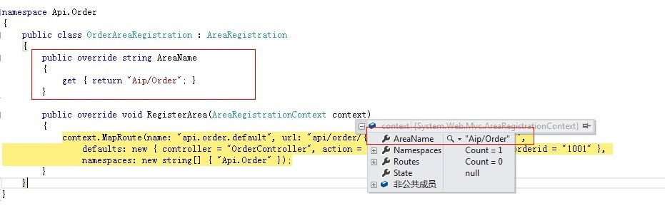
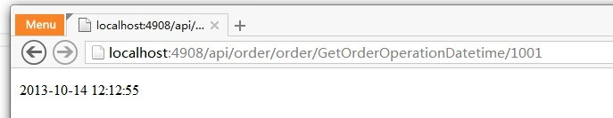
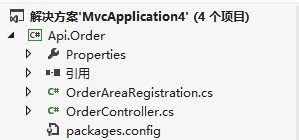

#.NET/ASP.NET MVC（模块化开发AraeRegistration）

##开篇介绍

ASP.NET Routing 路由功能非常强大，设计的也很巧妙；如果说ASP.NETMVC是建立在ASP.NET之上还不如准确的说ASP.NETMVC是建立在Routing基础之上的，才使得Controller顺利被找到并且执行Action；

那么今天这篇文章是一个简短的介绍如何在ASP.NETMVC下进行很好的模块化开发，都知道ASP.NETMVC是分层架构中的UI层框架；而UI层的开发有着天生的难以控制性，尤其是WEBUI和WINFORMUI有着很大的区别；WEBUI的组成元素多，又是在远程的浏览器中处理的，所以还是很考验架构设计的；

> 那么ASP.NETMVC的AreaRegistration是用来干什么呢，它是用来提供一个很好的接口让我们可以将Controller定义在其他的Library项目中，这主要可以用来解决模块化开发；一般情况下我们很少将所有的东西都定义在WebApplication中，而是会根据业务需要或者架构需要划分出一系列的Library项目来，从而让我们的逻辑架构更清晰也让物理架构的设计很灵活点，比如：横向的扩展，动态设计业务模块，WEBAPI等等；

但是Routing跟MVC没有必然的关系，都是可以通过扩展的方式嵌入各自想要的功能点，Routing是在提供自定义IHttpModule的方式将控制权拿到，而MVC是建立在Routing的基础上让Uri的路由为自己所用，其实准确点讲AreaRegistration适当的扩展可以用在很多的场合下，但是毕竟AreaRegistration是在ASP.NETMVC中提供出来的；

##AreaRegistration注册路由（传递路由上下文进行模块化注册）

简单的解释，AreaRegistration是用来在ASP.NETMVC里面注册多个区域的方式；就是可以将一个大型的MVC站点划分成多个Area区域，然后各自的Area有着自己的Controller、Action、View等元素；但是一般情况我们并不会那么做，因为将站点的所有UI层中的元素切开放会给维护工作带来很大的工作量，而且我们约定俗成的是UI层的东西放在一个主的WebApplication中，然后是业务功能的划分，但是大型站点也许需要这么做；

###AreaRegistration对象结构（典型的模板方法模式）

下面我们来分析一下AreaRegistration的对象结构，至少我们要搞清楚如何使用这个对象及相关的对象；

```C#
using System;
using System.Web.Routing; 

namespace System.Web.Mvc
{
    public abstract class AreaRegistration
    {
        protected AreaRegistration();        

        public abstract string AreaName { get; } 
        public static void RegisterAllAreas();
        public static void RegisterAllAreas(object state);
        public abstract void RegisterArea(AreaRegistrationContext context);
    }
}
```

这是AreaRegistration对象的代码结构，两个静态的重载方法是用来在Gloab.asax文件中启动全局注册用的，而带object state 参数的是用来传递到我们将要继承的对象中去的；然后剩下的一个AreaName属性、RegisterArea方法是需要我们去实现的；

其实熟悉设计模式的朋友都会对这种模式很熟悉，因为它是最典型的模板方法模式，也是设计原则中的依赖倒置原则，在内部MVC只依赖AreaRegistration对象，然后将通过RegisterArea方法将AreaRegistrationContext上下文传递到子类中去执行点东西；

这里需要强调的是，一个AreaRegistration对应一个独立的AreaRegistrationContext对象，相关的参数是在构造函数中传入的，前提是你必须实现AreaName属性；

###实现AreaRegistration对象

我们来实现一个OrderAreaRegistration对象，让其继承AreaRegistration抽象类；

```C#
using System;
using System.Collections.Generic;
using System.Linq;
using System.Text;
using System.Threading.Tasks;
using System.Web.Mvc; 

namespace Api.Order
{
    public class OrderAreaRegistration : AreaRegistration
    {
        public override string AreaName
        {
            get { return "Aip/Order"; }
        } 

        public override void RegisterArea(AreaRegistrationContext context)
        {
            context.MapRoute(name: "api.order.default", url: "api/order/{controller}/{action}/{orderid}",
                defaults: new { controller = "OrderController", action = "GetOrderOperationDatetime", orderid = "1001" },
                namespaces: new string[] { "Api.Order" });
        }
    }
}
```

定义在api项目中的Controller:

```C#
using System;
using System.Collections.Generic;
using System.Linq;
using System.Text;
using System.Threading.Tasks;
using System.Web.Mvc; 

namespace Api.Order
{
    public class Order : Controller
    {
        public string GetOrderOperationDatetime(string orderId)
        {
            if (orderId.Equals("1001"))
                return DateTime.Now.ToString();
            else
                return orderId;
        }
    }
}
```

然后我们得引用这个Library项目，这样它才能在启动的时候去自动的扫描到我们这个类型；

图1：



AreaRegistrationContext是使用AreaRegistraton的实现类的参数AreaName作为参数的一部分来构造特定的Context对象的；AreaRegistratioContext是表示一个区域的上下文，我们在Context里面注册的动东西都是属于当前Area的，它包括自己的Route集合；

图2：



站点顺利的路由到了我们在api.order项目中定义的OrderController；

图3：



这么来设计项目也是会多一中选择的；

##Reference

* [1] [原文链接](http://www.cnblogs.com/wangiqngpei557/p/3368161.html)