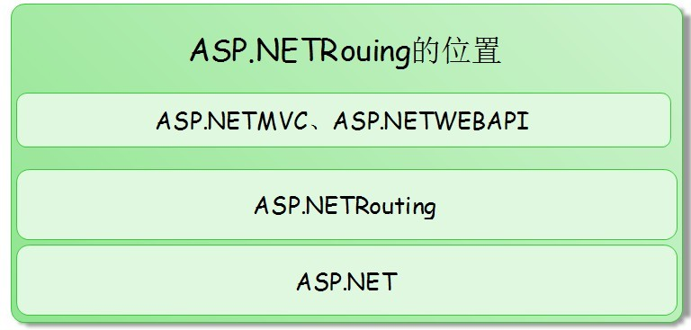
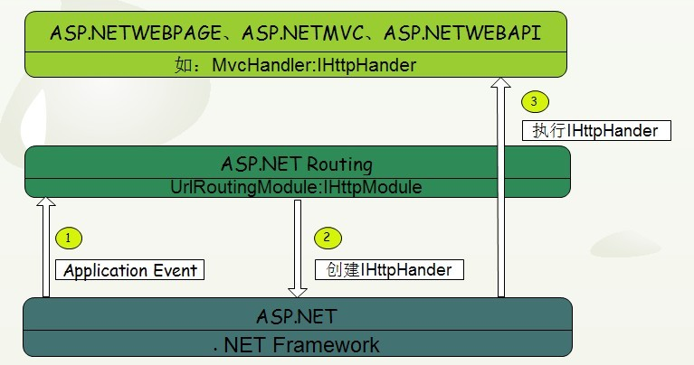
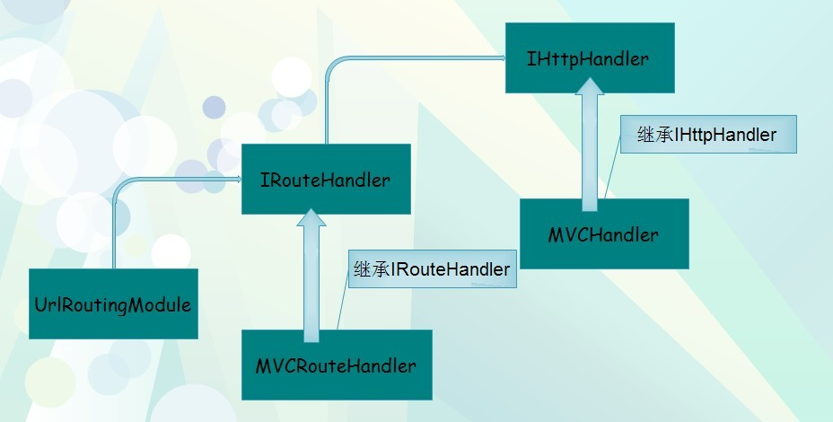
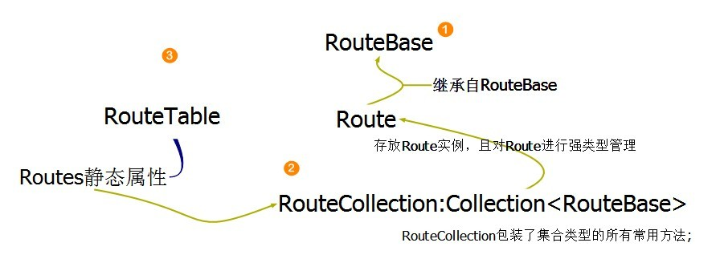
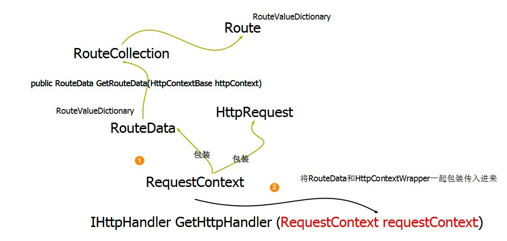

# .NET/ASP.NET Routing路由（深入解析路由系统架构原理）

## 开篇介绍

这篇文章让我们愉快的学习一下ASP.NET中核心的对象模型Routing模块，为什么说愉快呢，因为Routing正是建立在大家都比较熟悉的ASP.NET管道模型基础之上的，所以相比其他一些陌生的概念会轻松很多，不过不要紧一回生二回熟；

> ASP.NET Routing 系统是一切通过ASP.NET进行Uri访问应用程序的基础（并非物理文件的直接映射）；随着Routing的出现，我们的WEB设计已经和以前大不一样；越来越轻量级、简单化，都通过简便的Uri资源的方式进行处理，将精力放在业务的设计上；现在主流的Rest ful api 也都是建立在这样的一种机制下的，然而我们的ASP.NETMVC也是一种通过独立的Uri进行程序访问处理的框架，所以也是建立在ASP.NET Routing；再者就是现在也比较热门的ASP.NET技术（ASP.NETWEBAPI）；都是建立在Routing框架之上，可见它还是蛮重要的；

所以这篇文章让我们来分析一下Routing的工作原理，它为什么能在不影响现有框架的基础上提供这么好的扩展性，真的让人很想去一探究竟；目前非常可观是我们都了解ASP.NET现有的框架知识，我们大概了解它肯定是在ASP.NET管道模型的哪个位置进行了相应的拦截；

下面我们带着这个重要的线索来一点一点弄清楚它是如何为其他框架做支撑的，我最疑惑的是它是如何将WebPage和MVC进行很好的区分的 ，最关键的是它如何做到只提供一个接口让后续的相关框架都能基于这个公共的Routing接口进行扩展的，它的对象模型肯定很巧妙；我们需要去搞懂它，才能有信心去继续我们的ASP.NET相关框架的后续学习；

> **注意**：全文使用Routing一词替代ASP.NETRouting一词，特此说明，以免概念混淆；

## ASP.NETRouting路由对象模型的位置

问到ASP.NET最重要的扩展点在哪里？我想我们都会异口同声的说：在管道模型上，这也符合我们对此问题求解的一个基本思路；ASP.NET管道模型大家都懂的，在管道模型的相关事件中只要我们定义相关的事件就可以在管道的处理中插入自己的逻辑在里面；管道的最后执行接口是IHttpHander类型，只有阻止原本默认的IHttpHander接口创建才有可能改变整个的处理流程；

图2.1：


那么Routing只有在阻止IHttpHander接口的创建前先执行，才能扭转整个处理路线的机会，上图中显示的 *Application Event(2)(IHttpHander执行)* 意思是说只有在IHttpHander执行前的某个Application Event中进行Routing的执行才能在原本执行IHttpHander的地方执行其他定制的IHttpHander；而IHttpHander是ASP.NET框架的最终执行的接口，所以如果要想改变原本执行Page的Hander，需要提供自定义的IHttpHander接口对象；

> 换句话说，一切的执行入口其实在IHttpHander.ProcessRequest（）方法中，但是现在矛盾的是ASP.NET Routing 卡在中间，它让原本直接的处理流程变的有点扑簌迷离，它隔开了“ASP.NET基础框架 " 与 "基于ASP.NET的应用框架 "（如：ASP.NETMVC\ASP.NETWEBAPI\自定义框架）；

> **注意**：“ASP.NET基础框架”指ASP.NET本身的框架可以理解为传统的WEBFROM；而“基于ASP.NET的应用框架”是指基于ASP.NET基础框架而设计的如：MVC\WEBPAGE\WEBAPI之类的上层轻量级应用框架；

图2.2：



其实这幅图很明了的表达式了ASP.NETRouting的位置，它是用来为ASP.NET与ASP.NETMVC、ASP.NETWEBAPI承上启下的关键纽带；根据上面我们的分析思路，Routing是ASP.NET框架直接交互的对象模型，所以站在ASP.NET的角度它是不知道背后究竟发生了什么事情，其实ASP.NETRouting已经在ASP.NETApplication某个生命事件中将原本的创建逻辑移花接木了；

## ASP.NETRouting路由对象模型的入口

Routing起到中间人的作用，将ASP.NET的相关逻辑透明包装，我们虽然能在Routing的上层同样可以使用相关的ASP.NET对象，但是概念已经发生了根本上的变化；我们可以随意的引入自定义的IHttpHander实现类，根据前端传过来的Uri进行策略执行，也就是说你完全可以定义一套自己内部使用的Uri规则和处理框架，建立在Routing基础之上会很容易；

> 根据IHttpModule、IHttpHander 的相关的知识，我们很容易就能知道从哪里可以找到Routing的入口线索，如果我们都没有猜错的话在系统的Web.config文件中肯定有一个专门处理Routing的IHttpModule，利用来它将ASP.NETRouting对象植入到ASP.NET框架之中；
> 
> 我们找到.NET Framework环境配置的地方：C:\Windows\Microsoft.NET\Framework\v4.0.30319\Config 在该文件中我们可以找到系统级别的配置信息；
> 
> 其实这里面配置的都是系统级别的选项，而我们程序里面使用的Web.config文件只是用来配置跟应用程序相关的选项，这样的好处是我们可以在应用程序级别很方便的改变系统的默认配置；
> 
> 我们找到httpModules配置节，在倒数第二行发现一个name为UrlRoutingModule-4.0的IHttpModule配置，应该就是它了，最关键的是它的type信息是System.Web.Routing.UrlRoutingModule 毋庸置疑了；

现在就好办多了，我们只要顺藤摸瓜就能找到UrlRoutingModule是如何工作的了，不过先不能急，还有些思路并不清晰，我们继续慢慢分析；按照这样的一个思路，基本上我们可以断定UrlRoutingModule就是协调ASP.NETRouting框架的纽带；

图3.1：



此图总结了我们到目前为止的一个基本思路，底层ASP.NET框架处理HTTP的对象化，然后通过ASP.NETRouting Module创建IHttpHandler接口对象，再然后就是执行IHttpHander接口，共三个步骤；

作为应用框架也就是最上层的代码，如何才能决定ASP.NETRouting框架在处理ASP.NET的调用的时候能使用自己的IHttpHander接口对象，这个问题就需要我们深入的看一下ASP.NETRouting路由对象的内部对象模型了；

## ASP.NETRouting路由对象模型的内部结构

这里我将使用ASP.NETMVC作为应用框架来讲解本例（目前我并不了解ASP.NETWEBAPI）；那么ASP.NETMVC作为应用层框架，是如何让ASP.NETRouting帮助转换IHttpHander接口的呢，这就不得不去分析Routing一些列的对象之间的组成关系及互相作用了；

根据3.】小节，我们已经了解ASP.NETRouting是使用UrlRoutingModuel对象来作为ASP.NET管道的监听者，然后根据一系列的内部处理得出最终的IHttpHander接口对象；那么要想搞清楚UrlRoutingModule是如何具体的协调这一切的，必须得深入的去分析源代码才行，尽管我们只需要了解一个80%那也少不了这个环节；

> **注意**：需要源代码的朋友可以直接去一下站点获取，微软官方开源网站：http://www.codeplex.com/，开源中国：http://www.oschina.net/都可以找到源代码；

###UrlRoutingModule对象内部结构

首当其冲需要搞清楚的就是UrlRoutingModule对象，根据源码指示我们基本上能确定几个基本的原理，首先UrlRoutingModule继承自IHttpModule接口，订阅了Application.PostResolveRequstCache事件，在该事件中主要是通过全局路由对象表RouteTable对象获取提供给上层使用的依赖注入接口IRouteHander接口；

> **【依赖注入接口】**
> 
> 这里需要解释一下什么叫依赖注入接口，可以简单的将依赖注入接口理解成提供给外界一个具体实现的机会；其实就是设计原则中的“依赖倒置原则”，在RouteData的内部不是直接依赖具体的对象；接口就是契约，提供一个接口就是约定双方之间的契约；这里是约定了Routing框架将使用IRouteHander接口来获取最后的处理IHttpHander接口；

下面我们将对UrlRoutingModule对象进行分析，由于我们分析源代码是想搞清楚对象模型之间的操作流程及关系，所以不可能分析所有的代码，我们的重点是搞清楚他们的执行顺序及原理；由于UrlRoutingModule对象是导火线，它的出现将接二连三的牵连其他的对象出现，我们将分小节进行分析，交界处将一带而过；

根据我们前面的分析思路，我们首先要找到UrlRoutingModule绑定Application事件的地方；

```C#
protected virtual void Init (HttpApplication application)
{
    application.PostResolveRequestCache += PostResolveRequestCache;
}
```

在PostResolverRequestCache方法中，我们将看到该方法调用了本地内部的一个同名方法：

```C#
void PostResolveRequestCache (object o, EventArgs e)
{
    var app = (HttpApplication) o;
    PostResolveRequestCache (new HttpContextWrapper (app.Context));
}
```

然后实例化了一个HttpContextWrapper包装对象，传入该同名方法；

```C#
public virtual void PostResolveRequestCache (HttpContextBase context)
{
    var rd = RouteCollection.GetRouteData (context);
   //(1)匹配RouteData对象，后面分析；
    var rc = new RequestContext (context, rd);
    //(2)封装计算出来的RouteData对象和当前HttpRequest对象；
    IHttpHandler http = rd.RouteHandler.GetHttpHandler (rc);
    //(3)使用(1)步骤计算出来的当前RouteData对象中的RouteHander属性获取路由处理程序IHttpHander接口
    context.Request.RequestContext = rc;
    context.RemapHandler (http);
}
```

当然我已经省略了部分不太相关的代码，毕竟要想说清楚所有的代码一篇文章显然是不够的；上述代码中我用红色标记出重要的部分；

首先是第一个重要点（1），匹配RouteData对象；其实就是我们在程序里面配置的Url模板数据，当请求来的时候我们需要去根据当前请求的Url到路由表去匹配是否有符合当前Url的路由对象；

```C#
routes.MapRoute(
    name: "Default",
    url: "{controller}/{action}/{id}",
    defaults: new { controller = "Home", action = "Index", id = UrlParameter.Optional }
```
其实就是对应着本段代码的配置，这段代码处理后将是一个Route对象实例，而上面的RouteCollection就很好理解了，它是Route的强类型集合；

到目前为止，已经出现了好几个跟Route相关的对象，没关系，当我们将整条线分析到头时将很清楚他们的作用；

第二个重要点（2），封装RequestContext对象，其实我们从类型的名称上就能确定它的用途，它是请求上下文，也是有界上下文；这里面封装了在下面获取IHttpHander接口时将需要当作参数；

第三个重点（3），利用前面的匹配得到的RouteData对象，其实RouteData是路由数据的意思，那么什么叫路由数据：就是路由匹配成功后所生成的和路由相关的数据；还记得我们在3】节分析的原理吗，UrlRoutingModule对上层提供基本的路由功能，但是具体的处理是在应用层面上；

那么就是这里通过RouteData.RouteHandler.GetHttpHandler(RequestContext requestContext) 方法获取到的最终顶层应用处理器；

图4.1：



上面的解释可以使用这幅图来简单的表达；

UrlRoutingModule对象通过RouteData路由数据对象获取IRouteHander接口，然后通过IRouteHander接口获取最终的IHttpHander接口；

小结：其实可以将UrlRoutingModule对象理解成是ASP.NETRouting模块的基础部分，而扩展的地方则在我们应用程序配置的地方，也就是我们通常在Global.asax.cs文件中配置的路由数据；当我们在配置Route对象的时候其实已经指定了IRouteHander接口，然后这个接口会被放入RouteData同名属性中，而不是作为零散的对象被UrlRoutingModule直接获取；

### RouteBase、Route、RouteCollection、RouteTable路由核心对象模型

在4.1 】节中，UrlRoutingModule是路由框架的基础设施部分，内置于. NETFramework系统及ASP.NET配置之中web.config；在ASP.NET进行版本升级的时候该部分工作已经由系统自动帮我们升级，我们在使用的时候只需要创建ASP.NET3.5 SP1以上的版本都会自动拥有路由系统功能，因为根据微软官方MSDN介绍，路由系统是在ASP.NET3.5 SP1中引入的；其实我们大部分使用的ASP.NET版本已经是4.5的，就算以前是2.0、3.0的版本也会陆续升级到最新的版本；因为新版本的框架提供了无数个让你无法拒绝的优势；

那么当基础部分有了之后我们能做到就是应用编程接口的编程，其实这部分才是我们接触的地方；而这一小节我们将重点分析路由系统提供给我们应用层面的编程接口，也就是上面标题列出的几个核心对象；

> 先基本介绍一下这几个对象的意思和彼此之间的关系：
> 
> **RouteBase**：很明显是Route的基类，提供了作为自定义路由对象的顶层抽象，所有的路由框架的内部均使用抽象的RouteBase为依赖；
> 
> **Route**：路由系统默认实现的路由对象继承自RouteBase抽象基类，用来作为我们默认的路由配置对象，当然你可以可是实现自己的Route对象；
> 
> **RouteCollection**：Route作为单个Url的配置，那么系统中肯定会有多个Url规则的配置，所以RouteCollection对象是表示Route的强类型集合，该类继承自 Collection<RouteBase> 类型；所以RouteCollection是用来作为Route的集合管理用的；注意这里的泛型Collection<T>中的RouteBase，再一次提醒我们要“依赖倒置”；
>
> **RouteTable**：用来存放RouteCollection对象，路由表中有一系列的路由对象，而这一系列的对象就是RouteCollection管理的；在RouteTable中用Routes静态属性表示当前系统全局的路由映射表；

这里很明显能看出来对路由的一层一层抽象，从简单的Route表示一个路由映射，再到表示Route的集合RouteCollection，再到最后的RouteTable的，抽象的很OO；

为了让大家对上面这些对象的解释有一个直观的认识，我们用一张图来解释他们如何关联和执行流程；

图4.2：



下面我们将深入到各个对象的内部去摸索一下他们之间的交互，我们根据这种引用关系来分析，首先是Route对象；

#### 【Route、RouteBase】

Route对象继承自RouteBase代表一个Url模板的配置，包括Url的模板的字符串，如：api/order/102304，还有一些辅助性的内容，这不是本节的重点，我们只要知道它是用来做Url的配置即可； Route对象不是直接被我们实例化的，而是通过应用层的扩展方法进行实例化，为什么要这么做，其实这里就是路由为什么能转到上层的关键点；

根据ASP.NETMVC中的路由集合扩展类，也就是System.Web.Mvc.RouteCollectionExtensions静态类中的扩展方法，这些扩展方法就是用来包装我们在应用ASP.NET的时候配置Route使用的；是否还记得我们第4】节的一开始介绍了一个依赖注入接口的原理，这里将通过依赖注入接口达到外挂自定义实现的目的；

在Route源码中，我们将看到它有一个IRouteHander接口类型的属性RouteHander；

```C#
public class Route : RouteBase
{
  public IRouteHandler RouteHandler { get; set; }
}
```

这个IRouteHandler接口类型的属性就是我们ASP.NETMVC将要实现的一个IRouteHandler接口；而这个接口的定义：

```C#
public interface IRouteHandler
{
    IHttpHandler GetHttpHandler (RequestContext requestContext);
}
```

很简单，就是为了创建出ASP.NET管道引擎最后执行的IHttpHandler接口； Route类有一个重写了RouteBase的核心方法：

```C#
public override RouteData GetRouteData (HttpContextBase httpContext)
```

该方法是用来获取当前路由的一些匹配数据的，关于RouteData在4.1】节介绍过，详细我们将看下面关于对它的详细分析，这里将不做介绍了；

小结：其实Route对象还算简单，关键的两点就是GetRouteData方法和IRouteHander接口，前者是用来获取当前路由匹配成功后的路由信息，而后者是用来返回最终要执行的IHttpHandler接口；

#### 【RouteCollection、RouteTable】

RouteCollecton和RouteTable对象比较简单；我们先来看RouteCollection对象，首先你可能会有疑问，为什么不用一个简单的Collection类型的对象来存放Route实例，非要实现了一个RouteCollection；不看源码还真不知道它内部做了很多工作，首先最重要的就是线程并发情况下的Look机制；由于我们的RouteCollection对象是全局静态对象，会同时存在着多个线程并发的读取这个对象，所以必须在对集合访问的时候进行互斥控制；比如说这段代码：

```C#
public void Add (string name, RouteBase item)
{
    lock (GetWriteLock ()) {
        base.Add (item);
        if (!String.IsNullOrEmpty (name))
            d.Add (name, item);
    }
}
```

在添加路由的时候首先锁住写入对象，然后才能安全的进行操作；我们接着RouteTable对象，这个对象最简单，就是一个静态属性Routes用来存放全局路由表；

```C#
public class RouteTable
{
    static RouteTable ()
    {
        Routes = new RouteCollection ();
    }
    public static RouteCollection Routes { get; private set; }
}
```

当首次获取Routes属性时，会在静态构造函数中实例化RouteCollection对象；

### RouteValueDictionary、RouteData、RequestContext 路由数据对象模型

在上一小节中，我们分析了路由系统的几个核心对象，但是核心对象要想运行起来中间必须有一些数据封装的对象为他们消除数据传递的问题；而这小节的三个核心对象真是路由系统能成功工作的必不可少的数据存放、数据传输容器的核心对象；

> 先基本介绍一下这几个对象的意思和彼此之间的关系：
> 
> **RouteValueDictionary**:路由对象内部存放中间值使用的对象，比如Url模板的默认值，命名空间，地址栏传过来的参数等等；当然也可以用来存放任何Key-Value形式的任何值；
> 
> **RouteData**:路由数据，用来包装根据路由Url匹配成功后的路由数据封装，最重要的是将IRouteHander接口传递到UrlRoutingModule中去；
> 
> **RequestContext**:请求上下文，将HttpRequest、RouteData包装起来传入IRouteHander接口获取IHttpHander接口；因为IRouteHandler接口方法GetHttpHandler需要知道当前请求的一些信息和根据当前Url处理后的路由数据才能计算出当前的IHttpHandler接口；

为了让大家对上面这些对象的解释有一个直观的认识，我们用一张图来解释他们如何关联和执行流程；

图4.3:



下面详细的分析每个对象的内部原理；

#### 【RouteValueDictionary】

RouteValueDirctionary对象是在路由对象内部存放数据用的，比如：我们在配置路由的时候，可以指定一些默认值、命名空间等等；

看RouteValueDictionary源码定义：

```C#
public class RouteValueDictionary : IDictionary<string, object>
```

该类型继承自字典接口IDictionary<string,object>，继承自字典接口而不是继承自字典基类目的只是想使用字典的行为而不是它的默认实现；在RouteValueDictionary内部使用了一个Dictionary<string,object>类型作为最终容器；

```C#
Dictionary<string,object> d = new Dictionary<string,object> (CaseInsensitiveStringComparer.Instance);
```

在构造函数中使用了一个内部类CaseInsensitiveStringComparer进行Key的相等比较：

```C#
internal class CaseInsensitiveStringComparer : IEqualityComparer<string>
{
    public static readonly CaseInsensitiveStringComparer Instance = new CaseInsensitiveStringComparer ();
    public int GetHashCode (string obj)
    {
        return obj.ToLower (CultureInfo.InvariantCulture).GetHashCode ();
    }
    public bool Equals (string obj1, string obj2)
    {
        return String.Equals (obj1, obj2, StringComparison.OrdinalIgnoreCase);
    }
}
```

IEqualityComparer接口还是很不错的，不过现在基本上不这么用了，而是直接提供了一个Lambda做为比较函数；

#### 【RouteData】

路由数据对象，它的大概意思我想大家应该知道了，上面提到过很多次，这里就不介绍了；我们直接看一下RouteData内部核心代码段：

```C#
public RouteData (RouteBase route, IRouteHandler routeHandler)
{
    Route = route;
    RouteHandler = routeHandler;
    DataTokens = new RouteValueDictionary ();
    Values = new RouteValueDictionary ();
}
public RouteValueDictionary DataTokens { get; private set; }
public RouteBase Route { get; set; }
public IRouteHandler RouteHandler { get; set; }
public RouteValueDictionary Values { get; private set; }
```

通过构造函数我们能了解到，保存了对Route对象的引用和IRouteHander接口的引用，为什么将IRouteHandler作为构造函数参数，那是因为RouteBase根本没有对IRouteHander接口的属性定义；IRouteHandler接口在不在RouteBase或Route中不重要，因为Route可以是自定义的，这里的强制性是在RouteData中，它的构造函数必须接受IRouteHandler类型接口；

我们接着看，在构造函数的下面两行代码中分别是实例化了DataTokens、Values两个属性，而类型是RouteValueDictionary，这也刚好和我们上面分析的对上了；RouteValueDictionary是内部用来保存这些零散键值对数据容器，在Route、RouteData还有其他地方均需要用到；就是因为RouteValueDictionary的Value是Object类型，所以可以用来存放任何类型的值，比较通用；

#### 【RequestContext 】

RequestContext在上面也已经接触很多次了，表示请求上下文，也就是跟当请求相关的所有数据都封装在里面；在后面的文章中，我们将接触很多类似Context的对象，如：ControlContext，ViewContext之类的，都是用来控制上下文的边界，而不是直接传递零散的参数；

### IRouteHandler 、IHttpHander两个接口之间的关系

IRouteHandler接口是路由框架起作用的核心，只有提供了IRouteHandler实现才能顺利的得到背后的IHttpHandler接口；ASP.NETMVC提供了MvcRouteHandler对象来实现IRouteHandler接口，MvcRouteHandler在内部实例化实现了IHttpHandler接口的MvcHandler对象；MvcHandler然后通过RequestContext对象获取RouteData对象，接着得到相应的Control信息，进行后续的执行处理；

## UrlRoutingHandler 对象内部结构及扩展应用

在ASP.NETRouting路由框架中有一个很重要的IHttpHandler接口对象UrlRoutingHanlder，我想你肯定很疑惑，为什么需要这样一个对象；其实它的存在是为了提供给我们绕过UrlRoutingModule模块的机会；根据上面的详细的分析，我们知道路由的入口在UrlRoutingModule，所有的路由相关的映射工作都在该类中完成，但是有时候我们很想绕过UrlRoutingModule进行简单的处理或者性能方面的优化考虑，这就派上用场了；我能想到的使用场景目前来看是对ASP.NET第版本的项目做Url重写是比较方便，首先我们的项目需要建立在低版本的ASP.NET之上，但是需要添加Url.ReWriter的功能，就需要我们自己去实现这样的功能；

但是工作量和性能都很难控制好，如果使用这里提供的UrlRoutingHandler进行实现就很方便了，UrlRoutingHandler给我们使用ASP.NETRouting框架的机会同时也不需要关心是否配置了UrlRoutingModule；

```C#
public abstract class UrlRoutingHandler : IHttpHandler
```

根据代码看出它是一个抽象类，直接实现IHttpHanlder接口，但是重要的是ProcessRequest方法；

```C#
protected virtual void ProcessRequest (HttpContextBase httpContext)
{
    if (httpContext == null)
        throw new ArgumentNullException ("httpContext");

    var rd = RouteCollection.GetRouteData (httpContext);
    if (rd == null)
        throw new HttpException ("The incoming request does not match any route");
    if (rd.RouteHandler == null)
        throw new InvalidOperationException ("No  IRouteHandler is assigned to the selected route");

    RequestContext rc = new RequestContext (httpContext, rd);

    var hh = rd.RouteHandler.GetHttpHandler (rc);
    VerifyAndProcessRequest (hh, httpContext);
}

protected abstract void VerifyAndProcessRequest (IHttpHandler httpHandler, HttpContextBase httpContext);
```

该方法的逻辑跟UrlRoutingModule里的PostResolveRequestCache方法是差不多的，都会通过全局RouteCollection集合进行匹配当前的RouteData对象；那就足够说明这个过程不会再通过UrlRoutingModule模块；方法的最后一行是执行一个模板方法：VerifyAndProcessRequest ，该方法是留给子类去实现的；

那么这里将路由和执行合在一起了，基类负责路由子类负责执行，很不错的设计方法；

总结：这篇文章基本上介绍了跟路由相关的核心对象，但是还有一些其他辅助的类这里并没有进行讲解，当然如果你有兴趣可以自己去看看；这篇文章是为了让我们能对路由的处理流程及结构有个了解，做到能在适当的时候进行扩展和查找问题

## Reference

* [1] [原文链接](http://www.cnblogs.com/wangiqngpei557/p/3379095.html)