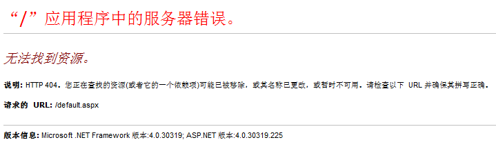
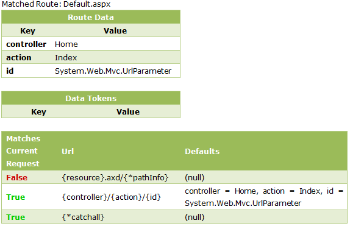
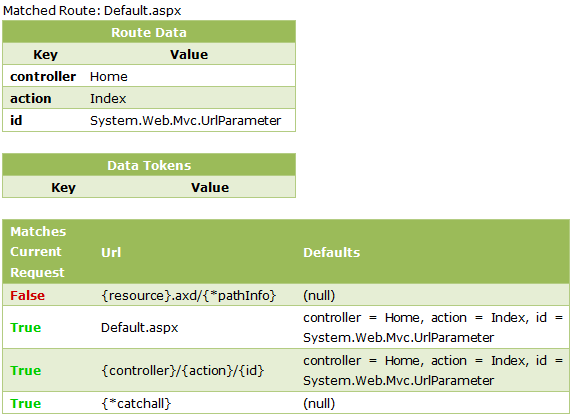
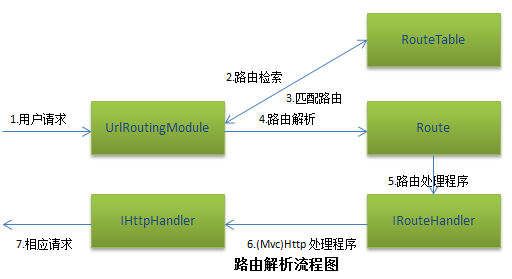

#ASP.NET MVC架构与实战系列之二：理解MVC路由配置

在上一篇文章中，我简短的谈了一下MVC的底层运行机制，如果对MVC还不是很了解的朋友，可以作为入门的参照。接下来，我开始介绍关于URL路由的相关知识。URL路由不是MVC独有的，相反它是独立于MVC而单独存在的(在System.Web.Routing下)。因此，URL路由也能为传统的ASP.NET应用程序服务。我用一个简单的例子来解释路由，在我们的上一节的"ASP.NET MVC应用程序"中添加一个新的页面default.aspx，其后台代码如下：

```C#
protected void Page_Load(object sender, EventArgs e)
{
    var originalPath = Request.Path;
    HttpContext.Current.RewritePath(Request.ApplicationPath, false);
    IHttpHandler handler = new MvcHttpHandler();
    handler.ProcessRequest(HttpContext.Current);
    HttpContext.Current.RewritePath(originalPath, false);
}
```

当执行请求页面default.aspx时，首先将请求的路径重写为"/"，而该路径会匹配路由{controller}/{action}/{id}，根据Global.asax路由配置，将映射为Home/Index/，从而输出Index.aspx的内容(而不是default.aspx的内容)，不禁要问：为什么default.aspx在MVC应用程序中当做普通的ASP.NET页面，而不是将该请求转化为路由执行？是不是在MVC中就不能使用普通的ASP.NET页面呢？如果不能，当有一天我希望将我的普通站点转化为MVC站点时，是否还需要重新开发？带着这些疑问，我们进一步来探讨如何在MVC中支持原有的ASP.NET页面。在Global.asax中的Application_Start()方法中添加以下代码：

```C#
protected void Application_Start()
{
    AreaRegistration.RegisterAllAreas();
    RegisterRoutes(RouteTable.Routes);
    RouteTable.Routes.RouteExistingFiles = true;
}
```

再次运行default.aspx会出现以前错误页面(找不到页面)。



刚才增加的代码：RouteTable.Routes.RouteExistingFiles = true(默认为false);表明MVC启用对现有Web页面的解析，此时尽管同样解析到路由{controller}/{action}/{id}上，但却找不到对应的控制器路由参数default.aspx，因而导致错误。接下来我们为它添加相关的路由设置，在Global.asax中添加以下代码：

```C#
//为default.aspx添加路由
routes.MapRoute(
    "Start",
    "default.aspx",
    new { controller = "Home", action = "Index", id = UrlParameter.Optional } 
);
```

删除或注释掉default.aspx.cs中的代码再次运行，会发现页面能正常解析。需要说明的是，URL路由的排列顺序非常关键，一旦找到第一个匹配的路由，将不会继续寻找剩下的路由了。是因为这里找到了匹配的路由Start，从而正确的映射到Home下的视图Index.aspx。为了更加深入理解路由解析的匹配规则，我们引入"路由匹配监控器"。添加引用"RouteDebug.dll"，并在Global.asax中注册检测代码以分别检测没有启用和启用(依靠RouteExistingFiles属性)ASP.NET页面解析两种情况。

```C#
protected void Application_Start()
{
    AreaRegistration.RegisterAllAreas();
    RegisterRoutes(RouteTable.Routes);
    //RouteTable.Routes.RouteExistingFiles = true;
    RouteDebugger.RewriteRoutesForTesting(RouteTable.Routes);
}
```
未启用(默认)Web页面解析的路由监控图



启用Web页面解析的路由监控图



从图中我们发现，当启用Web页面解析时，比未启用适多出一个路由项，这是因为此时是从Global.asax中去寻找匹配的路由项。过程大概是这样的：首先会到路由表集合中寻找，如果找到匹配的路由定义则解析路由定义中的各个参数，依次获取参数映射的控制器/视图/参数信息，最后定位到指定控制器下的指定视图页面进行输出。相反，而过找不到对应的匹配路由则返回错误页面。

前面已提到过，URL路由的基本格式是: {controller}/{action}/{id}，但也存在很多变体，总的来说，都会把不包含在{}中的部分当成常量来处理。如：blog/{action}/{author}的正确映射应该为:blog/show/miracle，再比如{report}/{year}/{month}/{day}映射为:sale/2012/5/25。这样就非常好理解页面具有的功能。开发者一般都会通过Global.asax文件的Application_Start()来设置URL路由的定义，通过静态类RouteTable的Routes属性来设置路由。

```C#
public static void RegisterRoutes(RouteCollection routes)
{
    routes.IgnoreRoute("{resource}.axd/{*pathInfo}");
    routes.Add(new Route("blog/{action}/{author}", new BlogRouteHandler()));
}

protected void Application_Start()
{
    AreaRegistration.RegisterAllAreas();
    RegisterRoutes(RouteTable.Routes);
}
```

我们可以看出在路由中定义了两个路由参数:action和author。当用户发送URL请求http://server/blog/show/miracle时，根据路由的定义将进行映射，使得action映射为show，author映射为miracle，如果当用户发送请求http://server/blog/add时，由于找不到对应的路由也没有默认路由，此时URL路由将不会进行处理，而是作为普通的页面交由ASP.NET应用程序处理。在添加URL路由的同时，还可以设置路由参数的默认值。

```C#
public static void RegisterRoutes(RouteCollection routes)
{
    routes.IgnoreRoute("{resource}.axd/{*pathInfo}");
    routes.Add(new Route("blog/{action}/{author}", new BlogRouteHandler())
    {
        Defaults = new RouteValueDictionary
        {
            {"action", "show"},
            {"author", "miracle"}
        }
    });
}
```

现在用户就可以发送更多的请求了，如: http://server/blog将映射到http://server/blog/show/miracle上，http://server/blog/add将映射到http://server/blog/add上，而http://server/blog/add/miraclehe将映射到http://server/blog/add/miraclehe上。简单总结一句：如果对应的路由参数没有填充值的话，则使用默认值，否则使用对应的路由参数值。有时，为了适应一类URL的定义，可以用通配符(*)来表示。如:blog/query/{*values}，对应的映射可以包含如下：/blog/query/miracle/2012/05，/blog/query/miracle或/blog/query等。可能还需要为路由参数添加约束，以更好的满足参数的准确性。如：

```C#
public static void RegisterRoutes(RouteCollection routes)
{
    routes.IgnoreRoute("{resource}.axd/{*pathInfo}");
    routes.Add(new Route("blog/{locale}/{year}", new BlogRouteHandler())
    {
        Constraints = new RouteValueDictionary
        {
            {"locale", "{a-z}{2}-{A-Z}{2}"},
            {"year", @"\d{4}"}
        }
    });
}
```

对应的映射为：/blog/en-US/2012，而/blog/en-us/2012，/blog/en-US/12均不符合要求。介绍了关于默认值和约束的相关知识后，我们来看看Route类定义，主要包含以下属性：默认值Defaults、约束Constraints、命名空间DataTokens、URL路由以及路由处理程序RouteHandler，以下是其构造函数列表。

```C#
public Route(string url, IRouteHandler handler);
public Route(string url, RouteValueDictionary defaults, IRouteHandler handler);
public Route(string url, RouteValueDictionary defaults, RouteValueDictionary constraints, IRouteHandler handler);
public Route(string url, RouteValueDictionary defaults, RouteValueDictionary constraints, RouteValueDictionary dataTokens, IRouteHandler handler);
```

可以看出，最简单的构造函数只需要URL路由和路由处理程序，最复杂的则包含所有属性。

```C#
var route = new Route("blog/{action}/{author}", 
                       new RouteValueDictionary { {"action", "show" }, {"author", "miracle"} },
                       new MvcRouteHandler());
```

可将(多个)路由添加到路由集合RouteCollection中，通过RouteTable.Routes属性来维护路由集合。

```C#
public static void RegisterRoutes(RouteCollection routes)
{
    routes.Add(new Route("blog/{action}/{author}", 
                       new RouteValueDictionary { {"action", "show" }, {"author", "miracle"} },
                       new MvcRouteHandler()));
}
```

大家可能会发现，添加路由有MapRoute和Add两个方法，那到底有什么区别的。MapRoute是RouteCollection的扩展方法，同时还有IngnoreRoute，而Add则是实例方法，相对来说要使用Add来调用比较复杂(包含刚才提到的5大属性)，而MapRoute则相对简洁。

```C#
public static void RegisterRoutes(RouteCollection routes)
{
    routes.MapRoute(
        "Article", // 路由名称
        "blog/{action}/{author}", // 带有参数的 URL
        new { controller = "Home", action = "show", author = "miracle" } 
    );
}
```

细心的朋友会发现，在MapRoute中指定了路由名称(可选)，到底有什么用呢？先看以下生成链接(在下一篇文章中将提到)的代码：

```asp
<%= Html.RouteLink("Miracle's Blog", "Article", new { action = "compose" }) %>
```

此时在URL路由匹配时就直接按照名称解析，同时可以不用指定默认的路由参数，而不用遍历匹配以提高匹配效率。另一种优化路由的方式是将最常见的路由存放在路由表的最前面(只要找到第一个则不再寻找)。

有时，我们需要自定义路由约束(需要实现IRouteConstraint的Match方法)以满足更复杂的路由需求。假定路由为: blog/miracle/{year}/{month}/{day}。此时year参数的参考值：2000~2012，month为:1~12， day为：28、29、30或31(根据月份而定)。分别添加YearRouteConstraint类、MonthRouteConstraint类和DayRouteConstraint类。

```C#
//日期路由约束

public class YearRouteConstraint : IRouteConstraint
{
    public bool Match(HttpContextBase httpContext, Route route, string parameterName, RouteValueDictionary values, RouteDirection routeDirection)
    {
        if (routeDirection == RouteDirection.IncomingRequest &&
            parameterName.ToLower() == "year")
        {
            var year = 0;
            if (int.TryParse(values["year"].ToString(), out year))
            {
                return year >= 2000 && year <= 2012;
            }
            return false;
        }
        return false;
    }
}

public class MonthRouteConstraint : IRouteConstraint
{
    public bool Match(HttpContextBase httpContext, Route route, string parameterName, RouteValueDictionary values, RouteDirection routeDirection)
    {
        if (routeDirection == RouteDirection.IncomingRequest &&
            parameterName.ToLower() == "month")
        {
            var month = 0;
            if (int.TryParse(values["month"].ToString(), out month))
            {
                return month >= 1 && month <= 12;
            }
            return false;
        }
        return false;
    }
}

public class DayRouteConstraint : IRouteConstraint
{
    public bool Match(HttpContextBase httpContext, Route route, string parameterName, RouteValueDictionary values, RouteDirection routeDirection)
    {
        if (routeDirection == RouteDirection.IncomingRequest &&
            parameterName.ToLower() == "day")
        {
            var month = 0;
            if (!int.TryParse(values["month"].ToString(), out month)) return false;
            if (month <= 0 || month > 12) return false;

            var day = 0;
            if (!int.TryParse(values["day"].ToString(), out day)) return false;

            switch (month)
            {
                case 1:
                case 3:
                case 5:
                case 7:
                case 8:
                case 10:
                case 12:
                    return day <= 31;
                case 4:
                case 6:
                case 9:
                case 11:
                    return day <= 31;
                case 2:
                    return day <= 28;//不计闰年
            }
        }
        return false;
    }
```

接下来，我们可以来利用自定义约束配置路由。

```C#
routes.MapRoute("Article", "blog/{year}/{month}/{day}",
                new
                {
                    controller = "blog",
                    action = "show",
                    author = "miracle",
                    year = "",
                    month = "",
                    day = ""
                },
                new 
                {
                    year = new YearRouteConstraint(),
                    month = new MonthRouteConstraint(),
                    day = new DayRouteConstraint()
                });
```

现在如果运行http://server/blog/show/miracle/2012/4/31将报错，因为不符合日期约束。

接下来，我简要总结一下路由解析流程。当用户输入URL地址发送请求时，UrlRoutingModule类就会到路由表(RouteTable)中解析与请求匹配的路由，然后将该路由分发到路由处理程序(IRouteHandler)，并连同RequestContext一起再次分发到Mvc处理程序(IHttpHandler)，定位相关的控制器并执行相关的动作实现输出。以下的整个过程的示意图。



最后，我顺便提一下如何在传统的Web站点中使用路由(一般情况下用户将传统站点转化为MVC站点的项目迁移过渡)。主要包含以下两个步骤：

1.常见实现IRouteHandler接口的WebFormRouteHandler类，返回实现IHttpHandler接口的实例化对象(实际上任何一个Page都是一个IHttpHandler实例对象)。

```C#
public class WebFormRouteHandler : IRouteHandler
{
    public string VirtualPath { get; private set; }
    //初始化虚拟路径
    public WebFormRouteHandler(string virtualPath)
    {
        this.VirtualPath = virtualPath;
    }
    public IHttpHandler GetHttpHandler(RequestContext requestContext)
    {
        //创建实例化的页面对象
        var page = BuildManager.CreateInstanceFromVirtualPath(VirtualPath, typeof(Page)) as IHttpHandler;
        return page;
    }
}
```

2.配置全局应用程序类(Global.asax)，实现路由到传统Web Form的映射。

```C#
//映射传统的web站点
routes.Add("show", new Route("blog/show/{author}", new WebFormRouteHandler("~/pages/show.aspx")));
routes.Add("compose", new Route("blog/compose/{year}/{month}/{day}", new WebFormRouteHandler("~/pages/compose.aspx")));
```

然后在default.aspx中添加两个链接：

```html
<div>
    <a href="blog/show/miracle">blog/show/miracle</a>
    <a href="blog/compose/2012/5/28">blog/compose/2012/5/28</a>
</div>
```

点击对应的链接就会进入相关的页面。通过以上的学习，我们发觉可以设置个性化的路由(源代码在此下载)，但请读者考虑如何验证被映射页面的安全性，我将以后的章节中详细讲解。

##Reference

* [1] [原文链接](http://www.cnblogs.com/hmiinyu/archive/2012/05/28/2519661.html)