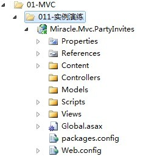

# ASP.NET MVC架构与实战系列之四：MVC实例演练

经过前三节基础理论的学习，我们在本节中开始我们的MVC实例演练之旅。在VS.NET中创建新的"ASP.NET MVC 3 Web Application"项目，并取个项目名：Miracle.Mvc.PartyInvites。为了简单起见，分别选择空模板、Razor视图引擎并取消"使用html5语义化标签"选项。项目创建完毕如下图所示：



从图中可以看出，项目中包含很多MVC自动生成的文件。特别注意的是，我们注意以下三个文件夹：Models、Views和Controllers，即我们俗称的MVC。现在我们直接运行刚才的项目，看看有什么结果：浏览器会显示"无法找到资源"的错误。根本原因在于：当浏览器发送请求(这里是默认请求:http://server:8080/)时，MVC会根据Global.asax中的默认设置(controller = "Home", action = "Index", id = UrlParameter.Optional)映射匹配请求的URL。我们发现项目中缺少Home的控制器和Index的action。

```C#
public static void RegisterRoutes(RouteCollection routes)
{
    routes.IgnoreRoute("{resource}.axd/{*pathInfo}");

    routes.MapRoute(
        "Default", // Route name
        "{controller}/{action}/{id}", // URL with parameters
        new { controller = "Home", action = "Index", id = UrlParameter.Optional } // Parameter defaults
    );

}
```

于是我们在Controllers中添加HomeController，然后添加Index方法。再次运行项目，将在浏览器中显示"Hello, Miracle"字符串。

```C#
public class HomeController : Controller
{
    public string Index() 
    {
        return "Hello, Miracle";
    }
}
```

虽然这段代码如此简单，但却为我们了解MVC结构开了个好头。MVC利用传统的ASP.NET的路由机制(Routing)，将URL映射为对应的控制器和action。如对我们以上实例而言，以下URL(http://server/，http://server/Home，http://server/Home/Index)都会映射为同一控制器和action，当前我们也可配置Global.asax中默认的路由匹配规则，来自定义配置路由规则。以上仅仅在客户端生成了一个字符串，我们来做点稍微有意义的：生成html对应的Page。改变一下Index的代码：

```C#
public class HomeController : Controller
{
    public ViewResult Index()
    {
        return View();
    }
}
```

此时如果直接运行，也将会显示"未找到视图或MasterPage"的错误。估计是缺少什么吧，不难发现Index的返回值变成了ViewResult，而函数体变成了return View()；我们知道，MVC控制器中的action方法除了返回字符串外，还可以返回视图ViewResult，此时action方法将对应于Views目录下指定控制器对应的View，我们可以试着在Index方法名或函数体中点击添加View，选择Razor视图引擎并取消"创建强类型视图"和"使用布局和模板页"选项。添加完毕后会发现在Views目录下生成了Views/Home/Index.cshtml。再次运行项目会显示"Hello, Miracle (from the view)"。我们并没有指定访问哪个视图，那怎么就能正确显示了呢？原因在于MVC的视图命名规则(即View视图名称与Controller中action的名称一致)。

```asp
@{
    Layout = null;
}
<!DOCTYPE html>
<html>
<head>
    <title>Index</title>
</head>
<body>
    <div>
        Hello, Miracle (from the view)
    </div>
</body>
</html>
```

MVC除了能返回ViewResult之外，还能返回RedirectResult，HttpUnautorizedResult等视图(都继承于ActionResult)。可能到这里，MVC仅仅输出一些字符串或html等静态文本，读者仍然没有发现MVC的强大魅力，不过先不着急。

接下来，我们来探讨如何在MVC中实现动态输出，通常而言构建数据是Controller的主要工作，渲染html是View的主要工作，数据将从Controller传递到View中。那如何实现数据传递的呢？在MVC中依靠ViewBag这个动态对象来完成，有意思的是，这个对象可在Controller中随意指定属性，而在View中来接收这个属性，达到数据传递的目的。再次运行项目，将显示"Good Morning，Miracle (from the view)"。

```C#
public ViewResult Index()
{
    var hour = DateTime.Now.Hour;
    ViewBag.Greeting = hour < 12 ? "Good Morning" : "Good Afternoon";
    return View();
}
```

```asp
@{
    Layout = null;
}
<!DOCTYPE html>
<html>
<head>
    <title>Index</title>
</head>
<body>
    <div>
        @ViewBag.Greeting, Miracle (from the view)
    </div>
</body>
</html>
```

有了以上对MVC基本框架的了解，我们来深入这个实例。客户现在要求制作一张聚会贺卡，并让受邀请的人在网站上进行电子回复(RSVP)。网站应满足以下几个特征：

(1).首页显示晚会的基本信息；(2).能进行电子回复的页面(RSVP)；(3).验证回复的信息，并跳转到感谢页；(4).RSVP电子邮件回复受邀者。我们来改动以下Index.cshtml:

```asp
//...
@ViewBag.Greeting, Miracle (from the view)
<p>We're going to have an excting party.<br/>
(To do: sell it better. Add pictures or something.)
</p>
```

由于需要进行电子回复，我们在主页中添加链接以便客人能进行电子回复。运行之后将会产生一个超链接(http://server/Home/RsvpForm)，其中对应于两个参数：第一个是显示的链接名称，第二个是对应的action名称。与Asp.Net不同的是，前者是对应与文件夹下的文件，后者对应于Controller下的Action方法。

```asp
@ViewBag.Greeting, Miracle (from the view)
<p>We're going to have an excting party.<br/>
(To do: sell it better. Add pictures or something.)
</p>
@Html.ActionLink("RSVP Now", "RsvpForm")
```

其中可能包含姓名、邮箱、电话等信息，这时我们封装成一个对象(Guest)来完成，也就是MVC中的"M"了。接下来在Models目录下创建以下类。

```C#
public class Guest
{
    public string Name { get; set; }
    public string Email { get; set; }
    public string Phone { get; set; }
    public bool? IsAttend { get; set; }
}
```

接下来创建对应的Action方法和对应的视图：RsvpForm和Views/Home/RsvpForm.cshtml。由于在电子回复中包含了客户的相关信息，因此我们创建视图时选择"强类型视图"选项。

```C#
@model Miracle.Mvc.PartyInvites.Models.Guest
@{
    Layout = null;
}
<!DOCTYPE html>
<html>
<head>
    <title>RsvpForm</title>
</head>
<body>
    <div>
        @using (Html.BeginForm())
        {
            <p>Your name: @Html.TextBoxFor(m => m.Name)</p>
            <p>Your email: @Html.TextBoxFor(m => m.Email)</p>
            <p>Your phone: @Html.TextBoxFor(m => m.Phone)</p>
            <p>Will you attend?
               @Html.DropDownListFor(m => m.IsAttend, new[]
               {
                    new SelectListItem() { Text="Yes, I'll be there", Value = bool.TrueString },
                    new SelectListItem() { Text="No, I can't come", Value = bool.FalseString }
               }, "Choose an option")
            </p>
            <input type="submit" value="Submit Rsvp"/>
        }
    </div>
</body>
</html>
```

从以上代码中不难发现：@model Miracle.Mvc.PartyInvites.Models.Guest，正是由于强类型视图，使得我们可以直接利用model来访问对应的属性。此外Html.BeginForm是创建form，类似于<form action="/Home/RsvpForm" method="post"></form>。细心的读者会发现，我们现在的MVC视图Form是运行在客户端的，而传统的Asp.Net Form是运行在服务端的(runat="server")。我们填写相关的信息，点击"Submit Rsvp"之后意外发现我们刚才输入的东西全不见了。这与传统的Form不太一致，原因是什么呢？传统的Web Form会保存当前页面的数据到_ViewState变量中，并赋值给隐藏变量，当页面回发时再将这些值赋到对应的控件上。而这里的MVC Form由于运行在客户端，也没有_ViewState、隐藏变量，更不存在回发的任何机制，而页面跳转到本身，相当于重新渲染了一次页面，因此数据丢失。后续我们将有办法来解决这个问题。

从上面我们看到，点击按钮没有触发任何事件，MVC也就不知道如何提交到服务器了。我们知道通常HTML请求都会分为get和post请求。这里试着给读者将一下两者的应用，get请求适合于首次访问页面(或点击链接)等渲染的页面(可能是空白页面，也可能是已经有数据的页面)，post请求是当在此页面中填入相关数据后保存到服务器时执行提交的动作(form的默认请求方法为post)。我们再次来修改RsvpForm方法：

```C#
[HttpGet]
public ViewResult RsvpForm()
{
    return View();
}
[HttpPost]
public ViewResult RsvpForm(Models.Guest guest)
{
    //TODO: send email to response the organizer
    return View("Thanks", guest);
}
```

重点关注第2个方法，首先是基于HttpPost请求，将guest的相关数据发送到Thanks视图，从上面的html页面源代码中可以看到Guest对象的相关属性已经映射到控件对应的id和name上，这里的return View("Thanks", guest)将客户数据从Rsvp Form传递到Thanks Form中，也即利用Data Binding完成了View之间数据的传递。接下来我们创建Views/Home/Thanks.cshtml视图。

```asp
@model Miracle.Mvc.PartyInvites.Models.Guest
@{
    Layout = null;
}
<!DOCTYPE html>
<html>
<head>
    <title>Thanks</title>
</head>
<body>
    <div>
        <h1>Thank you, @Model.Name!</h1>
        @if (Model.IsAttend == true)
        {
            @: It's great that you're coming. The drinks are already in the fridge! 
        }
        else
        {
            @: Sorry to hear that you can't make it, but thanks for letting us know. 
        }
    </div>
</body>
</html>
```

OK，大功基本告成。但是有个致命问题是：无论我填不填表单 内容，都可以跳到感谢页面。我们需要对那些进行认真填写的客户才会跳转到感谢页面，也就是说要对他们输入的信息进行验证。比如姓名必填、邮箱必须满足规则等。回想以前的Web Form，可以通过验证控件或JS验证完成，而且多个地方验证还要搬家似的到处粘贴，及其不方便。那我们就想是否可以只在一个地方验证就可以了呢，回头去看那个Model，只需要添加相关的MVC特性(需引入System.ComponentModel.DataAnnotations)即可完成。

```C#
public class Guest
{
    [Required(ErrorMessage = "Please enter your name")]
    public string Name { get; set; }

    [Required(ErrorMessage = "Please enter your email")]
    [RegularExpression(".+\\@.+\\..+", ErrorMessage = "Please enter a valid emmail")]
    public string Email { get; set; }

    [Required(ErrorMessage = "Please enter your phone")]
    public string Phone { get; set; }

    [Required(ErrorMessage = "Please verify whether you will attend")]
    public bool? IsAttend { get; set; }
}
```

我们在Controller中实现验证逻辑，根据ModelState.IsValid来判断是否通过验证。

```C#
[HttpPost]
public ViewResult RsvpForm(Models.Guest guest)
{
    if (ModelState.IsValid)
    {
        //TODO: send email to response the organizer
        return View("Thanks", guest);
    }
    else
    {
        return View();
    }
}
```

同时在View中当不通过验证时显示出这些错误信息。

```asp
@using (Html.BeginForm())
{
    @Html.ValidationSummary()
    //...
}
```

再次运行，将发现只有通过验证才能跳转到感谢页。同时请读者注意，此时的Rsvp Form可以进行数据保存了，点击按钮之后页面数据不再发生丢失了。原因在于页面不再进行重新渲染，而是接收了上一次HttpPost请求的结果。而HttpPost又保存了Guest对象的相关信息，因此不会丢失(但值得一提的是，打开页面源代码没有任何的_ViewState标记或隐藏变量)。相反添加了很多语义化的属性：

```html
<div class="validation-summary-errors" data-valmsg-summary="true">
    <ul>
        <li>Please enter your phone</li>
    </ul>
</div>
<p>
    Your name:
    <input data-val="true" data-val-required="Please enter your name" id="Name" name="Name"
        type="text" value="Miracle" /></p>
<p>
    Your email:
    <input data-val="true" data-val-regex="Please enter a valid emmail" data-val-regex-pattern=".+\@.+\..+" data-val-required="Please enter your email" id="Email" name="Email" type="text" value="hmiinyu@sina.com" /></p>
<p>
    Your phone:
    <input class="input-validation-error" data-val="true" data-val-required="Please enter your phone"
        id="Phone" name="Phone" type="text" value="" /></p>
<p>
    Will you attend?
    <select data-val="true" data-val-required="Please verify whether you will attend"
        id="IsAttend" name="IsAttend">
        <option value="">Choose an option</option>
        <option selected="selected" value="True">Yes, I&#39;ll be there</option>
        <option value="False">No, I can&#39;t come</option>
    </select>
</p>
```

以输入的姓名为例，当正确输入时，控件将渲染成：

```html
<input data-val="true" data-val-required="Please enter your name" id="Name" name="Name" type="text" value="Miracle" />
```

当输入无效时，控件将渲染成：

```html
<input class="input-validation-error" data-val="true" data-val-required="Please enter your name" id="Name" name="Name" type="text" value="" />
```

我们需要引入相关的CSS(其实就是Content目录下的site.css)，利用@Href操作符来完成。

```html
<link href="@Href("~/Content/Site.css")" rel="stylesheet" type="text/css" />
```

最后，我们通过WebMail helper来完成邮件发送动作。

```asp
@model Miracle.Mvc.PartyInvites.Models.Guest
@{
    Layout = null;
}
<!DOCTYPE html>
<html>
<head>
    <title>Thanks</title>
</head>
<body>
    @{
        try
        {
            WebMail.SmtpServer = "smtp.miracle.com";
            WebMail.SmtpPort = 8080;
            WebMail.EnableSsl = true;
            WebMail.UserName = "Miracle";
            WebMail.Password = "Miracle";
            WebMail.From = "miracle@rsvp.com";
            WebMail.Send("party-host@rsvp.com", "RSVP Notification",
                Model.Name + " is " + ((Model.IsAttend ?? false) ? "" : "not") + "attending");
        }
        catch
        {
            @: <b>Sorry - we couldn't send the email to confirm your RSVP.</b>
        }
    }
    <div>
        <h1>Thank you, @Model.Name!</h1>
        @if (Model.IsAttend == true)
        {
            @: It's great that you're coming. The drinks are already in the fridge! 
        }
        else
        {
            @: Sorry to hear that you can't make it, but thanks for letting us know. 
        }
    </div>
</body>
</html>
```

到此为止，我们展示了一个简单的MVC应用，说明是如何应用基础理论到实践的过程，读者可在此[下载源代码](http://files.cnblogs.com/hmiinyu/Miracle.Mvc.PartyInvites.zip)进行参考分析。

## Reference

* [1] [原文链接](http://www.cnblogs.com/hmiinyu/archive/2012/09/30/2709063.html)