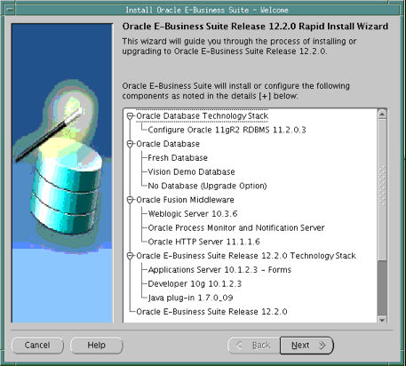
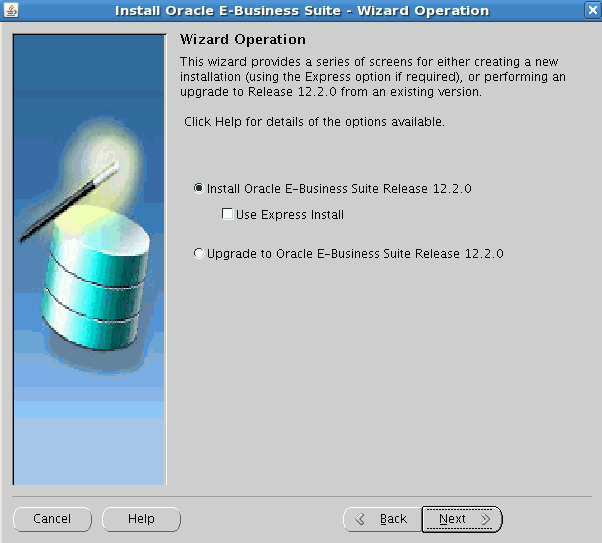
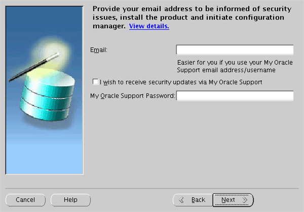
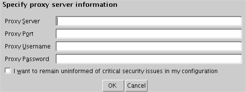
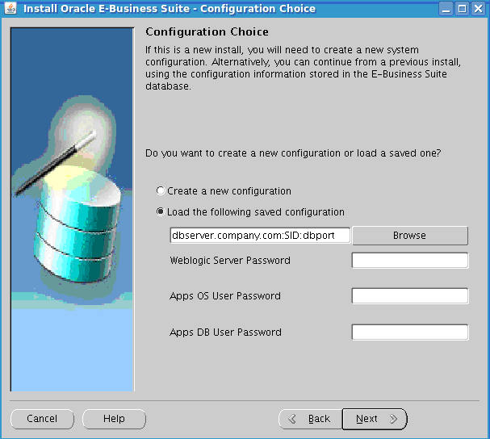
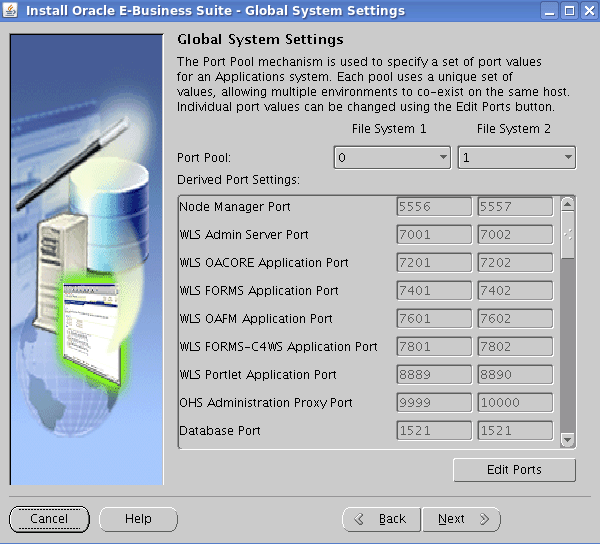
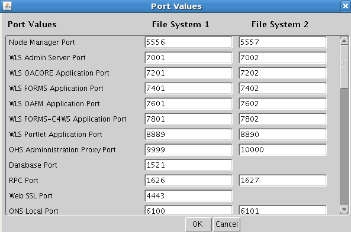

#Performing an installation
快速安装提供两种选择执行全新安装：标准安装(Standard Installation)和简易安装(Express Installation)。标准安装将会使用特定于系统的配置参数创建新的系统，简易安装只需用户进行很少的设置即可完成安装（系统会提供许多参数的默认值）。

本章包含以下内容:

* [标准安装](#standard-installation)
* [简易安装](#)
* [What To Do Next](#)

##Standard Installation
This section describes the setup steps for a standard installation, where the user supplies various system-specific parameters. An Express installation is described in [Setting Up an Express Installation](#).

**重要**: 在开始执行本章节提供的安装步骤之前，你必须已经使用buildStage脚本创建好stage area。具体请参考第一章关于创建Stage Area相关的章节

Follow the instructions in the section [Before You Begin](#) in [Getting Started](#). Then complete the following tasks, which are grouped into logical sections.

**重要**: 你不必在每个节点都执行这些安装步骤。你只需在数据库节点和主应用节点安装最新的程序包，然后使用标准的克隆命令将应用节点复制到所需的数目。克隆程序将会在本书的相关章节提及。

###Describe System Configuration
1. **Start the Rapid Install wizard**

    Start the wizard from the command line by entering rapidwiz at the prompt. The Welcome screen lists the database and the technology stack components that are installed with Oracle E-Business Suite.

    This screen lists the components that are included in, or supported by, this release of Oracle E-Business Suite. You can expand the component lists, using the scroll bar to bring all the components into view.

    A new installation includes a fresh Oracle 11g Release 2 (11gR2) database. In an upgrade, Rapid Install can optionally create an Oracle 11gR2 database Oracle Home without a database. You can use this Oracle Home to upgrade or migrate your existing database to Oracle 11gR2. Alternatively, you can choose to use a suitable existing Oracle Home.

    **Note**: See Oracle E-Business Suite Upgrade Guide: Release 12.0 and 12.1 to Release 12.2.0.

    **Welcome Screen**

    

    This screen is for information only. No decisions need to be made. When you have reviewed the information, click Next to continue.

2. **Select a wizard operation**

    Use the Select Wizard Operation screen to indicate the action you want Rapid Install to perform. You begin both new installations and upgrades from this screen. Based on the action you choose, the Rapid Install wizard continues with the appropriate screen flow.

    **Select Wizard Operation - Install Oracle E-Business Suite Release 12.2.0**

    

    The available actions are as follows:

  * Install Oracle E-Business Suite Release 12.2.0

    This action sets up a new, fully configured system, with either a fresh database or a Vision Demo database. The configuration is derived from the system-specific configuration parameters you will enter in the Rapid Install wizard and save in the Oracle E-Business Suite database (conf_&lt;SID&gt;.txt file initially, until the database has been created).

  * Express Configuration

    This install option sets up a fully configured, single-user system with either a fresh database or Vision Demo database. You supply a few basic parameters, such as database type and name, top-level install directory, and choice of port pools. The remaining directories and mount points are supplied by Rapid Install using default values.

    **Note**: The steps in [Setting Up an Express Installation](#) in this chapter describe this option.

  * Upgrade to Oracle E-Business Suite Release 12.2.0

    Choose this option to indicate that you are upgrading your E-Business Suite products to the current version of Oracle E-Business Suite. The wizard screen flow presents two paths: one that lays down the file system and installs the new technology stack, and one that configures servers and starts services.

    **Note**: See [Performing an Upgrade](#) to learn how Rapid Install works during a system upgrade.

    Using the following steps, you will set up a new installation. Choose Install Oracle E-Business Suite Release 12.2.0 and then click Next to continue.

3. **Supply email details for security updates**

    Data collected is sent via HTTPS (secure HTTP) to Oracle Support, facilitating pro-active problem avoidance and helping to reduce the time needed for resolution of support issues.

    **Supply Email Details for Security Updates**

    

    If submission of your details fails because no connection can be made, you are presented with a pop-up screen prompting for proxy server information:

    **Specify Proxy Server [Shown After Failed Connection Attempt]**

    

    If this screen appears, respond appropriately and then click OK.

4. **Identify configuration file**

    On the Configuration Choice screen, you indicate whether you will be using previously saved configuration details.

    **Configuration Choice**

    

    If you choose Create a new configuration , Rapid Install saves the configuration parameters you enter on the wizard screens in the Oracle E-Business Suite database, and in a configuration file (conf_&lt;SID&gt;.txt), which is stored in your system temporary directory until the installation is completed.

    If you choose Load the following saved configuration, the database connect string field becomes active. For a configuration stored in the database, this field is made up of &lt;hostname&gt;:&lt;SID&gt;:&lt;database port&gt;, for example server1.example.com:VIS:1521.

    **Important**: The host name must include the domain.

    Enter the appropriate database connect string (or conf_&lt;SID&gt;.txt file location, if applicable) to point Rapid Install to a stored configuration whose parameters you wish to use. Typically, you would choose this option when performing a multi-node install.

    **Note**: If Rapid Install is being run on the database tier using the Load the following saved configuration option, you must enter the default password for the APPS database user.

    After completing this step, click Next to continue.

5. **Specify Global System Settings**

    On the Global System Settings screen, you indicate whether you want to accept the default port values. You can specify a Port Pool setting to enable multiple Oracle E-Business Suite environments to co-exist on the same machine.

    For example, if you select an increment of 3 from the Port Pool list, the values in the Derived Port Settings will reflect this choice. Use the scroll bar or click Advanced Edit to see the Port Values screen.

    **Global System Settings**

    

    The default value of the Port Pool set is zero, but you can customize it by selecting another value from the drop-down list in the Port Pool field. There are 100 port pool selections: if you select an increment of 3, the default values are increased by that value. The Database Port (1521) becomes 1524, the RPC Port (1626) becomes 1629, and so on.

    At this point, you can simply accept the values for the chosen Port Pool (and therefore individual ports) by clicking Next. This will suffice for many installations.

    Otherwise, you can add an extra level of sophistication by specifying individual port values to meet particular site-specific requirements, over and above the basic use of the Port Pool mechanism described above. For example, you might wish to avoid using a particular port for some reason, perhaps because it will be needed by some other software. Clicking on the Edit Ports button will open a screen that allows you to specify the values of any ports you wish.

    **Port Values**

    

    When finished on this screen, click OK to return to the Global System Settings screen, and click Next on that screen.

6. Define Database Node Configuration

