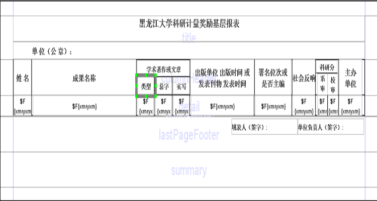

#JasperReport+iReport高级报表设计实战

##序言

一直以来，报表都是很多项目中一个重要的、不可获取的组成部分。然而其复杂性和专业性又使得程序员不能够也没时间自己设计属于目前手头正在构建的系统的报表模块；即便设计来了又可能由于通用性等原因不能够应用到下一个系统当中，这就导致了报表类库/组件在市场上的火爆。典型的例子就是水晶报表，几乎无处不在。还有一些专门处理中国式报表的组件也陆续出现在软件市场上。然而遗憾的是，他们中的绝大多数都是要收费的--这也无可厚非，毕竟人都是要生存的。所以大多数预算不够充裕的程序员都将目光转向了开源软件，而JasperReport就将是第一个进入他们视线中的佼佼者。

然而代码开源不代表我们就可以大大方方的拿来就用了，人家的文档也是要收费的，所以市面上有关于JasperReport的文档虽然也不少，但大多数都集中在简单应用和介绍基本操作的基础之上。对于复杂的报表设计并不能提供良好的帮助。本文将火力集中在相对复杂的报表设计（不包括图片和超连接等对办公系统或过程没有太大用途的页面元素），交叉表的生成等高级报表设计方案。对于那些基本的操作则留给读者自行体会，相信可以为各位解决一些实际问题。


##iReport概览

JasperReport是JasperSoft公司的一款开源的报表解决方案。通过JasperReport，用户就可以方便的定制、设计、生成项目所需要的各种报表。和JasperReport一样，iReport也是Sourceforg上的开源项目。它的出现，主要是为了降低JasperReport的使用难度，为用户提供可视化的报表设计工具，目前iReport的版本号为1.2.7。


每个版本的iReport都会与最新的JasperReport相匹配的功能，并可以手动设置与用户所使用的JasperReport兼容性，以便怀旧的用户可以无障碍地使用最新的iReport：


限于篇幅，我不可能把iReport操作的每一个细节都记录在本文中，而只能对涉及到的部分作出简要介绍，剩下的诸如报表中的各个报表元素是什么，属性都有什么；什么是iReport的字段（Filed），参数（parameter）和变量（variable）等等这些基本概念，如果想要深究细节的话有两种选择：1是寻找其官方文档（要收费），网上流传的文档版本较低，但是也可以作为参考，如果想要我翻译的JasperReport用户文档，可以给我发邮件。2是自己动手实践一下吧。

###准备工作

做报表的目的就是显示数据，无论是简单的查询结果还是某些统计信息。所以我们第一步要做的就是设定iReport中的数据源或数据库连接，以便于从数据库中动态获取数据。在菜单->Connection and Datasource里我们可以设定所要采用的数据提供方式。iReport为我们提供了丰富的选项：


通常情况下，我们一般有两种选择，一是选择数据库连结的数据源，通过这种方式，我们就可以直接在报表设计中写入SQL查询语句，让报表在运行期自动获取所需的数据来装填报表而不需要做额外的工作。但这样一来，就必然会损失一些程序的灵活性，比如查询语句或数据库连接需要修改的时候我们就不得不重新填入相应的内容并编译报表。所以我在工作中通常采用第二种方式，即用JavaBean的集合（Collection或Array）来充当数据源。下面我就分别介绍这两种连接方式：

####Database JDBC Connection Datasource

假设我要采用的数据库连接是MySQL，所以需要选择“Database JDBC Connection”方法：


我们可以根据自己的实际情况来建立数据库连接。值得一提的是，iReport为我们提供我们在实际项目中会遇到的几乎全部的JDBC驱动，不管你用的是MySQL，DB2，Orcale还是hsqldb和cloudscape，着实是十分方便。在设定好连接之后，我们就可以在“编辑->报表查询”中输入在报表填充所需的查询语句。如果你设置无误的话，在你输入SQL语句之后，iReport会自动为你显示出你要使用的表的属性都有哪些：


例如，我的数据库中的表“ky_kyxtbmb”中的属性在我填入sql语句之后被自动显示在了下面。对于简单的报表来说，这样做着实很方便。但是如果SQL查询或数据库连接需要变更的话，就需要重新填入SQL或数据库联接的信息，并编译报表设计，这显然是在损失了灵活性之后所获得的方便。所以通常我都采用第二种方式。

####JavaBean Set Datasource

我们点击“数据=〉连接/数据源=〉新建数据源”（如下图所示）。数据源类型我们要选择JavaBean set datasource。选项中Factory Class是用来生成Bean数据源的工厂类，它至少包含一个叫做createBeanCollection的方法（当然也可以叫其他的名字）。该工厂类用于为报表提供一个数组或集合类作为数据源，由报表引擎在运行期负责将数据读出，并装填到报表相应的字段。在利用iReport进行测试的时候，iReport会利用reflection功能在运行期创建一个看不见的工厂类，并调用其静态的数据源生成方法来生成数据源，最后交给报表引擎负责装填。


这里应该注意的是，JavaBean中的每一个字段都应该对应报表设计中的一个Field，这一点我们很快就会看到。再有就是我们看到iReport在指定生成数据源的静态方法的时候并没有给我们提供设置方法参数的功能，也就是说如果你的方法需要参数的话你就不能使用iReport来进行测试。不过这并不会产生很大的影响，我们在程序里测试就是了。


随后我们要做的是在“选项-〉classpath”中设定classpath，以便iReport能够找到我们定义的工厂类和相应的JavaBean类。最后，我们在“数据-〉报表查询-〉JavaBean数据源”中的类名文本框中填入JavaBean的全限定名，就可以获得JavaBean的字段名。这时选择“Add Selected Fields”就可以将这些字段变成报表中的“Field”，于是我们就可以在报表设计中通过“$F{字段名}”来使用它们了。下面是一个使用JavaBean数组作为数据源的例子：

```java
public class SRDataSourceFactory {
 
    /************************************************************************
     * 生成实验室人员知识年龄结构情况的数据源
     * @return JRDataSource
     ************************************************************************/
    public static JRDataSource createILabMemberInfoDS() throws Exception {
        JRBeanCollectionDataSource ds = null;
        ArrayList beans = createILabMemberInfoCollection();
        ds = new JRBeanCollectionDataSource(beans);
        return ds;
    }
 
	public static ArrayList createILabMemberInfoCollection() throws Exception {
		Connection conn = DBConnection.getConnection();//获得数据库连接
		ArrayList<ILabMemberInfoBean> beans = new ArrayList<ILabMemberInfoBean>();
		ILabPaperIndexedBean newBean;
 
		/**
		* @todo 下面的代码主要是将数据填入到newBean中，然后将newBean放入到数组beans里
		*       这里就不详述了。
		*/   
		……
		return beans;
	}
```

##实战报表设计

在实际应用中，很多报表都是用于显示对数据库信息进行统计查询的结果，所以这些报表都不是简单的二维表，而是带有复杂的表头的报表，又或表头的项目数量也是动态的交叉表。对第一种种报表来说，虽然其表头复杂，但报表的框架却是静态的，仅需要花费些时间在设计统计查询语句上，采用JavaBean作为数据源，运行期由数据库动态读取数据装填到报表中就可以了，所以我称之为“简单的”，具体实例见表格 2.1‑1和2.1‑2。第二种报表比之前一种复杂了很多，像表格 2.1‑3，这种表多用于显示统计查询的结果，其列的数量在运行期才能知晓。这需要报表工具专门的支持，而JasperReport为我们提供了支持这种交叉表的“有限”能力。而表格 2.1‑4的情况就更为复杂了，不但列是动态生成的，而且每一列都是复合表头。复合表头也就罢了，然而其表头的第二层（即指“项目数”和“经费”一层）又来源于不同的属性，这就超出了目前JasperReport和iReport的能力范畴（至于具体为甚么不能做我在下文还会有交待）。但我们还是有解决的方法：我们或者限定表的列数（这样就成了固定表头的简单报表了）；或者干脆就只能利用JaperReport的API来用程序动态生成报表设计，然而这显然是十分复杂的和费事的，也超出了本文的范畴，在这里就不详述了。下面我们就来看如何实现JasperReport和iReport能力所及的报表的设计。


图表 2.1‑1复杂表头的简单报表（1）


图表 2.1‑2复杂表头的简单报表（2）


图表 2.1‑3 简单的交叉表


图表 2.1‑4 复杂的交叉表

###简单的复杂表头报表设计

我的例子报表设计在设计器中显示的效果如下所示：



这个报表结构十分简单，并没有用到Group和Subreport及交叉表之类高级技术的，仅仅是为了说明复杂表头其实并不“复杂”。这个报表的作用是显示几个数据库表作统计查询结果，只要你在准备工作中正确的设置了参数（Parameter）和字段（Field），并输入了正确的查询语句，就可以获得想要的结果。


###交叉表的设计

交叉表（Crosstab—Cross Tabulation）是包含行列合计内容的表格，多用于显示统计结果，在工作中十分常用。JasperReport是在JasperReport1.1中开始支持这项功能的，然而其功能目前仍显稚嫩，还不能完成更为复杂的一些的操作，如图表 2.1‑4。不过聊胜于无，BIRT要到下一个版本才支持交叉表呢。下面就让我们具体看一下如何生成像图表 2.1‑3这样行列都带统计，且右下角的方格显示总计数值的报表设计吧。

####利用iReport向导生成交叉表架构

首先我们生成一个新的报表，在其summery带中放置一个交叉表，这时iReport就会出现交叉表生成向导来帮助我们设置交叉表的结构。跟据图2.1‑3的结构，我们看到表的行是飞机要飞往的城市名称，而列示飞机行班的名字。每一列的total指在每一个城市中某一架飞机的航班数，而每行的total表示某一城市中所有航班的数量，表的右下角为所有城市的总航班数。


可以看到，iReport的向导默认给我们提供了两个Row Group的能力，举例来说，我们扩展图2.1‑3，使其显示每个州的各个城市的飞机航班情况，就需要将Row Group1 设置为州（省）所对应的属性，而将Row Group 2置为城市所对应的属性。同样，我们也可以设置2个Column Group。但需要注意的是，我们发现这样的配置是不可能实现例如表2.1‑4这样的结构的。因为表2.1‑4中对应Column Group2的部分并不是取自一个属性，这样JasperReport就无法将其组织在一个格中。所以我们只能实现比2.1‑3的行/列多一个Group（即行列各多一维）但属性为单一属性的报表，而无法生成类似于2.1‑4这样的复杂结构。最后要说的是，如果有需要的话我们可以交叉表向导结束之后自行在交叉表的属性选项卡中加入新的行/列Group，而不仅仅局限于iReport向导中提供的两个。


在表的内容（Detail Field）部分我们也可以有如上图所示的3种选择，这一选项用来指示JasperReport如何进行运算。最后我们可以定义对total的配置，即是否加入行总计，是否加入列总计和是否显示表格线，本例中我们都是需要的。


至此，表格的基本骨架生成完毕，我们可以在设计器中看到如下内容：


然后我们在查询窗口写如下查询语句即可：


可以看到，我们并没有使用任何统计查询的语句，而JasperReport就能为我们自动进行统计运算，并将结果填入指定位置，它是怎么做到的呢？细心的人可能已经看出一点问题来了，怎么报表设计中的文本框里写的都是变量V而不是我们常用的字段F呢？这就是原因所在，JasperReport通过一个“Measure”，即我们在Detail Field部分定义的属性，根据其运算类型（包括Average, Count, First, Highest, Lowest, Nothing, StandardDeviation, Sum和Variance.）来对行/列的数量进行运算，并将结果存放在内部变量中（这些变量我们在iReport的变量查看器中是看不见的），并利用这些变量来显示统计结果。然而我们可以清楚地看到，这样的功能设定还是有很多问题的，例如如果我们的统计查询不能够仅由一条查询语句就能表示怎么办？就算用一条查询就能表示的统计，遇到像表2.1‑4这样的结构我们照样无计可施。所以在实在需要的情况下我们就只能借助于JasperReportAPI动态生成报表的JRXML文件来获得想要的灵活性，这是JasperReport的万灵丹，只不过需要付出更多的精力罢了。在JasperReport和IReport变得更强大之前，我们也就只能利用现有的工具作一些有限的工作了。

####偷懒的解决方案

对于交叉表来说，其难点在于报表的内容属于统计查询，不是一个查询语句就能获得所有想要的数据，而且表的列是不能在设计期就知晓的，进而不能像准备工作中所提到的那样设置一条查询就完事大吉。但是也可以有一个比较省事的方法是：将报表所需要的所有数据在数据库提取出来之后放到一个临时的表（或其他JasperReport数据源所支持的数据结构中，例如JavaBean）然后再将数据逐一填到报表中。对于表格 2.1‑2这样的报表，这种方法既实用又很简单，但是这种做法不适合列也是动态的交叉表—例如表格 2.1‑3。所以对于最后一种情况我们就没什么好说的，必须使用JasperReport的Crosstab的相关功能了。以上就是利用JasperReport+iReport进行报表设计的全部内容，限于篇幅，我只能尽量挑选一些网上人们问题的最多的普遍问题加以解释，说明了什么是JasperReport能做的，什么是它不能做或做起来很麻烦的，也大略讲解了究竟怎么做。希望能给各位在做报表时提供一点帮助。

##结束语

作者简介：本文作者薛笛，是黑龙江大学研究生。他目前在黑龙江大学信息技术研究所工作，从事传感器网络和移动数据库的研究，对Java技术特别感兴趣。可以通过 jxuedi@gmail.com 与他联系。

##引用

* [1] [原文地址](http://blog.csdn.net/kabini/article/details/1600055)