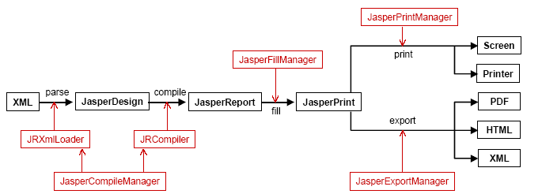
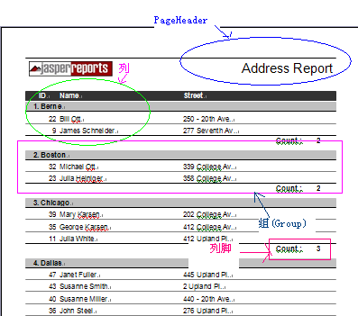
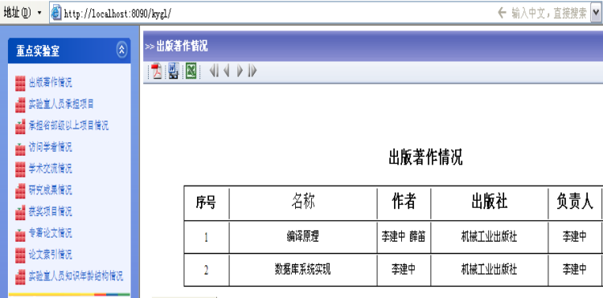
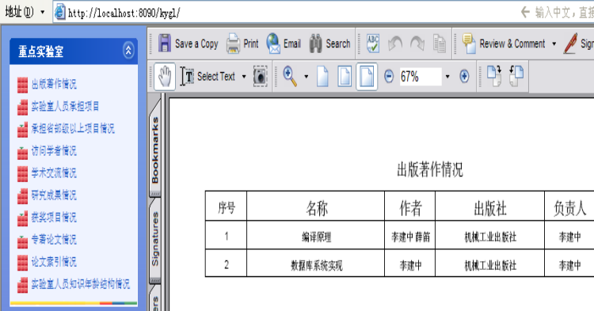

#用JasperReport+iReport进行Web报表开发

##序言

在很多实际的项目里，报表都是其中十分重要的组成部分，例如把查询结果以报表的形式呈现出来。这里所提到的报表可不是简单的二维表，而是拥有复杂表头的、多维的、可以在运行期从数据库中自动读取数据、可自动分页、拥有丰富的页面元素（图片，超连接等）、支持分组和交叉表、支持打印、最好还能导出到Excel或Word…...（汗L）。但是显而易见，报表功能越强大，提供的服务越丰富，其复杂度也就越提高，所以仅靠石器时代的手工方式生成报表是不能满足需要的。所幸，目前我们所熟知的几款报表工具功能上足够强大，而且都附有很方便的报表生成工具。它们分别是：JasperReport（+iReport），BIRT（+eclipse），水晶报表（+eclipse,JBuiler等等）。

之所以提到这三种报表工具首先是因为他们都是开放源码的（CrystalReportForEclipse1.0已经开源了）。既然不用考虑费用，那在我们的项目中到底选用哪一个呢？对于水晶报表而言，虽然其在.Net平台上表现十分抢眼，但是在Java平台上，多数的实现都是要收费的（例如For JBuilder版），而且其Eclipse插件的资源消耗十分惊人（我的机器配置为P4 3.0+512RAM，使用“Eclipse3.2+水晶报表插件”根本就跑不动）。所以我选择了纯Java的报表工具JasperReport与iReport的组合。但是关于JasperReport的文档相对匮乏，其官方文档还是要收费的，所我希望利用这篇文章展示如何利用这一强力组合来进行基于Web的报表开发，希望能为那些苦于报表的同仁们解决一些实际问题。

本文将火力集中在如何在Web环境下配置和使用JasperReport报表和报表的导出功能等方面，由于在以前的Blog中我已经写过如何设计普通的报表，所里这里将不再赘述。对于那些基本的操作则留给读者自行体会，相信在iReport的帮助下，上手会很快的。

##JasperReport简介

JasperReport是一个强大、灵活的报表生成工具，能够展示丰富的页面内容，并将之转换成PDF，HTML，XML，Excel（通过POI或JExcelAPI实现）和Rtf（通过POI实现）格式。该库完全由Java写成，可以用于在各种Java应用程序，包括J2EE，Web应用程序中生成动态内容。它的主要目的是辅助生成面向页面的（page oriented），准备付诸打印的文档。JasperReport借由定义于XML文档中的report design进行数据组织。这些数据可能来自不同的数据源，包括关系型数据库，collections，java对象数组。通过实现简单的接口，用户就可以将report library插入到订制好的数据源中。用JasperReport进行报表开发的过程如下所示（Version=1.0）：



目前JasperReport最新的版本是1.2.7，可以到Sourceforg网站下载其整个工程及代码。其工程文件目录下的demo子目录中包含很多定义良好的例子，可以实现各种所需功能。鉴于它的文档收费，想学习使用JasperReport的话我们也只能以这些demo作为学习资料了。

但是繁琐的XML标记和功能API在提供强大的动态及可扩展开发的同时也带来了超高的复杂性，在没有免费文档的情况下，手工编写报表设计所需的XML文件是极其不明智的。不过正如我们用JBuilder（或其他可视化开发工具）编写SwingGUI时一样，我们可以采用iReport进行可视化的报表设计来避免和可怕的XML文件及实现细节打交道。虽然可能会损失一些动态生成报表的灵活性，但是大多数情况下，我们只需要静态的设计框架和动态的装填数据而很少需要动态的报表框架，所以和我们所获得的方便相比，这些小小的损失简直可以忽略不计了。当然如果确实需要，且看到下面的东西你不晕的话，自己动手确实可以获得所需的灵活性。

其中的VerticalFilling和HorizontalFilling表示装填数据的顺序。从上图我们可以清楚地看到，一个报表的设计主要由PageHeader和报表内容组成，报表内容又是由列组成，内容既可以是一列也可以是多列，还可以是Group。具体的实例如下：



这些元素到底在JaserReport的XML设计文件中的定义为何我并不想关心，因为这都由iReport负责操心了，我们只需轻松的像搭积木一样利用iReport添加各种可视化元素就可以了。相信用过之后你会对iReport爱不释手，就像我一样。出于实际需要，我会提供一个简单的动态表单的生成框架供各位参考。 

##Web报表开发

现今的环境是Web大行其道，一个工具如果不能融入Web功能就无法立足。JasperReport的开发者显然很早就意识到了这一点，所以在JasperReport1.0以前就加入了支持Servlet/JSP的能力。也就是说，我们可以利用Servlet/JSP将生成好的报表导出成HTML（或PDF/RTF/EXCEL）格式供预览或导出之用。然而唯一的缺憾在于JasperReport并未提供在客户端直接打印的功能，而除了使用Applet之外我们又不能直接在客户端显示JRViewer这样的预览窗口，如何解决这些问题呢？

###环境设置

在Servlet/JSP中使用JasperReport无需更多的设置，只需要将JasperReport所用到的jar包放入工程中的WEB-INF/lib目录下即可。在程序运行期，Servlet/JSP只需能够正确加载报表文件，装填数据并生成JasperPring对象，利用我下面给出的导出框架稍加修改即可生成一个带有HTML/PDF/RTF/EXCEL导出功能以及可将HTML预览进行分页的功能模块。

###报表预览框架

```jsp
<%@page contentType="text/html; charset=UTF-8"%>
<%@page import="javax.servlet.*"%>
<%@ page import="net.sf.jasperreports.engine.*" %>
<%@ page import="net.sf.jasperreports.engine.util.*" %>
<%@ page import="net.sf.jasperreports.engine.export.*" %>
<%@ page import="net.sf.jasperreports.j2ee.servlets.*" %>
<%@ page import="java.util.*" %>
<%@ page import="java.io.*" %>
<%
 JasperPrint jasperPrint = (JasperPrint)session.getAttribute("JasperPrint");
 session.setAttribute(ImageServlet.DEFAULT_JASPER_PRINT_SESSION_ATTRIBUTE,jasperPrint);
 String pageTitle = (String)session.getAttribute("pageTitle");
 
 JRHtmlExporter exporter = new JRHtmlExporter();
 int pageIndex = 0;
 int lastPageIndex = 0;
 if (jasperPrint.getPages() != null){
    lastPageIndex = jasperPrint.getPages().size() - 1;
 }
 
 String pageStr = request.getParameter("pageIndex");
 try{
    if( pageStr != null)
        pageIndex = Integer.parseInt(pageStr);
 }catch(Exception e){
    //e.printStackTrace();
 }
 
 if (pageIndex < 0){
    pageIndex = 0;
 }
 
 if (pageIndex > lastPageIndex){
    pageIndex = lastPageIndex;
 }
 
 StringBuffer sbuffer = new StringBuffer();
 
 exporter.setParameter(JRExporterParameter.JASPER_PRINT, jasperPrint);
 exporter.setParameter(JRExporterParameter.OUTPUT_STRING_BUFFER, sbuffer);
 exporter.setParameter(JRHtmlExporterParameter.IMAGES_URI, "ImageServlet?image=");
 exporter.setParameter(JRExporterParameter.PAGE_INDEX, new Integer(pageIndex));
 exporter.setParameter(JRHtmlExporterParameter.HTML_HEADER, "");
 exporter.setParameter(JRHtmlExporterParameter.BETWEEN_PAGES_HTML, "");
 exporter.setParameter(JRHtmlExporterParameter.HTML_FOOTER, "");
 try{
    exporter.exportReport();
    }catch(Exception e){
      e.printStackTrace();
    }
%>
```

这部分代码用于将Servlet生成的JasperReport对象导出成HTML格式，导出所用的Servlet为JasperReport自带的ImageServlet。要特别注意的是我加了颜色部分的代码，即一定要向Session变量中放入一个JasperPrint对象，其关键字为“ImageServlet.DEFAULT_JASPER_PRINT_SESSION_ATTRIBUTE”，这样ImageServlet就可以获取并自动导出报表了。

```html
<html>
<head>
<title><%=pageTitle %></title>
<meta http-equiv="Content-Type" content="text/html; charset=UTF-8">
<link rel="stylesheet" type="text/css" href="CSS/style.css">
</head>
<body>
<table class="titleBarT">
    <tr>
      <td>        &gt;&gt;
       <%=pageTitle %>
      </td>
    </tr>
</table>
 
<table width="98%" cellpadding="0" cellspacing="0" border="0" height="22">
<tr>
      <td>       
        <div class="menu"><a href="PdfServlet"></a></div>
        <div class="menu"><a href="RtfServlet"></a></div>
        <div class="menu"><a href="XlsServlet"></a></div>
       
        <div class="menu"><a href="">&nbsp;&nbsp;</a></div>
        <div>
        <%
          if (pageIndex > 0)
          {
            %>
            <a href="本页?pageIndex=0"></a>
            <a href="本页?pageIndex=<%=pageIndex - 1%>"></a>
            <%
          }
          else
          {
            %>
            
            
            <%
          }
 
          if (pageIndex < lastPageIndex)
          {
            %>
            <a href="本页?pageIndex=<%=pageIndex + 1%>"></a>
            <a href="本页?pageIndex=<%=lastPageIndex%>"></a>
            <%
          }
          else
          {
            %>
            
            
            <%
            }
            %>
            </div>
            </td>
        </tr>
</table>
这段代码是将导出成HTML的报表进行分页显示。
<table width="98%" cellpadding="0" cellspacing="0" border="0">
<tr>
 <td width="50%">&nbsp;</td>
 <td align="left">
 <%=sbuffer.toString()%>
 </td>
 <td width="50%">&nbsp;</td>
</tr>
</table>
</body>
</html>
```

这里导出报表内容的代码。用Tomcat作为WebContainer，显示的结果如下：



利用这个框架我们可以轻易的实现自动分页的功能并将报表导出成我们想要的格式：如PDF，Word，Excel的等。



限于篇幅，这里我不能够展现报表开发的每一个细节和过程，但是我已经尽量将Web报表开发的大概过程提取出来，并着重介绍数据源的设制，交叉表的设计，以及Web预览框架这些相信每个做Web报表的人都会遇到的问题及其解决方案，在JasperReport的高端使用文档相对匮乏的情况下，希望我的努力能给你带来一点帮助。

###使用JNLP技术实现客户端预览

> 原文已删

##结束语

> 原文已删

##引用

* [1] [原文地址](http://blog.csdn.net/kabini/article/details/1600073)


