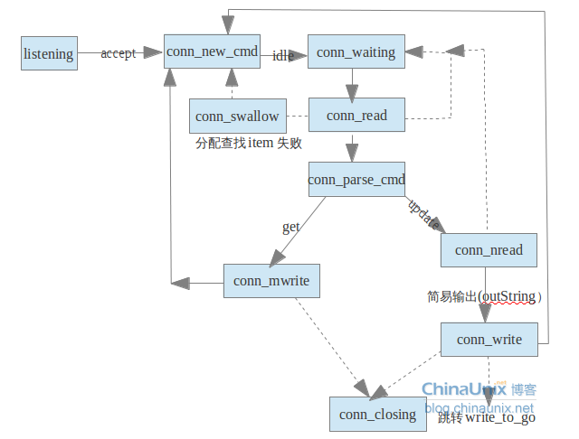

#状态机（一）

按我们之前的描述，Master线程建立连接之后，分发给Worker线程，而Worker线程处理业务逻辑时，会进入状态机，状态机按不同的状态处理业务逻辑，我们在分析连接分发时，已经看到了Master线程进入状态机时在有新连接建立的时候，后续的状态都是业务逻辑的状态，其处理流程如下图所示：



总共有10个状态（代码中的状态不止这些，有些没什么用，此处就没展现），状态listenning状态是Master建立连接的过程，我们已经分析过了，我们接下来分不同的文章分析其余的9中状态。

```c
enum conn_states {
    conn_listening,  //监听状态
    conn_new_cmd,    //为新连接做一些准备
    conn_waiting,    //等待读取一个数据包
    conn_read,       //读取网络数据
    conn_parse_cmd,  //解析缓冲区的数据
    conn_write,      //简单的回复数据
    conn_nread,      //读取固定数据的网络数据
    conn_swallow,    //处理不需要的写缓冲区的数据
    conn_closing,    //关闭连接
    conn_mwrite,     //顺序的写多个item数据
    conn_max_state   //最大状态，做断言使用
};
```

这篇文件先分析conn_new_cmd和conn_wating状态，子线程最初进入的状态就是conn_new_cmd状态，这个状态主要是做一些清理。

```c
case conn_new_cmd:
        --nreqs;//全局变量，记录每个libevent实例处理的事件，通过初始启动参数配置
        if (nreqs >= 0)//还可以处理请求
        {
            reset_cmd_handler(c);//整理缓冲区
        }
        else//拒绝请求
        {
            pthread_mutex_lock(&c->thread->stats.mutex);
            c->thread->stats.conn_yields++;//更新统计数据
            pthread_mutex_unlock(&c->thread->stats.mutex);
            if (c->rbytes > 0)//如果缓冲区有数据，则需要处理
            {
                if (!update_event(c, EV_WRITE | EV_PERSIST))//更新libevent状态
                {
                    if (settings.verbose > 0)
                        fprintf(stderr, "Couldn't update event\n");
                    conn_set_state(c, conn_closing);//关闭连接
                }
            }
            stop = true;
        }
        break;
//整理缓冲区
static void reset_cmd_handler(conn *c)
{
    c->cmd = -1;
    c->substate = bin_no_state;
    if (c->item != NULL)//还有item
    {
        item_remove(c->item);//删除item，本篇不分析其实现，后续分析
        c->item = NULL;
    }
    conn_shrink(c);//整理缓冲区
    if (c->rbytes > 0)//缓冲区还有数据
    {
        conn_set_state(c, conn_parse_cmd);//更新状态
    }
    else//如果没有数据
    {
        conn_set_state(c, conn_waiting);//进入等待状态，状态机没有数据要处理，就进入这个状态
    }
}
//缩小缓冲区
static void conn_shrink(conn *c)
{
    assert(c != NULL);

    if (IS_UDP(c->transport))//如果是UDP协议，不牵涉缓冲区管理
        return;
    //读缓冲区空间大小>READ_BUFFER_HIGHWAT && 已经读到的数据还没解析的数据小于 DATA_BUFFER_SIZE
    if (c->rsize > READ_BUFFER_HIGHWAT && c->rbytes < DATA_BUFFER_SIZE)
    {
        char *newbuf;

        if (c->rcurr != c->rbuf)
            memmove(c->rbuf, c->rcurr, (size_t) c->rbytes);//目前数据是从rcurr开始的，移动数据到rbuf中

        newbuf = (char *) realloc((void *) c->rbuf, DATA_BUFFER_SIZE);//按DATA_BUFFER_SIZE扩大缓冲区

        if (newbuf)
        {
            c->rbuf = newbuf;//更新读缓冲区
            c->rsize = DATA_BUFFER_SIZE;//更新读缓冲区大小
        }
        c->rcurr = c->rbuf;
    }

    if (c->isize > ITEM_LIST_HIGHWAT)//需要写出的item的个数，也就是要发送给客户端的item的个数
    {
        item **newbuf = (item**) realloc((void *) c->ilist,ITEM_LIST_INITIAL * sizeof(c->ilist[0]));//增大存放item的空间
        if (newbuf)
        {
            c->ilist = newbuf;//更新信息
            c->isize = ITEM_LIST_INITIAL;//更新信息
        }
    }

    if (c->msgsize > MSG_LIST_HIGHWAT)//msghdr的个数，memcached发送消息是通过sendmsg批量发送的
    {
        struct msghdr *newbuf = (struct msghdr *) realloc((void *) c->msglist,MSG_LIST_INITIAL * sizeof(c->msglist[0]));//增大空间
        if (newbuf)
        {
            c->msglist = newbuf;//更新信息
            c->msgsize = MSG_LIST_INITIAL;//更新信息
        }
    }

    if (c->iovsize > IOV_LIST_HIGHWAT)//msghdr里面iov的数量
    {
        struct iovec *newbuf = (struct iovec *) realloc((void *) c->iov,IOV_LIST_INITIAL * sizeof(c->iov[0]));//增大空间
        if (newbuf)
        {
            c->iov = newbuf;//更新信息
            c->iovsize = IOV_LIST_INITIAL;//更新信息
        }
    }
}

```

从conn_new_cmd状态会进入conn_parse_cmd状态（如果有数据）或者conn_waiting（如果没有数据）状态，下面看看conn_waiting状态。

```c
case conn_waiting:
        if (!update_event(c, EV_READ | EV_PERSIST))//修改libevent状态，读取数据
        {
            if (settings.verbose > 0)
                fprintf(stderr, "Couldn't update event\n");
            conn_set_state(c, conn_closing);
            break;
        }

        conn_set_state(c, conn_read);//进入读数据状态
        stop = true;
        break;
//更新libevent状态，也就是删除libevent事件后，重新注册libevent事件
static bool update_event(conn *c, const int new_flags)
{
assert(c != NULL);

struct event_base *base = c->event.ev_base;
if (c->ev_flags == new_flags)
    return true;
if (event_del(&c->event) == -1)//删除旧的事件
    return false;
event_set(&c->event, c->sfd, new_flags, event_handler, (void *) c);//注册新事件
event_base_set(base, &c->event);
c->ev_flags = new_flags;
if (event_add(&c->event, 0) == -1)
    return false;
return true;
}

```

备注：图片参考地址，http://blog.chinaunix.net/uid-27767798-id-3415510.html

##引用

- [0] [原文](http://blog.csdn.net/lcli2009/article/details/21879243)