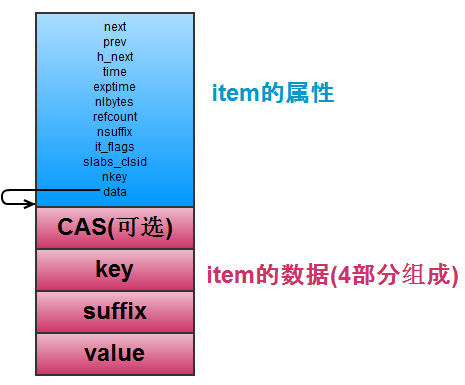
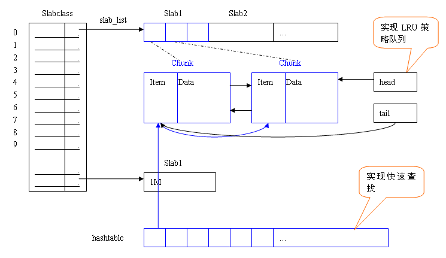

#item结构

item是Memcached中抽象实际数据的结构，我们分析下item的一些特性，便于后续Memcached的其他特性分析。

```c
typedef struct _stritem {
    struct _stritem *next;//item在slab中存储时，是以双链表的形式存储的,next即后向指针
    struct _stritem *prev;//prev为前向指针
    struct _stritem *h_next;//Hash桶中元素的链接指针
    rel_time_t      time; //最近访问时间
    rel_time_t      exptime;//过期时间
    int             nbytes;//数据大小
    unsigned short  refcount;//引用次数
    uint8_t         nsuffix;    //不清楚什么意思?
    uint8_t         it_flags;   //不清楚什么意思?
    uint8_t         slabs_clsid;//标记item属于哪个slabclass下
    uint8_t         nkey;       //key的长度
    union {
        uint64_t cas;
        char end;
    } data[];//真实的数据信息
} item;

```

其结构图如下所示：



即Item由两部分组成，item的属性信息和item的数据部分，属性信息解释如上，数据部分包括cas，key和真实的value信息，item在内存中的存储形式如下：


这个图画出了部分结构，还有Hash表的结构没有画出。



这里大概介绍了item的一些信息，后面我们会分析item插入Hash表等信息。

注：本篇博客的图片摘自：

- [http://kenby.iteye.com/blog/1423989](http://kenby.iteye.com/blog/1423989)
- [http://www.nosqlnotes.net/archives/222](http://www.nosqlnotes.net/archives/222)

##引用

- [0] [原文](http://blog.csdn.net/lcli2009/article/details/21985793)