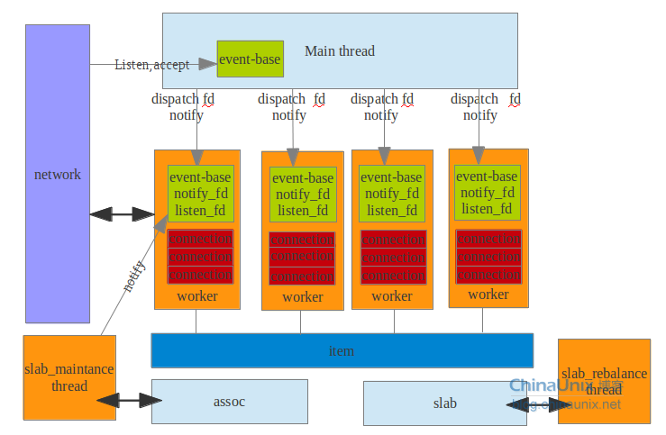
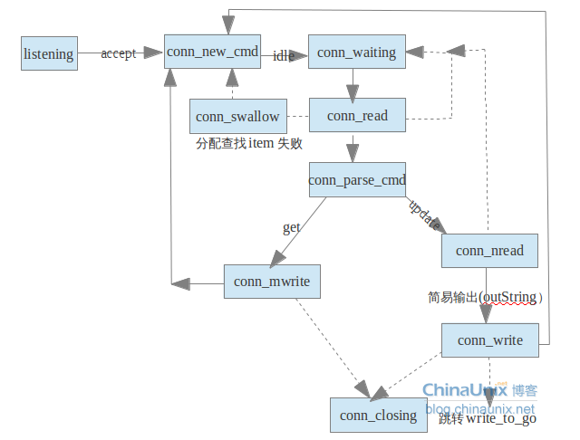

# Memcached的网络模型

Memcached依赖于libevent，网络模型是典型的reactor模式，主线程通过自己的event_base绑定端口监听网络中的连接。每个worker线程的初始任务就是轮询管道上的notify_receive_fd的读事件，如果有连接，主线程往相应的worker线程的管道的输入端notify_send_fd写入关键字‘c’，代表着网络上有新的连接要派发给worker线程，这样worker进程直接accept就能得到连接的fd了，同时把这个fd的读事件放到每个worker进程的event_base中，如图，每个worker的进程同时监听notify_receive_fd和外部连接的fd上的事件。每个worker都应该为连接上的fd分配一个conn结构体，这个结构体记录了这个连接全部的信息，如连接的fd，读写buf，操作的item，当前connection的状态等等。



主线程的任务就是监听网络，如果监听到了连接就顺序分发到worker线程，通过管道通知worker线程建立连接（调用accept函数，这样调用accept肯定能得到连接的fd）。

建立连接的代码：

```c
event_set(&c->event, sfd, event_flags, event_handler, (void *)c); 
//sfd就是监听连接的fd，event_handler就是有事件的回调函数，
//c是当前的connection，作为一个attachment，
//在调用回调函数时，就能通过attchement获得当前有事件的connection。 
event_base_set(base, &c->event); //初始化这个事件
c->ev_flags = event_flags; 

if (event_add(&c->event, 0) == -1) { //把这个事件加到event-base事件的监控中
    if (conn_add_to_freelist(c)) { 
       conn_free(c); 
    } 
    perror("event_add"); 
    return NULL; 
}
```

如果有连接，那么event_base会回调函数event_handler,还有监听新连接的sfd初始状态都是conn_listening,如果回调了函数event_hander,那么证明一定就是有连接请求的。

```c
case conn_listening:           //监听的fd的connection，初始状态就是这个，表示监听中，有连接
   addrlen = sizeof(addr); 
   if ((sfd = accept(c->sfd, (struct sockaddr *)&addr, &addrlen)) == -1) { 
                               //回调到了这个地方，肯定有连接，这个函数直接得到连接的sfd

   if ((flags = fcntl(sfd, F_GETFL, 0)) < 0 || 
   fcntl(sfd, F_SETFL, flags | O_NONBLOCK) < 0) { //把这个套结字变为非阻塞操作 
      perror("setting O_NONBLOCK"); 
      close(sfd); 
      break; 
    } 

} else { //这里把新的请求分配给相应的worker线程 
    dispatch_conn_new(sfd, conn_new_cmd, EV_READ | EV_PERSIST, 
    DATA_BUFFER_SIZE, tcp_transport); 
}
```

接到了请求了之后，会顺序分配给每个worker线程，把这个连接的sfd所关心的初始状态和事件和readbuf，作为一个entry放到worker进程的连接队列中，同时向那个worker的线程的管道的notify_ receive_fd写入‘c’,提示worker进程有连接，每个worker线程有个连接队列，做缓冲，为了防止worker新连接产生的过快，worker线程处理速度过慢。

```c
CQ_ITEM *item = cqi_new();                          //建立连接的item
char buf[1]; 
int tid = (last_thread + 1) % settings.num_threads; // 每次分配worker线程，加1

LIBEVENT_THREAD *thread = threads + tid; 

last_thread = tid;                             //可以看出每次分配worker都是顺序分配的

item->sfd = sfd; 
item->init_state = init_state; 
item->event_flags = event_flags; 
item->read_buffer_size = read_buffer_size; 
item->transport = transport; 

cq_push(thread->new_conn_queue, item);            //插入到这个worker进程的连接队列中

MEMCACHED_CONN_DISPATCH(sfd, thread->thread_id); 
buf[0] = 'c'; 
if (write(thread->notify_send_fd, buf, 1) != 1) { 
                                            //往这个worker的管道的一端写入数据，提示有连接了
perror("Writing to thread notify pipe"); 
}
```
worker线程拿到了这个连接之后，就应该是分配给这个连接一个结构体，包括这个连接所有的状态，都写buf等，这个结构体就是conn，然后这个worker线程会在它自己的event_base加入对这个新的连接的事件的监听。上面也说过了worker的event_base有两套处理逻辑，一个对notify_ receive_fd的，还有一套是对新连接的。这个notify_ receive_fd的处理逻辑就是处理2个事件，一个是建立连接，一个是[改变锁的粒度](http://blog.chinaunix.net/uid-27767798-id-3405690.html)。连接有个状态机：



1. listening:这个状态是主线程的connection默认状态，它只有这一个状态，它做的工作就是把接到连接分发到worker子线程。

2. conn_new_cmd:每个新连接的初始状态，这个状态会清空读写buf。

3. conn_waiting:这个状态就是在event_base中设置读事件，然后状态机暂停，挂起当前connection（函数退出，回调函数的attachment会记录这个connection），等待有新的信息过来，然后通过回调函数的attachment重新找到这个connection，然后启动状态机。

4. conn_read:该状态从sfd中读取客户端的指令信息。

5. conn_parse_cmd:判断具体的指令，如果是update的指令，那么需要跳转到conn_nread中，因为需要在从网络中读取固定byte的数据，如果是查询之类的指令，就直接查询完成后，跳转到conn_mwrite中，返回数据

6. conn_nread:从网络中读取指定大小的数据，这个数据就是更新到item的数据，然后将数据更新到hash和lru中去，然后跳转到conn_write

7. conn_write:这个状态主要是调用out_string函数会跳转到这个状态，一般都是提示信息和返回的状态信息，然后输出这些数据，然后根据write_to_go的状态，继续跳转

8. conn_mwrite:这个写是把connection中的msglist返回到客户端，这个msglist存的是item的数据，用于那种get等获得item的操作的返回数据。

9. conn_swallow:对于那种update操作，如果分配item失败，显然后面的nread，是无效的，客户端是不知道的，这样客户端继续发送特定的数量的数据，就需要把读到的这些数据忽略掉，然后如果把后面指定的数据都忽略掉了（set的两部提交，数据部分忽略掉），那么connection跳转到conn_new_cmd，如果读nread的那些特定数量的数据没有读到，直接跳转到conn_closing。

10. conn_closing:服务器端主动关闭连接，调用close函数关闭文件描述符，同时把conn结构体放到空闲队列中，供新的连接重用这写conn结构体。

总结：memcached的网络模块的事件模型依赖于libevent的实现，memcached把fd关心的事件注册给libevent并注册了回调函数，libevent负责回调memcached，主线程把连接dispatch到具体的worker线程，同时把这个连接的描述符注册给worker线程自己的一套libevent，这样worker就接收了这个连接，以后这个fd上的事件回调都是这个线程上的做的工作了，每个连接都有自己的一套状态机，如果接受到数据就通过状态机处理，状态扭转，如果暂时没有数据就把连接暂时挂起，等到有了数据继续执行状态机。

## 引用

- [0] [原文](http://blog.chinaunix.net/uid-27767798-id-3415510.html)