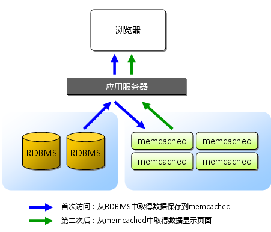

#memcached完全剖析--1. memcached的基础

翻译一篇技术评论社的文章，是讲memcached的连载。[fcicq](http://www.fcicq.net/wp/)同学说这个东西很有用，希望大家喜欢。

- **发表日**：2008/7/2
- **作者**：长野雅广(Masahiro Nagano)
- **原文链接**：[http://gihyo.jp/dev/feature/01/memcached/0001](http://gihyo.jp/dev/feature/01/memcached/0001)

我是[mixi株式会社](http://mixi.jp/)开发部系统运营组的长野。 日常负责程序的运营。从今天开始，将分几次针对最近在Web应用的可扩展性领域 的热门话题memcached，与我公司开发部研究开发组的前坂一起， 说明其内部结构和使用。

##memcached是什么？

[memcached](http://www.danga.com/memcached/)是以[LiveJournal](http://www.livejournal.com/)旗下[Danga Interactive](http://www.danga.com/) 公司的[Brad Fitzpatric](http://www.bradfitz.com/)为首开发的一款软件。现在已成为[mixi](http://mixi.jp/)、[hatena](http://www.hatena.ne.jp/)、 [Facebook](http://www.facebook.com/)、[Vox](http://www.vox.com/)、LiveJournal等众多服务中提高Web应用扩展性的重要因素。

许多Web应用都将数据保存到RDBMS中，应用服务器从中读取数据并在浏览器中显示。 但随着数据量的增大、访问的集中，就会出现RDBMS的负担加重、数据库响应恶化、 网站显示延迟等重大影响。

这时就该memcached大显身手了。memcached是高性能的分布式内存缓存服务器。 一般的使用目的是，通过缓存数据库查询结果，减少数据库访问次数，以提高动态Web应用的速度、 提高可扩展性。



图1 一般情况下memcached的用途

##memcached的特征

memcached作为高速运行的分布式缓存服务器，具有以下的特点。

- 协议简单
- 基于libevent的事件处理
- 内置内存存储方式
- memcached不互相通信的分布式

###协议简单

memcached的服务器客户端通信并不使用复杂的XML等格式， 而使用简单的基于文本行的协议。因此，通过telnet 也能在memcached上保存数据、取得数据。下面是例子。

```
$ telnet localhost 11211
Trying 127.0.0.1...
Connected to localhost.localdomain (127.0.0.1).
Escape character is '^]'.
set foo 0 0 3     （保存命令）
bar               （数据）
STORED            （结果）
get foo           （取得命令）
VALUE foo 0 3     （数据）
bar               （数据）
```

协议文档位于memcached的源代码内，也可以参考以下的URL。

> [http://code.sixapart.com/svn/memcached/trunk/server/doc/protocol.txt](http://code.sixapart.com/svn/memcached/trunk/server/doc/protocol.txt)

###基于libevent的事件处理

libevent是个程序库，它将Linux的epoll、BSD类操作系统的kqueue等事件处理功能 封装成统一的接口。即使对服务器的连接数增加，也能发挥O(1)的性能。 memcached使用这个libevent库，因此能在Linux、BSD、Solaris等操作系统上发挥其高性能。 关于事件处理这里就不再详细介绍，可以参考Dan Kegel的The C10K Problem。

- [libevent](http://www.monkey.org/~provos/libevent/)
- [The C10K Problem](http://www.kegel.com/c10k.html)

###内置内存存储方式

为了提高性能，memcached中保存的数据都存储在memcached内置的内存存储空间中。 由于数据仅存在于内存中，因此重启memcached、重启操作系统会导致全部数据消失。 另外，内容容量达到指定值之后，就基于LRU(Least Recently Used)算法自动删除不使用的缓存。 memcached本身是为缓存而设计的服务器，因此并没有过多考虑数据的永久性问题。 关于内存存储的详细信息，本连载的第二讲以后前坂会进行介绍，请届时参考。

###memcached不互相通信的分布式

memcached尽管是“分布式”缓存服务器，但服务器端并没有分布式功能。 各个memcached不会互相通信以共享信息。那么，怎样进行分布式呢？ 这完全取决于客户端的实现。本连载也将介绍memcached的分布式。


图2 memcached的分布式

接下来简单介绍一下memcached的使用方法。

##安装memcached

memcached的安装比较简单，这里稍加说明。

memcached支持许多平台。 * Linux * FreeBSD * Solaris (memcached 1.2.5以上版本) * Mac OS X

另外也能安装在Windows上。这里使用Fedora Core 8进行说明。

##memcached的安装

运行memcached需要本文开头介绍的libevent库。Fedora 8中有现成的rpm包， 通过yum命令安装即可。

```
$ sudo yum install libevent libevent-devel
```

memcached的源代码可以从memcached网站上下载。本文执笔时的最新版本为1.2.5。 Fedora 8虽然也包含了memcached的rpm，但版本比较老。因为源代码安装并不困难， 这里就不使用rpm了。

- [下载memcached](http://www.danga.com/memcached/download.bml)

memcached安装与一般应用程序相同，configure、make、make install就行了。

```
$ wget http://www.danga.com/memcached/dist/memcached-1.2.5.tar.gz
$ tar zxf memcached-1.2.5.tar.gz
$ cd memcached-1.2.5
$ ./configure
$ make
$ sudo make install
```

默认情况下memcached安装到/usr/local/bin下。

##memcached的启动

从终端输入以下命令，启动memcached。

```
$ /usr/local/bin/memcached -p 11211 -m 64m -vv
slab class   1: chunk size     88 perslab 11915
slab class   2: chunk size    112 perslab  9362
slab class   3: chunk size    144 perslab  7281
中间省略
slab class  38: chunk size 391224 perslab     2
slab class  39: chunk size 489032 perslab     2
<23 server listening
<24 send buffer was 110592, now 268435456
<24 server listening (udp)
<24 server listening (udp)
<24 server listening (udp)
<24 server listening (udp)
```

这里显示了调试信息。这样就在前台启动了memcached，监听TCP端口11211 最大内存使用量为64M。调试信息的内容大部分是关于存储的信息， 下次连载时具体说明。

作为daemon后台启动时，只需

```
$ /usr/local/bin/memcached -p 11211 -m 64m -d
```

这里使用的memcached启动选项的内容如下。

选项	说明

```
-p	使用的TCP端口。默认为11211
-m	最大内存大小。默认为64M
-vv	用very vrebose模式启动，调试信息和错误输出到控制台
-d	作为daemon在后台启动
```

上面四个是常用的启动选项，其他还有很多，通过

```
$ /usr/local/bin/memcached -h
```

命令可以显示。许多选项可以改变memcached的各种行为， 推荐读一读。

##用客户端连接

许多语言都实现了连接memcached的客户端，其中以Perl、PHP为主。 仅仅memcached网站上列出的语言就有

- Perl
- PHP
- Python
- Ruby
- C#
- C/C++
- Lua

等等。

> [memcached客户端API](http://www.danga.com/memcached/apis.bml)

这里介绍通过mixi正在使用的Perl库链接memcached的方法。

##使用Cache::Memcached

Perl的memcached客户端有

- Cache::Memcached
- Cache::Memcached::Fast
- Cache::Memcached::libmemcached

等几个CPAN模块。这里介绍的Cache::Memcached是memcached的作者Brad Fitzpatric的作品， 应该算是memcached的客户端中应用最为广泛的模块了。

> [Cache::Memcached - search.cpan.org](http://search.cpan.org/dist/Cache-Memcached/)

###使用Cache::Memcached连接memcached

下面的源代码为通过Cache::Memcached连接刚才启动的memcached的例子。

```perl
#!/usr/bin/perl

use strict;
use warnings;
use Cache::Memcached;

my $key = "foo";
my $value = "bar";
my $expires = 3600; # 1 hour
my $memcached = Cache::Memcached->new({
    servers => ["127.0.0.1:11211"],
    compress_threshold => 10_000
});

$memcached->add($key, $value, $expires);
my $ret = $memcached->get($key);
print "$ret\n";
```

在这里，为Cache::Memcached指定了memcached服务器的IP地址和一个选项，以生成实例。 Cache::Memcached常用的选项如下所示。

|选项|说明|
|----|----|
|servers|用数组指定memcached服务器和端口|
|compress_threshold|数据压缩时使用的值|
|namespace|指定添加到键的前缀|

另外，Cache::Memcached通过Storable模块可以将Perl的复杂数据序列化之后再保存， 因此散列、数组、对象等都可以直接保存到memcached中。

###保存数据

向memcached保存数据的方法有

- add
- replace
- set

它们的使用方法都相同：

```perl
my $add = $memcached->add( '键', '值', '期限' );
my $replace = $memcached->replace( '键', '值', '期限' );
my $set = $memcached->set( '键', '值', '期限' );
```

向memcached保存数据时可以指定期限(秒)。不指定期限时，memcached按照LRU算法保存数据。 这三个方法的区别如下：

|选项|说明|
|----|----|
|add|仅当存储空间中不存在键相同的数据时才保存|
|replace|仅当存储空间中存在键相同的数据时才保存|
|set|与add和replace不同，无论何时都保存|

###获取数据

获取数据可以使用get和get_multi方法。

```perl
my $val = $memcached->get('键');
my $val = $memcached->get_multi('键1', '键2', '键3', '键4', '键5');
```

一次取得多条数据时使用get_multi。get_multi可以非同步地同时取得多个键值， 其速度要比循环调用get快数十倍。

###删除数据

删除数据使用delete方法，不过它有个独特的功能。

```perl
$memcached->delete('键', '阻塞时间(秒)');
```

删除第一个参数指定的键的数据。第二个参数指定一个时间值，可以禁止使用同样的键保存新数据。 此功能可以用于防止缓存数据的不完整。但是要注意，set函数忽视该阻塞，照常保存数据

###增一和减一操作

可以将memcached上特定的键值作为计数器使用。

```perl
my $ret = $memcached->incr('键');
$memcached->add('键', 0) unless defined $ret;
```

增一和减一是原子操作，但未设置初始值时，不会自动赋成0。因此， 应当进行错误检查，必要时加入初始化操作。而且，服务器端也不会对 超过2 SUP(32)时的行为进行检查。

##总结

这次简单介绍了memcached，以及它的安装方法、Perl客户端Cache::Memcached的用法。 只要知道，memcached的使用方法十分简单就足够了。

下次由前坂来说明memcached的内部结构。了解memcached的内部构造， 就能知道如何使用memcached才能使Web应用的速度更上一层楼。 欢迎继续阅读下一章。

##引用

* [1] [原文](http://charlee.li/memcached-001.html)