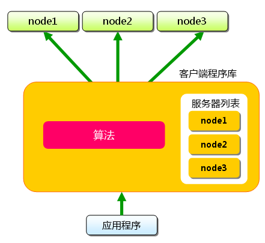
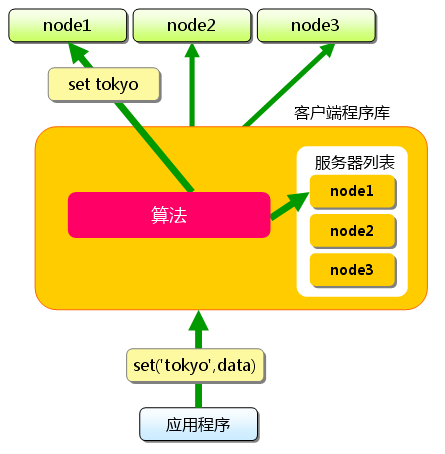
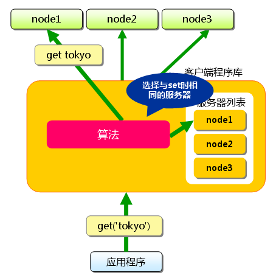
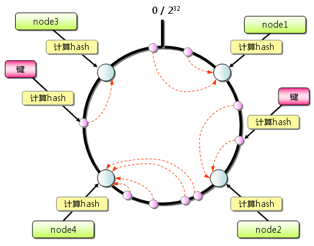
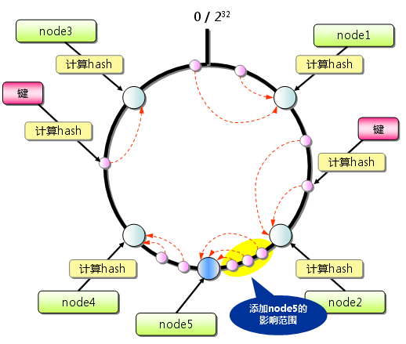

#memcached全面剖析--4. memcached的分布式算法

- **发表日**：2008/7/23
- **作者**：长野雅广(Masahiro Nagano)
- **原文链接**：http://gihyo.jp/dev/feature/01/memcached/0004

前几次的文章在这里：

- [第1次](http://charlee.li/memcached-001.html)
- [第2次](http://charlee.li/memcached-002.html)
- [第3次](http://charlee.li/memcached-003.html)

我是Mixi的长野。 [第2次](http://charlee.li/memcached-002.html)、[第3次](http://charlee.li/memcached-003.html)由前坂介绍了memcached的内部情况。本次不再介绍memcached的内部结构，开始介绍memcached的分布式。

##memcached的分布式

正如[第1次](http://charlee.li/memcached-001.html)中介绍的那样，memcached虽然称为“分布式”缓存服务器，但服务器端并没有“分布式”功能。 服务器端仅包括[第2次](http://charlee.li/memcached-002.html)、[第3次](http://charlee.li/memcached-003.html)前坂介绍的内存存储功能，其实现非常简单。至于memcached的分布式，则是完全由客户端程序库实现的。这种分布式是memcached的最大特点。

memcached的分布式是什么意思？

这里多次使用了“分布式”这个词，但并未做详细解释。 现在开始简单地介绍一下其原理，各个客户端的实现基本相同。

下面假设memcached服务器有node1～node3三台， 应用程序要保存键名为“tokyo”“kanagawa”“chiba”“saitama”“gunma” 的数据。



图1 分布式简介：准备

首先向memcached中添加“tokyo”。将“tokyo”传给客户端程序库后， 客户端实现的算法就会根据“键”来决定保存数据的memcached服务器。 服务器选定后，即命令它保存“tokyo”及其值。



图2 分布式简介：添加时

同样，“kanagawa”“chiba”“saitama”“gunma”都是先选择服务器再保存。

接下来获取保存的数据。获取时也要将要获取的键“tokyo”传递给函数库。 函数库通过与数据保存时相同的算法，根据“键”选择服务器。 使用的算法相同，就能选中与保存时相同的服务器，然后发送get命令。 只要数据没有因为某些原因被删除，就能获得保存的值。



图3 分布式简介：获取时

这样，将不同的键保存到不同的服务器上，就实现了memcached的分布式。 memcached服务器增多后，键就会分散，即使一台memcached服务器发生故障 无法连接，也不会影响其他的缓存，系统依然能继续运行。

接下来介绍第1次中提到的Perl客户端函数库Cache::Memcached实现的分布式方法。

##Cache::Memcached的分布式方法

Perl的memcached客户端函数库Cache::Memcached是 memcached的作者Brad Fitzpatrick的作品，可以说是原装的函数库了。

- [Cache::Memcached - search.cpan.org](http://search.cpan.org/dist/Cache-Memcached/)

该函数库实现了分布式功能，是memcached标准的分布式方法。

根据余数计算分散

Cache::Memcached的分布式方法简单来说，就是“根据服务器台数的余数进行分散”。 求得键的整数哈希值，再除以服务器台数，根据其余数来选择服务器。

下面将Cache::Memcached简化成以下的Perl脚本来进行说明。

```
use strict;
use warnings;
use String::CRC32;

my @nodes = ('node1','node2','node3');
my @keys = ('tokyo', 'kanagawa', 'chiba', 'saitama', 'gunma');

foreach my $key (@keys) {
    my $crc = crc32($key);             # CRC値
    my $mod = $crc % ( $#nodes + 1 );
    my $server = $nodes[ $mod ];       # 根据余数选择服务器
    printf "%s => %s\n", $key, $server;
}
```

Cache::Memcached在求哈希值时使用了CRC。

- [String::CRC32 - search.cpan.org](http://search.cpan.org/dist/String-CRC32/)

首先求得字符串的CRC值，根据该值除以服务器节点数目得到的余数决定服务器。 上面的代码执行后输入以下结果：

```
tokyo       => node2
kanagawa => node3
chiba       => node2
saitama   => node1
gunma     => node1
```

根据该结果，“tokyo”分散到node2，“kanagawa”分散到node3等。 多说一句，当选择的服务器无法连接时，Cache::Memcached会将连接次数 添加到键之后，再次计算哈希值并尝试连接。这个动作称为rehash。 不希望rehash时可以在生成Cache::Memcached对象时指定“rehash => 0”选项。

###根据余数计算分散的缺点

余数计算的方法简单，数据的分散性也相当优秀，但也有其缺点。 那就是当添加或移除服务器时，缓存重组的代价相当巨大。 添加服务器后，余数就会产生巨变，这样就无法获取与保存时相同的服务器， 从而影响缓存的命中率。用Perl写段代码来验证其代价。

```
use strict;
use warnings;
use String::CRC32;

my @nodes = @ARGV;
my @keys = ('a'..'z');
my %nodes;

foreach my $key ( @keys ) {
    my $hash = crc32($key);
    my $mod = $hash % ( $#nodes + 1 );
    my $server = $nodes[ $mod ];
    push @{ $nodes{ $server } }, $key;
}

foreach my $node ( sort keys %nodes ) {
    printf "%s: %s\n", $node,  join ",", @{ $nodes{$node} };
}
```

这段Perl脚本演示了将“a”到“z”的键保存到memcached并访问的情况。 将其保存为mod.pl并执行。

首先，当服务器只有三台时：

```
$ mod.pl node1 node2 nod3
node1: a,c,d,e,h,j,n,u,w,x
node2: g,i,k,l,p,r,s,y
node3: b,f,m,o,q,t,v,z
```

结果如上，node1保存a、c、d、e……，node2保存g、i、k……， 每台服务器都保存了8个到10个数据。

接下来增加一台memcached服务器。

```
$ mod.pl node1 node2 node3 node4
node1: d,f,m,o,t,v
node2: b,i,k,p,r,y
node3: e,g,l,n,u,w
node4: a,c,h,j,q,s,x,z
```

添加了node4。可见，只有d、i、k、p、r、y命中了。像这样，添加节点后 键分散到的服务器会发生巨大变化。26个键中只有六个在访问原来的服务器， 其他的全都移到了其他服务器。命中率降低到23%。在Web应用程序中使用memcached时， 在添加memcached服务器的瞬间缓存效率会大幅度下降，负载会集中到数据库服务器上， 有可能会发生无法提供正常服务的情况。

mixi的Web应用程序运用中也有这个问题，导致无法添加memcached服务器。 但由于使用了新的分布式方法，现在可以轻而易举地添加memcached服务器了。 这种分布式方法称为 Consistent Hashing。

##Consistent Hashing

关于Consistent Hashing的思想，mixi株式会社的开发blog等许多地方都介绍过， 这里只简单地说明一下。

- [mixi Engineers’ Blog - スマートな分散で快適キャッシュライフ](http://alpha.mixi.co.jp/entry/2008/10691/)
- [ConsistentHashing - コンシステント ハッシュ法](http://www.hyuki.com/yukiwiki/wiki.cgi?ConsistentHashing)

###Consistent Hashing的简单说明

Consistent Hashing如下所示：首先求出memcached服务器（节点）的哈希值， 并将其配置到0～2SUP(32)的圆（continuum）上。 然后用同样的方法求出存储数据的键的哈希值，并映射到圆上。 然后从数据映射到的位置开始顺时针查找，将数据保存到找到的第一个服务器上。 如果超过2SUP(32)仍然找不到服务器，就会保存到第一台memcached服务器上。



图4 Consistent Hashing：基本原理

从上图的状态中添加一台memcached服务器。余数分布式算法由于保存键的服务器会发生巨大变化 而影响缓存的命中率，但Consistent Hashing中，只有在continuum上增加服务器的地点逆时针方向的 第一台服务器上的键会受到影响。



图5 Consistent Hashing：添加服务器

因此，Consistent Hashing最大限度地抑制了键的重新分布。 而且，有的Consistent Hashing的实现方法还采用了虚拟节点的思想。 使用一般的hash函数的话，服务器的映射地点的分布非常不均匀。 因此，使用虚拟节点的思想，为每个物理节点（服务器） 在continuum上分配100～200个点。这样就能抑制分布不均匀， 最大限度地减小服务器增减时的缓存重新分布。

通过下文中介绍的使用Consistent Hashing算法的memcached客户端函数库进行测试的结果是， 由服务器台数（n）和增加的服务器台数（m）计算增加服务器后的命中率计算公式如下：

```
(1 - n/(n+m)) * 100
```

###支持Consistent Hashing的函数库

本连载中多次介绍的Cache::Memcached虽然不支持Consistent Hashing， 但已有几个客户端函数库支持了这种新的分布式算法。 第一个支持Consistent Hashing和虚拟节点的memcached客户端函数库是 名为libketama的PHP库，由last.fm开发。

- [libketama - a consistent hashing algo for memcache clients – RJ ブログ - Users at Last.fm](http://www.lastfm.jp/user/RJ/journal/2007/04/10/rz_libketama_-_a_consistent_hashing_algo_for_memcache_clients)

至于Perl客户端，连载的第1次中介绍过的Cache::Memcached::Fast和Cache::Memcached::libmemcached支持 Consistent Hashing。

- [Cache::Memcached::Fast - search.cpan.org](http://search.cpan.org/dist/Cache-Memcached-Fast/)
- [Cache::Memcached::libmemcached - search.cpan.org](http://search.cpan.org/dist/Cache-Memcached-libmemcached/)

两者的接口都与Cache::Memcached几乎相同，如果正在使用Cache::Memcached， 那么就可以方便地替换过来。Cache::Memcached::Fast重新实现了libketama， 使用Consistent Hashing创建对象时可以指定ketama_points选项。

```
my $memcached = Cache::Memcached::Fast->new({
    servers => ["192.168.0.1:11211","192.168.0.2:11211"],
    ketama_points => 150
});
```

另外，Cache::Memcached::libmemcached 是一个使用了Brain Aker开发的C函数库libmemcached的Perl模块。 libmemcached本身支持几种分布式算法，也支持Consistent Hashing， 其Perl绑定也支持Consistent Hashing。

- [Tangent Software: libmemcached](http://tangent.org/552/libmemcached.html)

##总结

本次介绍了memcached的分布式算法，主要有memcached的分布式是由客户端函数库实现， 以及高效率地分散数据的Consistent Hashing算法。下次将介绍mixi在memcached应用方面的一些经验， 和相关的兼容应用程序。

##引用

- [1] [原文](http://charlee.li/memcached-004.html)