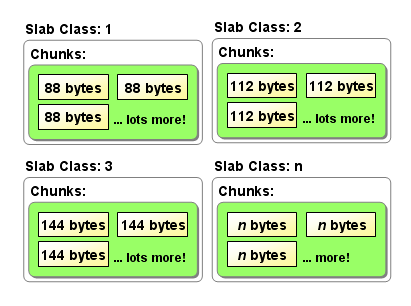
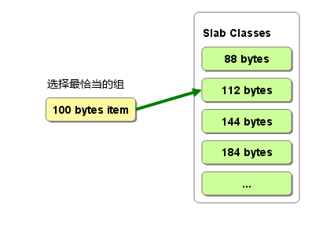
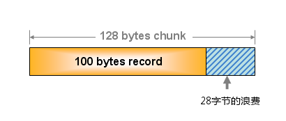

#memcached全面剖析--2.理解memcached的内存存储

下面是《memcached全面剖析》的第二部分。

- **发表日**：2008/7/9
- **作者**：前坂徹(Toru Maesaka)
- **原文链接**：http://gihyo.jp/dev/feature/01/memcached/0002

我是[mixi株式会社](http://mixi.jp/)研究开发组的前坂徹。 [上次](http://charlee.li/memcached-001/)的文章介绍了memcached是分布式的高速缓存服务器。 本次将介绍memcached的内部构造的实现方式，以及内存的管理方式。 另外，memcached的内部构造导致的弱点也将加以说明。

##Slab Allocation机制：整理内存以便重复使用

最近的memcached默认情况下采用了名为Slab Allocator的机制分配、管理内存。 在该机制出现以前，内存的分配是通过对所有记录简单地进行malloc和free来进行的。 但是，这种方式会导致内存碎片，加重操作系统内存管理器的负担，最坏的情况下， 会导致操作系统比memcached进程本身还慢。Slab Allocator就是为解决该问题而诞生的。

下面来看看Slab Allocator的原理。下面是memcached文档中的slab allocator的目标：

> the primary goal of the slabs subsystem in memcached was to eliminate memory fragmentation issues totally by using fixed-size memory chunks coming from a few predetermined size classes.

也就是说，Slab Allocator的基本原理是按照预先规定的大小，将分配的内存分割成特定长度的块， 以完全解决内存碎片问题。

Slab Allocation的原理相当简单。 将分配的内存分割成各种尺寸的块（chunk）， 并把尺寸相同的块分成组（chunk的集合）（图1）。



图1 Slab Allocation的构造图

而且，slab allocator还有重复使用已分配的内存的目的。 也就是说，分配到的内存不会释放，而是重复利用。

Slab Allocation的主要术语

###Page

分配给Slab的内存空间，默认是1MB。分配给Slab之后根据slab的大小切分成chunk。

###Chunk

用于缓存记录的内存空间。

###Slab Class

特定大小的chunk的组。

##在Slab中缓存记录的原理

下面说明memcached如何针对客户端发送的数据选择slab并缓存到chunk中。

memcached根据收到的数据的大小，选择最适合数据大小的slab（图2）。 memcached中保存着slab内空闲chunk的列表，根据该列表选择chunk， 然后将数据缓存于其中。



图2 选择存储记录的组的方法

实际上，Slab Allocator也是有利也有弊。下面介绍一下它的缺点。

##Slab Allocator的缺点

Slab Allocator解决了当初的内存碎片问题，但新的机制也给memcached带来了新的问题。

这个问题就是，由于分配的是特定长度的内存，因此无法有效利用分配的内存。 例如，将100字节的数据缓存到128字节的chunk中，剩余的28字节就浪费了（图3）。



图3 chunk空间的使用

对于该问题目前还没有完美的解决方案，但在文档中记载了比较有效的解决方案。

> The most efficient way to reduce the waste is to use a list of size classes that closely matches (if that’s at all possible) common sizes of objects that the clients of this particular installation of memcached are likely to store.

就是说，如果预先知道客户端发送的数据的公用大小，或者仅缓存大小相同的数据的情况下， 只要使用适合数据大小的组的列表，就可以减少浪费。

但是很遗憾，现在还不能进行任何调优，只能期待以后的版本了。 但是，我们可以调节slab class的大小的差别。 接下来说明growth factor选项。

##使用Growth Factor进行调优

memcached在启动时指定 Growth Factor因子（通过-f选项）， 就可以在某种程度上控制slab之间的差异。默认值为1.25。 但是，在该选项出现之前，这个因子曾经固定为2，称为“powers of 2”策略。

让我们用以前的设置，以verbose模式启动memcached试试看：

```
$ memcached -f 2 -vv
```

下面是启动后的verbose输出：

```
slab class   1: chunk size    128 perslab  8192
slab class   2: chunk size    256 perslab  4096
slab class   3: chunk size    512 perslab  2048
slab class   4: chunk size   1024 perslab  1024
slab class   5: chunk size   2048 perslab   512
slab class   6: chunk size   4096 perslab   256
slab class   7: chunk size   8192 perslab   128
slab class   8: chunk size  16384 perslab    64
slab class   9: chunk size  32768 perslab    32
slab class  10: chunk size  65536 perslab    16
slab class  11: chunk size 131072 perslab     8
slab class  12: chunk size 262144 perslab     4
slab class  13: chunk size 524288 perslab     2
```

可见，从128字节的组开始，组的大小依次增大为原来的2倍。 这样设置的问题是，slab之间的差别比较大，有些情况下就相当浪费内存。 因此，为尽量减少内存浪费，两年前追加了growth factor这个选项。

来看看现在的默认设置（f=1.25）时的输出（篇幅所限，这里只写到第10组）：

```
slab class   1: chunk size     88 perslab 11915
slab class   2: chunk size    112 perslab  9362
slab class   3: chunk size    144 perslab  7281
slab class   4: chunk size    184 perslab  5698
slab class   5: chunk size    232 perslab  4519
slab class   6: chunk size    296 perslab  3542
slab class   7: chunk size    376 perslab  2788
slab class   8: chunk size    472 perslab  2221
slab class   9: chunk size    592 perslab  1771
slab class  10: chunk size    744 perslab  1409
```

可见，组间差距比因子为2时小得多，更适合缓存几百字节的记录。 从上面的输出结果来看，可能会觉得有些计算误差， 这些误差是为了保持字节数的对齐而故意设置的。

将memcached引入产品，或是直接使用默认值进行部署时， 最好是重新计算一下数据的预期平均长度，调整growth factor， 以获得最恰当的设置。内存是珍贵的资源，浪费就太可惜了。

接下来介绍一下如何使用memcached的stats命令查看slabs的利用率等各种各样的信息。

##查看memcached的内部状态

memcached有个名为stats的命令，使用它可以获得各种各样的信息。 执行命令的方法很多，用telnet最为简单：

```
$ telnet 主机名 端口号
```

连接到memcached之后，输入stats再按回车，即可获得包括资源利用率在内的各种信息。 此外，输入”stats slabs”或”stats items”还可以获得关于缓存记录的信息。 结束程序请输入quit。

这些命令的详细信息可以参考memcached软件包内的protocol.txt文档。

```
$ telnet localhost 11211
Trying ::1...
Connected to localhost.
Escape character is '^]'.
stats
STAT pid 481
STAT uptime 16574
STAT time 1213687612
STAT version 1.2.5
STAT pointer_size 32
STAT rusage_user 0.102297
STAT rusage_system 0.214317
STAT curr_items 0
STAT total_items 0
STAT bytes 0
STAT curr_connections 6
STAT total_connections 8
STAT connection_structures 7
STAT cmd_get 0
STAT cmd_set 0
STAT get_hits 0
STAT get_misses 0
STAT evictions 0
STAT bytes_read 20
STAT bytes_written 465
STAT limit_maxbytes 67108864
STAT threads 4
END
quit
```

另外，如果安装了libmemcached这个面向C/C++语言的客户端库，就会安装 memstat 这个命令。 使用方法很简单，可以用更少的步骤获得与telnet相同的信息，还能一次性从多台服务器获得信息。

```
$ memstat --servers=server1,server2,server3,...
```

libmemcached可以从下面的地址获得：

> [http://tangent.org/552/libmemcached.html](http://tangent.org/552/libmemcached.html "http://tangent.org/552/libmemcached.html")

##查看slabs的使用状况

使用memcached的创造者Brad写的名为memcached-tool的Perl脚本，可以方便地获得slab的使用情况 （它将memcached的返回值整理成容易阅读的格式）。可以从下面的地址获得脚本：

> [http://code.sixapart.com/svn/memcached/trunk/server/scripts/memcached-tool](http://code.sixapart.com/svn/memcached/trunk/server/scripts/memcached-tool "http://code.sixapart.com/svn/memcached/trunk/server/scripts/memcached-tool")

使用方法也极其简单：

```
$ memcached-tool 主机名:端口 选项
```

查看slabs使用状况时无需指定选项，因此用下面的命令即可：

```
$ memcached-tool 主机名:端口
```

获得的信息如下所示：

```
 #  Item_Size   Max_age  1MB_pages Count   Full?
 1     104 B  1394292 s    1215 12249628    yes
 2     136 B  1456795 s      52  400919     yes
 3     176 B  1339587 s      33  196567     yes
 4     224 B  1360926 s     109  510221     yes
 5     280 B  1570071 s      49  183452     yes
 6     352 B  1592051 s      77  229197     yes
 7     440 B  1517732 s      66  157183     yes
 8     552 B  1460821 s      62  117697     yes
 9     696 B  1521917 s     143  215308     yes
10     872 B  1695035 s     205  246162     yes
11     1.1 kB 1681650 s     233  221968     yes
12     1.3 kB 1603363 s     241  183621     yes
13     1.7 kB 1634218 s      94   57197     yes
14     2.1 kB 1695038 s      75   36488     yes
15     2.6 kB 1747075 s      65   25203     yes
16     3.3 kB 1760661 s      78   24167     yes
```

各列的含义为：

|列|含义|
|----|----|
|#|slab class编号|
|Item_Size|Chunk大小|
|Max_age|LRU内最旧的记录的生存时间|
|1MB_pages|分配给Slab的页数|
|Count|Slab内的记录数|
|Full?|Slab内是否含有空闲chunk|

从这个脚本获得的信息对于调优非常方便，强烈推荐使用。

##内存存储的总结

本次简单说明了memcached的缓存机制和调优方法。 希望读者能理解memcached的内存管理原理及其优缺点。

下次将继续说明LRU和Expire等原理，以及memcached的最新发展方向—— 可扩充体系（pluggable architecher））。

##引用

- [0] [原文](http://charlee.li/memcached-002.html)