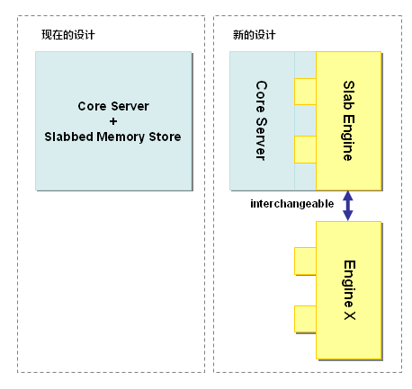

#memcached全面剖析--3.memcached的删除机制和发展方向

下面是《memcached全面剖析》的第三部分。

- **发表日**：2008/7/16
- **作者**：前坂徹(Toru Maesaka)
- **原文链接**：http://gihyo.jp/dev/feature/01/memcached/0003

前几次的文章在这里：

- [第1次](http://charlee.li/memcached-001.html)
- [第2次](http://charlee.li/memcached-002.html)

memcached是缓存，所以数据不会永久保存在服务器上，这是向系统中引入memcached的前提。 本次介绍memcached的数据删除机制，以及memcached的最新发展方向——二进制协议（Binary Protocol） 和外部引擎支持。

##memcached在数据删除方面有效利用资源

数据不会真正从memcached中消失

[上次](http://charlee.li/memcached-002.html)介绍过， memcached不会释放已分配的内存。记录超时后，客户端就无法再看见该记录（invisible，透明）， 其存储空间即可重复使用。

###Lazy Expiration

memcached内部不会监视记录是否过期，而是在get时查看记录的时间戳，检查记录是否过期。 这种技术被称为lazy（惰性）expiration。因此，memcached不会在过期监视上耗费CPU时间。

##LRU：从缓存中有效删除数据的原理

memcached会优先使用已超时的记录的空间，但即使如此，也会发生追加新记录时空间不足的情况， 此时就要使用名为 Least Recently Used（LRU）机制来分配空间。 顾名思义，这是删除“最近最少使用”的记录的机制。 因此，当memcached的内存空间不足时（无法从slab class 获取到新的空间时），就从最近未被使用的记录中搜索，并将其空间分配给新的记录。 从缓存的实用角度来看，该模型十分理想。

不过，有些情况下LRU机制反倒会造成麻烦。memcached启动时通过“-M”参数可以禁止LRU，如下所示：

```
$ memcached -M -m 1024
```

启动时必须注意的是，小写的“-m”选项是用来指定最大内存大小的。不指定具体数值则使用默认值64MB。

指定“-M”参数启动后，内存用尽时memcached会返回错误。 话说回来，memcached毕竟不是存储器，而是缓存，所以推荐使用LRU。

##memcached的最新发展方向

memcached的roadmap上有两个大的目标。一个是二进制协议的策划和实现，另一个是外部引擎的加载功能。

###关于二进制协议

使用二进制协议的理由是它不需要文本协议的解析处理，使得原本高速的memcached的性能更上一层楼， 还能减少文本协议的漏洞。目前已大部分实现，开发用的代码库中已包含了该功能。 memcached的下载页面上有代码库的链接。

- [http://danga.com/memcached/download.bml](http://danga.com/memcached/download.bml "http://danga.com/memcached/download.bml")

###二进制协议的格式

协议的包为24字节的帧，其后面是键和无结构数据（Unstructured Data）。 实际的格式如下（引自协议文档）：

```
 Byte/     0       |       1       |       2       |       3       |   
    /              |               |               |               |   
   |0 1 2 3 4 5 6 7|0 1 2 3 4 5 6 7|0 1 2 3 4 5 6 7|0 1 2 3 4 5 6 7|
   +---------------+---------------+---------------+---------------+
  0/ HEADER                                                        /   
   /                                                               /   
   /                                                               /   
   /                                                               /   
   +---------------+---------------+---------------+---------------+
 24/ COMMAND-SPECIFIC EXTRAS (as needed)                           /   
  +/  (note length in th extras length header field)               /   
   +---------------+---------------+---------------+---------------+
  m/ Key (as needed)                                               /   
  +/  (note length in key length header field)                     /   
   +---------------+---------------+---------------+---------------+
  n/ Value (as needed)                                             /   
  +/  (note length is total body length header field, minus        /   
  +/   sum of the extras and key length body fields)               /   
   +---------------+---------------+---------------+---------------+
  Total 24 bytes
```

如上所示，包格式十分简单。需要注意的是，占据了16字节的头部(HEADER)分为 请求头（Request Header）和响应头（Response Header）两种。 头部中包含了表示包的有效性的Magic字节、命令种类、键长度、值长度等信息，格式如下：

```
Request Header

 Byte/     0       |       1       |       2       |       3       |
    /              |               |               |               |
   |0 1 2 3 4 5 6 7|0 1 2 3 4 5 6 7|0 1 2 3 4 5 6 7|0 1 2 3 4 5 6 7|
   +---------------+---------------+---------------+---------------+
  0| Magic         | Opcode        | Key length                    |
   +---------------+---------------+---------------+---------------+
  4| Extras length | Data type     | Reserved                      |
   +---------------+---------------+---------------+---------------+
  8| Total body length                                             |
   +---------------+---------------+---------------+---------------+
 12| Opaque                                                        |
   +---------------+---------------+---------------+---------------+
 16| CAS                                                           |
   |                                                               |
   +---------------+---------------+---------------+---------------+

Response Header

 Byte/     0       |       1       |       2       |       3       |
    /              |               |               |               |
   |0 1 2 3 4 5 6 7|0 1 2 3 4 5 6 7|0 1 2 3 4 5 6 7|0 1 2 3 4 5 6 7|
   +---------------+---------------+---------------+---------------+
  0| Magic         | Opcode        | Key Length                    |
   +---------------+---------------+---------------+---------------+
  4| Extras length | Data type     | Status                        |
   +---------------+---------------+---------------+---------------+
  8| Total body length                                             |
   +---------------+---------------+---------------+---------------+
 12| Opaque                                                        |
   +---------------+---------------+---------------+---------------+
 16| CAS                                                           |
   |                                                               |
   +---------------+---------------+---------------+---------------+
```

如希望了解各个部分的详细内容，可以checkout出memcached的二进制协议的代码树， 参考其中的docs文件夹中的protocol_binary.txt文档。

###HEADER中引人注目的地方

看到HEADER格式后我的感想是，键的上限太大了！现在的memcached规格中，键长度最大为250字节， 但二进制协议中键的大小用2字节表示。因此，理论上最大可使用65536字节（216）长的键。 尽管250字节以上的键并不会太常用，二进制协议发布之后就可以使用巨大的键了。

二进制协议从下一版本1.3系列开始支持。

##外部引擎支持

我去年曾经试验性地将memcached的存储层改造成了可扩展的（pluggable）。

- [http://alpha.mixi.co.jp/blog/?p=129](http://alpha.mixi.co.jp/blog/?p=129 "http://alpha.mixi.co.jp/blog/?p=129")

MySQL的Brian Aker看到这个改造之后，就将代码发到了memcached的邮件列表。 memcached的开发者也十分感兴趣，就放到了roadmap中。现在由我和 memcached的开发者Trond Norbye协同开发（规格设计、实现和测试）。 和国外协同开发时时差是个大问题，但抱着相同的愿景， 最后终于可以将可扩展架构的原型公布了。 代码库可以从[memcached的下载页面](http://danga.com/memcached/download.bml) 上访问。

###外部引擎支持的必要性

世界上有许多memcached的派生软件，其理由是希望永久保存数据、实现数据冗余等， 即使牺牲一些性能也在所不惜。我在开发memcached之前，在mixi的研发部也曾经 考虑过重新发明memcached。

外部引擎的加载机制能封装memcached的网络功能、事件处理等复杂的处理。 因此，现阶段通过强制手段或重新设计等方式使memcached和存储引擎合作的困难 就会烟消云散，尝试各种引擎就会变得轻而易举了。

###简单API设计的成功的关键

该项目中我们最重视的是API设计。函数过多，会使引擎开发者感到麻烦； 过于复杂，实现引擎的门槛就会过高。因此，最初版本的接口函数只有13个。 具体内容限于篇幅，这里就省略了，仅说明一下引擎应当完成的操作：

- 引擎信息（版本等）
- 引擎初始化
- 引擎关闭
- 引擎的统计信息
- 在容量方面，测试给定记录能否保存
- 为item（记录）结构分配内存
- 释放item（记录）的内存
- 删除记录
- 保存记录
- 回收记录
- 更新记录的时间戳
- 数学运算处理
- 数据的flush

对详细规格有兴趣的读者，可以checkout engine项目的代码，阅读器中的engine.h。

###重新审视现在的体系

memcached支持外部存储的难点是，网络和事件处理相关的代码（核心服务器）与 内存存储的代码紧密关联。这种现象也称为tightly coupled（紧密耦合）。 必须将内存存储的代码从核心服务器中独立出来，才能灵活地支持外部引擎。 因此，基于我们设计的API，memcached被重构成下面的样子：



重构之后，我们与1.2.5版、二进制协议支持版等进行了性能对比，证实了它不会造成性能影响。

在考虑如何支持外部引擎加载时，让memcached进行并行控制（concurrency control）的方案是最为容易的， 但是对于引擎而言，并行控制正是性能的真谛，因此我们采用了将多线程支持完全交给引擎的设计方案。

以后的改进，会使得memcached的应用范围更为广泛。

##总结

本次介绍了memcached的超时原理、内部如何删除数据等，在此之上又介绍了二进制协议和 外部引擎支持等memcached的最新发展方向。这些功能要到1.3版才会支持，敬请期待！

这是我在本连载中的最后一篇。感谢大家阅读我的文章！

下次由长野来介绍memcached的应用知识和应用程序兼容性等内容。

##引用

- [1] [原文](http://charlee.li/memcached-003.html)