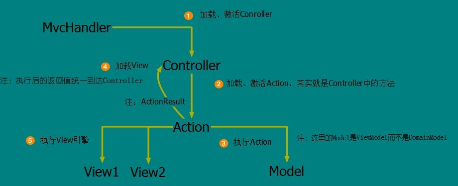
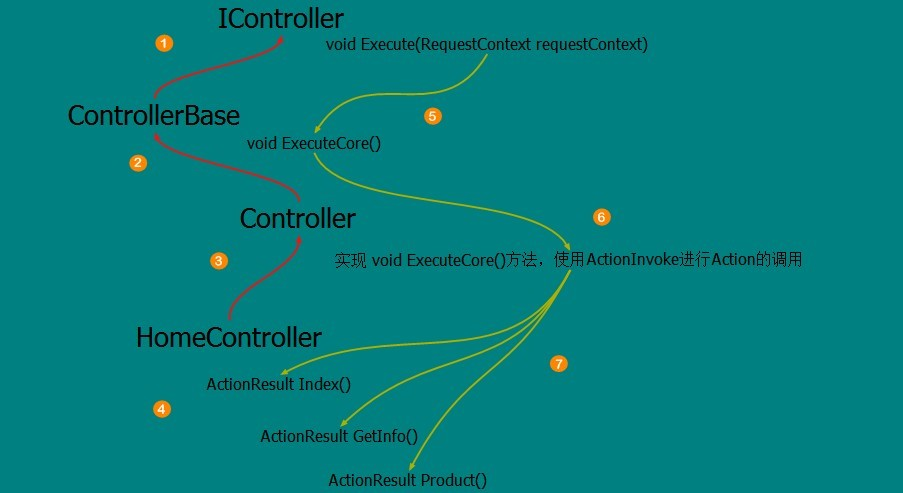
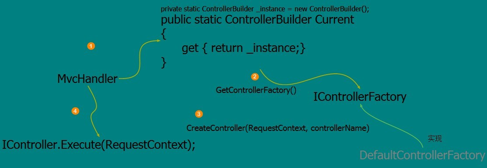

#.NET/ASP.NET MVC Controller 控制器（深入解析控制器运行原理）

##开篇介绍

经过前一篇文章《.NET/ASP.NET Routing路由（深入解析路由系统架构原理）》 的讲解，我们对ASP.NETRouting路由系统的整个运行机制有了一个基本的了解；当我们能清楚的知道Url是如何被解析成RouteData对象时，下面就是这些路由数据是如何被后面的应用框架所使用的，而通往应用框架的入口是MvcRouteHandler对象；

这篇文章将继续讲解通过路由后的ASP.NETMVC Controller控制器是如何被加载、激活并且执行的；跟控制器相关的一套对象模型是被MvcHandler对象作为源头调用起来的，也就是说，当我们穿过UrlRoutingModule对象后，并且成功的获取到应用框架配置的路由数据后，下面将进入IHttpHandler接口，而这个接口真是我们初始化RouteData对象时设定的应用框架入口，ASP.NETMVC所使用的是MvcHandler对象；

MvcRouteHandler对象是UrlRoutingModule和MvcHandler对象的连接器，只有MvcRouteHandler对象能成功执行后，方能进入到MvcHandler对象中，后续的一切运转才能顺利执行；

##ASP.NETMVC Controller 控制器的入口（Controller的执行流程）

在系统刚启动的时候，也就是在Global.asax.cs文件里面我们配置了Http客户端请求服务器的Url模板；在路由解析模块（UrlRoutingModule）里面，它将通过字符串级别的操作，解析出我们Url模板中的{Controller}/{Action}等的占位符变量；所以这个时候Controller的概念对我们来说还只是一个字符串而已，而到了目前的这个Controller控制器解析的位置其实已经和路由基本没关系了，因为我们穿过了路由模块到达了Controller解析的环节；Controller解析已经属于ASP.NETMVC应用框架的范围，我们可以简单的将路由解析（UrlRoutingModule）的过程视为将请求的Url（含有数据的Url）与我们配置的Url模板进行模式匹配的过程，得出匹配后的Url数据（RouteData），然后将Url数据并且连同当前请求上下文一起封装成RequestContext对象（RouteData、HttpContextBase）传入到Controller解析的环节，也就是MvcHandler中，作为MvcHandler构造函数的参数；

> 当MvcHandler接管控制权之后它需要准备好对Controller的解析和执行，但是Controller并发一个简单的对象，它有一个复杂的继承体系和使用方式，原因在于它需要协调多方面的工作所以变的有很复杂；

根据MVC的架构模式理论便知道Controller是协调Model与View的中间纽带，它既要管理好Model的执行，也要管理好View的呈现；而原本MVC的架构模式提出的背景是在WinFrom的情况下，也就是传统C/S结构的系统；WinFrom结构的系统有一个好处就是它的执行很方便，从View的展现收集数据到Controller的调度执行Model会容易完成，但是ASP.NETMVC是建立在ASP.NET WEB背景之下的MVC模式框架，所以这个时候对Controller的激活会变的相当麻烦，因为在传输过程中Controller已经是字符串形式，如果是在C/S结构中那么Controller对于每次处理一样的View不会每次都进行激活；既然每次都需要激活就需要进行缓存策略，缓存策略只是Controller中的一个关键点，需要明白的是Controller的确需要做很多事情；

图1：



根据上图的执行顺序，能看出Controller控制器扮演着一个很重要的角色，所有的执行、返回值、视图呈现均需要通过它来管理调度；当然本章的重点是搞清楚此图中的第一环节，Controller是如何被加载激活的，这里面将涉及到众多的辅助对象模型，比如：ControllerFactory控制器工厂，而控制器工厂又将借助ControllerTypeCache来缓存Controller对象，而ConrollerTypeCache又将借助TypeCacheSerializer来对Controller缓存文件的序列化；

##ASP.NETMVC Controller 控制器的入口（Controller的继承体系）

Controller控制器既然扮演着重要的角色，那么它就不会是一个简单的对象结构，它有着一个复杂的继承体系和对象模型支撑它来完成这些艰巨的任务；Controller要想能够运行起来，就需要搞清楚它有哪些执行入口，而需要知道它有哪些执行入口我们就需要搞清楚它的继承体系；入口的最高层抽象在哪一层，这样我们才能举一反三的扩展Controller的众多重要的功能；

首先我们了解到Controller的顶层抽象是IController接口，然后接着是ControllerBase抽象类实现了这个接口，而作为顶层抽象的实现ControllerBase完成了从IController接口继承下来的方法；

```C#
public interface IController {
   void Execute(RequestContext requestContext);
} 
```

通过该代码段可以看出，Controller的执行需要一个RequestContext对象，而这个对象真是UrlRoutingModule环节所完成的结果，RequestContext对象内部封装了在Request阶段所获得的请求数据，里面包括了跟Http相关的请求上下文（HttpContextBase），最重要的是路由数据对象（RouteData）；而控制器的执行必须需要RouteData中的有关Controller数据对象，也就是从请求Url中通过模式匹配出来的{Controller}部分的字符串；

ControllerBase定义了Controller使用到的部分公共属性，比如：用来保存临时数据的TempData，用来返回到View中的Model数据对象ViewBag、ViewData；并且初始化了ControllerContext对象，用来作为后续Controller使用的数据容器和操作上下文；

```C#
protected virtual void Initialize(RequestContext requestContext) {
    ControllerContext = new ControllerContext(requestContext, this);
} 
```

在ControllerBase中将对IController.Execute(RequestContext requestContext)方法调用转到了protected abstract void ExecuteCore()方法中；这是一个典型的模板方法模式，下面的继承类Controller，只需要接着protected abstract void ExecuteCore()方法就能和ControllerBase衔接上；

```C#
public abstract class Controller : ControllerBase
```

Controller类继承自ControllerBase，而Controller的任务只需要完成ExecuteCore()方法；

```C#
protected override void ExecuteCore() { 

   PossiblyLoadTempData();
   try {
      string actionName = RouteData.GetRequiredString("action");
       if (!ActionInvoker.InvokeAction(ControllerContext, actionName)) {
           HandleUnknownAction(actionName);
       }
   }
   finally {
       PossiblySaveTempData();
   }
}
```

Controller.ExecuteCore()的代码将从RouteData中获取执行action的名称，然后通过一个ActionInvoke的组件进行Action的调用，当Action被执行的时候将进入到我们继承的Controller，如：HomeController:Controller中，在我们自定的Controller中的方法都将被视为Action的匹配目标之一；

图2：



根据上图的指示，ControllerBase首先是实现IController接口，完成了对Execute(RequestContext requestContext)方法的实现，然后Controller继承ControllerBase类，重写了模板方法ExecuteCore()方法，然后我们自定义的HomeController其实是Action的容器，当Controller的ExecuteCore()方法执行时将通过ActionInvoke类进行对HomeController中的方法调用；

##ASP.NETMVC IController Factory 控制器工厂（Controller的创建）

当清楚了Controller的继承体系之后，下面回到MvcHandler调用的环节；MvcHandler继承自IHttpHandler接口 ，表示它将是ASP.NET真正执行请求处理的地方；在MvcHandler处理请求的方法中ProcessRequest(HttpContextBase httpContext)，将通过IControllerFactory接口创建IController接口；

IControllerFactory接口是控制器工厂接口，专门用来实现创建IController对象工厂类，在ASP.NETMVC内部有一个实现了IControllerFactory接口的默认工厂类DefaultControllerFactory，ASP.NETMVC内部是用这个类来创建IController对象的；

```C#
factory = ControllerBuilder.GetControllerFactory();
```

获取IDefaultControllerFactory接口需要通过ControllerBuilder对象，ControllerBuilder类是专门用来管理IControllerFactory对象的，同时ControllerBuilder也是应用编程接口，让自定义IControllerFactory对象成为可能；

创建IController需要我们传入RequestContext对象和ControllerName控制器名称；

```
// Get the controller type
string controllerName = RequestContext.RouteData.GetRequiredString("controller"); 
factory = ControllerBuilder.GetControllerFactory();
controller = factory.CreateController(RequestContext, controllerName);
```

从RequestContext.RouteData中获取到当前请求的conroller名称，然后用来作为factory.CreateController的参数；

图3：



MvcHandler通过ControllerBuilder对象的静态属性Current获取到ControllerBuilder对象实例，显然ControllerBuilder是一个单例模式的对象；然后通过ControllerBuilder对象获取到DefaultControllerFactory默认IControllerFactory工厂对象，接着利用DefaultControllerFactory创建出IController对象；

##Reference

* [1] [原文链接](http://www.cnblogs.com/wangiqngpei557/p/3390812.html)