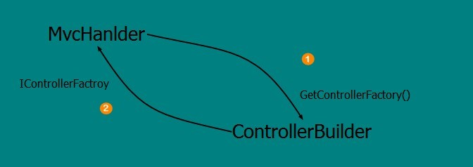
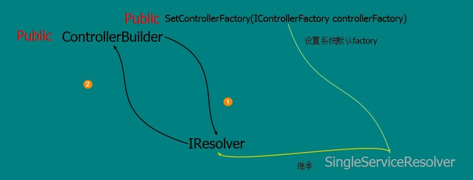

#.NET/ASP.NET MVC Controller 控制器（IController控制器的创建过程）

##开篇介绍

上一篇文章“.NET/ASP.NET MVC Controller 控制器（一：深入解析控制器运行原理）”详细的讲解了MvcHandler对象内部的基本流程逻辑，这基本的流程逻辑为我们后面的学习起到铺垫作用，当我们能正确的搞懂它的内部执行流程后，我们就可以顺藤摸瓜的去挖掘每个逻辑环节中的详细逻辑；

通过前面两篇文章的介绍，我们基本上能搞清楚一个Url请求是如何借助于UrlRoutingModule模块顺利穿过ASP.NET基础框架到达应用框架的过程，当UrlRoutingModule处理过后将RouteData对象封装在RequestContext请求上下文中传入到MvcHandler对象，然后MvcHandler对象通过IControllerFactory接口根据从RouteData中获取到controllername控制器名称字符串创建具体的IController对象实例；

这基本的流程我们是清晰了，但是我们并不太清楚IControllerFactory背后所发生的一切，到底谁作为IControllerFactory默认实现的，它又有着怎样的扩展入口让我们来扩展创建过程，这值得一探究竟；

那么这篇文章让我们来分析一下IControllerFactory的背后所发生的事情，我们是否能从中学到什么设计思想；

##ASP.NETMVC IControllerFactory 控制器工厂接口

既然能将ControllerFactory提取出接口来，那么对于IController的创建将是一个非常宽松的过程；简单的设想一下，如果不将Factory提出接口来，那么对于IController的创建将是一个很直观的过程，但是ASP.NETMVC将IController创建不是简单的使用一个ControllerFactory来解决，而是将这个创建过程设计的很松散，目的是为了扩展性方便，换句话说我们完全可以自定义一个Factroy来替代这个创建过程，也可以基于系统内部的Factroy来扩展一下；

MvcHandler使用IControllerFactroy创建出相应IController对象，那么首先我们需要搞清楚MvcHandler通过什么方式获取到实现IControllerFactory接口的；

其实在MvcHandler中并不是直接使用IControllerFactroy的相关实现，而是使用了ControllerBuilder对象，这个对象是一个单例模式的实现；MvcHanlder通过ControllerBuilder对象获取到一个实例，然后通过ControllerBuilder创建出IControllerFactory实现；

```C#
internal ControllerBuilder ControllerBuilder {
    get {
        if (_controllerBuilder == null) {
            _controllerBuilder = ControllerBuilder.Current;
        }
        return _controllerBuilder;
    }
    set {
        _controllerBuilder = value;
    }
} 

factory = ControllerBuilder.GetControllerFactory();
```

可以简单的理解为，ControllerBuilder管理着IControllerFactory的创建过程，MvcHanlder通过获取ControllerBuilder的全局实例，然后调用其方法GetControllerFactory，得到可以使用的IControllerFactory实现；

图1:



ControllerBuilder的设计很巧妙，它将IControllerFactory的实现为我们敞开了大门，我们可以通过这个入口做很多事情；

我们看一下IControllerFactroy接口的定义：

```C#
public interface IControllerFactory {
    IController CreateController(RequestContext requestContext, string controllerName);
    SessionStateBehavior GetControllerSessionBehavior(RequestContext requestContext, string controllerName);
    void ReleaseController(IController controller);
} 
```

接口中定义了三个方法，第一个方法CreateController很好理解，根据方法的第二个参数controllerName创建Controller实例；第二个方法GetControllerSessionBehavior方法是用来获取controllerName所代表的Controller的Session行为的，该行为是通过SessionStateAttribute特性表示；第三个方法ReleaseController方法是用在最后释放Controller的：

```C#
public virtual void ReleaseController(IController controller) {
    IDisposable disposable = controller as IDisposable;
    if (disposable != null) {
        disposable.Dispose();
    }
} 
```

由于Controller继承自IDisposable接口，所以在方法内部是直接调用Dispose方法来释放资源；这里需要注意的是，Controller对IDisposable接口的实现是virtual修饰符：

```C#
protected virtual void Dispose(bool disposing) {
} 
```

这就很方便我们通过重写此方法的方式来释放一些其他资源；

##ASP.NETMVC DefaultControllerFactory 默认控制器工厂

在ASP.NETMVC内部有一个默认的Factroy（DefaultControllerFactroy），DefaultControllerFactroy实现了核心的创建IController代码，这为我们的扩展提供了很好的接口；

通过调用IControllerFactory接口的CreateController(RequestContext requestContext, string controllerName) 方法，将进入到DefaultControllerFactory实现中，首要任务就是要根据controllerName名称找到对应的ContorllerType，然后才能创建具体的实例；

```C#
object routeNamespacesObj;
Type match;
if (requestContext != null && requestContext.RouteData.DataTokens.TryGetValue("Namespaces", out routeNamespacesObj)) {
    IEnumerable<string> routeNamespaces = routeNamespacesObj as IEnumerable<string>;
    if (routeNamespaces != null && routeNamespaces.Any()) {
        HashSet<string> nsHash = new HashSet<string>(routeNamespaces, StringComparer.OrdinalIgnoreCase);
        match = GetControllerTypeWithinNamespaces(requestContext.RouteData.Route, controllerName, nsHash); 

        // the UseNamespaceFallback key might not exist, in which case its value is implicitly "true"
        if (match != null || false.Equals(requestContext.RouteData.DataTokens["UseNamespaceFallback"])) {
            // got a match or the route requested we stop looking
            return match;
        }
    }
}
```

首先根据请求的路由数据RouteData，查找设置的命名空间集合，然后使用命名空间和控制器名称获取Type，如果Type!=null并且没有开启后被命名空间则直接返回Type；

###Controller中的AreaRegistration命名空间

在DefaultControllerFactroy内部使用到了两组命名空间来作为查找Controller的NameSpace，第一个是我们在配置Route数据的时候设置的：

```C#
context.MapRoute(name: "api.order.default", url: "api/order/{controller}/{action}/{orderid}",
    defaults: new { controller = "OrderController", action = "GetOrderOperationDatetime", orderid = "1001" },
    namespaces: new string[] { "Api.Order" }); 
```

而第二个我们一般都不会用它的，它是作为AreaRegistration后备命名空间而存在的，是在ControllerBuilder中设置的：

```C#
ControllerBuilder.Current.DefaultNamespaces.Add("MvcApplication4.ApiOrder"); 
```

对后备命名空间的赋值是在AreaRegistrationContext中的MapRoute(string name, string url, object defaults, object constraints, string[] namespaces) 方法中完成的：

```C#
if (namespaces == null && Namespaces != null) {
     namespaces = Namespaces.ToArray();
} 
```

复制代码
1 Route route = Routes.MapRoute(name, url, defaults, constraints, namespaces);
2 route.DataTokens["area"] = AreaName; 
3 
4 // disabling the namespace lookup fallback mechanism keeps this areas from accidentally picking up
5 // controllers belonging to other areas
6 bool useNamespaceFallback = (namespaces == null || namespaces.Length == 0);
7 route.DataTokens["UseNamespaceFallback"] = useNamespaceFallback; 
8 
9 return route; 
复制代码
由于AreaRegistration可以让我们对Controller的设计不局限于ASP.NETMVCWeb程序中，而可以将Controller独立出去进行模块化设计，所以需要提供有关Area的特殊命名空间查找方式；

4】ASP.NETMVC ControllerBuilder 控制器创建入口设置

ControllerBuilder作为Controller创建的设置入口，可以用来设置ControllerFactory替换系统默认的DefaultControllerFactory，ControllerBuilder是Controller的创建过程框架扩展入口，可以借助ControllerBuilder方便做很多设置；

```C#
Route route = Routes.MapRoute(name, url, defaults, constraints, namespaces);
route.DataTokens["area"] = AreaName; 

// disabling the namespace lookup fallback mechanism keeps this areas from accidentally picking up
// controllers belonging to other areas
bool useNamespaceFallback = (namespaces == null || namespaces.Length == 0);
route.DataTokens["UseNamespaceFallback"] = useNamespaceFallback; 

return route;
```

在ControllerBuilder的构造函数中，初始化了一个SingleServiceResolver<IControllerFactory>类型的Resolver，目的是为了对Factory实现IOC方式的获取；在代码中，实例化了一个DefaultControllerFactory类型的实例作为默认的Factory，比较重要的是将ControllerBuilder做为参数设置到了ControllerBuilder属性中，目的是为了能在后面解析Controller命名空间的时候用到；

```C#
public HashSet<string> DefaultNamespaces {
    get {
        return _namespaces;
    }
}
```

在此我们可以设置统一的命名空间，由于我们在设置Route的时候，都需要设置namesapce字段，但是如果有很多这样的Route的时候就很麻烦，我们可以通过此方式进行统一的设置；

```C#
public void SetControllerFactory(IControllerFactory controllerFactory) {
    if (controllerFactory == null) {
        throw new ArgumentNullException("controllerFactory");
    } 

    _factoryThunk = () => controllerFactory;
}
```

还有一个比较重要的就是设置自定义的ControllerFactory，在方法SetControllerFactory中，我们可以设置一个IControllerFactory类型的对象，就可以接管系统默认的DefaultControllerFactory对象，包括后面的所有的IController缓存策略；

图2：



基本上我们可以通过ControllerBuilder进入到ControllerFactroy的创建环节来，使用SetControllerFactory方法直接将我们自定义的IControllerFactroy传入即可；

##ASP.NETMVC 自定义IControllerFactory

既然知道了ContollerBulder可以使我们更改系统默认的控制器工厂，那么我们通过怎样的方式使用现在的Factroy；大致上我们只需要继承自DefaultControllerFactory然后进行相应的扩展即可；

```C#
public class CustomControllerFactory : DefaultControllerFactory
{
    protected override IController GetControllerInstance(System.Web.Routing.RequestContext requestContext, Type controllerType)
    {
        Console.WriteLine(string.Format("{0}is create.", controllerType.Name));
        return base.GetControllerInstance(requestContext, controllerType);
    }
}
```

现在假设我们需要在系统创建所有Controller的时候能记录下创建的记录信息，这样就很方便的完成了，我们只需要在系统初始化的地方进行设置：

```C#
ControllerBuilder.Current.SetControllerFactory(new Api.Order.CustomControllerFactory());
```

这样我们就接管了ControllerFactory的部分功能；

##Reference

* [1] [原文链接](http://www.cnblogs.com/wangiqngpei557/p/3424060.html)