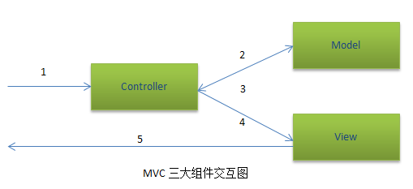
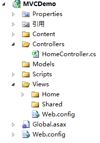
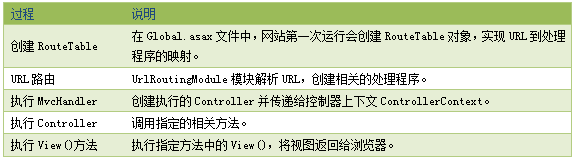
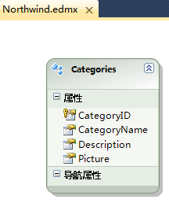
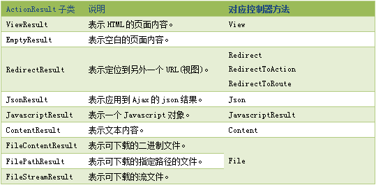

#ASP.NET MVC架构与实战系列之一：理解MVC底层运行机制

今天，我将开启一个崭新的话题：ASP.NET MVC框架的探讨。首先，我们回顾一下ASP.NET Web Form技术与ASP.NET MVC的异同点，并展示各自在Web领域的优劣点。在讨论之前，我对这两种技术都非常热衷，我个人觉得在实际的项目开发中，两者都能让我们受益匪浅，因此是目前Web领域两大平行和流行的技术。我们都知道，在传统的ASP.NET Web Form应用程序中，Microsoft已为我们设计了较为完整、简洁的开发环境，并提供了复杂的处理引擎，开发者只需简单的拖放控件和编写对应的事件就能实现我们想要的功能。但是，正是因为这些快捷的开发模式，对于开发者而言，却很难了解程序背后HTML的运作机制，而通常情况下HTML与后台程序又交织在一起(尽管比起ASP有较大进步)，使得页面设计人员和开发人员的职责融为一体，难以拆解，有时初学者对ASP.NET Web Form的机制不深入了解的话，会导致各种误用，例如ViewState存放大量的数据造成页面阻塞，Session跨服务器负载而丢失等莫名其妙的问题，而难以找到问题的根本点。因此ASP.NET MVC应运而生，将模型、视图与控制器划分到不同的Web应用模块中，使得设计人员与开发人员职责更好的分离，并且不需保存页面视图，不需数据回传，提高了应用程序的可维护性和扩展性，特别是非常容易进行测试驱动开发。

接下来，我们来了解MVC的三大组件(模型、视图、控制器)。所谓模型，就是MVC需要提供的数据源，负责数据的访问和维护。所谓视图，就是用于显示模型中数据的用户界面。所谓控制器，就是用来处理用户的输入，负责改变模型的状态并选择适当的视图来显示模型的数据。以下是我绘制的MVC三大组件之间的交互图。



从交互图中可以看出，MVC从用户发送请求到页面呈现结果大致经历了五个步骤，分别如下：

1. 用户在浏览器输入地址，向页面发送请求(实则是向控制器发出相关命令)；
2. 控制器接受命令后，向模型请求获得相关的数据；
3. 模型将相应的数据返回给控制器；
4. 控制器将相关数据发送到指定的视图；
5. 指定的视图呈现相关的数据。

从这五个步骤中，我们不难发现啊控制器起着承上启下的中枢作用，职责变得更加明晰，这也就是开发者主要关注的组件了。接下来，我以实际的实例来说明MVC的交互流程，并加以详细的理论支持。我们以Northwind下Categories表为例，一步一步展现类别的增删改查如何在MVC中的实现过程。新建"ASP.NET MVC2空应用程序"之后，会展现如下界面。



从界面中可以看出，Microsoft已约定了一套规范的目录结构，下面我就每一个目录的归纳一下：

* Content: 存放CSS、图片等静态资源文件。
* Controllers: 存放一系列以×××Controllers命名的控制器组件，执行与模型和视图的交互(一般业务会提取到业务逻辑层中)。
* Models: 存放Linq to SQL或ADO.NET Data Entity Model等模型组件，也可存放有关的数据操作等(一般会提取到数据访问层中)。
* Scripts: 存放应用程序必须的Javascript文件。
* Views: 存放与Controllers在与方法对应的视图，注意：如果存在×××Controllers控制器，在Views中就必然会映射一个×××命名的文件夹。在Views之下的Shared则存放视图组件的公共部分，如.master、样式表等。

此外，Global.asax实现MVC的URL的路由控制，可以在其中的RegisterRoutes()中设置默认的路由，以下是Global.asax的具体路由代码。

```C#
public class MvcApplication : System.Web.HttpApplication
{
    public static void RegisterRoutes(RouteCollection routes)
    {
        // 可以忽略的路由配置
        routes.IgnoreRoute("{resource}.axd/{*pathInfo}");
        // 设置默认路由
        routes.MapRoute(
            "Default", // 路由名称
            "{controller}/{action}/{id}", // 带有参数的 URL
            new { controller = "Home", action = "Index", id = UrlParameter.Optional } // 参数默认值
        );
    }

    protected void Application_Start()
    {
        AreaRegistration.RegisterAllAreas();
        RegisterRoutes(RouteTable.Routes);
    }
}
```

当MVC在.net framework3.5中运行时，还需要在web.config中的httpModules配置节中注册UrlRoutingModule类，用于解析URL路由，这正是MVC与传统的ASP.NET应用程序的根本区别。

```xml
<httpModules>
  <add name="UrlRoutingModule" type="System.Web.Routing.UrlRoutingModule, System.Web.Routing, 
       Version=3.5.0.0, Culture=neutral, PublicKeyToken=31BF3856AD364E35" />
</httpModules>
```

那UrlRoutingModule模块是怎样将页面请求转化为URL路由并调用控制器中的方法来实现视图展现的呢？

(1). 当启动MVC网站时，用户输入的URL地址将首先传递到UrlRoutingModule模块，该模块将解析该URL并选择对应的URL路由，并得到对应的IHttpContext对象来处理该URL路由。在默认情况下，该IHttpContext对象就是MvcHandler对象，通过该对象来选择相关的控制器来处理用户的请求。即UrlRoutingModule模块和MvcHandler对象是MVC网站的入口点，主要实现：选择对应的控制器，实例化控制器对象，调用控制器的相关方法。以下表格更详细地说明页面请求的执行过程。



(2). 在传统的ASP.NET应用程序中，每一个请求页面对应文件系统的一个文件，这些页面就是其实一个类，该类实现了IHttpHandler接口，每当页面进行请求时将调用ProcessRequest()方法，将指定的内容返回到浏览器中。而在基于MVC的应用程序中，每一个请求页面映射为相应控制器的相关方法，控制器负责将相关的内容返回到浏览器中。需要说明的是，同一个控制器可以包含多个方法来映射多个页面。页面到控制器的映射是通过路径表(RouteTable.Routes)来实现的，在路径表中添加对应的路由对象，实现将具有{controller}/{action}/{id}模式的URL映射到MvcRouteHandler。当请求MVC页面时，web.config配置文件中的UrlRoutingModule模块解析该URL，并获取相关的RouteData对象来创建HttpHandler的实例MvcHandler，然后在调用MvcHandler的ProcessRequest()方法创建控制器的实例，再执行控制器的Execute()方法并通过反射机制指定要调用的View()方法来实现页面内容向浏览器推送。

接下来，我将在刚才新建的MVC应用程序基础上构建模型，来实现应用程序的数据访问和业务逻辑(这里只是演示，不适合实际项目开发)。在"Models"文件夹上添加"ADO.NET实体数据模型"并配置相关的连接(这里以Northwind.edmx为例)，选择Categories表，操作完成后应该有如下截图。



然后我们切换到控制器目录，刚才我们谈过，控制器将用户请求的URL路由，分发到相关的方法而不是文件系统中的某个真实文件。打开默认的"HomeController.cs"文件:

```C#
//表示执行控制器方法出错时将会打开友好的错误提示页面
[HandleError]
//控制器必须以"***Controllers"命名,并实现Controller或IController
public class HomeController : Controller
{
    //控制器中的方法必须是public,如果是内部方法，将被设置为[NonActionAttribute]
    public ActionResult Index()
    {
        //设置字典数据以便将指定数据传递到视图
        ViewData["Message"] = "Welcome, Miracle!";
        //返回指定的内容到浏览器中
        return View();
    }
}
```

我们修改HomeController.cs以便实现Categories的显示、编辑、添加以及详情页面，对应相关的动作方法为Index()、Edit()、Create()以及Details()。

```C#
public class HomeController : Controller
{
    //实例化数据实体对象
    private Northwind db = new Northwind();
    //数据显示
    public ActionResult Index()
    {
        var model = db.Categories.ToList();
        return View(model);
    }
    //编辑
    [AcceptVerbs(HttpVerbs.Get)]
    public ActionResult Edit(int id)
    {
        var model = db.Categories.First(c => c.CategoryID == id);
        return View(model);
    }
    [AcceptVerbs(HttpVerbs.Post)]
    public ActionResult Edit(int id, FormCollection form)
    {
        var model = db.Categories.First(c => c.CategoryID == id);
        UpdateModel(model, new[] { "CategoryName", "Description" });
        db.SaveChanges();
        return RedirectToAction("Index");
    }
    //创建
    [AcceptVerbs(HttpVerbs.Get)]
    public ActionResult Create()
    {
        var model = new Categories();
        return View(model);
    }
    [AcceptVerbs(HttpVerbs.Post)]
    public ActionResult Create(int id, FormCollection form)
    {
        var model = db.Categories.FirstOrDefault(c => c.CategoryID == id);
        if (model == null)
        {
            var cate = new Categories();
            UpdateModel(cate, new[] { "CategoryName", "Description" });
            db.AddToCategories(cate);
            db.SaveChanges();
            return RedirectToAction("Index");
        }
        else
        {
            return RedirectToAction("Create");
        }
    }
    //详情
    [AcceptVerbs(HttpVerbs.Get)]
    public ActionResult Details(int id)
    {
        var model = db.Categories.First(c => c.CategoryID == id);
        return View(model);
    }
}
```

从以上的方法中我们看到返回类型都是ActionResult类，其实这是个抽象类，实际返回都是ActionResult的子类。



细心地朋友可能会发现，Edit、Create都是以成对的方式出现，这样有什么意义呢？再往下看，不难发现其中一个使用Get，另一个使用Post。也就是说编辑之前我们首先会获取这条数据，编辑完成后提交到服务器。而Create则是使用Get方式打开一个没有值的页面，填充对应的值之后再提交到服务器。这样一想，不就简单的多了。有了控制器，接下来，我们开始创建与控制器方法对应的视图了，操作起来很简单：点击控制器方法名右键"添加视图"，将会再对应的Views对应的文件夹(名称为控制器)下建立对应的页面(名称为方法名)。首先创建Index视图(需要选择强类型视图MVCDemo.Models.Categories)和视图内容为List，代码如下：

```asp
<%@ Page Title="" Language="C#" MasterPageFile="~/Views/Shared/Site.Master" Inherits="System.Web.Mvc.ViewPage<IEnumerable<MVCDemo.Models.Categories>>" %>
<asp:Content ID="Content1" ContentPlaceHolderID="TitleContent" runat="server">
    Index
</asp:Content>
<asp:Content ID="Content2" ContentPlaceHolderID="MainContent" runat="server">
    <h2>
        类别列表</h2>
    <table border="1">
        <tr>
            <th>操作
            </th>
            <th>
                类别编号
            </th>
            <th>
                类别名称
            </th>
            <th>
                说明
            </th>
        </tr>
        <% foreach (var item in Model)
           { %>
        <tr>
            <td>
                <%: Html.ActionLink("编辑", "Edit", new { id=item.CategoryID }) %>
                |
                <%: Html.ActionLink("详情", "Details", new { id=item.CategoryID })%>
            </td>
            <td>
                <%: item.CategoryID %>
            </td>
            <td>
                <%: item.CategoryName %>
            </td>
            <td>
                <%: item.Description %>
            </td>
        </tr>
        <% } %>
    </table>
    <p>
        <%: Html.ActionLink("创建", "Create") %>
    </p>
</asp:Content>
```

在这个页面中，我们发现很多地方都是用<%***%>包含代码的，还有Html这个内置类，其中包含很多方法用于创建控件。这里ActionLink(linkText,actionName,params)用于创建链接，linkText是链接文本，actionName是控制器的方法名称，params是参数列表。以同样方式创建编辑、新建及详情页面。这里我不再论述，可在源代码中下载。唯一需要改动的就是选择对应的视图内容(Edit、Create、Details)。谈到这里，对MVC已经有了基本的认识，如果对其中的还不太了解，可以试着打开源代码仔细分析一下即可。

##Reference
* [1] [原文地址](http://www.cnblogs.com/hmiinyu/archive/2012/05/25/2517730.html)