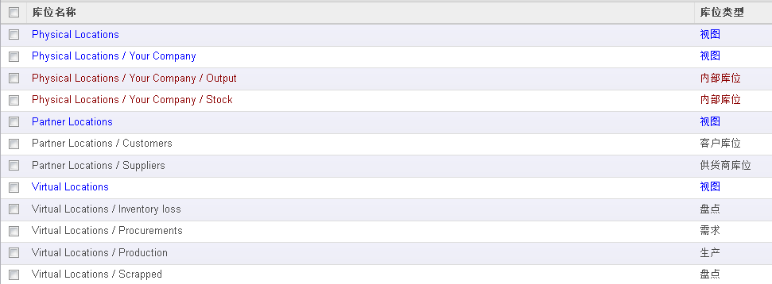

#库存基本操作 - 概述

首先，OpenERP是通过记录产品在库存间的移动来记录库存数量的。OpenERP的数据库中没有库存数量的字段，它的库存数量是实时计算得来的。OE的库存管理不记录库存数量，它记录的是库存移动，记录在 stock_move表中。例如采购进货时，入库单上的每一条进货明细对应stock_move的一条记录，记录该货物移动的源库位、目标库位，数量，移动日期，移动状态（已发生 or尚未发生）。计算产品库存时，汇总该产品的stock_move，入库减去出库的Move，即得该产品的总库存。如果只要计算某库位的产品库存，汇总目标库位是该库位的move数量，减去源库位是该库位的数量，即得库存。 

或许有人要问，采购入库时，是从供应商处提取货物，记入我方仓库，库存移动的源库位在哪？是的，OpenERP的库存管理中，为了解决此类问题，设置了若干虚拟库位，分别对应Supplier、Customer、Production等。采购入库时，从供应商的虚拟库位Supplier Location移动到本公司库位，销售出库时，从本公司库位移动到客户的虚拟库位Customer Location。生产原料出库时，从公司库位到虚拟库位Production Location，车间成品入库时，从Production Location移动到公司库位。甚至库存盘盈盘亏时，系统记录的是公司库位到虚拟库位Inventory loss Loction的库存移动。 

在业务伙伴的Stock Properties中，可以为每一业务伙伴设置Supplier Location和Customer Location。Supplier Location、Customer Location可以是真实的库位，也可以是为了记录库存移动而虚设的库位。在产品的Counter-Part Locations Properties中，可以为每一产品设置Production Location和Inventory loss Loction。同样的，Production Location、Inventory loss Loction可以是真实的，也可以是虚设的。例如，可以将每个生产车间当成一个生产库位进行设置。 

其次，关于虚拟库存。虚拟库存在OpenERP中叫virtual stock, futurestock，故名思议，是将来库存，不是现在的库存（现在的库存叫real stock）。虚拟库存的概念是，将要进货的数量减去将要出货的数量，加上现存的数量，即得虚拟库存。因为2天内和10天内将要进货、出货的数量不同，所以虚拟库存的数量根据计算日期而异。虚拟库存的意义是，例如，某笔销售业务，客户要在5天后提货100件。此时，销售员要检查库存是否足够，但他应该检查的是5天后的库存，而不是现在的库存。所以，对实际业务而言，重要的是虚拟库存，而不是实际库存。 

Warehouse和Location。Warehouse是仓库，对应公司真实存在的仓库。一个仓库通常包含若干个库位（Location），如，合格品区、收货区、辅助区、不合格品区。在OpenERP中，Warehouse包括收货区、出货区、存货区三个库位。当然，简单情况，可以将三个区设成同一个库位。Location是库位，库位可以真实存在，也可以是虚拟的。库位下面还可以包括若干子库位，如下图所示。库存计算、库存移动都是针对库位的，不是针对仓库的。所以，库位是OpenERP库存管理的核心概念。

库位类型：
+ **供应商库位（Supplier Location）**：用于从供应商处收货时的库存移动的源库位，是一种虚拟库位。
+ **视图库位（View）**：库位树状结构的中间节点，用于组织库位树状结构。该种视图不可在库存移动中使用，但可用于库存统计，即统计其下面的各个库位的总库存。
+ **内部库位（Internal Location）**：仓库中实际存放货物的库位，即库区。
+ **客户库位（Customer Location）**： 用于供货给客户时的库存移动的目标库位，是一种虚拟库位。
+ **盘点库位（Inventory）**：用于盘亏时的目标库位，或者盘盈时的源库位。注意，新上OE系统时候也是从该库位中“移动”产品至各库位，以建立期初库存。
+ **补货库位（Procurement）**：产品需求单，引起库存移动的“临时”源库位或目标库位。当系统初次生成需求单时候，系统不能确定补货的来源（不确定是通过购买还是通过生产补货）。只有当系统运行完补货调度计划（Procurement Scheduler）后，才知道补货来源。默认情况下，系统每天运行一次补货调度计划，当然，你可以在任何时候手动执行补货调度计划。补货库位用于初次生成的需求单中的库存移动。每当运行完补货调度计划后，该库位库存数量应为零。
+ **生产库位（Production）**：生产时候，生产领料的目标库位或成品入库时候的源库位，是一种虚拟库位。
+ **多公司中间库位（Transit Location for Inter-Companies Transfers）**：多公司时候，用于库存移动时候的中间库位。

第四，库位链。OpenERP中，可以设置库位链来跟踪货物的移动顺序。例如，假如某仓库的入库程序是，收货区 验货区 存货库区。那么，可以设置库位链：收货区库位 验货区库位 存货库区库位，当收货人确认后，系统自动增加收货区到验货区的库存移动，验货人确认后，系统自动增加验货区到存货库区的库存移动。也即是，设置好库位链后，货物可以手动或者自动在库位链间移动。 

库位链中，从前一库位到下一库位的移动，有三种移动方式：
+ **手动操作（Manual Operation）**：系统自动生成一张到下一库位的移动单，要求操作员确认后才实际移动。
+ **自动调拨（Automatic Move）**：系统自动生成一张到下一库位的移动单，不需要操作员确认，直接移动。此时通常还会指定库链提前时间（Chaining Lead Time），该时间表示，货物进入库位后，等待该时间，再进入下一库位。这个概念可以用于建模物流路径结点及其时间。
+ **自动，但不增加（Automatic No Step Added）**：统不生成到下一库位的移动单，而是直接修改原库存移动的目标库位为下一库位。

本文引用自 [6 库存基本操作------6.1 概述](http://www.openerpchina.org/forum.php?mod=viewthread&tid=11718)
