#库存基本操作-出入库单（Picking List）

在OpenERP中，出库单、入库单、库存调拨单，内部实现都是用Packing List对象，对应的数据表是stock_picking。一个Packing List包含若干条库存移动记录（stock_move）。 

路径为：仓库 》按订单接收发送产品 》入库/送货单。 

头信息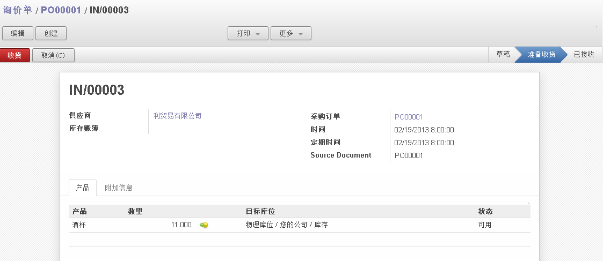

+ **业务伙伴(Partner)**：本装箱单的业务伙伴，如果是入库单，通常是供应商，如果是出库单，通常是客户。

+ **Reference**：装箱单名称（编号）。

+ **采购订单(Purchase Order)**：指明本装箱单是由哪个采购订单引起的。

+ **时间(Time)**：装箱单生成时间。

+ **计划时间(Scheduled Time)**：根据提前期系统计算出库存移动的时间。

+ **来源(Source Document)**：指明本装箱单是由哪些单据引起的。

+ **发票管理(Invoice Control)**：有无效、待开票和已开票三个值。当出/入库后需要基于装箱单手动创建内部发票时，出/入库单上的发票管理的值为“待开票”，如果在出/入库单上点击了按钮“创建内部发票”时，发票管理的值自动变为“已开票”。不需要基于出/入库单手动开票时，发票管理的值为“无效”，且当值为“无效”时此字段不显示。

+ **多公司中间库位(Transit Location for Inter-Companies Transfers)**：多公司时候，用于库存移动时候的中间库位。

+ **产品信息(Status)**：可能的状态有，草稿、 等待可用、准备收货 、已接收和已取消。草稿，新建单据之后确认单据之前。等待可用，确认单据后且库存移动数量大于产品在手数量。准备收货，确认单据后且库存移动数量小于等于在手数量。已接收，产品入库或出库后。已取消，取消单据后，草稿、等待可用、准备收货状态下才可进行“取消”操作。
  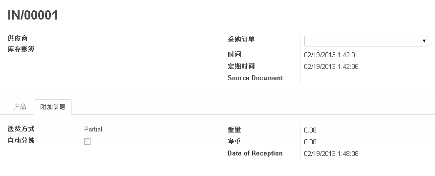
  
+ **送货方式(Delivery Method)**：指定货物是部分发运还是一次性发运。有partial和全部一次性两个选项。

+ **接收日期(Date of Reception)**：货物实际发出或接收的日期。默认情况下，系统是以入库、出库的操作日作为出入库日期。实际业务中，货物出入库之后，不一定当天就在系统中做出入库操作。这种情况下，需要手动输入实际的出入库日期，系统会将此日期记录于出入库对应的库存移动（Stock Move）上。

    OpenERP系统中仓库业务发生顺序一般是:  
    1. 业务单据：业务部门开具业务单据，如销售订单、采购订单。
    2. 出/入库单：系统一般会基于销售订单或采购订单，自动生成入库单或出库单。也可手动新建出/入库单。
    3. 修改出/入库单：根据实际接收或发送的货物，修改出/入库单。
    4. 处理出/入库单：实际出/入库后，处理出/入库单。
    5. 仓库会计处理：根据实际情况决定是否开具系统内部发票，根据业务特征决定是否实施记录库存移动会计分录。

	以出库单为例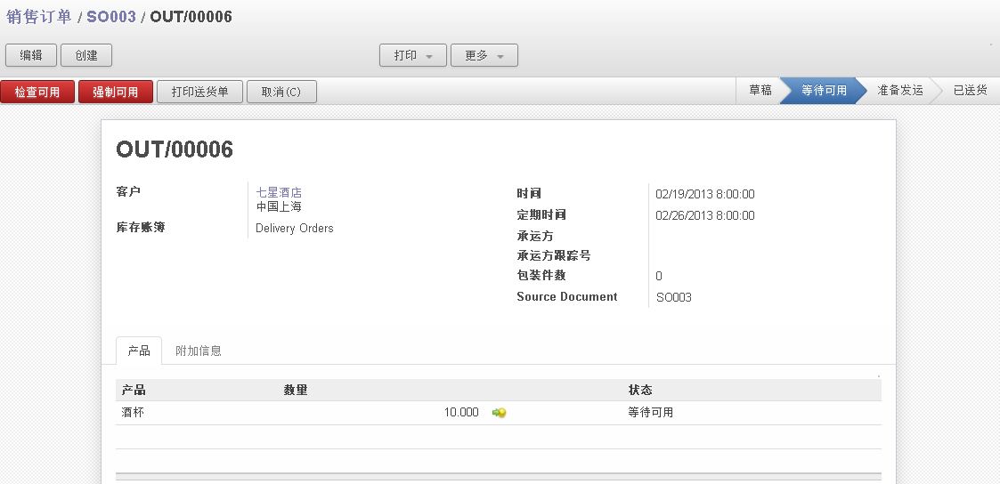

+ **检查可用(Check Availability)**：检查可用有预留的意思，当手动检查后出库单的状态变为“准备发运”则表示成功为该出库单预留了货物；否则状态依然为“等待发运”，且未能为该出库单预留货物。 

    手动检查产品的在手数量扣除预留量后是否大于或等于出库单上的发运数量，如果是则出库单的状态为“准备发运”；如果否则状态继续为“等待可用”。也可以设置系统自动检查

+ **强制可用(Force Availability)**：检查可用后出库单的状态仍为“等待可用”，可点击此按钮使得出库操作得以继续进行。不建议这样操作。 

在处理出/入库会遇到以下几种情况

1. 实际（计划）出入库数量和系统中的出入库单一致，且一次出入库完。
2. 实际（计划）出入库数量和系统中的出入库单一致，但分多次出入库，打印多张出入库单。
3. 实际（计划）出入库数量和系统中的出入库单一致，但分多次出入库，打印一张出入库单。
4. 实际（计划）出入库数量比系统中的出入库单少。
5. 实际（计划）出入库数量比系统中的出入库单多。

以下图系统中的出库单为例：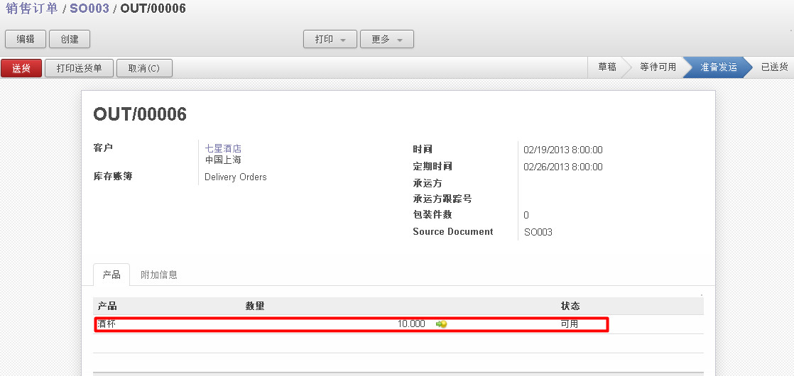

1. 实际（计划）出入库数量和系统中的出入库单一致，且一次出入库完。  
   这种情况是标准业务情况。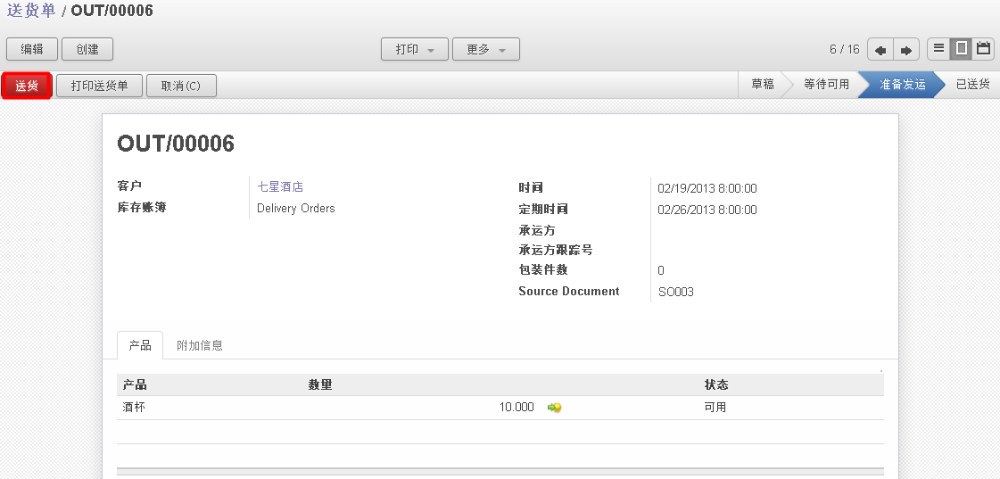  
   点击“送货”按钮。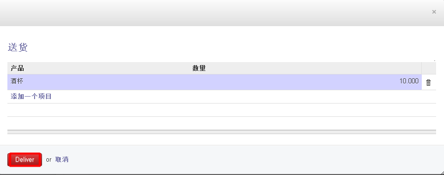  
   点击“Delivery”按钮。
	
2. 实际（计划）出入库数量和系统中的出入库单一致，但分多次出入库，打印多张出入库单。  
   如，货物不足，和客户协商后，分两次给客户发货，且每次发货都有出库单，可根据每次的出库分批向客户开票收款。  
   点击“送货”按钮。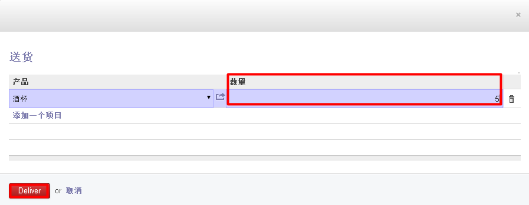  
   **数量**：出入库的总数量。  
   修改数量，再点击“Delivery”。  
   **数量**：本次出入库的数量。如果数量少于原数量，则原出入库单会一分为多张出入库单，多张出入库单的总数量等于原出入库单的数量。   
   系统会自动将原出库单拆分为两张出库单。
   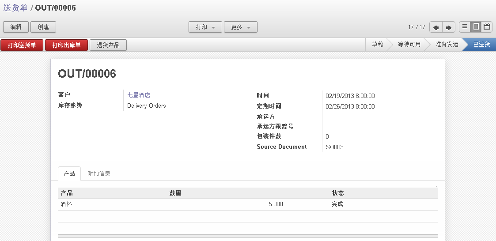  
   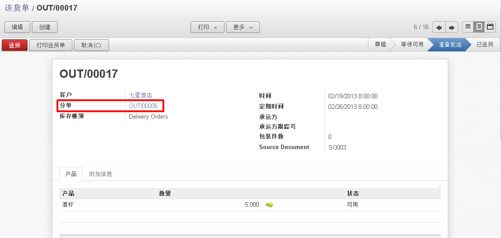  
   
3. 实际（计划）出入库数量和系统中的出入库单一致，但分多次出入库，打印一张出入库单。  
   如，货物不足，和客户协商后，分两次给客户发货，但只开一张出库单，可根据总的出库情况向客户开票收款单。  
   点击“产品行信息”。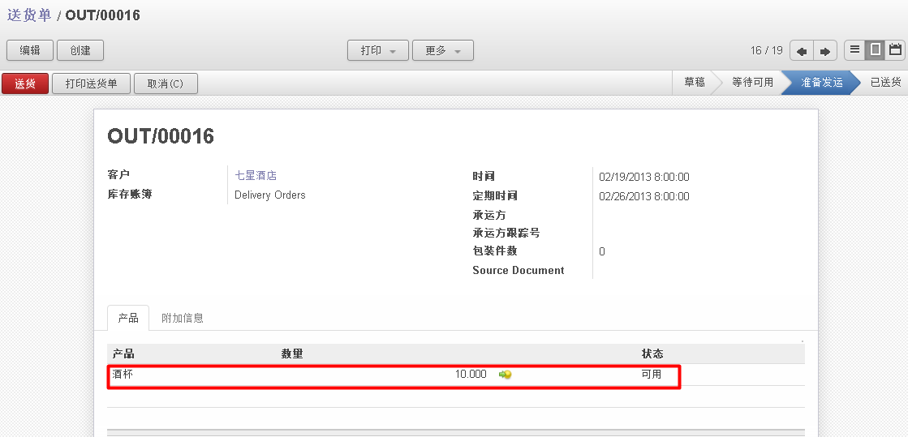  
   点击“Process Partially”。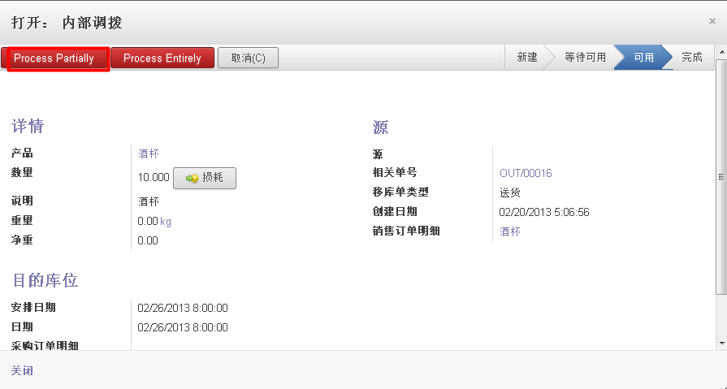  
   **数量**：等于产品行中的数量，出入库单的总数量，它的变动会影响产品行中数量的变化。  
   **Process Partially**：部分出/入库。  
   **Process Entirely**：一次性出入库。  
   **损耗**：损耗的数量。  
   修改数量，并点击“审核”按钮。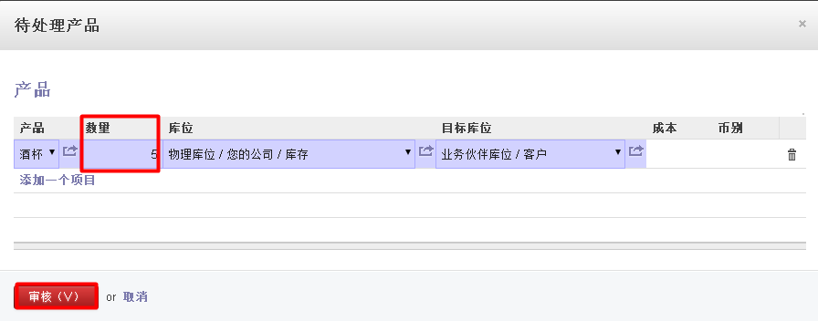  
   **数量**：本次出入库的数量。如果数量少于原数量，则原出入库单行会一分为多行，多行的总数量等于原行的数量。  
   原出库的产品行拆成了两行。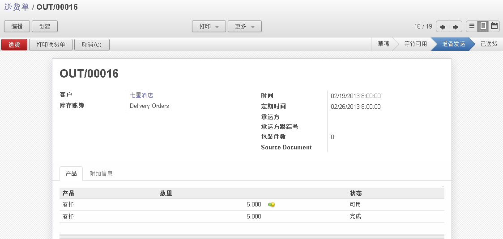
   
4. 实际（计划）出入库数量比系统中的出入库单少。  
   如，货物不足，和客户/供应商协商后，只需要部分产品。  
   点击“产品行信息”。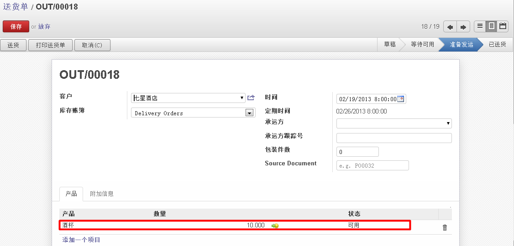  
   修改数量，点击“Process Entriely”。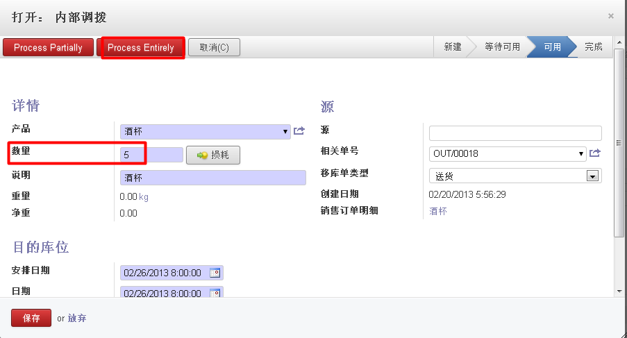  
   原出库单变为数量减少且状态为“完成”的出库单。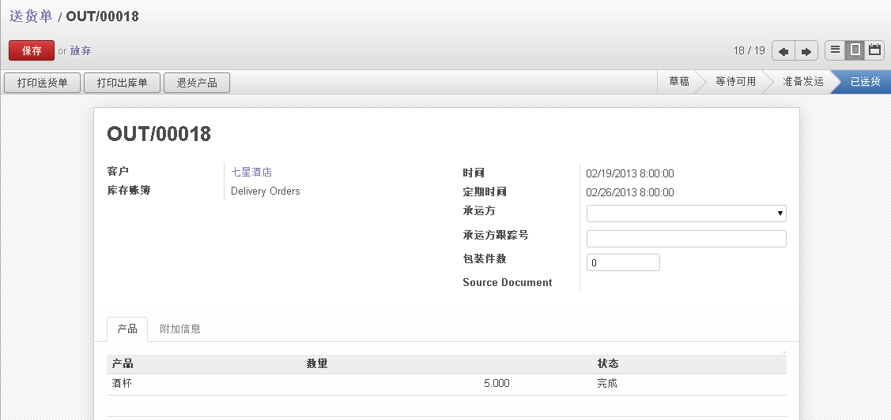  

5. 实际（计划）出入库数量比系统中的出入库单多。  
   如:仓库货物有剩余，且与客户协商后，客户同意多收货物。此时出库数量比系统根据销售订单自动生成的出库单的数量更多。

操作步骤为，1. 按4）中修改数量。2. 根据实际情况，如果一次完成出库，则可参考1）和4）；如果分多次完成出库，则可参考2）和3）

本文引用自[6 库存基本操作------6.2 出入库单（Picking List）](http://www.openerpchina.org/forum.php?mod=viewthread&tid=11719)
