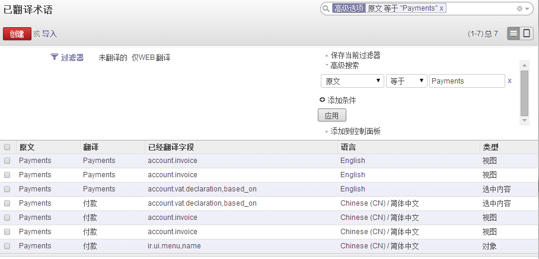

#操作技巧 - 巧用搜索修正翻译

>本文基于 Odoo v8

Odoo的多语言是基于数据库表ir_translation配置的。在安装模块时，语言文件会被导入该表中。由于各个模块的汉化程度参差不齐，界面上看起来非常别扭。

你可以进入数据库update ir_translation，然后进入“设置(Settings) 》翻译(Translations) 》应用程序术语(Application Terms) 》同步术语(Synchronize Terms)”，更新相关的语言文件，可使翻译更新立即生效。或者等待下次重启系统时生效。

当然，这样做很麻烦，因为我们可以在界面上更加便捷地进行翻译。

进入 “设置(Settings) 》翻译(Translations) 》应用程序术语(Application Terms) 》已翻译术语(Translated Terms)”，我们会发现这里正是ir_translation里相关的内容。我们可以创建新的翻译，也可以用鼠标单击相关记录进行编辑。然而，这里的记录非常多，我们不可能使用分页来定位需要翻译的内容，况且这些记录是不规则分布的，很难在同一页里显示相同的原文内容。

于是，我们需要过滤出我们想要的记录。没错，使用页面右上角的搜索框！也许（肯定）地，你会发现，在搜索框里输入内容后按Enter，搜索出来的结果却总是没有内容。心细的你会发现，搜索框右侧有一个小三角，是的，它就是伟大的小三角，它将把我们带入搜索功能中神奇的世界。

如上图，系统已经自动为你提供了两个快捷的过滤器：“未翻译的”和“仅WEB翻译”，这非常有用。我们也可以定制。

用你的鼠标单击“高级搜索(Advanced Search)”，选择字段、选择条件、输入内容，然后点击“应用(Apply)”。你有理由见证这一切的发生，看下图

所有原文为Payments的记录全部显示在一起了，我们只需要用鼠标轻轻点击要改的地方就可以进入编辑状态进行修改了。注意哦，不要把语言为English的记录也给翻译了哦。我觉得在当今社会将Payments翻译成“付款”是不可接受的，它应该叫做“支付”！好吧，动手把它改过来。打住，并不是所有地方都能叫“支付”，在发票上可能使用“付款”会好一点不是吗！你自己看着办吧。完成修改后，记得点击左上角的“保存”按钮将修改保存在数据库中。

最后，如果想让修改的翻译立即生效，可以进行“同步术语”，这将会是一个漫长的过程~~~