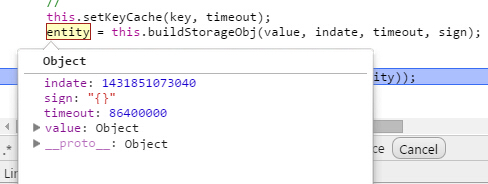

## 什么是localstorage

前几天在老项目中发现有对cookie的操作觉得很奇怪，咨询下来是要缓存一些信息，以避免在URL上面传递参数，但没有考虑过cookie会带来什么问题：

1. cookie大小限制在4k左右，不适合存业务数据
2. cookie每次随HTTP事务一起发送，浪费带宽

我们是做移动项目的，所以这里真实适合使用的技术是localstorage，localstorage可以说是对cookie的优化，使用它可以方便在客户端存储数据，并且不会随着HTTP传输，但也不是没有问题：

1. localstorage大小限制在500万字符左右，各个浏览器不一致
2. localstorage在隐私模式下不可读取
3. localstorage本质是在读写文件，数据多的话会比较卡（firefox会一次性将数据导入内存，想想就觉得吓人啊）
4. localstorage不能被爬虫爬取，不要用它完全取代URL传参

瑕不掩瑜，以上问题皆可避免，所以我们的关注点应该放在如何使用localstorage上，并且是如何正确使用。

## localstorage的使用

### 基础知识

localstorage存储对象分为两种：

1. sessionStrage： session即会话的意思，在这里的session是指用户浏览某个网站时，从进入网站到关闭网站这个时间段，session对象的有效期就只有这么长。
2. localStorage： 将数据保存在客户端硬件设备上，不管它是什么，意思就是下次打开计算机时候数据还在。

两者区别就是一个作为临时保存，一个长期保存。

这里来一段简单的代码说明其基本使用：

```html
<div id="msg" style="margin: 10px 0; border: 1px solid black; padding: 10px; width: 300px;height: 100px;"></div>
<input type="text" id="text" />
<select id="type">
  <option value="session">sessionStorage</option>
  <option value="local">localStorage</option>
</select>
<button onclick="save();">保存数据</button>
<button onclick="load();">读取数据</button>
<script type="text/javascript">
  var msg = document.getElementById('msg'),
        text = document.getElementById('text'),
        type = document.getElementById('type');
 
  function save() {
    var str = text.value;
    var t = type.value;
    if (t == 'session') {
      sessionStorage.setItem('msg', str);
    } else {
      localStorage.setItem('msg', str);
    }
  }
 
  function load() {
    var t = type.value;
    if (t == 'session') {
      msg.innerHTML = sessionStorage.getItem('msg');
    } else {
      msg.innerHTML = localStorage.getItem('msg');
    }
  }
</script>
```

### 真实场景

实际工作中对localstorage的使用一般有以下需求：

1. 缓存一般信息，如搜索页的出发城市，达到城市，非实时定位信息
2. 缓存城市列表数据，这个数据往往比较大
3. 每条缓存信息需要可追踪，比如服务器通知城市数据更新，这个时候在最近一次访问的时候要自动设置过期
4. 每条信息具有过期日期状态，在过期外时间需要由服务器拉取数据
5. ......

```javascript
define([], function () {
 
  var Storage = _.inherit({
    //默认属性
    propertys: function () {
 
      //代理对象，默认为localstorage
      this.sProxy = window.localStorage;
 
      //60 * 60 * 24 * 30 * 1000 ms ==30天
      this.defaultLifeTime = 2592000000;
 
      //本地缓存用以存放所有localstorage键值与过期日期的映射
      this.keyCache = 'SYSTEM_KEY_TIMEOUT_MAP';
 
      //当缓存容量已满，每次删除的缓存数
      this.removeNum = 5;
 
    },
 
    assert: function () {
      if (this.sProxy === null) {
        throw 'not override sProxy property';
      }
    },
 
    initialize: function (opts) {
      this.propertys();
      this.assert();
    },
 
    /*
    新增localstorage
    数据格式包括唯一键值，json字符串，过期日期，存入日期
    sign 为格式化后的请求参数，用于同一请求不同参数时候返回新数据，比如列表为北京的城市，后切换为上海，会判断tag不同而更新缓存数据，tag相当于签名
    每一键值只会缓存一条信息
    */
    set: function (key, value, timeout, sign) {
      var _d = new Date();
      //存入日期
      var indate = _d.getTime();
 
      //最终保存的数据
      var entity = null;
 
      if (!timeout) {
        _d.setTime(_d.getTime() + this.defaultLifeTime);
        timeout = _d.getTime();
      }
 
      //
      this.setKeyCache(key, timeout);
      entity = this.buildStorageObj(value, indate, timeout, sign);
 
      try {
        this.sProxy.setItem(key, JSON.stringify(entity));
        return true;
      } catch (e) {
        //localstorage写满时,全清掉
        if (e.name == 'QuotaExceededError') {
          //            this.sProxy.clear();
          //localstorage写满时，选择离过期时间最近的数据删除，这样也会有些影响，但是感觉比全清除好些，如果缓存过多，此过程比较耗时，100ms以内
          if (!this.removeLastCache()) throw '本次数据存储量过大';
          this.set(key, value, timeout, sign);
        }
        console && console.log(e);
      }
      return false;
    },
 
    //删除过期缓存
    removeOverdueCache: function () {
      var tmpObj = null, i, len;
 
      var now = new Date().getTime();
      //取出键值对
      var cacheStr = this.sProxy.getItem(this.keyCache);
      var cacheMap = [];
      var newMap = [];
      if (!cacheStr) {
        return;
      }
 
      cacheMap = JSON.parse(cacheStr);
 
      for (i = 0, len = cacheMap.length; i < len; i++) {
        tmpObj = cacheMap[i];
        if (tmpObj.timeout < now) {
          this.sProxy.removeItem(tmpObj.key);
        } else {
          newMap.push(tmpObj);
        }
      }
      this.sProxy.setItem(this.keyCache, JSON.stringify(newMap));
 
    },
 
    removeLastCache: function () {
      var i, len;
      var num = this.removeNum || 5;
 
      //取出键值对
      var cacheStr = this.sProxy.getItem(this.keyCache);
      var cacheMap = [];
      var delMap = [];
 
      //说明本次存储过大
      if (!cacheStr) return false;
 
      cacheMap.sort(function (a, b) {
        return a.timeout - b.timeout;
      });
 
      //删除了哪些数据
      delMap = cacheMap.splice(0, num);
      for (i = 0, len = delMap.length; i < len; i++) {
        this.sProxy.removeItem(delMap[i].key);
      }
 
      this.sProxy.setItem(this.keyCache, JSON.stringify(cacheMap));
      return true;
    },
 
    setKeyCache: function (key, timeout) {
      if (!key || !timeout || timeout < new Date().getTime()) return;
      var i, len, tmpObj;
 
      //获取当前已经缓存的键值字符串
      var oldstr = this.sProxy.getItem(this.keyCache);
      var oldMap = [];
      //当前key是否已经存在
      var flag = false;
      var obj = {};
      obj.key = key;
      obj.timeout = timeout;
 
      if (oldstr) {
        oldMap = JSON.parse(oldstr);
        if (!_.isArray(oldMap)) oldMap = [];
      }
 
      for (i = 0, len = oldMap.length; i < len; i++) {
        tmpObj = oldMap[i];
        if (tmpObj.key == key) {
          oldMap[i] = obj;
          flag = true;
          break;
        }
      }
      if (!flag) oldMap.push(obj);
      //最后将新数组放到缓存中
      this.sProxy.setItem(this.keyCache, JSON.stringify(oldMap));
 
    },
 
    buildStorageObj: function (value, indate, timeout, sign) {
      var obj = {
        value: value,
        timeout: timeout,
        sign: sign,
        indate: indate
      };
      return obj;
    },
 
    get: function (key, sign) {
      var result, now = new Date().getTime();
      try {
        result = this.sProxy.getItem(key);
        if (!result) return null;
        result = JSON.parse(result);
 
        //数据过期
        if (result.timeout < now) return null;
 
        //需要验证签名
        if (sign) {
          if (sign === result.sign)
            return result.value;
          return null;
        } else {
          return result.value;
        }
 
      } catch (e) {
        console && console.log(e);
      }
      return null;
    },
 
    //获取签名
    getSign: function (key) {
      var result, sign = null;
      try {
        result = this.sProxy.getItem(key);
        if (result) {
          result = JSON.parse(result);
          sign = result && result.sign
        }
      } catch (e) {
        console && console.log(e);
      }
      return sign;
    },
 
    remove: function (key) {
      return this.sProxy.removeItem(key);
    },
 
    clear: function () {
      this.sProxy.clear();
    }
  });
 
  Storage.getInstance = function () {
    if (this.instance) {
      return this.instance;
    } else {
      return this.instance = new this();
    }
  };
 
  return Storage;
 
});
```

这段代码包含了localstorage的基本操作，并且对以上问题做了处理，而真实的使用还要再抽象：

```javascript
define(['AbstractStorage'], function (AbstractStorage) {
 
  var Store = _.inherit({
    //默认属性
    propertys: function () {
 
      //每个对象一定要具有存储键，并且不能重复
      this.key = null;
 
      //默认一条数据的生命周期，S为秒，M为分，D为天
      this.lifeTime = '30M';
 
      //默认返回数据
      //      this.defaultData = null;
 
      //代理对象，localstorage对象
      this.sProxy = new AbstractStorage();
 
    },
 
    setOption: function (options) {
      _.extend(this, options);
    },
 
    assert: function () {
      if (this.key === null) {
        throw 'not override key property';
      }
      if (this.sProxy === null) {
        throw 'not override sProxy property';
      }
    },
 
    initialize: function (opts) {
      this.propertys();
      this.setOption(opts);
      this.assert();
    },
 
    _getLifeTime: function () {
      var timeout = 0;
      var str = this.lifeTime;
      var unit = str.charAt(str.length - 1);
      var num = str.substring(0, str.length - 1);
      var Map = {
        D: 86400,
        H: 3600,
        M: 60,
        S: 1
      };
      if (typeof unit == 'string') {
        unit = unit.toUpperCase();
      }
      timeout = num;
      if (unit) timeout = Map[unit];
 
      //单位为毫秒
      return num * timeout * 1000 ;
    },
 
    //缓存数据
    set: function (value, sign) {
      //获取过期时间
      var timeout = new Date();
      timeout.setTime(timeout.getTime() + this._getLifeTime());
      this.sProxy.set(this.key, value, timeout.getTime(), sign);
    },
 
    //设置单个属性
    setAttr: function (name, value, sign) {
      var key, obj;
      if (_.isObject(name)) {
        for (key in name) {
          if (name.hasOwnProperty(key)) this.setAttr(k, name[k], value);
        }
        return;
      }
 
      if (!sign) sign = this.getSign();
 
      //获取当前对象
      obj = this.get(sign) || {};
      if (!obj) return;
      obj[name] = value;
      this.set(obj, sign);
 
    },
 
    getSign: function () {
      return this.sProxy.getSign(this.key);
    },
 
    remove: function () {
      this.sProxy.remove(this.key);
    },
 
    removeAttr: function (attrName) {
      var obj = this.get() || {};
      if (obj[attrName]) {
        delete obj[attrName];
      }
      this.set(obj);
    },
 
    get: function (sign) {
      var result = [], isEmpty = true, a;
      var obj = this.sProxy.get(this.key, sign);
      var type = typeof obj;
      var o = { 'string': true, 'number': true, 'boolean': true };
      if (o[type]) return obj;
 
      if (_.isArray(obj)) {
        for (var i = 0, len = obj.length; i < len; i++) {
          result[i] = obj[i];
        }
      } else if (_.isObject(obj)) {
        result = obj;
      }
 
      for (a in result) {
        isEmpty = false;
        break;
      }
      return !isEmpty ? result : null;
    },
 
    getAttr: function (attrName, tag) {
      var obj = this.get(tag);
      var attrVal = null;
      if (obj) {
        attrVal = obj[attrName];
      }
      return attrVal;
    }
 
  });
 
  Store.getInstance = function () {
    if (this.instance) {
      return this.instance;
    } else {
      return this.instance = new this();
    }
  };
 
  return Store;
});
```

我们真实使用的时候是使用store这个类操作localstorage，代码结束简单测试：



存储完成，以后都不会走请求，于是今天的代码基本结束 ，最后在android Hybrid中有一后退按钮，此按钮一旦按下会回到上一个页面，这个时候里面的localstorage可能会读取失效！一个简单不靠谱的解决方案是在webapp中加入：

```javascript
window.onunload = function () { };//适合单页应用，不要问我为什么，我也不知道
```

### 结语

localstorage是移动开发必不可少的技术点，需要深入了解，具体业务代码后续会放到git上，有兴趣的朋友可以去了解

## 参考资料

* [1] [HTML5本地存储Localstorage](http://www.cnblogs.com/yexiaochai/p/4509472.html)
