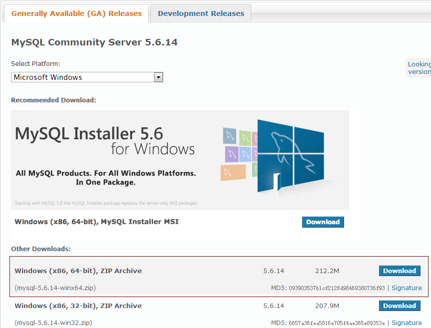
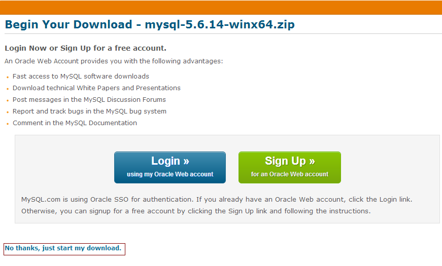
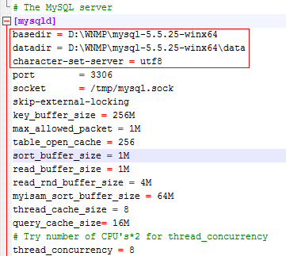
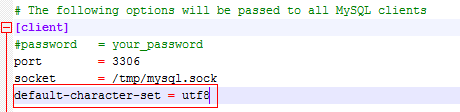
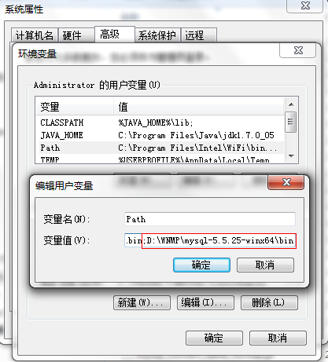

#在Windows7_x64下安装MySQL(zip压缩包)

##下载MySQL

MySQL下载地址：http://dev.mysql.com/downloads/mysql/



点击Download按钮，页面跳转到登录页



点击下方的No thanks, just start my dowload的链接，直接下载MySQL。

##安装MySQL

下载的zip包是免安装的，将它解压缩到D:\WNMP目录下一个独立的文件夹：mysql-5.5.25-winx64 (备注：安装包在本文撰写之前下载，因此版本号与图片中的版本号不一致，但不影响以下的配置步骤)


##配置初始化参数

安装根目录下有几个配置文件(*.ini)可以参考，仔细阅读一下不难发现最大的区别就是对内存缓冲区的配置参数大小。参考网上的说法：

> * my-small.ini是为了小型数据库而设计的。不应该把这个模型用于含有一些常用项目的数据库。
> * my-medium.ini是为中等规模的数据库而设计的。如果你正在企业中使用RHEL,可能会比这个操作系统的最小RAM需求(256MB)明显多得多的物理内存。由此可见，如果有那么多RAM内存可以使用，自然可以在同一台机器上运行其它服务。
> * my-large.ini是为专用于一个SQL数据库的计算机而设计的。由于它可以为该数据库使用多达512MB的内存，所以在这种类型的系统上将需要至少1GB的RAM,以便它能够同时处理操作系统与数据库应用程序。
> * my-huge.ini是为企业中的数据库而设计的。这样的数据库要求专用服务器和1GB或1GB以上的RAM。
> * my-innodb-heavy-4G.ini用于只有InnoDB的安装，最多有4G RAM，支持大的查询。

我们这里保守地选择参考my-large.ini(我的机器内存是4G)，复制它，并重命名为my.ini。我们要用my.ini来启动MySQL。（备注：MySQL查找配置文件的顺序为C:\my.ini, C:\my.cnf, C:\WINDOWS\my.ini, C:\WINDOWS\my.cnf, 安装根目录\my.ini, 安装根目录\my.cnf）

用Notepad++（没有安装这个软件的话就用记事本吧）打开my.ini文件，作如下修改：

```
#在[mysqld]下面添加：
# MySQL的安装目录
basedir = D:\WNMP\mysql-5.5.25-winx64
# 指定MySQL数据库数据存储目录
datadir = D:\WNMP\mysql-5.5.25-winx64\data
# 指定MySQL服务器使用的字符集，支持中文可设置为utf8或gbk
character-set-server = utf8
```

如图：



```
#在[client]下面添加：
default-character-set = utf8 # 设置MySQL客户端使用的字符集
```

如图：



由于Windows CMD默认使用的字符集是gbk，为了简单地避免出现乱码问题，特在此将它设置为与服务器字符集相同。

##安装MySQL服务

打开CMD(Windows命令行)，执行以下语句：

```
C:\Windows\System32>D:
 
D:\>cd D:\WNMP\mysql-5.5.25-winx64\bin
 
D:\WNMP\mysql-5.5.25-winx64\bin>mysqld --install mysql --defaults-file=D:\WNMP\mysql-5.5.25-winx64\my.ini
Service successfully installed.
```

此时可以查看是否已经安装了服务：


##启动mysql服务

在CMD(Windows命令行)输入：

```
C:\Windows\System32>net start mysql
mysql 服务正在启动 .
mysql 服务已经启动成功。
```

备注：关闭服务使用命令net stop mysql

##设置Path环境变量

将MySQL安装目录下的bin添加到变量Path中，如图：



作此设置之后，就可以在CMD(Windows命令行)中直接使用mysql命令了。

##连接并登录MySQL

打开CMD(Windows命令行)，输入：

```
C:\Windows\System32>mysql -h localhost -u root -p
Enter password: 
Welcome to the MySQL monitor.  Commands end with ; or \g.
Your MySQL connection id is 1
Server version: 5.5.25-log MySQL Community Server (GPL)
 
Copyright (c) 2000, 2011, Oracle and/or its affiliates. All rights reserved.
 
Oracle is a registered trademark of Oracle Corporation and/or its
affiliates. Other names may be trademarks of their respective
owners.
 
Type 'help;' or '\h' for help. Type '\c' to clear the current input statement.
```

备注：初次登录root不需要密码，所以在要求输入密码的时候直接按Enter健即可。

##设置root密码

root具有MySQL数据库最高的权限，几乎无所不能，所以必须为它设置一个安全系数最高的密码。

连接mysql之后，输入以下命令：

```
mysql> use mysql;
Database changed
mysql> update user set password=PASSWORD('123456') where user='root' or user='';
Query OK, 4 rows affected (0.00 sec)
Rows matched: 4  Changed: 4  Warnings: 0
mysql> grant all on *.* to root@'%' identified by '123456' with grant option;
Query OK, 0 rows affected (0.00 sec)
mysql> commit;
Query OK, 0 rows affected (0.00 sec)
mysql> flush privileges;
Query OK, 0 rows affected (0.00 sec)
mysql> quit;
Bye
```

至此，MySQL数据库安装大餐新鲜出炉，尽情享用吧。

##附录：查看连接基本状态

````
mysql> status
--------------
mysql  Ver 14.14 Distrib 5.5.25, for Win64 (x86)
 
Connection id:          3
Current database:
Current user:           root@localhost
SSL:                    Not in use
Using delimiter:        ;
Server version:         5.5.25-log MySQL Community Server (GPL)
Protocol version:       10
Connection:             localhost via TCP/IP
Server characterset:    utf8
Db     characterset:    utf8
Client characterset:    utf8
Conn.  characterset:    utf8
TCP port:               3306
Uptime:                 24 min 38 sec
 
Threads: 1  Questions: 16  Slow queries: 0  Opens: 33  Flush tables: 1  Open tab
les: 26  Queries per second avg: 0.010
--------------
```