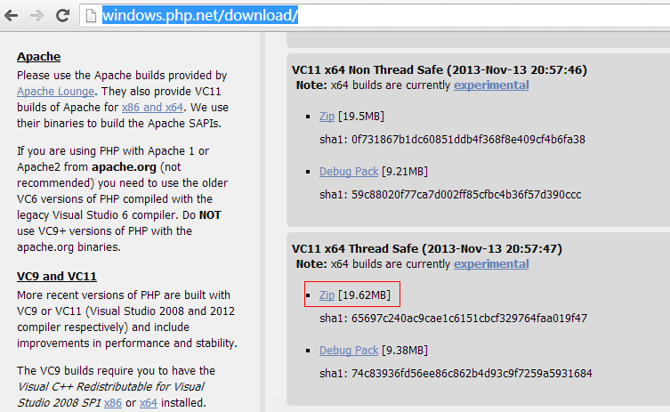
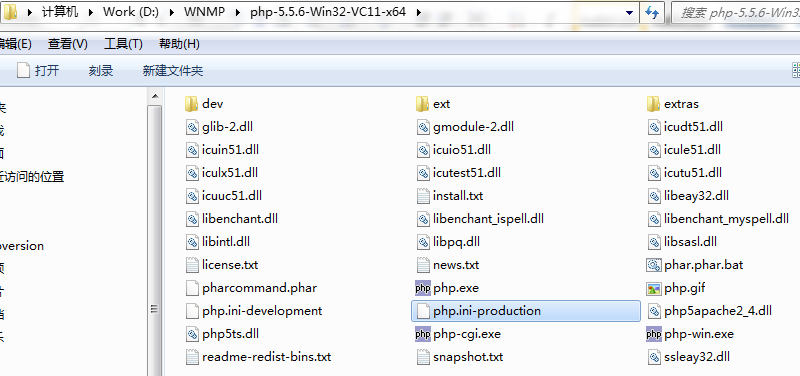
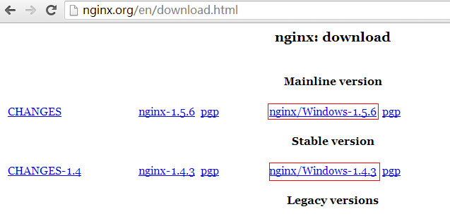
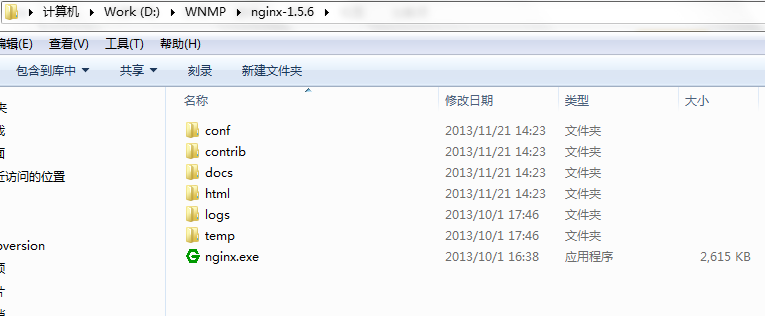
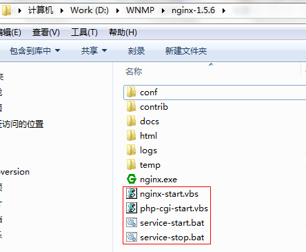
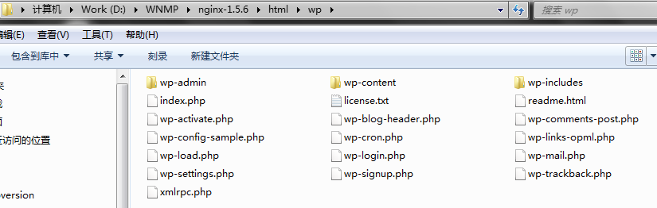
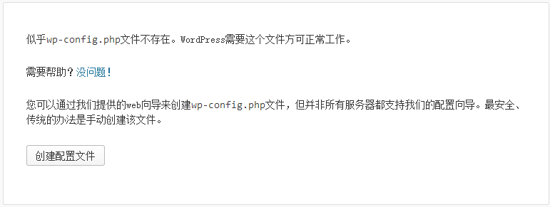
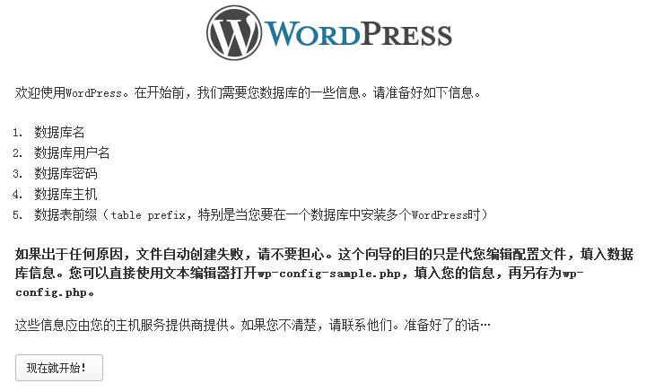
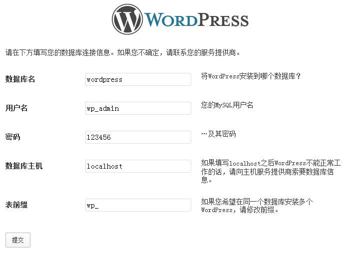

#在Windows7_x64下搭建Nginx+MySQL+Php环境并安装wordpress

#安装MySQL

请阅读我写的文章[《在Windows7_x64下安装MySQL(zip压缩包)》](在Windows7_x64下安装MySQL-zip压缩包.md)

#安装php

PHP下载地址：http://windows.php.net/download/



和MySQL一样，下载包是一个zip压缩包，只需解压缩即可。将它解压缩到 D:\WNMP\php-5.5.6-Win32-VC11-x64目录下:



##配置php

将php.ini-production文件复制并重命名为php.ini，并用Notepad++(没有安装此软件的话就使用记事本)打开php.ini：

查找并定位到行 | 修改为
------------ | --------
; extension_dir = "ext" | extension_dir = "ext"
;extension=php_gd2.dll | extension=php_gd2.dll
;extension=php_mbstring.dll | extension=php_mbstring.dll
;extension=php_mysql.dll | extension=php_mysql.dll
;extension=php_mysqli.dll | extension=php_mysqli.dll
;extension=php_pdo_mysql.dll | extension=php_pdo_mysql.dll
;cgi.force_redirect = 1 | cgi.force_redirect = 1
;cgi.fix_pathinfo=1 | cgi.fix_pathinfo=1
;cgi.rfc2616_headers = 0 | cgi.rfc2616_headers = 1

##安装Nginx

Nginx下载地址：http://nginx.org/en/download.html



当前可以选择下载稳定版本1.4.3，或者选择最新版本1.5.6，本文选择下载最新版。与php和mysql一样，下载包是一个zip压缩包，将它解压缩到D:\WNMP\nginx-1.5.6目录下：



##配置Nginx

Nginx的配置文件是在安装目录的conf文件夹下的nginx.conf，并用Notepad++(没有安装此软件的话就使用记事本)打开它：

查找并定位到以下配置：

```
location / {
    root   html;
    index  index.html index.htm;
}
```

修改为：

```
location / {
    root   html;
    index  index.html index.htm index.php;
}
```

继续往下查找并定位到以下配置：

```
#location ~ \.php$ {
#    root           html;
#    fastcgi_pass   127.0.0.1:9000;
#    fastcgi_index  index.php;
#    fastcgi_param  SCRIPT_FILENAME  /scripts$fastcgi_script_name;
#    include        fastcgi_params;
#}
```

将#号去掉，并改为：

```
location ~ \.php$ {
    root           html;
    fastcgi_pass   127.0.0.1:9000;
    fastcgi_index  index.php;
    fastcgi_param  SCRIPT_FILENAME  $document_root$fastcgi_script_name;
    include        fastcgi_params;
}
```

在Nginx的根目录下

创建php-cgi-start.vbs文件，添加以下内容：

```
createobject("wscript.shell").run "D:\WNMP\php-5.5.6-Win32-VC11-x64\php-cgi.exe -b 127.0.0.1:9000 -c D:\WNMP\php-5.5.6-Win32-VC11-x64\php.ini",0
```

创建nginx-start.vbs文件，添加以下内容：

```
createobject("wscript.shell").run "D:\WNMP\nginx-1.5.6\nginx.exe",0
```

创建service-start.bat文件用于启动web服务器，添加以下内容：

```
echo off;
php-cgi-start.vbs
echo php-cgi started.
Nginx-start.vbs
echo nginx started.
exit;
```

创建service-stop.bat文件用于关闭web服务器，添加以下内容：

```
echo off
echo Stopping nginx...
taskkill /F /IM nginx.exe > nul
echo Stopping PHP FastCGI...
taskkill /F /IM php-cgi.exe > nul
exit
```

以后只需用鼠标双击service-start.bat启动web服务，运行service-stop.bat关闭web服务。

配置完成后Nginx的安装根目录如下：



##安装wordpress

将wordpress压缩包解压到D:\WNMP\nginx-1.5.6\html\目录下(这个目录是我们已配置的nginx默认根目录)，并将文件夹重命名为wp，如下：



连接mysql数据库创建一个由wordpress专用的数据库：

```
C:\Windows\System32>mysql -h localhost -u root -p123456
Welcome to the MySQL monitor. Commands end with ; or \g.
Your MySQL connection id is 5
Server version: 5.5.25-log MySQL Community Server (GPL)

Copyright (c) 2000, 2011, Oracle and/or its affiliates. All rights reserved.

Oracle is a registered trademark of Oracle Corporation and/or its
affiliates. Other names may be trademarks of their respective
owners.

Type 'help;' or '\h' for help. Type '\c' to clear the current input statement.

mysql> create database wordpress;
Query OK, 1 row affected (0.00 sec)

mysql> create user wp_admin@localhost identified by '123456';
Query OK, 0 rows affected (0.00 sec)

mysql> grant all privileges on wordpress.* to wp_admin;
Query OK, 0 rows affected (0.00 sec)
```

在浏览器访问：http://localhost/wp即可访问wordpress安装页面(注意：nginx已启动)



创建配置文件



现在就开始



提交


进行安装

接下去就跟普通的网上注册一样简单了。

