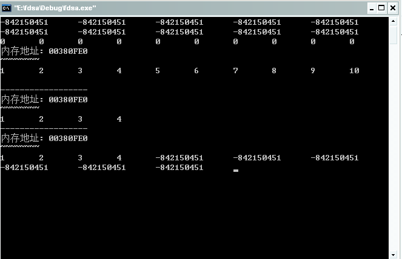

# 内存分配

## realloc()函数

- 原型：`extern void *realloc(void *mem_address, unsigned int newsize)`;

- 语法： 指针名=（数据类型*）realloc（要改变内存大小的指针名，新的大小）。

- 头文件：#include <stdlib.h> 有些编译器需要#include <alloc.h>，在TC2.0中可以使用alloc.h头文件

- 功能：先按照newsize指定的大小分配空间，将原有数据从头到尾拷贝到新分配的内存区域，而后释放原来mem_address所指内存区域，同时返回新分配的内存区域的首地址。即重新分配存储器块的地址。

- 返回值：如果重新分配成功则返回指向被分配内存的指针，否则返回空指针NULL。

注意：这里原始内存中的数据还是保持不变的。当内存不再使用时，应使用free()函数将内存块释放。

## malloc()函数

- 原型：`extern void *malloc(unsigned int num_bytes);`

- 头文件：在TC2.0中可以用malloc.h或 alloc.h (注意：alloc.h 与 malloc.h 的内容是完全一致的)，而在Visual C++6.0中可以用malloc.h或者stdlib.h。

- 功能：分配长度为num_bytes字节的内存块

- 返回值：如果分配成功则返回指向被分配内存的指针，否则返回空指针NULL。当内存不再使用时，应使用free()函数将内存块释放。

- 说明：关于该函数的原型，在旧的版本中malloc返回的是char型指针，新的ANSIC标准规定，该函数返回为void型指针，因此必要时要进行类型转换。

## calloc()函数

calloc是一个C语言函数

- 功 能: 在内存的动态存储区中分配n个长度为size的连续空间，函数返回一个指向分配起始地址的指针；如果分配不成功，返回NULL。

- 跟malloc的区别： calloc在动态分配完内存后，自动初始化该内存空间为零，而malloc不初始化，里边数据是随机的垃圾数据。

- 用 法: `void *calloc(unsigned n,unsigned size)；`

- 头文件：stdlib.h或malloc.h

```c
#include <stdio.h>
#include <stdlib.h>
int main(void)
{    
    int num = 10;
    int i;    
    long *p = (long *)malloc(num * sizeof(long)); 
    long *p1=(long *)calloc(num,sizeof(long));

    for (i = 0; i < num; i++)
    {
        printf("%d\t", p[i]);
    }

    for (i = 0; i < num; i++)
    {
        printf("%d\t", p1[i]);
    }

    printf("内存地址: %p\n~~~~~~~~\n", p);  
 
    for (i = 0; i < num; i++)
        p[i] = i+1;   
 
    for (i = 0; i < num; i++) 
        printf("%d\t", p[i]); 

    printf("\n------------------\n");
    num = 4;    
    p = (long *)realloc(p, num*sizeof(long));  
    printf("内存地址: %p\n~~~~~~~~\n", p);
 
    for (i = 0; i < num; i++) 
        printf("%d\t", p[i]); 

    printf("\n------------------\n");    
    num = 10;    
    p = (long *)realloc(p, num*sizeof(long));  
    printf("内存地址: %p\n~~~~~~~~\n", p);  
 
    for (i = 0; i < num; i++) 
        printf("%d\t", p[i]);

    free(p);   
    free(p1);
    getchar();   
    return 0;
}
```

运行结果为：



由数据可以很直观的看出他们之间的区别

## 引用

- [0] [原文](http://blog.csdn.net/bigloomy/article/details/6581706)