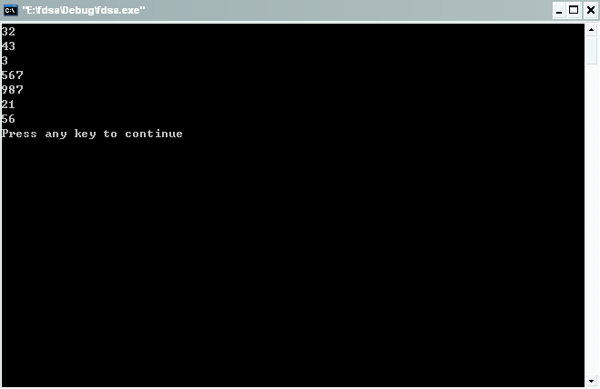
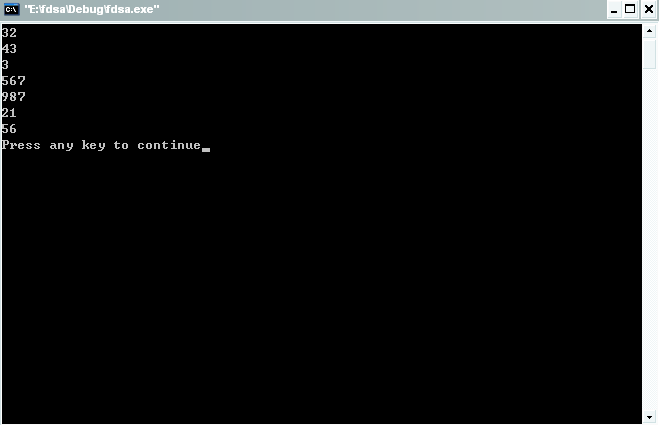
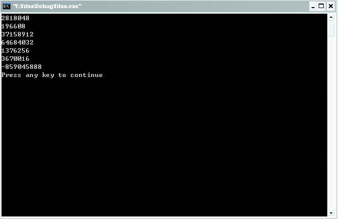

# 堆栈

在讲解堆栈之前，我们先要来说说其实我们常说的堆栈是两种数据结构。那么什么是堆什么又是栈呢？

栈，是硬件。主要作用表现为一种数据结构，是只能在某一端插入和删除的特殊线性表。它按照后进先出的原则存储数据，先进入的数据被压入栈底，最后的数据在栈顶，需要读数据的时候从栈顶开始弹出数据（最后一个数据被第一个读出来）。栈是允许在同一端进行插入和删除操作的特殊线性表。允许进行插入和删除操作的一端称为栈顶(top)，另一端为栈底(bottom)；栈底固定，而栈顶浮动；栈中元素个数为零时称为空栈。插入一般称为进栈（PUSH），删除则称为退栈（POP）。 栈也称为先进后出表。栈可以用来在函数调用的时候存储断点，做递归时要用到栈！

以上定义是在经典计算机科学中的解释。

在计算机系统中，栈则是一个具有以上属性的动态内存区域。程序可以将数据压入栈中，也可以将数据从栈顶弹出。在i386机器中，栈顶由称为esp的寄存器进行定位。压栈的操作使得栈顶的地址减小，弹出的操作使得栈顶的地址增大。

栈在程序的运行中有着举足轻重的作用。最重要的是栈保存了一个函数调用时所需要的维护信息，这常常称之为堆栈帧或者活动记录。堆栈帧一般包含如下几方面的信息：

1. 函数的返回地址和参数
2. 临时变量：包括函数的非静态局部变量以及编译器自动生成的其他临时变量。

堆，是一种动态存储结构，实际上就是数据段中的自由存储区，它是C语言中使用的一种名称，常常用于动态数据的存储分配。堆中存入一数据，总是以2字节的整数倍进行分配，地址向增加方向变动。堆可以不断进行分配直到没有堆空间为止，也可以随时进行释放、再分配，不存在次序问题。

堆和栈在使用时相向生长，栈向上生长，即向小地址方向生长，而堆向下增长，即向大地址方向，其间剩余部分是自由空间。使用过程中要防止增长过度而导致覆盖。

一般的程序我们都是使用小内存模式。

明白了堆和栈的概念之后我们来看一个面试的c语言题目。代码要相关要求如下所示：

```c
#include <iostream>
using namespace std; 

void print()
{
    //这里进行打印arr数组，print不准传参数
}

int main()
{ 
    int s=0;
    int ss=0;
    char *str="fdsafdsafdsafdsafdsafdsafdsa";
    char fdsa='f';
    char srt[8];
    int arr[]={32,43,3,567,987,21,56};//数值随即

    print();
    return 0;
}
```

刚刚一开始看到这个题目时，你可能有点发懵，心想可能在不传递参数的情况下打印arr数组的内容，但是看看我们的标题就应该知道该题跟栈有关系，在做之前我们先来回顾几个知识点。

push操作先修改指针，后将信息入栈。

ESP为堆栈指针，栈顶有ESP寄存器来定位。压栈的操作使得栈顶的地址减小，弹出的操作使得栈顶的地址增大。

EBP是32位的BP，EBP是基址指针，EBP与BP的关系就像AX与AL、AH的关系一样。BP为基指针寄存器，用它课直接存取堆栈中的数据，他的作用在调用函数时保存ESP，使函数结束时可以正确返回。

c的默认函数压栈操作为：
参数是从右向左压栈的，默认四字节对齐，函数里面定义的变量是默认对齐方式----变量首地址是自身结构体里边最大标准数据类型字节的整数倍。

我们先来看看上面这段代码的汇编语句：

```
//*******************************************start*********************************************//

.file "push.c"
.text
.globl print
.type print, @function
print:
    pushl %ebp
    movl %esp, %ebp
    popl %ebp
    ret
.size print, .-print
.section .rodata
.LC0:
.string "fdsafdsafdsafdsafdsafdsafdsa"
.text
.globl main
.type main, @function
main:
    pushl %ebp
    movl %esp, %ebp
    andl $-16, %esp
    subl $64, %esp
    movl %gs:20, %eax
    movl %eax, 60(%esp)
    xorl %eax, %eax
    movl $0, 44(%esp)
    movl $0, 40(%esp)
    movl $.LC0, 36(%esp)
    movb $102, 51(%esp)
    movl $32, 8(%esp)
    movl $43, 12(%esp)
    movl $3, 16(%esp)
    movl $567, 20(%esp)
    movl $987, 24(%esp)
    movl $21, 28(%esp)
    movl $56, 32(%esp)
    call print
    movl $0, %eax
    movl 60(%esp), %edx
    xorl %gs:20, %edx
    je .L3
    call __stack_chk_fail
.L3:
    leave
    ret
.size main, .-main
.ident "GCC: (Ubuntu/Linaro 4.5.2-8ubuntu4) 4.5.2"
.section .note.GNU-stack,"",@progbits

//*******************************************end*********************************************//
```

看看上面的汇编代码，我们的重点放在红色字体部分，在函数的开头部分都有这么两行代码：

```
 pushl %ebp               --------------------------->保存上一个函数的栈底
 movl %esp, %ebp    --------------------------->用来保存当前堆栈指针的值
```

ebp存放当前函数栈低的地址，就是说ebp可以看做一个指针，指向栈顶，而其实栈顶存放的数据就是上一个函数的ebp的值，即就是main函数的栈底。

明白了上面的内容，那么我们就可以实现题目的要求了。代码如下所示：

```c
#include <iostream>
using namespace std; 
void print()
{
    //这里进行排序，print不准传参数

    unsigned int _ebp;
    __asm{
        mov _ebp,ebp
    }
    int *p=(int *)(*(int *)_ebp-4-4-4-4-8-7*4);

    for(int i=0;i<7;i++)
        cout<<p[i]<<endl;

}
int main()
{ 
    int s=0;
    int ss=0;
    char *str="fdsafdsafdsafdsafdsafdsafdsa";
    char fdsa='f';
    char srt[8];
    int arr[]={32,43,3,567,987,21,56};//数值随即

    print();
    return 0;
}
```

其中用红色标记的部分是一个重点，用汇编语句mov _ebp,ebp；来获得ebp寄存器的值，存放在_ebp中，ebp存放当前函数栈底的地址，就是说ebp可以看做一个指针，指向栈顶，因为 pushl %ebp，所以栈顶存放的数据就是上一个函数的ebp的值，即就是main函数的栈底。由此可知*(int*)_ebp意思就是取出栈顶的数据，即main函数的栈底。栈中数据的存储方式是根据声明的先后顺序来的，所以了为了能够对arr数组进行打印，我们要计算出数组首地址的存储地址，由于变量的压栈方式默认是四字节对齐，所以我们使用一句int *p=(int *)(*(int *)_ebp-4-4-4-4-8-7*4);来得到数组的首地址，有人可能很疑惑了，为什么这句 char *str="fdsafdsafdsafdsafdsafdsafdsa";声明的变量只是占了四字节呢？！这里要注意了，因为指针变量的地址在32位的计算机中占用四个字节，他的内容并不存储在栈中，而是在堆中，栈中仅仅是保存了指向堆的指针。讲到这儿基本上都豁然开朗了吧。看看下面的运行结果吧！



为了强调默认的字节对齐概念，我们再来修改下代码得到的运行结果可以上面得做一个比较。

代码如下，红色部分为修改代码。

```c
#include <iostream>
using namespace std; 
void print()
{
    //这里进行排序，print不准传参数

    unsigned int _ebp;
    __asm{
        mov _ebp,ebp
    }
    int *p=(int *)(*(int *)_ebp-4-4-4-4-8-7*4);

    for(int i=0;i<7;i++)
        cout<<p[i]<<endl;

}
int main()
{ 
    int s=0;
    int ss=0;
    char *str="fdsafdsafdsafdsafdsafdsafdsa";
    char fdsa='f';

    char srt[6];
    int arr[]={32,43,3,567,987,21,56};//数值随即

    print();
    return 0;
}
```

运行结果为：



如果我们修改了 char srt[6];之后去把int *p=(int *)(*(int *)_ebp-4-4-4-4-8-7*4);修改为int *p=(int *)(*(int *)_ebp-4-4-4-4-6-7*4);，注意红色部分的对比，运行结果就变为了：



显然对比可知运行结果出错了。在此多次一举的给出对比无非是为了大家能够对字节的对齐方式加以重视。当然以上内容难免有错，毕竟c语言博大精深，如果有不正确的地方，请纠正。 

## 引用

- [0] [原文](http://blog.csdn.net/bigloomy/article/details/6582662)