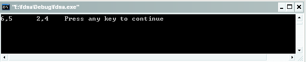
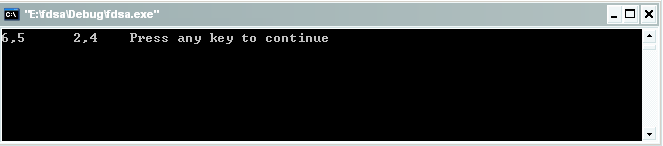
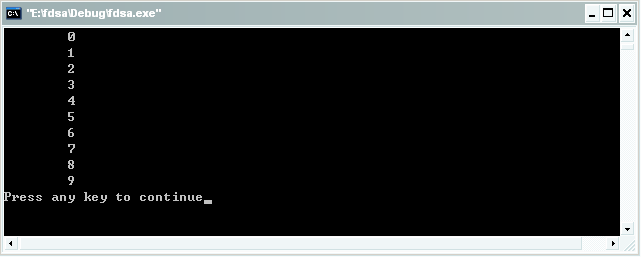

#函数指针

我们经常会听到这样的说法，不懂得函数指针就不是真正的C语言高手。我们不管这句话对与否，但是它都从侧面反应出了函数指针的重要性，所以我们还是有必要掌握对函数指针的使用。先来看看函数指针的定义吧。

函数是由执行语句组成的指令序列或者代码，这些代码的有序集合根据其大小被分配到一定的内存空间中，这一片内存空间的起始地址就成为函数的地址，不同的函数有不同的函数地址，编译器通过函数名来索引函数的入口地址，为了方便操作类型属性相同的函数，c/c++引入了函数指针，函数指针就是指向代码入口地址的指针，是指向函数的指针变量。 因而“函数指针”本身首先应该是指针变量，只不过该指针变量指向函数。这正如用指针变量可指向整形变量、字符型、数组一样，这里是指向函数。C在编译时，每一个函数都有一个入口地址，该入口地址就是函数指针所指向的地址。有了指向函数的指针变量后，可用该指针变量调用函数，就如同用指针变量可引用其他类型变量一样，在这些概念上是一致的。函数指针有两个用途：调用函数和做函数的参数。

函数指针的声明方法为：

```
数据类型标志符 (指针变量名) (形参列表);
```

“函数类型”说明函数的返回类型，由于“()”的优先级高于“*”,所以指针变量名外的括号必不可少，后面的“形参列表”表示指针变量指向的函数所带的参数列表。例如：

```c
int function(int x，int y); /* 声明一个函数 */

int (*f) (int x，int y); /* 声明一个函数指针 */

f=function; /* 将function函数的首地址赋给指针f */
```

赋值时函数function不带括号，也不带参数，由于function代表函数的首地址，因此经过赋值以后，指针f就指向函数function(int x，int y);的代码的首地址。

下面的程序说明了函数指针调用函数的方法：

例一、

```c
#include<stdio.h> 

int max ( int x, int y){ return x>y?x:y;}
int min ( int x, int y){ return x<y?x:y;}

void main ()
{
    int ( *f ) ( int x, int y)=max;  
    //f=&max; 
    printf ( "%d,%d\t", max (2,6), (f)(5,4));
    f=min;                   
    printf (" %d,%d\t" , min (2,6), (f)(5,4)); 
}
```

注意：以上代码的红色部分我们将会在接下来的代码分析部分进行讲解，读者也可以思考下如果运行注释部分，结果是否还是正确的呢？

f是指向函数的指针变量，所以可把函数max()赋给f作为f的值，即把max()的入口地址赋给f,以后就可以用f来调用该函数，实际上f和max都指向同一个入口地址，不同就是f是一个指针变量，不像函数名称那样是死的，它可以指向任何函数，就看你想怎么做了。在程序中把哪个函数的地址赋给它，它就指向哪个函数。而后用指针变量调用它，因此可以先后指向不同的函数。**不过注意，指向函数的指针变量没有++和--运算，用时要小心**。

函数括号中的形参可有可无，视情况而定,不过，在某些编译器中这是不能通过的。这个例子的补充如下。

1. 定义函数指针类型：

    ```c
    typedef int (*fun_ptr)(int,int);
    ```

2. 申明变量，赋值：

    ```c
    fun_ptr max_func=max;
    ```

也就是说，赋给函数指针的函数应该和函数指针所指的函数原型是一致的。

例二、

```c
#include<stdio.h>

void FileFunc()
{
    printf("FileFunc\n");
}

void EditFunc()
{
    printf("EditFunc\n");
}

void main()
{
    typedef void (*funcp)();
    funcp pfun= FileFunc;
    pfun();
    pfun = EditFunc;
    pfun();　
}
```

看了上面两段代码，应该都知道如何用函数指针来调用函数了，但是我们刚刚在上面的描述中留下过一个问题，就是运行注释部分f=&max;结果是否还是正确的呢？下面我就给出上面两个运行结果的对别，然后来分析下原因。

有注释前的运行结果为： 




把注释部分加进去的运行结果为：



对比以上的运行结果可以看出，f=&max语句被执行时的结果和没有被执行时的结果是一样的。为什么会出现这样的结果呢？答案是这是编译器处理的，max本身就是个地址，它没有放到任何变量里，自然没有取它的地址一说。所以我们可以看看在调试的过程中&max的值和max的值是一样的。调试代码如下：

```
root@ubuntu:/home/shiyan# gdb ss
GNU gdb (Ubuntu/Linaro 7.2-1ubuntu11) 7.2
Copyright (C) 2010 Free Software Foundation, Inc.
License GPLv3+: GNU GPL version 3 or later <http://gnu.org/licenses/gpl.html>
This is free software: you are free to change and redistribute it.
There is NO WARRANTY, to the extent permitted by law.  Type "show copying"
and "show warranty" for details.
This GDB was configured as "i686-linux-gnu".
For bug reporting instructions, please see:
<http://www.gnu.org/software/gdb/bugs/>...
Reading symbols from /home/shiyan/ss...done.
(gdb) list
1  #include<stdio.h> 
2  int max ( int x, int y){ return x>y?x:y;}
3  int min ( int x, int y){ return x<y?x:y;}
4  void main ()
5  { int ( *f ) ( int x, int y)=max;  
6  //f=&max;
7  printf ( "%d,%d\t", max (2,6), (f)(5,4));
8  f=min;                   
9  printf (" %d,%d\t" , min (2,6), (f)(5,4)); 
10 }   
(gdb) b 4
Breakpoint 1 at 0x80483ec: file hanshu.c, line 4.
(gdb) r
Starting program: /home/shiyan/ss

Breakpoint 1, main () at hanshu.c:5
5  { int ( *f ) ( int x, int y)=max;  
(gdb) print max
$1 = {int (int, int)} 0x80483c4 <max>
(gdb) print f
$2 = (int (*)(int, int)) 0xbffff6c8
(gdb) s
7  printf ( "%d,%d\t", max (2,6), (f)(5,4));
(gdb) 
max (x=5, y=4) at hanshu.c:2
2  int max ( int x, int y){ return x>y?x:y;}
(gdb) print max
$3 = {int (int, int)} 0x80483c4 <max>
(gdb) print &max
$4 = (int (*)(int, int)) 0x80483c4 <max>
(gdb) print *max
$5 = {int (int, int)} 0x80483c4 <max>
(gdb) s
max (x=2, y=6) at hanshu.c:2
2  int max ( int x, int y){ return x>y?x:y;}
(gdb) s
main () at hanshu.c:8
8  f=min;                   
(gdb) print min
$6 = {int (int, int)} 0x80483d3 <min>
(gdb) print &min
$7 = (int (*)(int, int)) 0x80483d3 <min>
(gdb) print *min
$8 = {int (int, int)} 0x80483d3 <min>
(gdb) s
9  printf (" %d,%d\t" , min (2,6), (f)(5,4)); 
(gdb) print f
$9 = (int (*)(int, int)) 0x80483d3 <min>
(gdb) print &f
$10 = (int (**)(int, int)) 0xbffff6ac
(gdb) print *f
$11 = {int (int, int)} 0x80483d3 <min>
(gdb) s
min (x=5, y=4) at hanshu.c:3
3  int min ( int x, int y){ return x<y?x:y;}
(gdb) s
min (x=2, y=6) at hanshu.c:3
3  int min ( int x, int y){ return x<y?x:y;}
(gdb) print min
$12 = {int (int, int)} 0x80483d3 <min>
(gdb) s
main () at hanshu.c:10
10 }
```

在调试的过程中我print了很多的信息，细心的读者肯定能获得更多的收获，尤其是对变量f的print，读者可以自己阅读，学到更多的东西。我给出的只是一个参考的调试方式，希望读者能够举一反三，自己对代码进行实际的调试，加深理解。

上面说的都是用指针来实现函数的调用，接下来我们看一个用函数指针作为参数的用法。

```c
#include <iostream>
using namespace std;
typedef int (*print)(int );
int fun1(int i)
{  
    return (int)i;  
}  
   
void fun2(int j,print prt)
{  
    for(int k=0;k<j;k++)
        cout<<'\t'<<prt(k)<<'\n'; 
}  
   
void main() 
{  
    int   i=10;  
    fun2(i,fun1);  
} 
```

运行结果如下：



看了上面的描述，我想都对函数指针的概念有了大致的了解，另外一个希望大家不要混淆的概念就是指针函数，,这两个概念都是简称，指针函数是指带指针的函数，即本质是一个函数。我们知道函数都又有返回类型（如果不返回值，则为无值型，即为void），只不过指针函数返回类型是某一类型的指针。

其定义格式如下所示：

```
返回类型标识符 *返回名称（形式参数表）
{ 函数体}
```

返回类型可以是任何基本类型和复合类型。返回指针的函数的用途十分广泛。事实上，每一个函数，即使它不带有返回某种类型的指针，它本身都有一个入口地址，该地址相当于一个指针。比如函数返回一个整型值，实际上也相当于返回一个指针变量的值，不过这时的变量是函数本身而已，而整个函数相当于一个“变量”，关于函数的返回值问题我将在下一章来讲解，本章到此为止。希望以上内容对你有所帮助！

## 引用

- [0] [原文](http://blog.csdn.net/bigloomy/article/details/6584858)