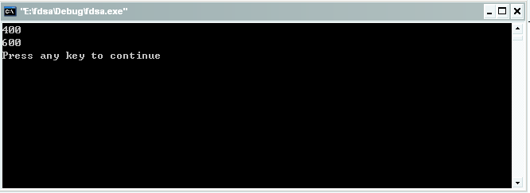
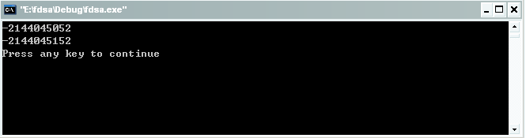
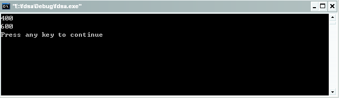
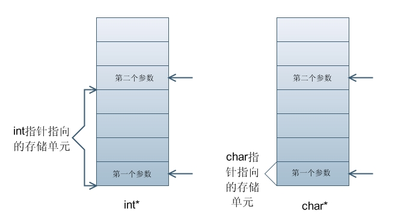
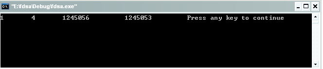
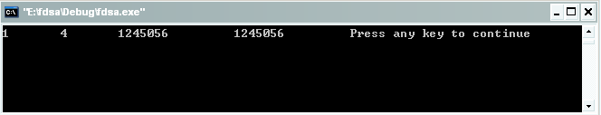
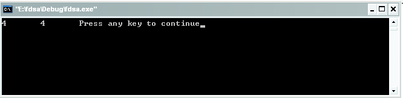

#变参函数的实现

在学习C语言的过程中我们可能很少会去写变参函数，印象中大学老师好像也没有提及过，但我发现变参函数的实现很巧妙，所以还是特地在此分析下变参函数的实现原理。无需标准C的支持，我们自己写代码来实现。

先来看看一个实现代码：

```c
#include <stdio.h>

#define va_list void*
#define va_arg(arg, type)    *(type*)arg; arg = (char*)arg + sizeof(type);
#define va_start(arg, start) arg = (va_list)(((char*)&(start)) + sizeof(start))

int sum(int nr, ...)
{
    int i = 0;
    int result = 0;
    va_list arg = NULL;
    va_start(arg, nr);

    for(i = 0; i < nr; i++)
    {
        result += va_arg(arg, int);
    }
    return result;
}

int main(int argc, char* argv[])
{
    printf("%d\n", sum(4, 100,100,100,100));
    printf("%d\n", sum(3, 200, 200, 200));

    return 0;
}
```

运行结果如下：



\#define va_list void*通过这句代码我们实现了定义va_list是一个指针，参数类型不定，它可以指向任意类型的指针。为了让arg指向第一个可变参数，我们用nr的地址加上nr的数据类型大小就行了，采用如下的定义可以实现。

```c
#define va_start(arg, start) arg = (va_list)(((char*)&(start)) + sizeof(start)) 。
```

通过(((char*)&(start)) + sizeof(start)) 可以得到第一个可变参数的地址，再将其强制转换为va_list类型。

成功取出了第一个可变参数后，接下来的任务就是继续取出可变参数，方法跟上面求第一个可变参数的方法一样，通过arg = (char*)arg + sizeof(type);来实现让arg指向下一个可变参数，type为可变参数的类型，通过这种方法可以一一取出可变参数。

在这里顺便给出上面实现代码的汇编代码，有兴趣的可以读读，加深下对于底层汇编代码的阅读能力。

```
 .file "varargs.c"
 .text
.globl sum
 .type sum, @function
sum:
 pushl %ebp
 movl %esp, %ebp
 subl $16, %esp
 movl $0, -4(%ebp)
 movl $0, -8(%ebp)
 movl $0, -12(%ebp)
 leal 12(%ebp), %eax
 movl %eax, -12(%ebp)
 movl $0, -4(%ebp)
 jmp .L2
.L3:
 movl -12(%ebp), %eax
 movl (%eax), %eax
 addl %eax, -8(%ebp)
 addl $4, -12(%ebp)
 addl $1, -4(%ebp)
.L2:
 movl 8(%ebp), %eax
 cmpl %eax, -4(%ebp)
 jl .L3
 movl -8(%ebp), %eax
 leave
 ret
 .size sum, .-sum
 .section .rodata
.LC0:
 .string "%d\n"
 .text
.globl main
 .type main, @function
main:
 pushl %ebp
 movl %esp, %ebp
 andl $-16, %esp
 subl $32, %esp
 movl $100, 16(%esp)
 movl $100, 12(%esp)
 movl $100, 8(%esp)
 movl $100, 4(%esp)
 movl $4, (%esp)
 call sum
 movl $.LC0, %edx
 movl %eax, 4(%esp)
 movl %edx, (%esp)
 call printf
 movl $200, 12(%esp)
 movl $200, 8(%esp)
 movl $200, 4(%esp)
 movl $3, (%esp)
 call sum
 movl $.LC0, %edx
 movl %eax, 4(%esp)
 movl %edx, (%esp)
 call printf
 movl $0, %eax
 leave
 ret
 .size main, .-main
 .ident "GCC: (Ubuntu/Linaro 4.5.2-8ubuntu4) 4.5.2"
 .section .note.GNU-stack,"",@progbits
```

其中有几条指令在此讲解下。

leave指令所做的操作相当于如下两条指令：

```
movl %ebp, %esp  

popl  %ebp
```

ret指令所做的操作相当于如下指令：

```
pop %eip
```

如果有对AT&T汇编语法规则不懂的，可以看看我前面写的那篇文章。

到这儿为止是乎应该是说结束的时候了，但是细心的读者可能发现了一个问题，就是我们在最初给出的代码部分有一句红色标记的代码，如下：

```
#define va_start(arg, start) arg = (va_list)(((char*)&(start)) + sizeof(start))
```

为什么要把这句代码单独拿出来讲解呢，肯定是有原因的，因为((char*)&(start)) +sizeof(start)这句代码的特殊性在于使用了(char*)进行强制转换，在这里为什么不使用(int*)进行强制转换呢，如改为如下代码：

```c
#include <stdio.h> 
#include <stdlib.h>

#define va_list void*
#define va_arg(arg, type)    *(type*)arg; arg = (char*)arg + sizeof(type);
#define va_start(arg, start) arg = (va_list)(((int*)&(start)) + sizeof(start))    //修改为(int*)

int sum(int nr, ...)
{
    int i = 0;
    int result = 0;
    va_list arg = NULL;
    va_start(arg, nr);

    for(i = 0; i < nr; i++)
    {
        result += va_arg(arg, int);
    }
    return result;
}

int main(int argc, char* argv[])
{
    printf("%d\n", sum(4, 100,100,100,100));
    printf("%d\n", sum(3, 200, 200, 200)); 
    return 0;
}
```

运行结果为：



显然运行结果是错误的，为什么会出现这样的错误呢，我们暂且不分析，先来看看我们接下来做的修改：

```c
#include <stdio.h> 
#include <stdlib.h>

#define va_list void*
#define va_arg(arg, type)    *(type*)arg; arg = (char*)arg + sizeof(type);
#define va_start(arg, start) arg = (va_list)(((int*)&(start)) + sizeof(start)/4)    //注意对比红色部分的变化

int sum(int nr, ...)
{
    int i = 0;
    int result = 0;
    va_list arg = NULL;
    va_start(arg, nr);

    for(i = 0; i < nr; i++)
    {
        result += va_arg(arg, int);
    }
    return result;
}

int main(int argc, char* argv[])
{
    printf("%d\n", sum(4, 100,100,100,100));
    printf("%d\n", sum(3, 200, 200, 200)); 
    return 0;
}
```

运行结果如下：



运行结果正确。

现在来分析下为什么会出现这两种结果呢，看看下面我给出的这个图解和代码应该就能够很清楚的理解为什么会出现以上的两种运行结果了。



代码如下：

```c
#include <stdio.h>

int main()
{
    int a = 12;
    int  *p_int  = &a;
    char *p_char = (char*)&a;        
    printf( "%d \t", sizeof(char));
    printf( "%d \t", sizeof(int));
    printf( "%d \t", p_int+1);
    printf( "%d \t", p_char+1);
    return 0;
}
```

运行结果为：



修改以上红色部分的代码，得到如下代码：

```c
#include <stdio.h>

int main()
{
    int a = 12;
    int  *p_int  = &a;
    char *p_char = (char*)&a;        
    printf( "%d \t", sizeof(char));
    printf( "%d \t", sizeof(int));
    printf( "%d \t", p_int+1);
    printf( "%d \t", p_char+4);
    return 0;
}
```

注意对比前后代码的变化部分！！！

运行结果如下：



首先看看给出的图，int指针所指向的单元占有四个字节的空间，而char指针所指向的单元只占有一个字节的空间。所以如果是整形指针想要取下一个参数，只需加1，但是如果是char指针，如果当前参数是int型，那么想要取下一个参数就要加4才能实现。但是值得注意的是，int*和char*所占的存储单元都是4个字节，这是由我们所使用的32位计算机本身确定的。为了加深大家的印象，特地给出如下代码：

```c
#include <stdio.h>

int main()
{
    int a = 12;
    int  *p_int  = &a;
    char *p_char = (char*)&a;        
    printf( "%d \t", sizeof(char*));
    printf( "%d \t", sizeof(int*));
    return 0;
}
```

运行结果如下：



到此为止就是真的该结束了，总不能没完没了的讲下去吧，呵呵……

很多代码仅仅是修改了一点，我都贴出了完整的代码，是希望你在阅读的过程中能直接copy过去，看看运行效果，加深下印象。还是那句话，C语言博大精深，我还是C语言菜鸟，以上内容难免有错。如需转载，请注明出处！

## 引用

- [0] [原文](http://blog.csdn.net/bigloomy/article/details/6588354)