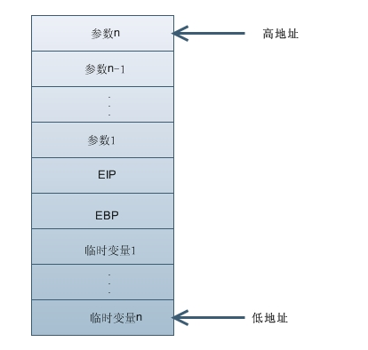
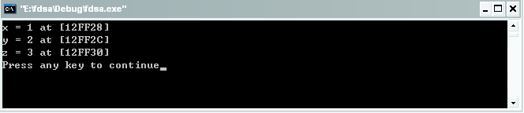

#函数的调用关系

显示函数的调用关系是调试器的必备功能，如果我们在程序的运行中出现了崩溃的情况，通过函数的调用关系可以快速定位问题的根源，懂得函数调用关系的实现原理也可以扩充自己的知识面，在没有调试器的情况下，我们也可以自己来实现显示函数的调用关系。在我们自己动手写backtrace函数之前，先来看看glibc提供的backtrace函数的使用。代码如下：

```c
#include <stdio.h> 
#include <stdlib.h>
#include <execinfo.h>

#define MAX_LEVEL 4

static void call2()
{
    int i = 0;
    void* buffer[MAX_LEVEL] = {0};
    
    int size=backtrace(buffer, MAX_LEVEL);
    
    for(i = 0; i < size; i++)
    {
        printf("called by %p\n", buffer[i]);
    }
    
    return;
}

static void call1()
{
    call2();

    return;
}

static void call()
{
    call1();

    return;
}

int main(int argc, char* argv[])
{
    call();

    return 0;
}
```

在此先讲解下backtrace()函数的使用：

```c
int backtrace(void **buffer,int size)
```

该函数用来获取当前线程的调用堆栈,获取的信息将会被存放在buffer中,它是一个指针列表。参数 size 用来指定buffer中可以保存多少个void* 元素。函数返回值是实际获取的指针个数,最大不超过size大小，在buffer中的指针实际是从堆栈中获取的返回地址,每一个堆栈框架有一个返回地址。

接下来的任务就是编译运行了。

```
root@ubuntu:/home/shiyan# gcc -g -Wall sss.c -o p
root@ubuntu:/home/shiyan# ./p
```

输出结果为：

```
called by 0x8048440
called by 0x804847d
called by 0x804848a
called by 0x8048497
```

上面的运行结果就是调用者的地址，看起来还不是那么的直观，我们使用addr2line工具来实现地址到源代码位置的转换。

运行

```
root@ubuntu:/home/shiyan# ./p |awk '{print "addr2line "$3" -e p"}'>t.sh;. t.sh;rm -f t.sh
```

输出结果为：

```
/home/shiyan/sss.c:12
/home/shiyan/sss.c:27
/home/shiyan/sss.c:34
/home/shiyan/sss.c:40
```

接下来看看在栈中数据的结构。



函数参数的压栈是从右向左的，即先压最后一个参数，在压倒数第二个，以此类推，最后才压入第一个参数。为了加深大家的印象，下面我给出一个测试代码：

```c
#include <stdio.h>

void turn(int x, int y, int z)
{
   printf("x = %d at [%X]\n", x, &x);
   printf("y = %d at [%X]\n", y, &y);
   printf("z = %d at [%X]\n", z, &z);
}

int main(int argc, char *argv[])
{
   turn(1, 2, 3);
   return 0;
}
```

运行结果为：



比较打印出来的地址可以看出参数z的地址是最大的，x的地址最小。

参数的压栈工作完成之后，接下来就依次是EIP、EBP、临时变量的压栈操作了。最后压入的是被调用函数本身，并为它分配临时的变量空间，而对于不同版本的gcc的处理方式各有不同，老版本的gcc第一个临时变量放在最高的地址，第二个其次，依次顺序分布，新版本的gcc则与之相反。

实现backtrace()函数的调用关系，其步骤如下：

1. 获取当前函数的EBP；

2. 通过EBP获得调用者得EIP；

3. 通过EBP获得上一级的EBP；

4. 重复这个过程，知道结束。

自己实现的backtrace()函数，代码如下：

```c
#include <stdio.h>

#define MAX_LEVEL 4

#define OFFSET 4

int backtrace(void** buffer, int size)
{
    int  n = 0x23f;
    int* p = &n;
    int  i = 0;
    
    int ebp = p[1 + OFFSET];
    int eip = p[2 + OFFSET];
    
    for(i = 0; i < size; i++)
    {
        buffer[i] = (void*)eip;
        p = (int*)ebp;
        ebp = p[0];
        eip = p[1];
    }
    
    return size;
}

static void call2()
{
    int i = 0;
    void* buffer[MAX_LEVEL] = {0};
    
    int size=backtrace(buffer, MAX_LEVEL);
    
    for(i = 0; i < size; i++)
    {
        printf("called by %p\n", buffer[i]);
    }
    
    return;
}

static void call1()
{
    call2();
    
    return;
}

static void call()
{
    call1();
    
    return;
}

int main(int argc, char* argv[])
{
    call();
    
    return 0;
}
```

运行结果如下：

```
root@ubuntu:/home/shiyan# gcc -g bac.c -o tt
root@ubuntu:/home/shiyan# ./tt
called by 0x8048491
called by 0x80484ce
called by 0x80484db
called by 0x80484e8
```

转换为源代码位置：

```
root@ubuntu:/home/shiyan# ./tt |awk '{print "addr2line "$3" -e tt"}'>t.sh;. t.sh;rm -f t.sh
```

```
root@ubuntu:/home/shiyan# ./tt |awk '{print "addr2line "$3" -e tt"}'>t.sh;. t.sh;rm -f t.sh
/home/shiyan/bac.c:32
/home/shiyan/bac.c:47
/home/shiyan/bac.c:54
/home/shiyan/bac.c:60
```

在此重点介绍下backtrace()函数的实现原理。

通过 int* p = &n;来获取第一个临时变量的位置，因为我使用的是新版本的gcc，有5个临时变量，所以EIP的值存放在p[6]中，EBP的的值存放在p[5]，通过  buffer[i] = (void*)eip;可以把eip的强制转换为可以指向任意类型的指针， 接下来通过 p = (int*)ebp;来获得上一个函数的ebp，获得ebp之后由ebp和eip的位置关系可以得到eip，由于ebp指向的单元存储的是上一个函数的ebp，所以用一个简单的for循环就能实现了。

另外在头文件"execinfo.h"中除了声明backtrace()函数外，还有如下两个函数也用于获取当前线程的函数调用堆栈。

```c
char ** backtrace_symbols (void *const *buffer, int size)
```

backtrace_symbols将从backtrace函数获取的信息转化为一个字符串数组. 参数buffer应该是从backtrace函数获取的数组指针,size是该数组中的元素个数(backtrace的返回值)   

函数返回值是一个指向字符串数组的指针,它的大小同buffer相同.每个字符串包含了一个相对于buffer中对应元素的可打印信息.它包括函数名，函数的偏移地址,和实际的返回地址

现在,只有使用ELF二进制格式的程序和苦衷才能获取函数名称和偏移地址.在其他系统,只有16进制的返回地址能被获取.另外,你可能需要传递相应的标志给链接器,以能支持函数名功能(比如,在使用GNU ld的系统中,你需要传递(-rdynamic))，该函数的返回值是通过malloc函数申请的空间,因此调用这必须使用free函数来释放指针。

注意:如果不能为字符串获取足够的空间函数的返回值将会为NULL。

Function:

```
void backtrace_symbols_fd (void *const *buffer, int size, int fd)
```

backtrace_symbols_fd与backtrace_symbols 函数具有相同的功能,不同的是它不会给调用者返回字符串数组,而是将结果写入文件描述符为fd的文件中,每个函数对应一行.它不需要调用malloc函数,因此适用于有可能调用该函数会失败的情况。
还是那句话，以上内容难免有误，如有错误，请纠正。

## 引用

- [0] [原文](http://blog.csdn.net/bigloomy/article/details/6592167)