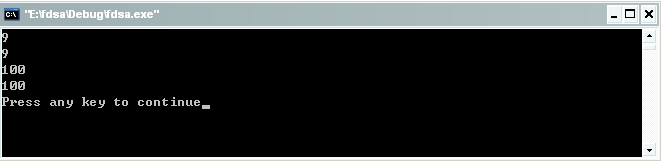
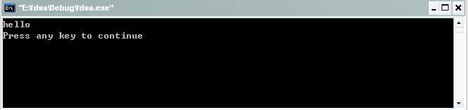

#const修饰符

或许还有不少人对于const修饰符理解的并不深刻，都只是停留在一个比较浅的层面上，仅仅是在读别人代码的时候看到了const修饰符的使用，自己的写代码的过中从未使用过，所以自然对于const修饰符比较陌生。那么到底什么是const修饰符，我们在自己编写C语言代码的过程中又该如何有效的使用const修饰符呢，现在让我们来学习下const修饰符的使用。

const在C语言中算是一个比较新的描述符，我们称之为常量修饰符，即就是说其所修饰的对象为常量。当你代码中想要设法阻止一个变量被改变，那么这个时候可以选择使用const关键字。在你给一个变量加上const修饰符的同时，通常需要对它进行初始化，在之后的程序中就不能再去改变它。

可能有的人会有一个疑问，我们不是有在C中有预处理指令#define VariableName VariableValue 可以很方便地进行值替代，干嘛还要引入const修饰符呢？！这是因为预处理语句虽然可以很方便的进行值得替代，但它有个比较致命的缺点，即预处理语句仅仅只是简单值替代，缺乏类型的检测机制。这样预处理语句就不能享受C编译器严格类型检查的好处，正是由于这样，使得它的使用存在着一系列的隐患和局限性。

在讲解const修饰符之前，我们在此首先给出const修饰符的几个典型作用：

1. const类型定义：指明变量或对象的值是不能被更新,引入目的是为了取代预编译指令

2. 可以保护被修饰的东西，防止意外的修改，增强程序的健壮性；

3. 编译器通常不为普通const常量分配存储空间，而是将它们保存在符号表中，这使得它成为一个编译期间的常量，没有了存储与读内存的操作，使得它的效率也很高。

4. 可以节省空间，避免不必要的内存分配。

接下来看看具体的使用。

## 一、const修饰符在函数体内修饰局部变量。

```c
const int n=5；
```

和

```c
int const n=5；
```

是等价的。我们在编程的过程中一定要清楚的知道const修饰的对象是谁，在这里修饰的是n，和int没有关系。const 要求他所修饰的对象为常量，不能被改变，同时也不能够被赋值，所以下面这样的写法是错误的。

```c
const int n;
n=0;
```

对于上面的情况是比较容易理解的，但是当const与指针一起使用时，就容易让人感到迷惑。例如，下面我们来看看一个p和q的声明：

```c
const int *p;
int const *q;
```

看了上面的代码可能有人会觉得 const int *p;表示的是const int类型的指针（const直接修饰int），而 int const *q;表示的是int类型的const指针（const直接修饰指针）。实际上，在上面的声明中p和q都被声明为const int类型的指针。而int类型的const指针应该这样声明：

```c
int * const r= &n;
```

以上的p和q都是指向const int类型的指针，也就是说，你在以后的程序里不能改变*p的值。而r是一个const指针，它在声明的时候被初始化指向变量n（即r=&n；）之后，r的值将不再允许被改变，但*r的值可以改变。在此对于判断const的修饰对象给出一种常使用的方法，我们以*为界线，如果const位于*的左侧，则const就是用来修饰指针所指向的变量，即指针指向为常量；如果const位于*的右侧，const就是修饰指针本身，即指针本身是常量。

还是给个代码来加深下大家的印象吧。

```c
#include <stdio.h>

int main(int argc, char* argv[])
{
    int ss=9;
    int * const r= &ss;
    printf("%d\n",*r);
    printf("%d\n",ss);
    *r=100;
    printf("%d\n",*r);
    printf("%d\n",ss);

    return 0;
}
```

运行结果如下：



简单的来分析下吧，因为r指向的是ss的地址，所以修改r指向的地址单元的值的同时ss的值也随之变化。

结合上述两种const修饰的情况，我们现在应该可以完成如何声明一个指向const int类型的const指针，如下：

```c
const int * const r=&ss;
```

这个时候我们既不能修改*r的值也不能修改r的值。

接下来看看const用于修饰常量静态字符串，例如：例如：

```c
const char* str="fdsafdsa";
```

如果没有const的修饰，我们可能会在后面有意无意的写str[4]='x'这样的语句，这样会导致对只读内存区域的赋值，然后程序会立刻异常终止。有了const，这个错误就能在程序被编译的时候就立即检查出来，这就是const的好处。让逻辑错误在编译期被发现。

## 二、const在函数声明时修饰参数

```c
void *memmove( void* dest, const void* src, size_t count ); 
```

这是标准库中的一个函数，在头文件#include <string.h>中声明，其功能为由src所指内存区域复制count个字节到dest所指内存区域。用于按字节方式复制字符串（内存）。它的第一个参数，是将字符串复制到哪里去(dst),是目的地，这段内存区域必须是可写。它的第二个参数，是要将什么样的字符串复制出去，我们对这段内存区域只做读取，不写。于是，我们站在这个函数自己的角度来看，src 这个指针，它所指向的内存内所存储的数据在整个函数执行的过程中是不变。于是src所指向的内容是常量。于是就需要用const修饰。另外需要强调的一点就是src和dest所指内存区域可以重叠，但复制后dest内容会被更改。函数返回指向dest的指针。

例如，我们这里这样使用它。

```c
#include <stdio.h> 
#include <string.h>

int main(int argc, char* argv[])
{
    const char* str="hello";
    char buf[10];
    memmove(buf,str,6); 
    printf("%s\n",buf);

    return 0;
}
```

运行结果如下：



如果我们反过来写，memmove(str,buf,6);那么编译器一定会报错。事实是我们经常会把各种函数的参数顺序写反。事实是编译器在此时帮了我们大忙。如果编译器静悄悄的不报错，即在函数声明void *memmove( void* dest, const void* src, size_t count ); 处去掉const即可，那么这个程序在运行的时候一定会崩溃。这里还要说明的一点是在函数参数声明中const一般用来声明指针而不是变量本身。例如，上面的size_t len,在函数实现的时候可以完全不用更改len的值，那么是否应该把len也声明为常量呢？可以，可以这么做。我们来分析这么做有什么优劣。如果加了const,那么对于这个函数的实现者，可以防止他在实现这个函数的时候修改不需要修改的值(len),这样很好。但是对于这个函数的使用者，

1. 饰符号毫无意义，我们可以传递一个常量整数或者一个非常量整数过去，反正对方获得的只是我们传递的一个copy。

2. 实现。我不需要知道你在实现这个函数的时候是否修改过len的值。

所以，const一般只用来修饰指针。再看一个复杂的例子

```c
int execv(const char *path, char *const argv[]);
```

着重看后面这个，argv.它代表什么。如果去掉const,我们可以看出char * argv[]，argv是一个数组，它的每个元素都是char *类型的指针。如果加上const.那么const修饰的是谁呢？修饰的是一个数组，argv[]意思就是说这个数组的元素是只读的。那么数组的元素的是什么类型呢？是char *类型的指针.也就是说指针是常量，而它指向的数据不是。于是

```c
argv[1]=NULL; //非法
argv[0][0]='a'; //合法
```

## 三、const作为全局变量

在程序中，我们要尽可能少的使用全局变量。因为其作用域是全局，所以程序范围内都可以修改它的值，从而导致了全局变量不能保证值的正确性，如果出现错误非常难以发现。如果在多线程中使用全局变量，你的程序将会错的一塌糊涂。多线程会修改另一个线程使用的全局变量的值，如果不注意，一旦出错后果不堪设想。所以在这种情况下万不得意不要使用全局变量。我们要尽可能多的使用const。如果一个全局变量只在本文件中使用，那么用法和前面所说的函数局部变量没有什么区别。如果它要在多个文件间共享，那么就牵扯到一个存储类型的问题。

有两种方式。

1. 用extern

    例如

    ```c
    /* pi.h */
    extern const double pi;
    /* pi.c */
    const double pi=3.14;
    ```

    然后其他需要使用pi这个变量的，包含pi.h
    
    ```c
    #include pi.h
    ```

    或者，自己把那句声明复制一遍就好。这样做的结果是，整个程序链接完后，所有需要使用pi这个变量的共享一个存储区域。

2. 使用static,静态外部存储类

    ```c
    /* constant.h */
    static const double pi=3.14;
    ```

    需要使用这个变量的*.c文件中，必须包含这个头文件。前面的static一定不能少。否则链接的时候会报告说该变量被多次定义。这样做的结果是，每个包含了constant.h的*.c文件，都有一份该变量自己的copy,该变量实际上还是被定义了多次，占用了多个存储空间，不过在加了static关键字后，解决了文件间重定义的冲突。坏处是浪费了存储空间，导致链接完后的可执行文件变大。通常来说，对于存储空间字节的变化不是太大的情况下，不是问题。好处是，你不用关心这个变量是在哪个文件中被初始化的。

下面再来看看一段代码：

```c
#include <stdio.h>

int main()
{
    const int a=12;
    const int *p=&a;           // 这个是指向常量的指针，指针指向一个常量
    p++;                               //可以指针可以自加、自减
    p--;                                  //合法

    int const *q=&a;           // 这个和上面const int *p=&a;是一个意思 
    int b=12;
    
    
    int * const r=&b;           //这个就是常量指针(常指针)，不能自加、自减,并且要初始化
    //r++;                               //编译出错 

    const int * const t=&b; //这个就是指向常量的常指针,并且要初始化，用变量初始化

    //t++;                                //编译出错
    p=&b;                              //const指针可以指向const和非const对象 
    q=&b;                              //合法
    
    return 0;
}
```

为了便于代码的阅读理解，在此就直接在代码后面加注释，就不在这儿做过多的讲解了。

综上所述，const 的好处，是引入了常量的概念，让我们不要去修改不该修改的内存。直接的作用就是让更多的逻辑错误在编译期被发现。所以我们要尽可能的多使用const。以上内容难免有错，如果错误，请纠正！如需转载，请注明出处！

## 引用

- [0] [原文](http://blog.csdn.net/bigloomy/article/details/6595197)