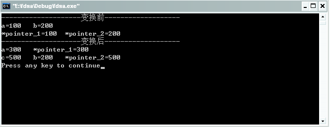
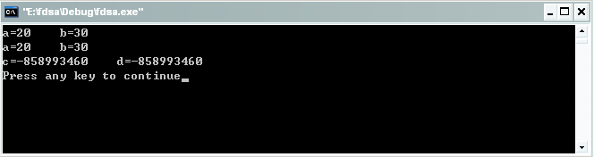
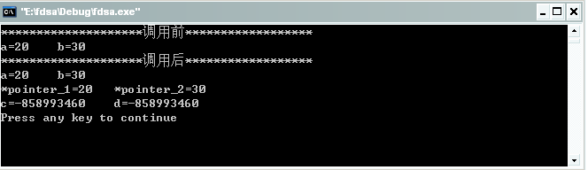
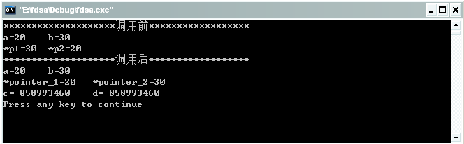
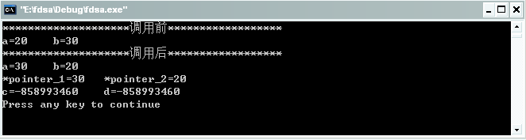

#指针（一）

懂得C语言的人都知道，C语言之所以强大，以及其自由性，绝大部分体现在其灵活的指针运用上。因此，说指针是c语言的灵魂，一点都不为过。所以从我的标题加了个（一）也可以看出指针的重要性，我尽可能的向大家交代清楚我对于指针的理解。所以在讲解的过程中我尽可能的用代码加文字的描述方式，通过代码的分析来加深我们对于指针的理解，我给出的都是完整的代码，所以读者可以在看的过程中直接copy下去即可运行，希望下面的讲解能够对你有所帮助。

首先让我们来看看定义一个指针的一般形式为：

```
基类型   *指针变量名
```

看了上面的指针的定义形式，我们可能对于有些地方会有疑惑，如为什么要指定基类型呢？因为我们都知道整型和字符型在内存中占的字节数是不相同的，当我们进行指针的移动和指针的运算时，如果指针指向的是一个整型变量，那么指针移动一个位置就是移动4个字节，但是如果指针指向的是一个字符型的变量，那么指针移动的就是一个字节，因此我们必须规定指针变量所指向的基类型。

为了不枯燥的讲解我们来看看下面的代码吧。（注意：本博客的所有代码均使用vc6编译运行，所以可能有的规则跟C语言的稍有区别）

```c
#include <stdio.h>

int main()
{
    int a,b;
    int *pointer_1,*pointer_2;
    a=100;
    b=200;
    pointer_1=&a;
    pointer_2=&b;
    printf("--------------------变换前-------------------\n");
    printf("a=%d\tb=%d\n",a,b);
    printf("*pointer_1=%d\t*pointer_2=%d\n",*pointer_1,*pointer_2);
    *pointer_1=300;
    int c=500;
    pointer_2=&c;
    printf("--------------------变换后-------------------\n");
    printf("a=%d\t*pointer_1=%d\n",a,*pointer_1);
    printf("c=%d\tb=%d\t*pointer_2=%d\n",c,b,*pointer_2);
}
```

运行结果如下：



在此我们定义了两个整型指针int \*pointer_1,\*pointer_2;，它们分别指向变量a和b，值得注意的是\*pointer_1和a、\*pointer_2和b是共用同一个存储空间的，当我们在接下类的代码中改变 \*pointer_1=300;时，由输出就可以看出来a的值也跟随发生了改变。但是当我们声明了一个 int c=500;之后，使用pointer_2=&c;，b的值不变，仅仅是改变\*pointer_2，因为我仅仅是改变了\*pointer_2指向了c的存储空间，如果有有兴趣的读者可以自己验证下如果我们修改了a的值之后\*pointer_1的值会跟随一起改变，因为他们指向的是同一个存储空间。

接下来看看如何在函数的参数中来使用指针。

```c
#include <stdio.h>

swap(int p1,int p2)
{
    int temp;
    temp=p1;
    p1=p2;
    p2=temp;
}

int main()
{
    int a,b;
    int *pointer_1,*pointer_2;
    int c,d;
    c=a;
    d=b;
    pointer_1=&a;
    pointer_2=&b;
    a=20;
    b=30;
    swap(a,b);
    printf("a=%d\tb=%d\n",a,b);
    printf("a=%d\tb=%d\n",*pointer_1,*pointer_2);
    printf("c=%d\td=%d\n",c,d);
}
```

初步分析上面的代码，看似是要通过一个函数的调用来实现一个a、b的交换，还有就是通过c=a;、d=b;来实现对c、d赋初值。先来看看下面的运行结果：



结果跟我们想象的不一样，a、b没有实现交换的原因是因为我们使用的是传值，而不是传址，所以调用的过程中做的处理就是把a、b的值复制到另外申请的两个空间p1、p2中去，因而交换操作是在p1、p2的空间中进行的，所以对于a、b的值并没有影响。c、d的初值为什么没有跟a、b的值一样呢，因为我们在初始化的过程中给c、d赋初值的时候a、b的并没有给定初值，所以a、b的初值是在编译的过程中由系统给定的，又因为我们申请的c、d的空间是跟a、b没有任何关系的，所以接下来再对a、b赋初值的时候c、d的初值并不会改变。

下一个代码：

```c
#include <stdio.h>

swap(int *p1,int *p2)
{
    int *temp;
    
    temp=p1;
    p1=p2;
    p2=temp;
}

int main()
{
    int a,b;
    int *pointer_1,*pointer_2;
    int c,d;
    c=a;
    d=b;
    pointer_1=&a;
    pointer_2=&b;
    a=20;
    b=30;
    printf("********************调用前******************\n");
    printf("a=%d\tb=%d\n",a,b);
    swap(pointer_1,pointer_2);
    printf("********************调用后******************\n");
    printf("a=%d\tb=%d\n",a,b);
    printf("*pointer_1=%d\t*pointer_2=%d\n",*pointer_1,*pointer_2);
    printf("c=%d\td=%d\n",c,d);
    
    return 0;
}
```

看看上面这个代码似乎满足了我们前面说的传址的要求，那先让我们来看看实验结果吧。



结果似乎也是出乎我们的意料之外，为什么使用了传值却还是没有能够实现呢？如果我们在调用函数中加上一句 printf("*p1=%d\t*p2=%d\n",*p1,*p2);，得到下面的结果：



从结果来看似乎告诉我们，我们已经实现交换了，但是为什么没有能够返回来呢？在这里要注意了，因为我们在函数的交换语句仅仅是改变了局部指针变量p1和p2的值，所以没有改变a、b的值，所以使用printf("*p1=%d\t*p2=%d\n",*p1,*p2);使得我们的确看到了a、b交换的假象，仅仅是改变了局部变量p1和p2的值。

下一个代码：

```c
#include <stdio.h>
#include <stdlib.h>

swap(int *p1,int *p2)
{
    int *temp;
    temp=(int *)malloc(sizeof(int));
    *temp=*p1;
    *p1=*p2;
    *p2=*temp;
    free(temp);
}

int main()
{
    int a,b;
    int *pointer_1,*pointer_2;
    int c,d;
    c=a;
    d=b;
    pointer_1=&a;
    pointer_2=&b;
    a=20;
    b=30;
    printf("********************调用前******************\n");
    printf("a=%d\tb=%d\n",a,b);
    swap(pointer_1,pointer_2);
    printf("********************调用后******************\n");
    printf("a=%d\tb=%d\n",a,b);
    printf("*pointer_1=%d\t*pointer_2=%d\n",*pointer_1,*pointer_2);
    printf("c=%d\td=%d\n",c,d);
    
    return 0;
}
```

看看也行结果：



最后终于出现了一个我们想要的结果了。从以上的分析读者自己也知道原因所在了吧，这里操作的才是p1、p2所指向的地址，才真正的做到了对于a、b存储空间的数值的交换。细心的读者可能看到了我们在代码中用了红色部分标记的代码，它完全可以用一句int temp;来替代，之所以我们在这里要用int *temp;无非是要大家牢记对于指针一些特殊的使用，如果我们没有这句temp=(int *)malloc(sizeof(int));，以上代码在编译的过程中是不会有任何错误的，但是在运行的过程中就会出现错误，所以通常情况下我们在使用指针的过程中，要特别注意野指针情况的出现，以免出现一些莫名奇妙的有错。

## 引用

- [0] [原文](http://blog.csdn.net/bigloomy/article/details/6612215)