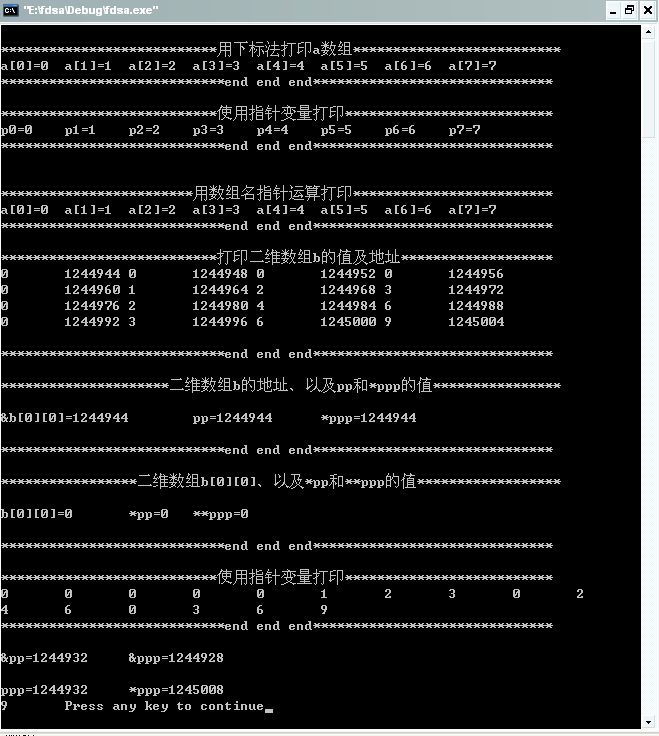
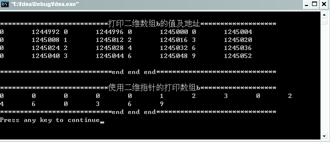

#指针（二）

现在每篇博客都要求有摘要，但是如果我就这样直接接着上一篇的内容开始讲的话可能第一次看我博客的人都不知道我在说啥，所以我还是把前一篇博客的第一段作为摘要搬过来吧。

懂得C语言的人都知道，C语言之所以强大，以及其自由性，绝大部分体现在其灵活的指针运用上。因此，说指针是c语言的灵魂，一点都不为过。所以从我的标题加了个（一）也可以看出指针的重要性，我尽可能的向大家交代清楚我对于指针的理解。所以在讲解的过程中我尽可能的用代码加文字的描述方式，通过代码的分析来加深我们对于指针的理解，我给出的都是完整的代码，所以读者可以在看的过程中直接copy下去即可运行，希望下面的讲解能够对你有所帮助。

在此也特地强调下，如果以后出现类似的情况时，我博客的第一段均作为摘要。如果已经在前面的博客中看过摘要的，那么重复的摘要部分可跳过不读，直接进入正文。

接着上一篇的指针部分，我们接下来看看数组的指针和指向数组的指针变量。数组的指针就是数组的起始地址，数组元素的指针是数组元素的地址。对于一个数组元素的引用我们通常可以使用两种方法：

1. 下标法，如a[8]。

2. 指针法。

其中使用指针法的优点是使得目标程序占内存少、运行速度快，从而使得其质量更高。为什么说指针具有这样的优点呢，我想还是有必要在此给出点我解释，因为指针在32位机器下占用4个字节，如果函数传输一个占用内存很大的对象例如：int   a[2000]，显然用指针引用传送简单，节省了内存，也节省了用于复制对象的时间；如果我们用下标法来引用数组，还得去取数组的起始地址,通过base   +   offset再转换为直接寻址,比指针多了操作。

从以上可以看出，指针能力很强，能完成许多事情，C的精髓就在于指针，使得C能接近ASM的效率。所以我们在写编写程序的时候有必要充分利用指针的优点，编写出高效的C语言代码。

下面来看看一个代码：

```c
#include <stdio.h>
#include <stdlib.h>

int main()
{
    int a[8];
    int *p;
    //***************************用下标法打印a数组**************************//
    printf("\n***************************用下标法打印a数组**************************\n");
    for(int i=0;i<8;i++)
    {
        a[i]=i;
        printf("a[%d]=%d\t",i,a[i]);
    }
    printf("\n****************************end end end******************************\n");
    //****************************end end end******************************//
    
    //***************************使用指针变量打印**************************//
    printf("\n***************************使用指针变量打印**************************\n");
    p=a;
    for(int j=0;j<8;j++)
    {
        printf("p%d=%d\t",j,*p++);
    }
    printf("\n****************************end end end******************************\n");
    //****************************end end end******************************//
    printf("\n");
    
    //************************用数组名指针运算打印*************************//
    printf("\n************************用数组名指针运算打印*************************\n");
    for(int k=0;k<8;k++)
    {
        printf("a[%d]=%d\t",k,*(a+k));
    }
    printf("\n****************************end end end******************************\n");
    //****************************end end end******************************//
    
    //****************************打印二维数组b的值地址********************//
    printf("\n***************************打印二维数组b的值及地址*******************\n");
    int b[4][4];
    for(int n=0;n<4;n++)
    {
        for(int m=0;m<4;m++)
        {
            b[n][m]=n*m;
            printf("%d\t",b[n][m]);
            printf("%d\t",&b[n][m]);
        } 
        printf("\n");
    }
    printf("\n****************************end end end******************************\n");
    //****************************end end end******************************//
     
    int *pp=&b[0][0];
    int **ppp=&pp;
    
    //*********************二维数组b的地址、以及pp和*ppp的值****************//
    printf("\n*********************二维数组b的地址、以及pp和*ppp的值****************\n");
    printf("\n&b[0][0]=%d\tpp=%d\t*ppp=%d\n",&b[0][0],pp,*ppp);
    printf("\n****************************end end end******************************\n");
    //****************************end end end******************************//
    
    //*****************二维数组b[0][0]、以及*pp和**ppp的值******************//
    printf("\n*****************二维数组b[0][0]、以及*pp和**ppp的值******************\n");
    printf("\nb[0][0]=%d\t*pp=%d\t**ppp=%d\n",b[0][0],*pp,**ppp);
    printf("\n****************************end end end******************************\n");
    //****************************end end end******************************//
    
    //***************************使用指针变量打印**************************//
    printf("\n***************************使用指针变量打印**************************\n");
    for(pp=&b[0][0];pp<(&b[0][0]+16);pp++)
        printf("%d\t",*pp);
    printf("\n****************************end end end******************************\n");
    //****************************end end end******************************//
    
    printf("\n&pp=%d\t&ppp=%d\n",&pp,&ppp);
    
    printf("\nppp=%d\t*ppp=%d\n",ppp,*ppp);
    
    printf("%d\t",*(*ppp-1));

    return 0;
}
```

在写上面的代码时，我加上了很多的注释，和打印说明语句，使得代码看起来不怎么美观，但是它丝毫不会影响我们对于代码的阅读，下面先让我们来看看运行结果后再来对齐进行分析。



上面的图片可能有点偏大。因为图片看起来效果更好些，所以我还是把图片传上来的同时也把打印结果复制了一份如下，如果图片因为网络原因打不开就看下面的运行结果：

```
***************************用下标法打印a数组**************************
a[0]=0  a[1]=1  a[2]=2  a[3]=3  a[4]=4  a[5]=5  a[6]=6  a[7]=7
****************************end end end******************************

***************************使用指针变量打印**************************
p0=0    p1=1    p2=2    p3=3    p4=4    p5=5    p6=6    p7=7
****************************end end end******************************

************************用数组名指针运算打印*************************
a[0]=0  a[1]=1  a[2]=2  a[3]=3  a[4]=4  a[5]=5  a[6]=6  a[7]=7
****************************end end end******************************

***************************打印二维数组b的值及地址*******************
0       1244944 0       1244948 0       1244952 0       1244956
0       1244960 1       1244964 2       1244968 3       1244972
0       1244976 2       1244980 4       1244984 6       1244988
0       1244992 3       1244996 6       1245000 9       1245004

****************************end end end******************************

*********************二维数组b的地址、以及pp和*ppp的值****************

&b[0][0]=1244944        pp=1244944      *ppp=1244944

****************************end end end******************************

*****************二维数组b[0][0]、以及*pp和**ppp的值******************

b[0][0]=0       *pp=0   **ppp=0

****************************end end end******************************

***************************使用指针变量打印**************************
0       0       0       0       0       1       2       3       0       2
4       6       0       3       6       9
****************************end end end******************************

&pp=1244932     &ppp=1244928

ppp=1244932     *ppp=1245008
9       Press any key to continue
```

首先来看看我们使用的三种打印一维数组a的方法，都成功的对a数组中的每个元素进行了打印，接下类是一个打印二维数组b的过程，在打印数组b中每个元素的同时我们也打印出了它相应的地址，细心的读者可能发信地址间的规律，因为我们声明的是int型，所以每个元素占用4个字节，相邻元素间的地址之差为4。

接下来我们使用了一个指针pp和一个指向指针的指针ppp，在使用指针的指针ppp的过程中要尤其注意它的使用。通过打印语句我们打印出了&b[0][0],pp,*ppp，其都具有相同的结果，都为二维数组b[0][0]的地址，所以接下来打印的b[0][0],*pp,**ppp均为b[0][0]的值，接下来我们采用指针的方法来成功的打印了二维数组b。

在接下来我们打印出了指针pp、双指针ppp的地址，同时也打印了ppp和*ppp的值，注意了*ppp的值和最后一次打印的数组元素的地址的关系，为什么会出现这样的结果呢，因为我们前面使用了一句int **ppp=&pp;，使得*ppp和pp指向的是同一个存储空间，其地址为&pp=1244932 ，所以在改变pp的值得时候，*ppp的值也在跟随其改变。所以细心的读者可能发现了在最后一句打印语句printf("%d\t",*(*ppp-1));中，我们使用了*(*ppp-1)才能成功的打印出二维数组b的最后一个最后一个元素。

如何采用二维指针类打印数组呢，请看下面的代码：

```c
#include <stdio.h>

int main()
{
    //****************************打印二维数组b的值地址********************//
    printf("\n***************************打印二维数组b的值及地址*******************\n");
    int b[4][4];
    for(int n=0;n<4;n++)
    {
        for(int m=0;m<4;m++)
        {
            b[n][m]=n*m;
            printf("%d\t",b[n][m]);
            printf("%d\t",&b[n][m]);
        } 
        printf("\n");
    }
    printf("\n****************************end end end******************************\n");
    //****************************end end end******************************//
     
    int *pp=&b[0][0];
    int **ppp=&pp;
    
    //****************************使用二维指针的打印数组b*******************//
    printf("\n***************************使用二维指针的打印数组b*******************\n");
    for(*ppp;*ppp<(&b[0][0]+16);(*ppp)++)
        printf("%d\t",**ppp);
    printf("\n****************************end end end******************************\n");
    //****************************end end end******************************//
    
    return 0;
}
```

运行结果如下：



注意代码中我们的红色标记部分，很多人在采用二维指针**ppp进行打印的时候最容易出错的地方，很多人使用的是如下方式：

```
for(*ppp;*ppp<(&b[0][0]+16);*ppp++)
```

看似没有问题，似乎能得到正确的结果，但是我们仔细分析就会发现其中的问题所在，因为++的优先级高于*，所以首先进行的是ppp++运算，然后才是*ppp，这样的话就出现我们前面所讲的野指针的问题了。所以在调用printf("%d\t",**ppp);就会出现内存错误。所以在此我们需要加上一个括号(*ppp)++，这样*ppp中的才是b[0][0]的地址，接下来通过使用++操作和printf("%d\t",**ppp);才能成功的打印出二维数组b的元素。

## 引用

- [0] [原文](http://blog.csdn.net/bigloomy/article/details/6612387)