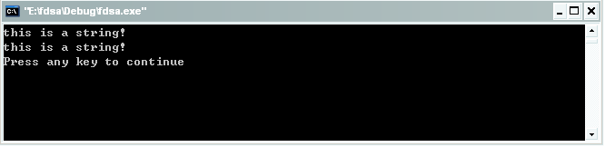
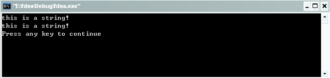

#指针（三）

但凡人都是急功近利和有惰性的，我就是个例子。不想每篇博客都写一个摘要和那些大段的文字描述，但是为了让一些新的读者朋友了解我的博客内容，我还是像前面说的那样，把第一篇关于指针的摘要搬过来，因为我写的这几篇都是关于指针的，所以没有必要每篇一个摘要，在此就偷偷懒了，如果读过我前面两篇C指针博客的朋友可以跳过这篇博客前面的摘要不读，直接进入主题部分。

懂得C语言的人都知道，C语言之所以强大，以及其自由性，绝大部分体现在其灵活的指针运用上。因此，说指针是c语言的灵魂，一点都不为过。所以从我的标题加了个（一）也可以看出指针的重要性，我尽可能的向大家交代清楚我对于指针的理解。所以在讲解的过程中我尽可能的用代码加文字的描述方式，通过代码的分析来加深我们对于指针的理解，我给出的都是完整的代码，所以读者可以在看的过程中直接copy下去即可运行，希望下面的讲解能够对你有所帮助。

在C语言中我们可以使用两种方法来访问一个字符串。

1. 用字符数组存放一个字符串

    ```c
    char str[ ]="this is str!!!";
    ```

    在此str是一个数组名，代表字符串数组的首地址。

2. 用字符指针指向一个字符串

    ```c
    char *str="this is str,too";
    ```

    C语言对于字符串常量是按照字符数组的方式来进行处理的，在内存开辟了一个字符数组来存放字符串常量。在此的str被定义为一个指针变量，指向字符型数组，它只能指向一个字符变量和其他的字符数据。输出都是使用printf("%s",str);，在此过程中系统会先输出一个str所指向的字符数据，然后使用str加1的方法输出下一个字符，知道遇到'\0'串结束符为止，在内存中的字符串的最后都被自动加上一个'\0'。

    字符串的传递可以使用传址的方法，用字符数组的名字或者用指向字符数组的指针变量作为参数。在被调用的函数中可以改变字符串的内容，主函数可以得到改变了的字符串。

## 一、用字符数组作为参数

接下来看看一个代码：

```c
#include <stdio.h>

void copy_string(char from[],char to[])
{
    int i=0;
    while(from[i]!='\0'){
        (to[i]=from[i]);
        i++;
    }
    
    to[i]='\0';
    
    return ;
}

int main()
{
    char str[]="this is a string!";
    printf("%s\n",str);
    char dec_str[206];
    copy_string(str,dec_str);
    printf("%s\n",dec_str);
    return 0;
}
```

运行结果为：



仅仅从代码实现的难易程度来看的话没有什么难点，但是可能有不少人可能会把我们代码中用红色标志的代码部分忘掉，从而出错。

在此也给出我的另外一种实现方式：

```c
#include <stdio.h>

void copy_string(char from[],char to[])
{
    int i=0;
    while((to[i]=from[i++])!='\0'){
        ;
    }
    
    return ;
}

int main()
{
    char str[]="this is a string!";
    printf("%s\n",str);
    char dec_str[206];
    copy_string(str,dec_str);
    printf("%s\n",dec_str);
    return 0;
}
```

运行结果为：



值得注意的是这种实现方式的中的巧妙的利用了while语句while((to[i]=from[i++])!='\0')。千万不要写成 while((to[i++]=from[i++])!='\0')，这样的话每次执行判断语句是i++被执行了两次，导致最终的结果出错。

## 二、用字符指针变量

```c
#include <stdio.h>

void copy_string(char *from,char *to)
{
    int i=0;
    while(*from!='\0')
        *to++=*from++;
    *to='\0';
     
    return ;
}

int main()
{
    char str[]="this is a string!";
    printf("%s\n",str);
    char dec_str[206];
    copy_string(str,dec_str);
    printf("%s\n",dec_str);
    return 0;
}
```

运行结果为：


在此我也给出一种结合逗号表达式和for循环语句来实现的参考代码：

```c
#include <stdio.h>

void copy_string(char *from,char *to)
{
    int i=0;
    for(;*to=*from,*from!='\0';from++,to++);
     
    return ;
}

int main()
{
    char str[]="this is a string!";
    printf("%s\n",str);
    char dec_str[206];
    copy_string(str,dec_str);
    printf("%s\n",dec_str);
    return 0;
}
```

运行结果为：


代码的巧妙之处在于结合了逗号表达式和for循环语句来实现，因为逗号表达式的结果为最后一个表达式的结果，所以执行判断语句里边的逗号表达式时其所取的值依然为*from!='\0'。

有兴趣的读者自己可以尝试下其他的实现方法，下面再给出几种很巧妙的实现方法，有兴趣的读者可以自己研究下其实现原理，均为完整代码。

```c
#include <stdio.h>

void copy_string(char *from,char *to)
{
    int i=0;
    for(;*to++=*from++;);
     
    return ;
}

int main()
{
    char str[]="this is a string!";
    printf("%s\n",str);
    char dec_str[206];
    copy_string(str,dec_str);
    printf("%s\n",dec_str);
    return 0;
}
```

```c
#include <stdio.h>

void copy_string(char *from,char *to)
{
    int i=0;
    while(*to++=*from++);
     
    return ;
}

int main()
{
    char str[]="this is a string!";
    printf("%s\n",str);
    char dec_str[206];
    copy_string(str,dec_str);
    printf("%s\n",dec_str);
    return 0;
}
```

```c
#include <stdio.h>

void copy_string(char *from,char *to)
{
    int i=0;
    while((*to++=*from++)!='\0');
     
    return ;
}

int main()
{
    char str[]="this is a string!";
    printf("%s\n",str);
    char dec_str[206];
    copy_string(str,dec_str);
    printf("%s\n",dec_str);
    return 0;
}
```

```c
#include <stdio.h>

void copy_string(char *from,char *to)
{
    char*p1,*p2;
    p1=from;
    p2=to;
    while((*p2++=*p1++)!='\0');
     
    return ;
}

int main()
{
    char str[]="this is a string!";
    printf("%s\n",str);
    char dec_str[206];
    copy_string(str,dec_str);
    printf("%s\n",dec_str);
    return 0;
}
```

```c
#include <stdio.h>

void copy_string(char from[],char to[])
{
    char*p1,*p2;
    p1=from;
    p2=to;
    while((*p2++=*p1++)!='\0');
     
    return ;
}

int main()
{
    char str[]="this is a string!";
    printf("%s\n",str);
    char dec_str[206];
    copy_string(str,dec_str);
    printf("%s\n",dec_str);
    return 0;
}
```

就不在此一一贴出运行结果了，运行结果同上，如果有兴趣可以自己研究下以上代码，同时还有很多的实现方法，希望以上代码能够启发读者的灵感写出更多的实现方法和更好的实现方案来。

## 引用

- [0] [原文](http://blog.csdn.net/bigloomy/article/details/6612650)