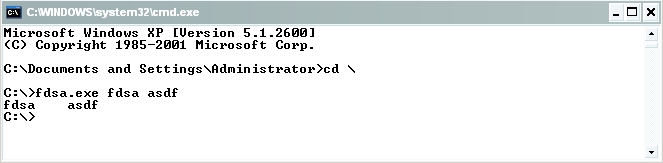
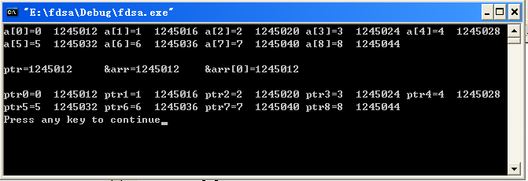
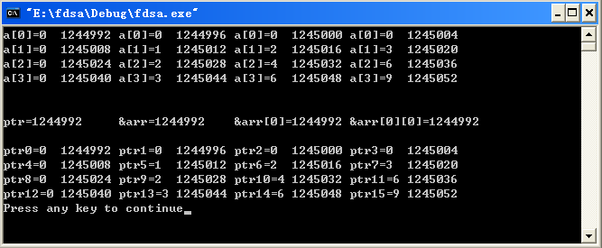
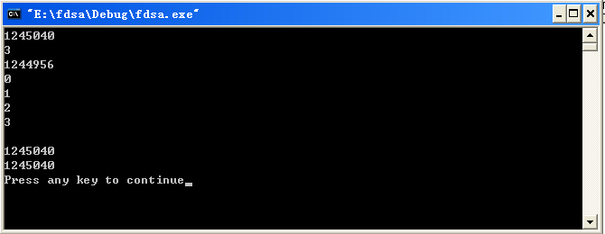

#指针（四）

正如前一篇博客所说的，但凡人都是急功近利和有惰性的，都不喜欢花时间去阅读那些我们认为枯燥的文字描述，喜欢直接进入主题。但是有时候恰恰就是因为我们的这种急功近利和惰性，使得我们绕了很大一个弯，到最后还是回到了文字描述上来，所以我觉得适当的文字描述下，让读者对于文章的整体有个大概的认识之后，再去学习能收获更好的效果。我的前两篇关于C指针的博客用的摘要都是copy我第一篇C指针博客的摘要，当然这篇也不例外，还是会引用我第一篇博客的摘要，只是在引用摘要之前我要先交代件事儿，就是关于函数指针和指针函数、以及指针常量和常量指针我就不在此讲解了，有兴趣的朋友可以参考我之前写的两篇博客---C语言的那些小秘密之函数指针和C语言的那些小秘密之const修饰符。

懂得C语言的人都知道，C语言之所以强大，以及其自由性，绝大部分体现在其灵活的指针运用上。因此，说指针是c语言的灵魂，一点都不为过。所以从我的标题加了个（一）也可以看出指针的重要性，我尽可能的向大家交代清楚我对于指针的理解。所以在讲解的过程中我尽可能的用代码加文字的描述方式，通过代码的分析来加深我们对于指针的理解，我给出的都是完整的代码，所以读者可以在看的过程中直接copy下去即可运行，希望下面的讲解能够对你有所帮助。

先让我们来看看一段非常熟悉的代码：

```c
#include <stdio.h>

void main(int argc,char *argv[])
{ 
    while(argc-->1)
        printf("%s\t",*++argv);
}
```

运行结果如下：



可能还是有人不是很了解main函数里的参数argc和argv是什么意思，在此做一简单的讲解，argc为命令行输入的参数个数，在此argc=3，有三个参数，分别是：fdsa.exe   fdsa   asdf，argv是一个指针数组，在此相当于char *argv[0]="fdsa.exe"、char *argv[1]="fdsa"、char *argv[0]="asdf"。有了上面的解释相信能够很好的理解main函数的参数了。

现在来分析下上面的代码，程序中有一句argv++；但是我们上面的分析是argv是一个数组名，而数组名是不能进行这样的++运算的，难道出错了嘛？！但是明明运行结果已经就在眼前了，在解释之前我们再来看如下一段代码：

```
#include <stdio.h>

void main()
{ 
    char *argv[]={"this","is","shuzu"};
    *++argv;
}
```

编译发现出错了。

好了现在我们可以来解释为什么会出现如上两种情况了，有种特殊情况就是数组名作为函数参数，传递的是数组的首地址，系统会把形参当作变量来处理，所以如果我们吧main函数改写为main(int argc,char **argv);就好理解多了。

看了上面的代码，接下来我们看看指针数组和数组指针的区别所在。

1. 指针数组指的是一个数组，数组中的每个元素都是指针类型，所有的指针都指向不同的地址，所指的地址的数据也不一定一样，但是所指的数据类型必须一样。

2. 数组指针指的是定义的是一个指针，而指针指向的是数组，指针指向数组首单元的地址，对于数组内部元素的属性不了解，仅仅是规定了数组首单元的地址，通过它可以找到整个数组。

接下来看看一段代码：

```c
#include <stdio.h>

void main()
{ 
   int *p=new int [10]; 
   int arr[10]; 
   int (*ptr)[10]; 
   for(int i=0;i<9;i++)
   {
       arr[i]=i;
       printf("a[%d]=%d\t%d\t",i,arr[i],&arr[i]);
   }
   printf("\n");
   int j=0;
   ptr=&arr;
   printf("\nptr=%d\t&arr=%d\t&arr[0]=%d\n",ptr,&arr,&arr[0]);
   printf("\n");
   for(;j<9;j++)
   {
       printf("ptr%d=%d\t%d\t",j,*((*ptr)+j),&(*ptr)[j]);
   }
   printf("\n");
}
```

运行结果如下：



在程序中我们打印了数组a中每个数组元素的值和其相应的地址，同时也定义了一个数组指针，int (*ptr)[10]; ，在引用数组指针的过程中必须要注意的是数组指针的维数必须要引用的数组维数相同，否从会出错。我们可以把int (*ptr)[10]; 拆开来看，把指针ptr看成是指向int  [10];的类型，把int  [10]视为一种新的类型，所以在使用指针ptr的时候类型必须要一致，即必须是一个int  [10]这样的数组。

对以上的代码稍加修改：

```c
#include <stdio.h>

void main()
{ 
    int arr[4][4];
    int (*ptr)[4]; 
    for(int i=0;i<4;i++)
    {
        for(int j=0;j<4;j++)
        {
            arr[i][j]=i*j;
            printf("a[%d]=%d\t%d\t",i,arr[i][j],&arr[i][j]);
        }
        printf("\n");
    }
    printf("\n");
    int j=0;
    ptr=arr;
    printf("\nptr=%d\t&arr=%d\t&arr[0]=%d\t&arr[0][0]=%d\n",ptr,&arr,&arr[0],&arr[0][0]);
    printf("\n");
    for(;j<16;j++)
    {
        if(j%4==0&&j!=0)
            printf("\n");
        printf("ptr%d=%d\t%d\t",j,*((*ptr)+j),&(*ptr)[j]);
    }
    printf("\n");
}
```

运行结果如下：



可能有的读者看了

```c
int arr[4][4];int (*ptr)[4];
``` 

这两句代码之后认为接下来的代码ptr=arr;有错，因为arr是一个二位数组，而ptr只是一个指向int  [4]类型的指针。但是要注意了，从运行结果我们也可以肯定的是上面的代码是正确的，但是为什么是正确的呢？！首先我们把arr分为两部分来看，第一部分为int  [4]，第二部分为arr[4]，这样就一目了然了，我们可以认为我们定义了一个一维数组arr[4]，数组有四个元素，每个元素的类型为int  [4]，因此和一般的数组一样，我们可以将该数组名赋给指针，其实也就是第一个元素的地址付给指针。即: ptr=arr;或者ptr=&arr[0]。其余情况以此类推。

下面再来看看一段代码：

```c
#include <stdio.h>

void sum(int s[])
{
    int i;
    printf("%d\n",s);
    printf("%d\n",*(s+3));
    printf("%d\n",&s);
    printf("%d\n",*s++);
    printf("%d\n",*s++);
    printf("%d\n",*s++);
    printf("%d\n",*s);
    printf("\n");

}

void main(int argc,char *argv[])
{
    int ss[4];
    for(int i=0;i<4;i++)
        ss[i]=i;
    sum(ss);
    printf("%d\n",ss);
    printf("%d\n",&ss);
} 
```

运行结果如下：



在main函数中我们使用了两句 printf("%d\n",ss);和 printf("%d\n",&ss);来打印数组ss的地址，值得注意的就是数组的首地址的几种表示方法，还可以是&ss[0]；在调用ss函数的过程中，我们使用的是数组作为参数，同时为了加深读者对于数组作为参数的时候可以使用++这样的操作符印象，我在此使用s++的方法打印了整个数组。细心的读者会发现我使用的 printf("%d\n",s);和 printf("%d\n",&s);在此打印的结果不再一样了，跟在main函数中用这样的语句打印数组首地址的结果一致不符合，这也从侧面说明了当数组名作为参数的时候，系统是将它作为变量处理的，所以打印的结果不一致。

指针的讲解到此就告一段落了，由于本人水平有限，博客中的不妥或错误之处在所难免，殷切希望读者批评指正。同时也欢迎读者共同探讨相关的内容，如果乐意交流的话请留下你宝贵的意见。

## 引用

- [0] [原文](http://blog.csdn.net/bigloomy/article/details/6612790)