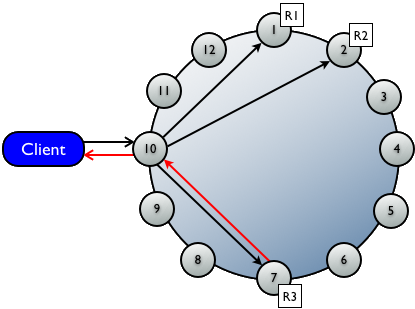
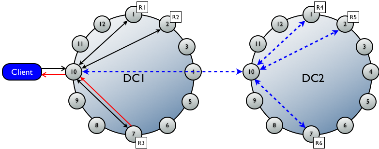
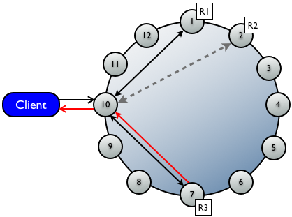
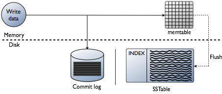
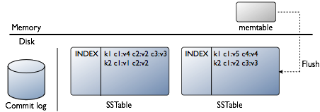
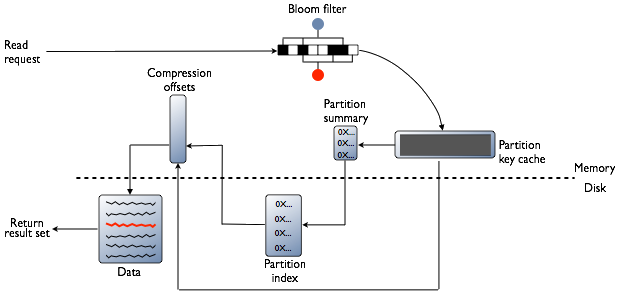
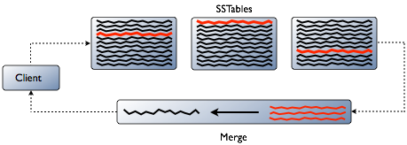
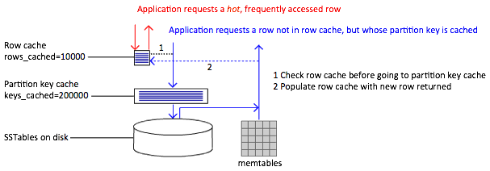

#Cassandra研究报告

##1 基本安装

###1.1 在基于RHEL的系统中安装Cassandra

####1.1.1 必要条件

* YUM包管理器
* Root或sudo权限
* JRE6或者JRE7
* JNA(Java native Access)（生产环境需要）

####1.1.2 步骤

* 安装配置JRE(略)

* 添加软件包仓库到YUM的软件库
    
    将以下内容添加进/etc/yum.repos.d/datastax.repo文件即可：
    
    ```
    [datastax]
    name = DataStax Repo for ApacheCassandra
    baseurl =http://rpm.datastax.com/community
    enabled = 1
    gpgcheck = 0
    ```

* 安装2.0版最新的软件包
    
    ```
    $ sudo yuminstall dsc20
    ```

* 安装JNA
    
    ```
    $ sudo yuminstall jna
    ```

经过上述步骤即安装好了Cassandra，随后便可对其进行配置。以此方式安装的Cassandra会创建一个名为cassandra的用户，cassandra以此用户启动服务。

###1.2 在任意基于Linux的系统中安装Cassandra

####1.2.1 必要条件

* JRE6或者JRE7
*  JNA(Java native Access) （生产环境需要）

####1.2.2 步骤

* 安装配置JRE(略)

* 下载Cassandra二进制 tarball
    
    由http://planetcassandra.org/Download/StartDownload页面手工下载对应版本的Cassandra，或者通过curl -OLhttp://downloads.datastax.com/community/dsc.tar.gz命令自动下载最新的DataStaxCommunity，也可由http://cassandra.apache.org/download/页面手工下载对应版本。

* 解压tarball
    
    ```
    tar –xzvf dsc-cassandra-2.0.0-bin.tar.gz
    ```
    
    根据下载的版本也可能是：tar –xzvf  apache-cassandra-2.0.0-bin.tar.gz

* 安装配置JNA
    
    * 下载jna.jar(https://github.com/twall/jna/ )。
    * 将下载的jna.jar添加进Cassandra安装目录的lib目录下或将其添加进CLASSPATH环境变量中
    * 在/etc/security/limits.conf文件中加入如下行：
        
        ```
        $USER soft memlock unlimited
        $USER hard memlock unlimited
        ```
        
        其中$USER为运行cassandra的用户

* 创建数据目录和日志目录并指定给用于运行cassandra服务的具有相应读写权限的用户
    
    ```
    $ sudo mkdir/var/lib/cassandra
    $ sudo mkdir/var/log/cassandra
    $ sudo chown-R  $USER: $GROUP /var/lib/cassandra
    $ sudo chown-R  $USER: $GROUP /var/log/Cassandra
    ```

    Cassandra配置文件中默认使用上述目录分别作为数据目录和日志目录，可创建不同的目录，赋予对应的权限，并在配置文件中重新指定以改变默认行为。

至此已安装好了Cassandra，随后便可对其进行配置。

###1.3在其他平台安装Cassandra（略）

###1.5通过源码构建Cassandra（略）

##2 简单配置

Cassandra的主配置文件为cassandra.yaml，其位置随Cassandra安装方式不同而不同。

* 对于CassandraPackage安装：/etc/cassandra/conf
* 对于CassandraBinary安装：***install_location***/conf
* 对于DataStaxEnterprise Packaged安装：/etc/dse/cassandra
* 对于DataStaxEnterpriseBinary安装：***install_location***/resources/cassandra/conf

 配置文件中的配置参数被分为如下几个组

* Initialization properties：控制集群内的节点如何配置，包括节点间通讯，数据分区及复制布置。
* Global row and key caches properties：用于缓存表的参数的配置参数。
* Performance tuning properties：调整性能和系统资源的利用，包括内存、磁盘I/O、CPU、读和写。
* Binary and RPC protocol timeout properties：用于二进制协议的超时设置。
* Remote procedure call tuning（RPC）properties：用于配置和调整RPCs（客户端连接）
* Fault detection properties：用于处理运行情况较差或者失败的节点。
* Automatic backup properties：用于自动化备份。
* Security properties：用于服务器端和客户端的安全设置

每个组包都含若干具体的参数（具体内容可参考：http://www.datastax.com/documentation/cassandra/1.2/webhelp/index.html#cassandra/configuration/configCassandra_yaml_r.html）

 例如，对于新安装的Cassandra可能会修改配置文件中的下面几个参数

* data_file_directories：数据目录，对于包方式（如deb或rpm）安装的Cassandra，该目录会在安装过程中自动创建并具有正确的权限，默认位置为/var/lib/cassandra/data。
* commitlog_directory：commit log目录，对于包方式安装的Cassandra，该目录会在安装过程中自动创建并具有正确的权限，默认位置为/var/lib/cassandra/commitlog。
* saved_caches_directory：保存的缓存目录，对于包方式安装的Cassandra，该目录会在安装过程中自动创建并具有正确的权限，默认位置为/var/lib/cassandra/saved_caches。

如果以二进制方式或源码方式安装Cassandra需自行创建相应目录，赋予正确的权限。又或者不想使用默认的位置，也可以自行创建新的目录，赋予正确的权限，并在配置文件中指定。比如：

```
data_file_directories:/data/cassandra/data
commitlog_directory:/data/cassandra/commitlog
saved_caches_directory:/data/cassandra/saved_caches
```

 另外，对于包方式安装的Cassandra，还会在安装过程中自动创建/var/log/cassandra目录并赋予正确的权限。默认情况下Cassandra将其日志写进该目录的system.log文件中。可通过修改log4j-server.properies文件（与cassandra.yaml位于同一目录）中的log4j.appender.R.File来改变默认行为，比如：log4j.appender.R.File=/data/cassandra/system.log

 还可能要修改JVM级别的参数，该部分的参数可在cassandra-env.sh文件（与cassandra.yaml位于同一目录）中设置。

##3 启动及简单使用

###3.1 启动Cassandra

对于二进制包安装方式

* 执行bin/cassandra–f，前台启动cassandra，cassandra会将日志输出到标准输出中。若没在输出中看到“error”、“fatal”或者类似“java stack trace”的内容表明cassandra可正常工作。可通过“Control-C“停止casandra。
* 执行bin/cassandra，后台启动cassandra。
* 可通过kill或pkill命令停止cassandra

对于YUM安装方式

* 执行sudoservice Cassandra start启动cassandra
* 执行sudoservice Cassandra stop 停止cassandra

###3.2 使用cqlsh

执行bin/cqlsh，出现如下提示则表明连接成功（需python2.7）：

```
Connected toTest Cluster at localhost:9160.
[cqlsh 4.0.0 |Cassandra 2.0.0 | CQL spec 3.1.0 | Thrift protocol 19.37.0]
Use HELP for help.
```

可在cqlsh命令提示符下输入help或？获得帮助，输入exit或quit退出cqlsh，命令默认以“;”结束。

查看keyspace

```sql
DESCRIBE keyspaces;
```

创建keyspace

```sql
CREATE KEYSPACE mykeyspace WITH REPLICATION = { 'class' : 'SimpleStrategy','replication_factor' : 2 };
```

切换keyspace

```sql
USE mykeyspace;
```

创建表

```sql
CREATE TABLE users (
  user_id int PRIMARY KEY,
  fname text,
  lname text
);
```

查看表

```sql
DESCRIBE TABLES;
```

插入数据

```sql
INSERT INTO users (user_id,  fname, lname)
  VALUES (1745, 'john', 'smith');

INSERT INTO users (user_id,  fname, lname)
  VALUES (1744, 'john', 'doe');

INSERT INTO users (user_id,  fname, lname)
  VALUES (1746, 'john', 'smith');
```

查询数据

```sql
SELECT * FROM users;
```

建立索引后使用WHERE从句查找

```sql
CREATE INDEX ON users (lname);

SELECT * FROM users WHERE lname = 'smith';
```

删除表

```sql
DROP TABLE users;
```

至此已经拥有了单节点的Cassandra，且能够通过cqlsh连接至cassandra并使用CQL执行操作。下面对Cassandra作进一步介绍。

##4 搭建集群

###4.1 单数据中心集群

####4.1.1 前置工作

* 在每个节点上装配Cassandra
* 为集群确定名称
* 获取每个节点的IP
* 确定用来做种子的节点（Cassandra通过种子节点来找到彼此并了解环的拓扑）
* 确定snitch（用于确定向/从哪个数据中心和网架写入/读取数据。有不同的类型可选，具体参考：http://www.datastax.com/documentation/cassandra/2.0/webhelp/cassandra/architecture/architectureSnitchesAbout_c.html）

####4.1.2 具体配置

假定使用以下已经安装了Cassandra的节点配置集群(资源有限，这里只用两台机器来说明过程。真实环境下最好是有多台机器，且一个集群中最好有一个以上的种子)

```
node0 192.168.83.35 (seed)
node1 192.168.83.37
```

假定节点所在机器有防火墙，注意开放Cassandra所使用的端口（相关端口可查http://www.datastax.com/documentation/cassandra/2.0/webhelp/cassandra/security/secureFireWall_r.html）

若Cassandra正运行则先关闭，后清除数据。

```
$ sudo service cassandra stop
```

或者（根据安装方式而不同）

```
$ ps auwx | grep cassandra
$ sudo  kill ***pid***
```

清除数据

```
$ sudo rm -rf /var/lib/cassandra/*
```

修改cassandra.yaml文件中的相应内容

```
cluster_name:'MyDemoCluster'
num_tokens:256
seed_provider:
 - class_name:org.apache.cassandra.locator.SimpleSeedProvider
    parameters:
         - seeds:  "192.168.83.35"
listen_address:192.168.83.35
rpc_address:0.0.0.0
endpoint_snitch:SimpleSnitch
```

若是建立全新的还不包含数据的集群则加上`auto_bootstrap:false`

剩余节点的配置与除了listen_address应当为自身IP外，其他配置与上述相同

先启动逐个启动seed节点，再逐个启动剩余节点

```
$ sudo service cassandra start
```

或者

```
$ cd ***install_location***
$ bin/Cassandra
```

使用nodetoolstatus命令查看集群是否成功运行

###4.2 多数据中心集群

这里，数据中心指的就是一组节点，与复制组是同义词。多数据中心集群中，数据可以在不同数据中心间自动、透明复制。

####4.2.1 前置工作

与单节点集群配置基本相同，不同的是还需要确定数据中心和网架的命名。

####4.2.2 具体配置

1. 假定在以下已经安装了Cassandra的节点配置集群
    
    ```
    node0 192.168.83.35(seed1)
    node1 192.168.83.36
    node2 192.168.83.37
    node3 192.180.83.35(seed2)
    node4 192.180.83.36
    node5 192.168.83.37
    ```
    
2. 若如防火墙，则先开放相应端口（同上）
    
3. 若Cassandra正运行则先关闭（同上）
    
4. 清除数据（同上）

5. 修改cassandra.yaml文件中的相应内容
    
    …同上…

    ```
    endpoint_snitch:PropertyFileSnitch
    ```
    
    若是建立全新的还不包含数据的集群则加上`auto_bootstrap:false`

6. 剩余节点的配置与除了listen_address应当为自身IP外，其他配置与上述相同

7. 步骤5中指定endpoint_snitch为PropertyFileSnitch所以要编辑对应的cassandra-topologies.properties配置文件（若endpoint_snitch指定为GossipingPropertyFileSnitch则要编辑cassandra-rackdc.properties，指定为YamlFileNetworkTopologySnitch则要编辑cassandra-topology.yaml）
    
    ```
    # CassandraNode IP=Data Center:Rack
    192.168.83.35=DC1:RAC1
    192.168.83.36=DC2:RAC1
    192.168.83.37=DC1:RAC1
    192.180.83.35 =DC2:RAC1
    192.180.83.36=DC1:RAC1
    192.168.83.37=DC2:RAC1
    ```
    
    之后还要为位置的节点设置一个默认的数据中心和网架名
    
    ```
    # default forunknown nodes
    default=DC1:RAC1
    ```
    
8. 逐个启动种子节点，之后逐个启动剩余节点（同上）

9. 验证环是否成功启动（同上）

##5 使用CQL

CQL:CassandraQuery Language

###激活CQL

cqlsh、DataStaxJava Driver、Thrift方法set_cql_version、Python驱动中的connect()调用。

###使用cqlsh

```
bin/cqlsh host port –u username –p password
```

###创建keyspace

keyspace为表命名空间，指明节点中数据如何复制，一般一个应用对应一个keyspace。cassandra中的复制控制以单个keyspace为基础。

```sql
CREATE KEYSPACE demodb WITH REPLICATION = {'class' : 'SimpleStrategy','replication_factor': 3};
```

class指明复制策略，replication_factor指明复制的份数

###使用keyspace

```sql
USE demodb;
```

###更新keyspace

```sql
ALTER KEYSPACE demodb WITH REPLICATION = { 'class' : 'SimpleStrategy', 'replication_factor' : 2};
ALTER KEYSPACE demodb WITH REPLICATION ={'class' : 'NetworkTopologyStrategy', 'dc1' : 3, 'dc2': 2};
```
之后在每个受影响的节点执行nodetoolrepair demodb

###创建表

```sql
use demodb

CREATE TABLE users (
  user_name varchar,
  password varchar,
  gender varchar,
  session_token varchar,
  state varchar,
  birth_year bigint,
  PRIMARY KEY (user_name));
```

###使用复合primary key创建表

```
CREATE TABLE emp (
  empID int,
  deptID int,
  first_name varchar,
  last_name varchar,
  PRIMARY KEY (empID, deptID));
```

###插入数据

```sql
INSERT INTO emp (empID, deptID, first_name, last_name) VALUES (104, 15, 'jane', 'smith');
```

###查询表（以系统表为例）

system是Cassandra的系统库，当前含schema_keyspaces、local、peers、schema_columns和schema_columnfamilies几个表，分别包含keyspace信息，本地节点信息、集群节点信息、columns信息和columnfamilies信息

```sql
use system
SELECT * from schema_keyspaces; 获取到当前节点中的eyspace
SELECT * FROM peers; 获取节点所在集群信息
```

###提取并排序查询结果

```sql
SELECT * FROM emp WHERE empID IN (103,104) ORDER BY deptID DESC;
```

###使用keyspace限定符

经常使用USE keyspacename来切换keyspace可能不方便，可使用keyspace限定符指定表所属的keyspace，如

```
SELECT * from system.schema_keyspaces;
```

可在ALTER TABLEC、REATE TABLE、DELETE、INSERT、SELECT、TRUNCATE、UPDATE中使用

###指定column的过期时间

```
INSERT INTO emp (empID, deptID, first_name, last_name) VALUES (105, 17, 'jane', 'smith') USING TTL 60;
```

其中USING TTL 60指明该条数据60秒后过期，届时会被自动删除。另外指定了TTL的数据columns会在compaction和repair操作中被自动删除。指定TTL会有8字节额外开销。

###查询过期时间

```
SELECT TTL(last_name) from emp;
```

###更新过期时间

```
INSERT INTOemp (empID, deptID, first_name, last_name) VALUES (105, 17, 'miaomiao', 'han') USING TTL 3600;
```

也即，以新的TTL重插一遍数据即可。（指定插入的整条数据的过期时间）

或者

```sql
UPDATA emp USING TTL 3600 SET last_name='han' where empid=105 and deptid=17; 
```

（指定set指明的数据的过期时间）

###查询写入时间

```sql
SELECT WRITETIME(first_name) from emp;
```

可查的该数据何时被插入。

###添加columns

```sql
ALTER TABLE emp ADD address varchar;
```

###更改column数据类型

```sql
ALTER TABLE emp ALTER address TYPE text;
```

###移除数据

* 指定过期时间（同上）
* 删除table或keyspace
    
    ```sql
    DROP TABLE table_name
    DROP KEYSPACE keyspace_name;
    ```

* 删除columns和rows
    
    ````sql
    DELETE last_name FROM emp WHERE empid=104 and deptid=15;
    DELETE FROM emp WHERE empid=104 and deptid=15;
    ```

###使用collection类型

####set类型

```
CREATE TABLE users (
  user_id text PRIMARY KEY,
  first_name text,
  last_name text,
  emails set&lt;text&gt;
);

INSERT INTO users (user_id, first_name, last_name, emails) VALUES('frodo','Frodo', 'Baggins', {'f@baggins.com', 'baggins@gmail.com'});

UPDATE users SET emails = emails + {'fb@friendsofmordor.org'} WHERE user_id = 'frodo';

UPDATE users SET emails = emails - {'fb@friendsofmordor.org'} WHERE user_id = 'frodo';

UPDATE users SET emails = {} WHERE user_id = 'frodo';

DELETE emails FROM users WHERE user_id = 'frodo';
```

####list类型

```
ALTER TABLE users ADD top_places list&lt;text&gt;;

UPDATE users SET top_places = [ 'rivendell', 'rohan' ] WHERE user_id= 'frodo';

UPDATE users SET top_places = [ 'the shire' ] + top_places WHERE user_id = 'frodo';

UPDATE users SET top_places = top_places + [ 'mordor' ] WHERE user_id = 'frodo';

UPDATE users SET top_places[2] = 'riddermark' WHERE user_id ='frodo';

DELETE top_places[3] FROM users WHERE user_id = 'frodo';

UPDATE users SET top_places = top_places - ['rivendell'] WHERE user_id = 'frodo';
```

####map类型

```sql
ALTER TABLE users ADD todo map&lt;timestamp, text&gt;;

UPDATE users SET todo =
  { '2012-9-24' : 'entermordor',
  '2012-10-2 12:00' : 'throwring into mount doom' }
WHERE user_id = 'frodo';

UPDATE users SET todo['2012-10-2 12:00'] = 'throw my precious intomount doom' WHERE user_id = 'frodo';

INSERT INTO users (user_id,todo)  VALUES ('miaohan', { '2013-9-22 12:01' : 'birthday wishes to Bilbo',  '2013-10-1 18:00' : 'Check into Inn of Prancing Pony' });

DELETE todo['2012-9-24'] FROM users WHERE user_id = 'frodo';

UPDATE users USING TTL 60 SET todo['2012-10-1'] = 'find water' WHERE user_id = 'frodo';
```

注；可为上述三种集合类型的每个元素设置单独的过期时间。

###创建和使用索引

```sql
CREATE INDEX last_name_key ON users(last_name);
```

```sql
SELECT * FROM users WHERE last_name = 'Baggins'
```

（需创建了索引才能在WHERE中使用该列进行查询，暂无多列索引，需逐列分别建立索引）

###轻量级事务

使用IF从句实现

```
INSERT INTO emp(empid,deptid,address,first_name,last_name) VALUES(102,14,'luoyang','Jane Doe','li') IF NOT EXISTS;

UPDATE emp SET address = 'luoyang' WHERE empid = 103 and deptid = 16 IF last_name='zhang';
```

###使用counter

用于记录特定时间或处理的次数。对应的column需使用counter数据类型，该类数据一般存储于专门的表中，且使用UPDATE载入并增减counter值，不使用INSERT插入counter值。只能在原数值的基础上增减，不能为直接指定一个数值。

```sql
CREATE KEYSPACE counterks WITH REPLICATION = { 'class' : 'SimpleStrategy','replication_factor' : 3 };

CREATE TABLE counterks.page_view_counts
  (counter_value counter,
  url_name varchar,
  page_name varchar,
  PRIMARY KEY (url_name, page_name)
);

UPDATE counterks.page_view_counts
 SET counter_value = counter_value + 1
 WHERE url_name='www.datastax.com' AND page_name='home';
```

若原来不存在WHERE条件中指定的内容，该条语句会将表中的url_name值置为'www.datastax.com'将page_name置为’home’,将counter_value指定为默认初始值0加1。若WHERE条件中指定的内容存在，则将counter_value置为原来的counter_value加1

```sql
UPDATE counterks.page_view_counts
 SET counter_value = counter_value + 2
 WHERE url_name='www.baidu.com' AND page_name='map';
```

更多CQL内容请参见：http://www.datastax.com/documentation/cql/3.1/webhelp/index.html

##6 安全

三方面安全策略

* Client-to-node/node-to-node加密（SSL）：加密传输的数据
* 基于登录账户/密码的认证：确定谁可以使用数据库
* 对象授权管理：确定用户可在在数据库上干什么

###6.1 SSL加密

####6.1.1 Client-to-node

#####准备证书

为每个节点产生私钥/公钥对

```
keytool-genkey -alias cassandra_vms00780 -keystore ~/keys/.keystore
```

导出公钥部分到单独的证书文件，并拷贝该文件到其他所有节点

```
keytool-export -alias cassandra_vms00780 -file ~keys/cassandra_vms00780.cer -keystore ~/keys/.keystore
```

将每个节点的证书添加到所有节点的信任库中

```
keytool-import -v -trustcacerts -alias cassandra_vms00780 -file cassandra_vms00780.cer–keystore  ~/keys/ .truststore
```

保证将.keystore和truststore文件分发到所有节点

确认.keystore文件只对Cassandradaemon可读

#####编辑配置文件

配置cassandra.yaml文件中client_encryption_options部分的参数

```
client_encryption_options:
enabled: true
keystore: ~keys/.keystore ## .keystore file路径
keystore_password:***keystore password***  ## 产生keystore时用的密码
truststore: ~keys/.truststore
truststore_password:***truststore password***
require_client_auth:***true or false***
```

####6.1.2 node-to-node

#####准备证书

同上

#####编辑配置文件

配置cassandra.yaml文件中server_encryption_options部分的参数

```
server_encryption_options:
   internode_encryption: ***internode_option:all/none/dc/rack***
   keystore: ~keys/.keystore
   keystore_password: ***keystore password***
   truststore:~keys/.truststore
   truststore_password: ***truststorepassword***
   require_client_auth: ***true or false***
```

####6.1.3 在cqlsh中使用SSL

可在主目录依据样例文件cqlshrc.sample创建.cqlshrc文件

```
[authentication]
username = cassandra
password = cassandra

 [connection]
hostname = localhost
port = 9160
factory =cqlshlib.ssl.ssl_transport_factory

 [ssl]
certfile =~/keys/cassandra.cert
validate = true

 [certfiles]
192.168.1.3 =~/keys/cassandra01.cert
192.168.1.4 =~/keys/cassandra02.cert
```

###6.2 内部认证

基于Cassandra控制的登录账户和密码

认证用的登录名和经bcrypt散列的密码存储于system_auth.credentials表中

####6.2.1 配置

#####第一步

若要使用基于用户名/密码的认证机制，需要先配置cassandra.yaml文件中authenticator的值为PasswordAuthenticator（该参数默认值为AllowAllAuthenticator，即，不进行任何认证）。这样cassandra会在system_auth.user创建一个超级用户，用户名和密码均为cassandra。之后，配置system_auth这个keyspace的replication factor为较大的值（详见第5章使用创建、更新keyspace部分的内容）

#####认证语句

* ALTER USER
    
    ```sql
    ALTER USER user_name WITH PASSWORD 'password'  (NOSUPERUSER| SUPERUSER)
    ```
    
    注：SUPERUSER可更改其他用户的密码和SUPERUSER状态(NOSUPERUSER或 SUPERUSER)，但不能改变自己的SUPERUSER状态。普通用户只能更改自己的密码。

* CREATE USER
    
    ```sql
    CREATE USER user_name WITH PASSWORD 'password'  (NOSUPERUSER| SUPERUSER)
    ```
    
    只有SUPERUSER可创建用户，创建的用户默认为NOSUPERUSER

* DROP USER
    
    ```sql
    DROP USER user_name
    ```
    
    只有SUPERUSER可删除用户，用户不能自己删除自己。

* LIST USERS
    
    ```sql
    LIST USERS
    ```

（为什么没有结果？？？）

列出用户

#####更改默认SUPERUSER

使用默认SUPERUSER也即cassandra登录

```
./cqlsh -ucassandra -p Cassandra
```

新建另一SUPERUSER，之后删除原cassandraSUPERUSER

```sql
create user us_yanzhaozhang with password 'cassandra' superuser;
drop user cassandra;
```

重启cassandra，使用新的SUPERUSER登录，执行后续操作。

####6.2.2 使用cqlsh登录

若使用cqlsh登录，可将认证信息存储于.cqlshrc文本文件，放置在用户主目录中，以免重复录入登录信息。注意对该文本文件设置对应的权限以防信息泄露。

```
[authentication]
username = example_username
password = example_password
```

###6.3 内部授权

对象权限管理基于内部授权，与关系型数据库GRANT/REVOKE语法类似。

首先要配置cassandra.yaml中authorizer的值为CassandraAuthorizer(默认为AllowAllAuthorizer，允许任何用户的任何动作)，设定为该值后会将授权信息存储在system_auth.permissions表中。

之后，配置system_auth这个keyspace的replicationfactor为较大的值。

通过设置permissions_validity_in_ms选项调整权限有效期。

####语法

```
GRANT permission_name PERMISSION
| ( GRANT ALL PERMISSIONS ) ON resource TO user_name
```

```
REVOKE (permission_name PERMISSION )
| ( REVOKE ALL PERMISSIONS )
ON resourceFROM user_name
```

```
LIST permission_name PERMISSION
| ( LIST ALL PERMISSIONS )
    ON resource OF user_name
    NORECURSIVE
```
 
其中permission_name为

* ALL
* ALTER
* AUTHORIZE
* CREATE
* DROP
* MODIFY
* SELECT

resource为

* ALL KEYSPACES
* KEYSPACE keyspace_name
* TABLE keyspace_name.table_name

###6.4 配置防火墙端口访问

需在防火墙策略中开放一下端口

####公共端口

* 22 ssh端口
* 8888 OpsCenter website端口

####Cassandra节点间端口

* 1024+ JMX reconnection/loopback端口
* 7000 Cassand集群内节点间通讯端口
* 7199 Cassandra JMX 监控端口
* 9160 Cassandra客户端端口

####Cassandra OpsCenter 端口

* 61620 OpsCenter监控端口
* 61621 OpsCenter代理端口

##7 架构

###7.1 梗概

点对点分布式系统，集群中各节点平等，数据分布于集群中各节点，各节点间每秒交换一次信息。每个节点的commit log捕获写操作来确保数据持久性。数据先被写入memtable-内存中的数据结构，待该结构满后数据被写入SSTable-硬盘中的数据文件。所有的写内容被自动在集群中分区并复制。

Cassandra数据库面向行。授权用户可连接至任意数据中心的任意节点，并通过类似SQL的CQL查询数据。集群中，一个应用一般包含一个keyspace，一个keyspace中包含多个表。

客户端连接到某一节点发起读或写请求时，该节点充当客户端应用与拥有相应数据的节点间的协调者(coordinator）以根据集群配置确定环中的哪个节点当获取这个请求。

**关键词**

* Gossip：点对点通信协议，用以Cassandra集群中节点间交换位置和状态信息。
* Partitioner：决定如何在集群中的节点间分发数据，也即在哪个节点放置数据的第一个replica。
* Replica placement strategy：决定在哪些节点放置数据的其他replica。Cassandra在集群中的多个节点存储数据的多份拷贝-replicas来确保可靠和容错。
* Snitch：定义了复制策略用来放置replicas和路由请求所使用的拓扑信息
* cassandra.yaml文件：Cassandra主配置文件
* system:Cassandra的系统keyspace，存放table、keyspace的属性信息等。而属性信息可通过CQL或其他驱动设置。

###7.2 节点间通信

Cassandra使用点对点通讯协议gossip在集群中的节点间交换位置和状态信息。gossip进程每秒运行一次，与至多3个其他节点交换信息，这样所有节点可很快了解集群中的其他节点信息。

####配置gossip（在cassandra.ymal中设置）

* cluster_name:节点所属集群名，集群中每个节点应相同。
* listen_address：供其他节点连接至该节点的IP地址或主机名，当由localhost设为公共地址。
* seed_provider：逗号分隔的IP地址（种子列表），gossip通过种子节点学习环的拓扑，集群中各节点种子列表当相同。多数据中心集群中每个数据中心的种子列表当至少包含一个该中心内的节点。
* storage_port：节点间通讯端口，集群中各节点当一致。
* initial_token：用于single-node-per-token结构，节点在环空间只拥有一段连续的token范围。
* num_tokens：用于virtual nodes，定义了节点在环空间所拥有的随机分配的token数目。

####失败检测与恢复

* gossip可检测其他节点是否正常以避免将请求路由至不可达或者性能差的节点（后者需配置为dynamic snitch方可）。
* 可通过配置phi_convict_threshold来调整失败检测的敏感度。
* 对于失败的节点，其他节点会通过gossip定期与之联系以查看是否恢复而非简单将之移除。若需强制添加或移除集群中节点需使用nodetool工具。
* 一旦某节点被标记为失败，其错过的写操作会有其他replicas存储一段时间（需开启hinted handoff，若节点失败的时间超过了max_hint_window_in_ms，错过的写不再被存储。）Down掉的节点经过一段时间恢复后需执行repair操作，一般在所有节点运行nodetool repair以确保数据一致。

###7.3 数据复制和分发

Cassandra中分发、复制同时进行。Cassandra被设计为点对点系统，会创建数据的多个副本存储在集群中的一组节点中。Cassandra中数据被组织为表，由primary key标识，primary key决定数据将被存储在哪个节点。

####需指定的内容

* Virtual nodes：指定数据与物理节点的所属关系
* Partitioner：在集群内划分数据
* Replicationstrategy：决定如何处理每行数据的replicas
* Snitch：定义replicationstrategy放置数据的replicas时使用的拓扑信息

####一致性哈希

表中每行数据由primary key标识，Cassandra为每个primarykey分配一个hash值，集群中每个节点拥有一个或多个hash值区间。这样便可根据primary key对应的hash值将该条数据放在包含该hash值的hash值区间对应的节点中。

####虚拟节点

使用虚拟接电视数据在集群中的分布


若不使用虚拟节点则需手工为集群中每个节点计算和分配一个token。每个token决定了节点在环中的位置以及节点应当承担的一段连续的数据hash值的范围。如上图上半部分，每个节点分配了一个单独的token代表环中的一个位置，每个节点存储将row key映射为hash值之后落在该节点应当承担的唯一的一段连续的hash值范围内的数据。每个节点也包含来自其他节点的row的副本。而是用虚拟节点允许每个节点拥有多个较小的不连续的hash值范围。如上图中下半部分，集群中的节点是用了虚拟节点，虚拟节点随机选择且不连续。数据的存放位置也由row key映射而得的hash值确定，但是是落在更小的分区范围内。

 使用虚拟节点的好处

* 无需为每个节点计算、分配token
* 添加移除节点后无需重新平衡集群负载
* 重建死掉的节点更快
* 改善了在同一集群使用异种机器

####数据复制

Cassandra在多个节点中存放replicas以保证可靠性和容错性。replicationstrategy决定放置replicas的节点。replicas的总数由复制因子- replication factor确定，比如因子为2代表每行有两份拷贝，每份拷贝存储在不同的节点中。所有的replicas无主从之分。replication factor通常不能超过集群中节点总数。然而，可现增加replication facto之后在将节点增至期望的数量。当replication facto超过总结点数时，写操作被拒绝，但读操作可进行，只要满足期望的一致性级别。

当前有两种可用的复制策略：

* SimpleStrategy：仅用于单数据中心，将第一个replica放在由partitioner确定的节点中，其余的replicas放在上述节点顺时针方向的后续节点中。
* NetworkTopologyStrategy：可用于较复杂的多数据中心。可以指定在每个数据中心分别存储多少份replicas。在每个数据中心放置replicas的方式类似于SimpleStrategy，但倾向于将replicas放在不同rack，因为同一rack的节点倾向于同时失败。配置每个数据中心分别放置多少replicas时要考虑两个主要方面：(1)可满足本地读而非跨数据中心读；(2)失败场景。两种常用的配置方式为(1)每个数据中心两份replicas，(2)每个数据中心3份replicas。当然，用于特殊目的的非对称配置也是可以的，比如在读操作较频繁的数据中心配置3份replicas而在用于分析的数据中心配置一份replicas。

复制策略在创建keyspace时指定，如

```sql
CREATE KEYSPACE Excelsior WITH REPLICATION = { 'class' : 'SimpleStrategy','replication_factor' : 3 };
CREATE KEYSPACE "Excalibur" WITH REPLICATION = {'class' :'NetworkTopologyStrategy', 'dc1' : 3, 'dc2' : 2};
```

其中dc1、dc2这些数据中心名称要与snitch中配置的名称一致。

###7.4 Partitioners

在Cassandra中，table的每行由唯一的primarykey标识，partitioner实际上为一hash函数用以计算primary key的token。Cassandra依据这个token值在集群中放置对应的行。

三种partitioner(在cassandra.yaml中设置)

* Murmur3Partitioner：当前的默认值，依据MurmurHash哈希值在集群中均匀分布数据。
* RandomPartitioner：依据MD5哈希值在集群中均匀分布数据。
* ByteOrderedPartitioner：依据行key的字节从字面上在集群中顺序分布数据。（不推荐使用）

Murmur3Partitioner和RandomPartitioner使用token向每个节点指派等量的数据从而将keyspace中的表均匀分布在环中，即使不同的表使用不同的primary key。读写请求均被均匀的分布。ByteOrderedPartitioner允许通过primary key顺序扫描（可通过index达到同样目的），但已引起如下问题(1)较复杂的负载均衡，(2)顺序的写易导致热点，(3)多表不均匀的负载均衡。

注意：若使用虚拟节点(vnodes)则无需手工计算tokens。若不使用虚拟节点则必须手工计算tokens将所得的值指派给cassandra.ymal主配置文件中的initial_token参数。具体可参考：http://www.datastax.com/documentation/cassandra/2.0/webhelp/index.html#cassandra/architecture/../configuration/configGenTokens_c.html

###7.5 Snitches

提供网络拓扑信息，用以确定向/从哪个数据中心或者网架写入/读取数据。

注意：(1)所有节点需用相同的snitch;(2)集群中已插入数据后由更改了snitch则需运行一次fullrepair。

* Dynamic snitching

    监控从不同replica读操作的性能，选择性能最好的replica。dynamic snitch默认开启，所有其他snitch会默认使用dynamic snitch 层。

* SimpleSnitch

    默认值，用于单数据中心部署，不使用数据中心和网架信息。使用该值时keyspace复制策略中唯一需指定的是replication factor

* RackInferringSnitch

    根据数据中心和网架确定节点位置，而数据中心及网架信息又有节点的IP地址隐含指示。

* PropertyFileSnitch

    根据数据中心和网架确定节点位置，而网络拓扑信息又由用户定义的配置文件cassandra-topology.properties 获取。在节点IP地址格式不统一无法隐含指示数据中心及网架信息或者复杂的复制组中使用该值。需注意的是：(1)配置文件中数据中心名需与keyspace中复制策略中指定的数据中心名称一致；(2)配置文件中需包含集群中任一节点；（3）集群中各节点内cassandra-topology.properties配置文件需相同。

* GossipingPropertyFileSnitch
* 在cassandra-rackdc.properties配置文件中定义本节点所属的数据中心和网架，利用gossip协议与其他节点交换该信息。若从PropertyFileSnitch切至该值，则需逐节点逐次更新值为GossipingPropertyFileSnitch以确保gossip有时间传播信息。

* EC2Snitch

    用于部署在Amazon EC2中且所有节点在单个区域中的集群。

* EC2MultiRegionSnitch
* 用于部署在AmazonEC2中，且节点跨多个区域的集群。

###7.6 客户端请求

client连接至节点并发出read/write请求时，该node充当client端应用与包含请求数据的节点(或replica)之间的协调者，它利用配置的partitioner和replicaplacement策略确定那个节点当获取请求。

####7.6.1 写请求



协调者(coordinator)将write请求发送到拥有对应row的所有replica节点，只要节点可用便获取并执行写请求。写一致性级别(write consistency level)确定要有多少个replica节点必须返回成功的确认信息。成功意味着数据被正确写入了commit log个memtable。

上例为单数据中心，11个节点，复制因子为3，写一致性等级为ONE的写情况。

####7.6.2 多数据中心的写请求



基本同上，但会在各数据中心分别选择一个协调者以处理该数据中心内的写请求。与client直接连接的coordinator节点只需将写请求发送到远程数据中心的coordinator一个节点即可，剩余的由该coordinator完成。若一致性级别设置为ONE或者LOCAL_QUORUM则仅与直接协调者位于同一数据中心的节点需返回成功确认。

上例为双单数据中心，各11个节点，复制因子为6，写一致性等级为ONE的写情况。

####7.6.3 读请求



* 直接读请求
* 后台读修复请求

与直接读请求联系的replica数目由一致性级别确定。后台读修复请求被发送到没有收到直接读请求的额外的replica，以确保请求的row在所有replica上一致。

协调者首先与一致性级别确定的所有replica联系，被联系的节点返回请求的数据，若多个节点被联系，则来自各replica的row会在内存中作比较，若不一致，则协调者使用含最新数据的replica向client返回结果。

同时，协调者在后台联系和比较来自其余拥有对应row的replica的数据，若不一致，会向过时的replica发写请求用最新的数据进行更新。这一过程叫read repair。

上例为单数据中心，11个节点，复制因子为3，一致性级别为QUORUM的读情况。

##8 数据库内部

###8.1 数据管理

使用类似Log-StructuredMerge Tree的存储结构，而非典型的关系型数据库使用的B-Tree结构。存储引擎连续的将数据以追加的模式写物磁盘并持续存储数据。节点间/内的操作并行运行。因不使用B-Tree故无需协同控制，在写时不必执行更新。Cassandra在SSD中性能表现极佳。

####高吞吐量和低延迟

操作并行运行，吞吐量和延迟相互独立。log-structured设计避免询盘开销。去除on-disk数据修改，省时且延长SSD寿命。无on-disk型的数据修改故无需锁定写请求这样的协同控制。无主、从，在所有节点运行同样的代码。

####单独的表目录

```
/var/lib/cassandra/data/ks1/cf1/ks1-cf1-ja-1-Data.db
```

其中/var/lib/cassandra/data/为cassandra.yaml中指定的数据文件目录。ks1为keyspace名cf1/为columnfamilies名。这样可将表连接至选定的目标位置以便于将活跃的表移到更快的存储介质，或者将表分不到多个可用的存储设备以均衡负载

###8.2 关于写

####复制的角色

通过在多个同级节点创建数据的多个副本保证可靠性和容错。表是非关系型的，无需过多额外工作来维护关联的表的完整性，因此写操作较关系型数据库快很多。

####写过程



先将数据写进内存中的数据结构memtable，同时追加到磁盘中的commitlog中。表使用的越多，对应的memtable应越大，cassandra动态的为memtable分配内存，也可自己手工指定。memtable内容超出指定容量后memtable数据（包括索引）被放进将被刷入磁盘的队列，可通过memtable_flush_queue_size配置队列长度。若将被刷入磁盘的数据超出了队列长度，cassandra会锁定写。memtable表中的数据由连续的I/O刷进磁盘中的SSTable，之后commit log被清空。每个表有独立的memtable和SSTable。

###8.3 关于更新、删除和hinted handoff writes

####更新（cassandra中插入重复的primarykey也被看做是更新操作）



不直接在磁盘中原地更新而是先在memtable进行所有的更新。最后更新内容被刷入磁盘存储在新的SSTable中，仅当column的时间戳比既存的column更新时才覆盖原来的数据。

####删除

* 不会立即从磁盘移除删除的数据

    被删除的数据会被tombstone标记以指定其状态，它会存在一定的时间（由gc_grace_seconds指定），超出该时间后compaction进程永久删除该column。

* 若不例行性的执行节点repair操作，被删除的column可能重新出现

    若删除期间节点down掉，被标记为tombstone的column会发送信号给Cassandra使其重发删除请求给该replica节点。若replica在gc_grace_seconds期间复活，会最终受到删除请求，若replica在gc_grace_seconds之后复活，节点可能错过删除请求，而在节点恢复后立即删除数据。需定期执行节点修复操作来避免删除数据重现。

####hinted handoff writes

在不要求一致性时确保写的高可用，在cassandra.yaml中开启该功能。执行write操作时若拥有对应row的replica down掉了或者无回应，则协调者会在本地的system.hints表中存储一个hint，指示该写操作需在不可用的replica恢复后重新执行。默认hints保存3小时，可通过max_hint_window_in_ms改变该值。

提示的write不计入consistencylevel中的ONE，QUORUM或ALL，但计入ANY。ANY一致性级别可确保cassandra在所有replica不可用时仍可接受write，并且在适当的replica可用且收到hint重放后该write操作可读。

移除节点后节点对应的hints自动移除，删除表后对应的hints也会被移除。

仍需定期执行repair（避免硬件故障造成的数据丢失）

###8.4 关于读

从SSD并行随机读取，延时极低（不推荐cassandra使用转盘式硬盘）。以partition key读/写，消除了关系型数据库中复杂的查询。

####读SSTable



首先检查Bloom filter，每个SSTable都有一个Bloomfilter，用以在进行任何磁盘I/O前检查请求的partition key对应的数据在SSTable中存在的可能性。若数据很可能存在，则检查Partition key cache(Cassandra表partition index的缓存)，之后根据index条目是否在cache中找到而执行不同步骤：

* 找到

    从compression offset map中查找拥有对应数据的压缩快。

    从磁盘取出压缩的数据，返回结果集。

* 未找到

    搜索Partition summary（partition index的样本集）确定index条目在磁盘中的近似位置。

    从磁盘中SSTable内取出index条目。

    从compression offset map中查找拥有对应数据的压缩快。

    从磁盘取出压缩的数据，返回结果集。

####回顾插入/更新数据


####读的过程


由insert/update过程可知，read请求到达某一节点后，必须结合所有包含请求的row中的column的SSTable以及memtable来产生请求的数据。



例如，要更新包含用户数据的某个row中的email 列，cassandra并不重写整个row到新的数据文件，而仅仅将新的email写进新的数据文件，username等仍处于旧的数据文件中。上图中红线表示Cassandra需要整合的row的片段用以产生用户请求的结果。为节省CPU和磁盘I/O，Cassandra会缓存合并后的结果，且可直接在该cache中更新row而不用重新合并。

###8.5 关于事务和协同控制

不支持RDBMS中具有回滚和锁定机制的ACID事务，但提供了一定程度的原子性（行级）、隔离性（行级）、持久性和eventual/tunable 类型的一致性（因不支持连接和外键，故不提供ACID场景下的一致性）。

####原子性

row-level，对一个row的插入/更新被当做一个原子操作。不支持要么都做要么都不做的多行插入/更新。不支持在一个replica上write成功而在其他replica上write失败的回滚。用时间戳确定column的最新更新。若多个session同时更新同样的column则使用最近的更新。

####一致性

* Tuneable一致性

    提供partition容错。用户可以以单个操作为基础决定需多少个节点接收DML操作或响应SELECT操作。

* Linearizable一致性
* 轻量事务(compare-and-set)的一系列隔离级别。在tuneable一致性不足以满足要求时使用，如执行无间断的相继操作或同时/不同时运行一个操作产生同样的结果。Cassandra2.0使用类似2-phase commit的Paxos consensus协议实现Linearizable一致性。（为支持该一致性引入了SERIAL类型的consistency level及在CQL中使用了带IF从句的轻量事务）

####隔离性

Cassandra2.0开始支持row-level的隔离性。对行的写操作在完成之前对其他用户不可见。

####持久性

同时将数据写入内存中的memtable及磁盘中的commit log。服务器故障时若memtable尚未刷入磁盘，在故障恢复后可重放commit log恢复丢失数据。这提供了本地持久性。数据在其他节点的副本加强了持久性。

**轻量事务**

Cassandra2.0中引入，弥补Tuneable一致性。

```sql
INSERT INTO emp(empid,deptid,address,first_name,last_name) VALUES(102,14,'luoyang','Jane Doe','li') IF NOT EXISTS;

UPDATE emp SET address = 'luoyang' WHERE empid = 103 and deptid = 16IF last_name='zhang';
```

###8.6 配置数据一致性

Cassandra中，一致性级别可配置，以确定请求的数据如何在不同的replica保持一致性，从而平衡响应时间和数据精确性。

####写一致性

指明在返回确认至客户端前，write操作必须成功的replica数。

* ANY：write至少在一个replica成功。即使所有replica 都down掉，在写hinted handoff后write仍成功。在replica恢复后该write可读。
* ONE：write必须成功写入至少一个replica的commit log和memtable。
* TWO：至少两个
* THREE：至少三个
* QUORUM：至少(replication_factor/ 2) + 1个
* LOCAL_QUORUM：至少(replication_factor/ 2) + 1个，且与协调者处于同一数据中心
* EACH_QUORUM：所有数据中心，至少(replication_factor/ 2) + 1个
* ALL：全部
* SERIAL：至少(replication_factor/ 2) + 1个，用于达成轻量事务的linearizable consistency

需注意的是：实际上write还是会被发到所有相关的replica中，一致性级别只是确定必需要反馈的replica数。

####读一致性

指明在返回数据值客户端前，需要相应read请求的相关replica数。Cassandra从这些数量的replica中根据时间戳检查最新的数据。级别同写一致性。

可通过cqlsh命令CONSISTENCY设置keyspace的一致性，也可编程设置一致性。

##9 操作

###9.1 监控Cassandra集群

工具：nodetool utility、DataStaxOpsCenter、JConsole

* nodetool utility：Cassandra发行版附带的命令行工具，用于监控和常规数据库操作。一些常用命令如status、cfstats、cfhistograms、netstats、tpstats等。
* DataStax OpsCenter：图形用户界面工具，从中央控制台监控和管理集群中所有节点。
*  JConsole：JMX兼容工具用以监控java应用程序，提供Overview、Memory、Thread、Classes、VM summary、Mbeans方面的信息。

###9.2 调整Bloom filters

Bloom filters用以在执行I/O前确定SSTable是否含特定的row。用于index扫描而不用于range扫描。通过bloom_filter_fp_chance参数配置其属性值，范围为0至1.0(关闭)，值越大则使用的内存越少，但也意味着若SSTable由较多碎片则导致较高的磁盘I/O。默认值依赖于compaction_strategy类型。值的设置依赖工作负荷，如，若需在一特定表上运行繁重的scan则需将bloom_filter_fp_chance设置高一点。

通过如下语句设置：

```sql
ALTER TABLE addamsFamily WITH bloom_filter_fp_chance = 0.1;
```

设置好后需使用Initiatecompaction或Upgrade SSTables方式之一重新产生Bloom filter。

###9.3 数据缓存

两类cache：partitionkey cache和row cache

* partition key cache：Cassandra表partition index的cache
* row cache：一个row首次被访问后整个row(合并自多个对应的SSTable及memtable)被放在row cache中以便于后续对改row的访问能直接由内存获取数据。

对于很少访问的archive表当禁用缓存。

####开启与配置cache

开启

```sql
CREATE TABLE users (
  userid text PRIMARY KEY,
  first_name text,
  last_name text,
)
WITH caching ='all';
```

配置

在cassandra.yaml中，调整下列参数；

* key_cache_keys_to_save
* key_cache_save_period
* key_cache_size_in_mb
* row_cache_keys_to_save
* row_cache_size_in_mb
* row_cache_save_period
* row_cache_provider

####工作原理：



第一个read操作直接命中rowcache，从内存取出数据。第二个read操作为命中row cache，但命中partition key cache，并由此整合所有相关的SSTable及memtable中的片段为请求的row，返回row并写进row cache。

####cache使用优化建议

* 将很少请求的数据或row很长的数据放在cache较小或不使用cache的表中
* 用较多的节点部署各节点负载较轻的集群
* 逻辑上将read稠密的数据分开在离散的表中

###9.4 配置memtable吞吐量

可改善write性能。Cassandra在commit logspace threshold超出时将memtables内容刷进磁盘创建SSTable。在cassandra.ymal中配置commit log space threshold来调整memtable吞吐量。配置的值依赖于数据和write负载。下列两种情况可考虑增加吞吐量：

* write负载包含大量在小数据集上的更新操作
* 稳定持续的写操作

###9.5 Compaction与Compression

####9.5.1 Compaction

周期性的后台进程。Compaction期间Cassandra通过整合row片段合并SSTable、移除过期的tombstones、重建索引等，并在新SSTable合并完成后移除旧的SSTable。

#####两类Compaction

* SizeTieredCompactionStrategy

    收集尺寸相近的SSTable合并为一个较大的SSTable。

* LeveledCompactionStrategy

    创建相对较小的SSTable，尺寸被固定为不同等级（L0、L1、L2……），同一级内SSTable大小相同，每差一个等级尺寸差10倍。SSTable从较小的等级逐渐合并至较高的等级。

Compaction操作会临时增加磁盘I/O，但完成后可改善read性能。

#####开启与配置Compaction

使用CQL语句CREATE/ALTER TABLE

```sql
ALTER TABLE users WITH
 compaction = { 'class' : 'LeveledCompactionStrategy', 'sstable_size_in_mb' : 10  }

ALTER TABLE users
 WITH compaction ={'class' : 'SizeTieredCompactionStrategy','min_threshold' : 6 }
```

> 更多属性参见[CQL keyspace and table properties](http://www.datastax.com/documentation/cql/3.1/webhelp/index.html#cql/cql_reference/cql_storage_options_c.html).

配置cassandra.yaml文件

* snapshot_before_compaction
* in_memory_compaction_limit_in_mb
* multithreaded_compaction
* compaction_preheat_key_cache
* concurrent_compactors
* compaction_throughput_mb_per_sec

####9.5.2 Compression

通过减少数据体积和磁盘I/O来最大化存储能力。大大提升读性能且不会像传统关系型数据库中的Compression操作降低write性能。

#####什么时候执行Compression

适用于拥有大量的row且每个row与其他row有一样的column或尽可能多相同的column的表。越相似压缩比越高，性能提升越明显。row具有差异较大的column集的表不适于Compression。如Dynamic表。

配置好compression后后续创建的SSTable被压缩，之前已经存在的SSTable不被立即压缩直到正常的Cassandracompaction进程开始。可使用nodetool upgradesstables命令强制压缩既存的SSTable

#####配置Compression

禁用

```sql
CREATE TABLE DogTypes (
              block_id uuid,
              species text,
              alias text,
              population varint,
              PRIMARY KEY (block_id)
            )
            WITH compression = {'sstable_compression' : '' };
```

开启

```sql
CREATE TABLE DogTypes (
              block_id uuid,
              species text,
              alias text,
              population varint,
              PRIMARY KEY (block_id)
            )
            WITH compression = {'sstable_compression' : 'LZ4Compressor' };
```

调整

```sql
ALTER TABLE CatTypes
  WITH compression = { 'sstable_compression' :'DeflateCompressor', 'chunk_length_kb' : 64 }
```

###9.6 调整Java资源

性能下降或内存消耗过多时需考虑调整Java资源。有两个文件用于Cassandra中环境设置：

* comf/cassandra-env.sh：配置JVM
* bin、cassandra-in.sh：配置Cassandra环境变量

调整Heap尺寸时MAX_HEAP_SIZE与HEAP_NEWSIZE要同时设置，前者设置JVM最大heap尺寸，后者设置新生代的尺寸，新生代尺寸越大垃圾回收暂停时间越长，反之垃圾回收消耗越大。

当前默认配置：

系统内存 | Heap 大小
------------ | ---------------
少于 2GB | 系统内存的1/2
2GB t到 4GB | 1GB
大于 4GB | 系统内存的1/4，但不会超过8GB

heap大小并非越大越好：首先Java6处理8GB以上的垃圾收集的能力会迅速缩减；其次会减少操作系统缓存页所能使用的内存。

Cassandra1.2以后版本Bloomfilter和compression offset map是off-heap的，不算在JVM的heap之内。Cassandra2.0后partition summary也是off-heap的。若在Cassandra中使用JNA库，row cache也会升级为off-heap。这些可帮减少heap大小，增强JVM GC性能，从而增加Cassandra高效处理每个节点中数据的能力。

若GC频发发生且在适度的时间完成表明JVM GC压力过大，此时需作出增加节点、降低cache大小、调整JVM中有关GC的参数等补救措施。

JavaManagement Extensions (JMX)提供了管理和监控Java应用和服务的各种工具。如JConsole,、the nodetool utility和 DataStax OpsCenter这些JMX兼容工具。

comf/cassandra-env.sh中其他相关参数

* com.sun.management.jmxremote.port
* com.sun.management.jmxremote.ssl
* com.sun.management.jmxremote.authenticate
* -Djava.rmi.server.hostname

###9.7 修复 node

使用nodetool的repair命令，修复与给定的数据范围相关的replica间的不一致性。在下属情形运行修复：

* 规律的、计划的集群维护操作期间（除非没有执行过delete）
* 节点恢复后
* 在包含较少被访问的数据的节点上
* 在down掉的节点更新数据

运行节点修复的方针：

* 常规修复操作执行次数由gc_grace值硬性规定。需在该时间内在每个节点至少运行一次修复操作。
* 同时在多于一个的节点运行常规修复时需谨慎，最好在低峰期规律运行修复。
* 在很少delete或overwrite数据的系统中，可增加gc_grace的值。

修复操作消耗磁盘I/O，可通过下述途径减轻：

* 使用nodetool的compactionthrottling选项。
* 使用nodetoolsnapshot之后从snapshot执行修复。

修复操作会导致overstreaming（问题源于Cassandra内部Merkletrees数据结构）。比如只有一个损坏的partition但却需发送很多的stream，且若节点中存在的partition越多问题越严重。这会引起磁盘空间浪费和不必要的compaction。可使用subrange 修复来减轻overstreaming。subrange repair只修复属于节点的部分数据。

###9.8 添加/移除节点或数据中心

####在既存集群中添加节点

以使用vnodes的节点为例（推荐此种方式，虚拟节点相关内容见第7节）

* 在新节点安装Cassandra，关闭cassandra，清除数据。

* 在cassandra.yaml和cassandra-topology.properties中配置如下属性：
    
    * cluster_name
    * listern_address/broadcast_address
    * endpoint_snitch
    * num_tokens
    * seed_provider

* 逐个启动新节点中的cassandra，不同节点的初始化之间保持两分钟的间隔。可用nodetool netstats监控启动和数据流处理
* 待所有新节点运行起来后逐个在每个之前已存在的节点执行nodetool cleanup来移除不再属于这些节点的key。在下一个节点执行nodetool cleanup前必须等上一个节点中的nodetool cleanup结束。另外cleanup操作可考虑在低峰期进行。

####向既存集群中添加数据中心

以使用vnodes的节点构成的集群为例

* 确保keyspace使用NetworkTopologyStrategy复制策略
* 对于每个新节点在cassandra.yaml中设置如下属性
    
    ```
    auto_bootstrap: false
    ```

    设置其他与所属集群匹配的属性（参见上一部分：在既存集群中添加节点）

* 根据设置的snitch类型在各新节点配置对应的指明网络拓扑的配置文件（无需重启）
* 确保使用的客户端不会自动探测新的节点。
* 若使用QUORUM一致性级别，需检查LOCAL_QUORUM或EACH_QUORUM一致性级别是否满足多数据中心的要求
* 逐个在每个节点开启cassandra。注意初始化时间间隔。
* 所有节点运行起来后执行下列操作

#####替换死掉的节点

以使用vnodes的节点构成的集群为例

* 用nodetool status命令确认环中死掉的节点，从输出中记录该节点的HOST ID。
* 添加并启动新的替代节点（参见：在既存集群中添加节点）
* 使用nodetool removenode命令根据记录的死亡节点的HOST ID从集群中移除死掉的节点。

#####移除数据中心

* 确认没有client正在向数据中心内的任何节点写数据
* 在数据中心内的各节点中执行nodetool repair以确保数据从该中心得到正确的传播。更改所有的keyspace属性确保不再引用即将移除的数据中心。
* 在数据中心内的各节点分别运行nodetool decommission

##10 备份恢复

Cassandra通过为磁盘中的数据文件（SSTable文件）创建快照来备份数据。可为单个表、单个keyspace、所有keyspace创建快照。可用并行SSH工具为整个集群创建快照。创建时不保证所有replica一致，但在恢复快照时Cassandra利用内建的一致性机制保持一致性。创建了系统范围的快照后可开启增量备份只备份自上次快照以来变化了的数据（每当一个SSTable被flush后，一个对应的硬链接被拷贝至与/snapshot同级的/backups子目录(需使用JNA)）。

若在Cassandra中使用了JNA，则快照通过硬链接创建。否则会因将文件拷贝至不同的位置而增加磁盘I/O。

###10.1 创建快照

在每个节点执行nodetoolsnapshot命令为节点创建快照。也可通过并行SSH工具（如pssh）运行nodetool snapshot创建全局的快照。

```
$ nodetool -h localhost -p 7199 snapshot demdb
```

执行命令后首先会将内存中的数据刷进磁盘，之后为每个keyspace的SSTable文件创建硬链接。快照的默认位置为/var/lib/cassandra/data/***keyspace_name***/***table_name***/snapshots。其中/var/lib/cassandra/data部分依据数据目录设置而不同。

要保证空间充足，创建后可考虑移至其他位置。

###10.2删除快照

创建新的快照并不会自动删除旧的快照，需在创建新快照前通过nodetool clearsnapshot命令移除旧的快照。

```
$ nodetool -h localhost -p 7199 clearsnapshot
```

同样可通过并行SSH工具（如pssh）运行nodetoolclearsnapshot一次删除所有节点的快照。

###10.3启用增量备份

默认不开启，可通过在各节点的cassandra.yaml配置文件中设置incremental_backups为true来开启增量备份。开启后会为每个新的被刷入的SSTable创建一个硬链接并拷贝至数据目录的/backups子目录。

Cassandra不会自动删除增量备份文件，创建新的快照前需手工移除旧的增量备份文件。

###10.4从快照恢复数据

需所有的快照文件，若使用了增量备份还需快照创建之后所有的增量备份文件。通常，在从快照恢复数据前需先truncate表。（若备份发生在delete前而恢复发生在delete后且没truncate表时，则不能得到最原始的数据，因为直到compaction操作发生前被标记为tombstone的数据与原始数据处于不同的SSTable中，所以恢复包含原始数据的SSTable不会移除被标记被tombstone的数据，这些数据仍然显示为将被删除）。

可以用如下方式从快照恢复数据

* 使用sstableloader工具

    http://www.datastax.com/documentation/cassandra/2.0/webhelp/cassandra/tools/toolsBulkloader_t.html

* 先拷贝snapshot目录中的快照文件至相应数据目录。之后通过JConsole调用column family MBean 中的JMX方法loadNewSSTables()或者使用nodetool refresh命令而不调用上述方法。

* 使用重启节点的方式

    * 若恢复单节点则先关闭该节点，若恢复整个集群则需先关闭所有节点
    * 清除/var/lib/cassandra/commitlog中的所有文件
    * 删除&lt;data_directory_location&gt;/&lt;keyspace_name&gt;/&lt;table_name&gt;中所有*.db文件
    * 拷贝最新&lt;data_directory_location&gt;/&lt;keyspace_name&gt;/&lt;table_name&gt;/snapshots/&lt;snapshot_name&gt;的快照文件至&lt;data_directory_location&gt;/&lt;keyspace_name&gt;/&lt;table_name&gt;/snapshots/&lt;snapshot_name&gt;
    * 若使用了增量备份则还需拷贝&lt;data_directory_location&gt;/&lt;keyspace_name&gt;/&lt;table_name&gt;/backups中的内容至&lt;data_directory_location&gt;/&lt;keyspace_name&gt;/&lt;table_name&gt;
    * 重启节点
    * 运行nodetool repair

##11工具

nodetool：管理Cassandra集群的命令行工具

http://www.datastax.com/documentation/cassandra/2.0/webhelp/index.html#cassandra/tools/toolsNodetool_r.html

sstableloader：载入大量外部数据至一集群；将已经存在的SSTable载入到另外一个节点数不同或者复制策略不同的集群；从快照恢复数据。上述操作无需停机。

http://www.datastax.com/documentation/cassandra/2.0/webhelp/index.html#cassandra/tools/toolsBulkloader_t.html

cassandra：启动cassandra 服务器进程

http://www.datastax.com/documentation/cassandra/2.0/webhelp/index.html#cassandra/tools/toolsCUtility_t.html

cassandra-stress：基于java的Cassandra集群压力测试工具。

http://www.datastax.com/documentation/cassandra/2.0/webhelp/index.html#cassandra/tools/toolsCStress_t.html

cassandra-shuffle：在不停机的状态下将single-token-per-node的结构转化为使用虚拟节点的结构。

http://www.datastax.com/documentation/cassandra/2.0/webhelp/index.html#cassandra/tools/toolsCassandraShuffle.htm

sstablescrub：清洗指定的表的SSTable。

http://www.datastax.com/documentation/cassandra/2.0/webhelp/index.html#cassandra/tools/toolsSSTableScrub_t.html

Ø  sstable2json/json2sstable：前者将磁盘中表示表的SStable转化为JSON格式的文档，用于调试和测试目的；后者做反向转换。

http://www.datastax.com/documentation/cassandra/2.0/webhelp/index.html#cassandra/tools/toolsSStable2json_t.html

http://www.datastax.com/documentation/cassandra/2.0/webhelp/index.html#cassandra/tools/toolsJson2sstable_t.html

Ø  sstablekeys：sstable2json  –e 的缩写，仅作用于key。

http://www.datastax.com/documentation/cassandra/2.0/webhelp/index.html#cassandra/tools/toolsSStabkeys_t.html

Ø  sstableupgrade：将特定表中或快照中的SSTable升级至匹配当前Cassandra版本。

http://www.datastax.com/documentation/cassandra/2.0/webhelp/index.html#cassandra/tools/ToolsSSTableupgrade_t.html

##参考

http://www.datastax.com/documentation/cassandra/2.0/webhelp/index.html

> **原文链接**
>
>http://blog.csdn.net/zyz511919766/article/details/38683219