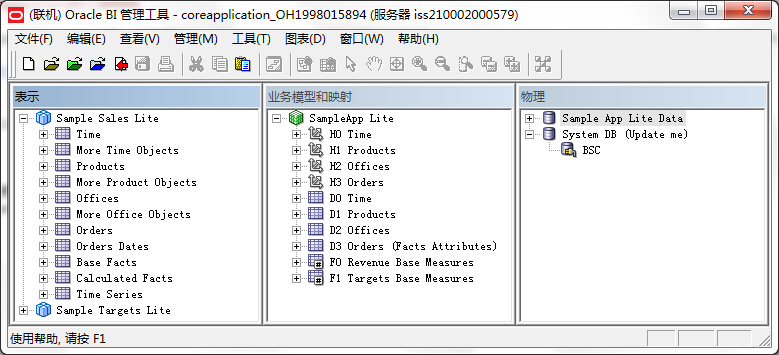
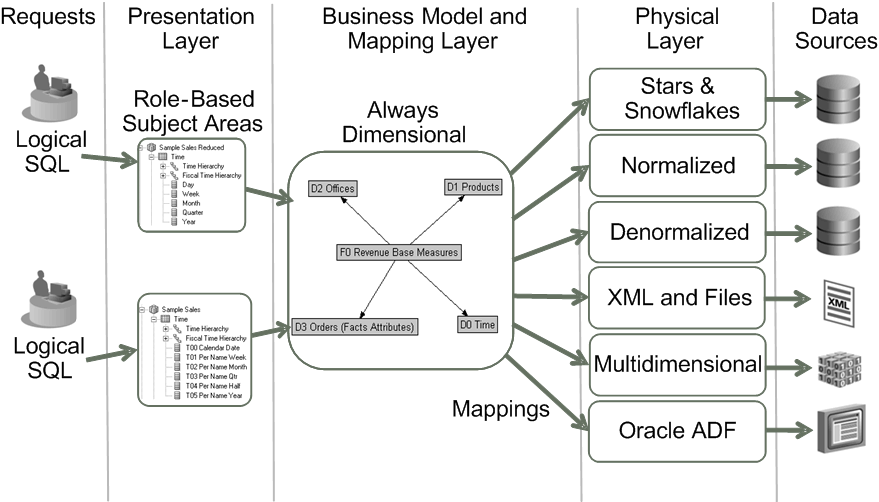

#Oracle BI Repository的三层结构

Oracle BI Repository分为三层：物理层(Physical layer)、业务模型和映射层(Business Model and Mapping layer)、表示层(Presentation layer)

* **物理层(Physical layer)**
  
  物理层中定义对象及其关系，BI Server根据每个物理层的数据源编写本地的查询。该层中可以从数据源中导入tables, cubes, flat files。
  
  将应用的逻辑从物理模型中分离出来可以令多个物理数据源绑定到同一个逻辑对象中，提供聚合疏导和分区的能力，同时不受物理数据源改动的影响而保证维度的一致性。物理层与逻辑的分离使BI应用的创建更加简便。
  
* **业务模型和映射层(Business Model and Mapping layer)**
  
  该层定义业务或数据的逻辑模型，指定业务模型与物理方案之间的映射。它定义了用户可用的对象和关系的超集，决定了用户可见的分析方式。它也隐藏了原始数据模型的复杂度。
  
  逻辑模型中的每个字段都映射到物理层的一个或多个字段。在运行时，Oracle BI Server根据业务模型逻辑SQL请求，然后使用映射确定物理表、文件和cube的最佳集合以生成物理层的查询。映射一般包含计算和转换，可能需要连结多个物理表。
  
* **表示层(Presentation layer)**
  
  该层为用户提供一种方式来展现定制化的、安全的、基于角色的逻辑模型视图。它在业务模型和映射层的基础上进一步抽象化，向Presentation Services和其它客户端发送请求创建用户可见的数据视图。
  
  你可以基于一个业务模型在表示层创建多个主题区域(subject area)，有效地将业务模型切分到各个易于处理的部分。

在充分了解了用户的需求，并设计好业务模型与映射后，你可以使用BI管理工具创建repository了。三层的创建顺序：物理层 》业务模型与映射层 》表示层

