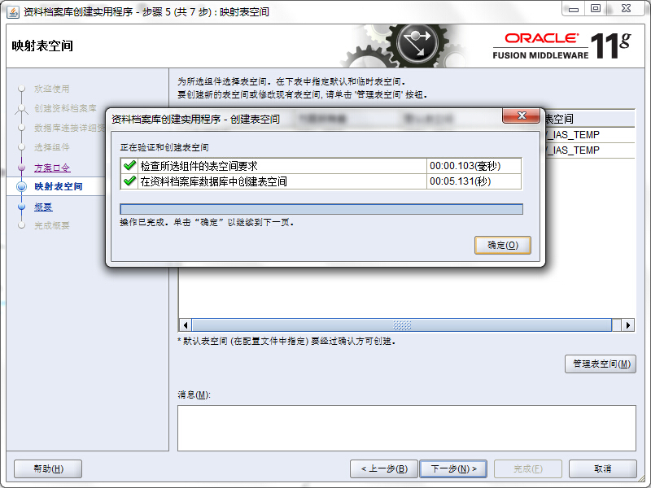

#在Windows 7安装BIEE之一：使用RCU创建资料档案库(二)

从oracle官网下载的zip文件：ofm_rcu_win_11.1.1.7.0_64_disk1_1of1.zip

将它解压到E:\app目录中

则E:\app\rchHome即为RCU_HOME。

打开命令行窗口，执行以下命令：

```
C:\Users\pqpan>e:
E:\>cd app\rcuhome
E:\app\rcuHome>bin\rcu.bat
```

启动资料档案库创建实用程序


点击下一步


选中`创建`，点击下一步


输入资料档案库所在的数据库相关信息，点击下一步


点击确定


输入前缀，选中组件`Oracle Business Intelligence`，则会默认选中依赖的`元数据服务`，点击下一步


点击确定


选中`对所有方案使用相同的口令`，输入口令：Aa123456，点击下一步


点击下一步


点击确定



点击确定


点击创建


创建成功，点击关闭

