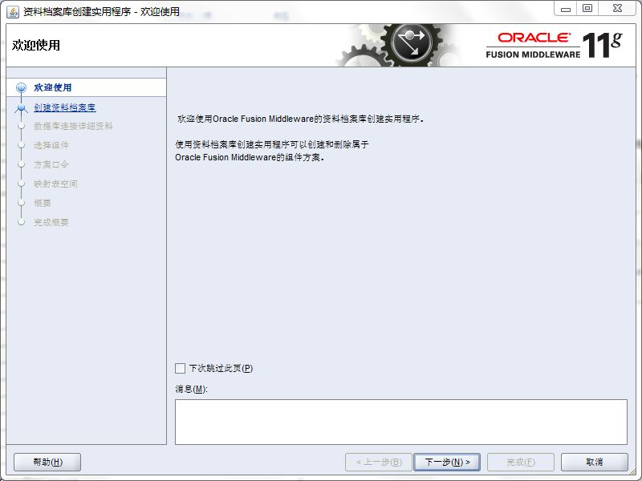
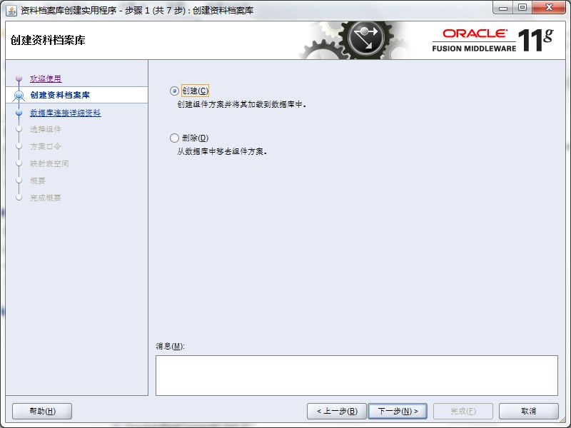

#在Windows 7安装BIEE之使用RCU创建资料库

从oracle官网下载的zip文件：ofm_rcu_win_11.1.1.7.0_64_disk1_1of1.zip

将它解压到E:\app目录中

则E:\app\rchHome即为RCU_HOME。

执行 RCU_HOME\BIN\rcu.bat，开始在图形界面创建资料档案库



点击下一步



选中`创建`，点击下一步


选择和输入资料档案库所在的数据库，点击下一步


点击确定


输入前缀，选中组件`Oracle Business Intelligence`，则会默认选中依赖的`元数据服务`，点击下一步


点击确定


选中`对所有方案使用相同的口令`，输入口令：Aa123456，点击下一步


点击下一步


点击确定


点击确定


点击创建

意外地弹出警告：


点击停止


点击关闭

##错误分析

进入目录 E:\app\rcuHome\rcu\log 查看相关的日志，错误信息：

```
ORA-65096: 公用用户名或角色名无效
```

原因是数据库为Oracle Database 12c Release 1的容器数据库，用户名必须以 `C##` 或者 `c##` 开头。由于BIEE 11g不允许前缀中包含特殊字符（包括#），可判断BIEE 11g的资料档案库不能建在oracle database 12c中。


