#在Windows7安装BIEE 11g x64

##准备安装

[使用RCU创建资料档案库](./在Windows 7安装BIEE之一：使用RCU创建资料档案库(二).md)

从Oracle官网下载安装包，共有4个zip文件，将他们一起解压为 E:\bishiphome

创建目录：E:\app\BIEE11G

##执行安装

**以管理员身份**打开命令行窗口，执行以下命令：

```
C:\Windows\system32>e:
E:\>cd bishiphome
E:\bishiphome>cd disk1
E:\bishiphome\Disk1>setup
E:\bishiphome\Disk1>
```

进入图形安装界面：

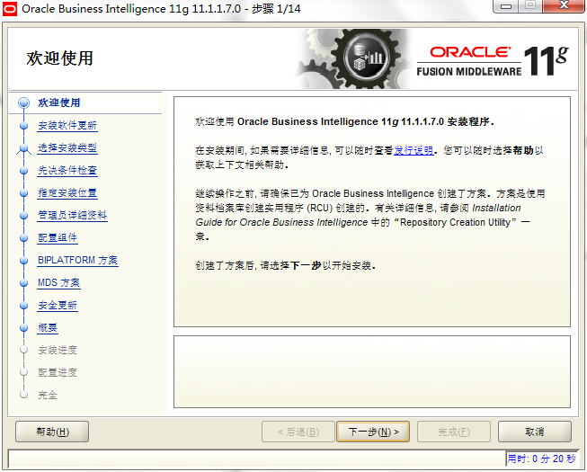

点击下一步

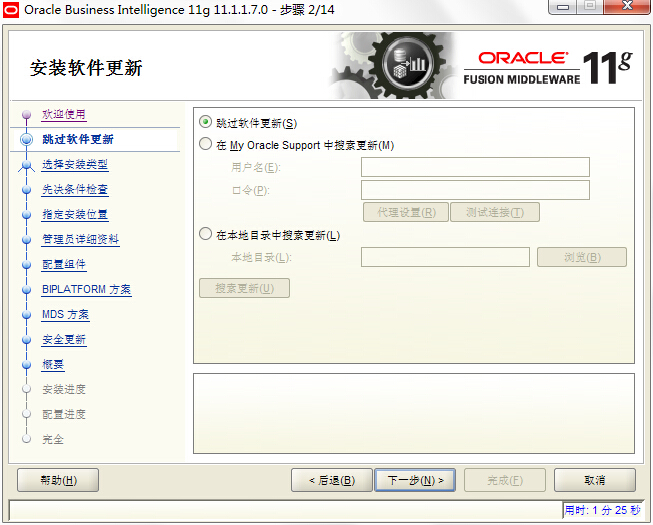

选中`跳过软件更新`，点击下一步

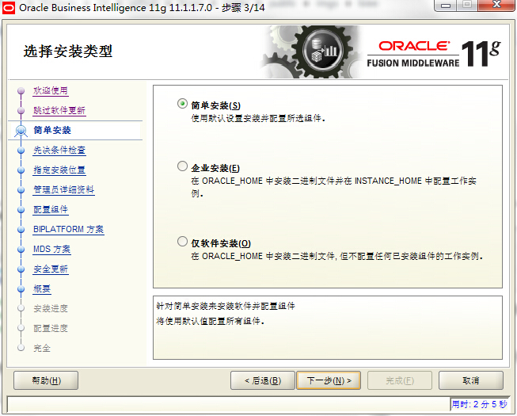

选中`简单安装`，点击下一步

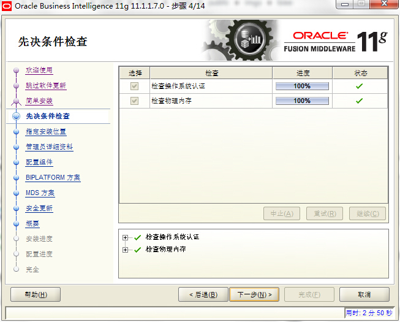

点击下一步

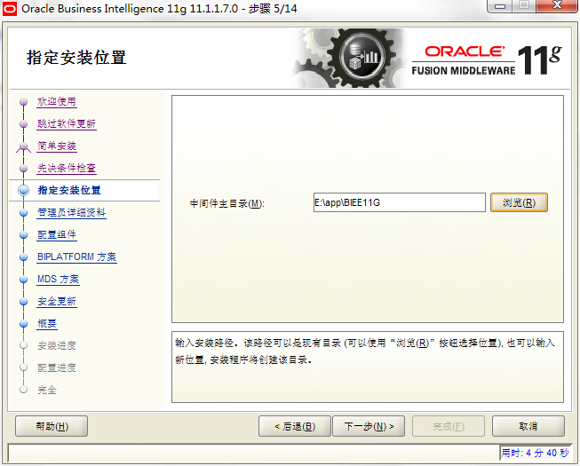

输入或浏览后打开中间件主目录 E:\app\BIEE11G，点击下一步

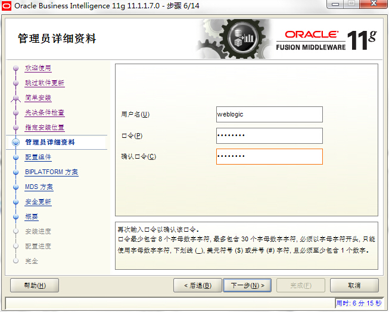

输入口令Aa123456，并点击下一步

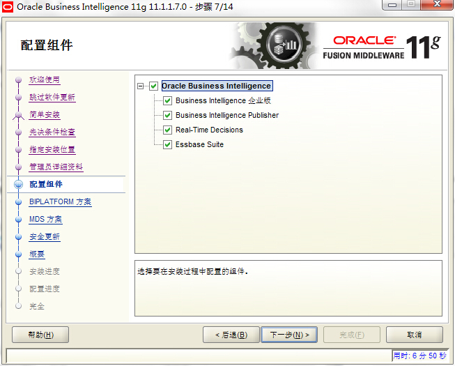

选中所有组件，点击下一步

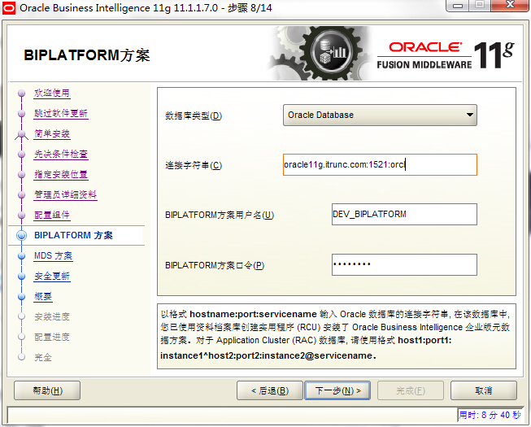

输入资料档案库DEV_BIPLATFORM的相关信息，点击下一步

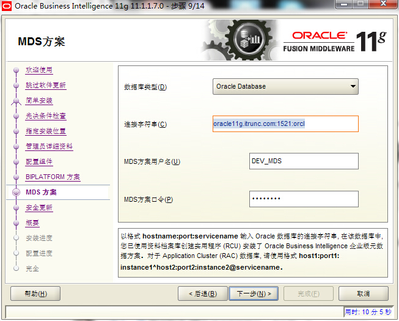

元数据的DEV_MDS相关信息与DEV_BIPLATFORM基本一样，点击下一步

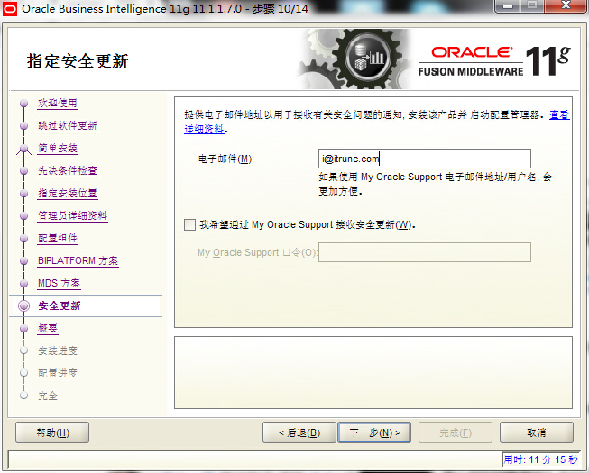

输入电子邮件，取消`我希望通过My Oracle Supportt接收安全更新`，点击下一步

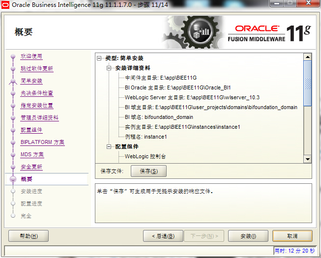

点击安装


开始安装，静默等待模式。。。

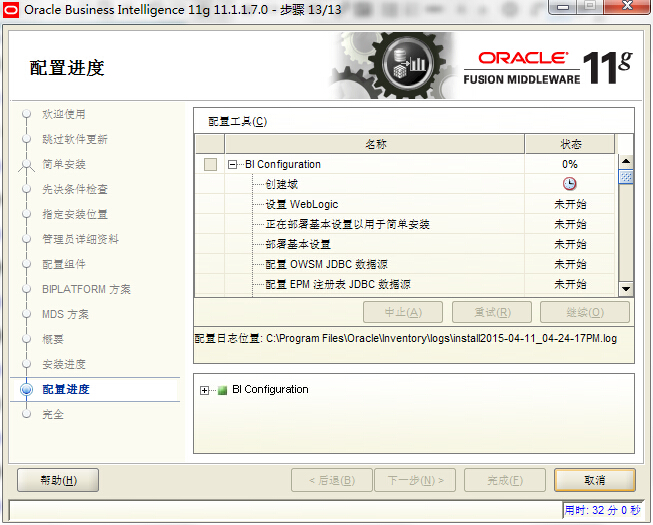

自动进入配置，继续等待。。。

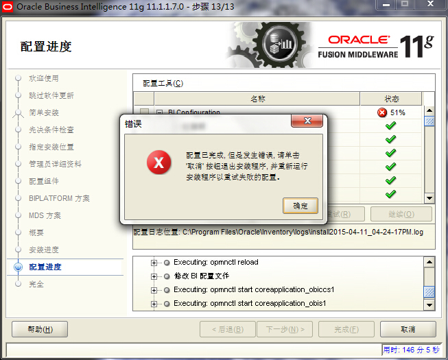

失败了有木有，最关键的两个组件：配置BI域和分发资料档案库！


