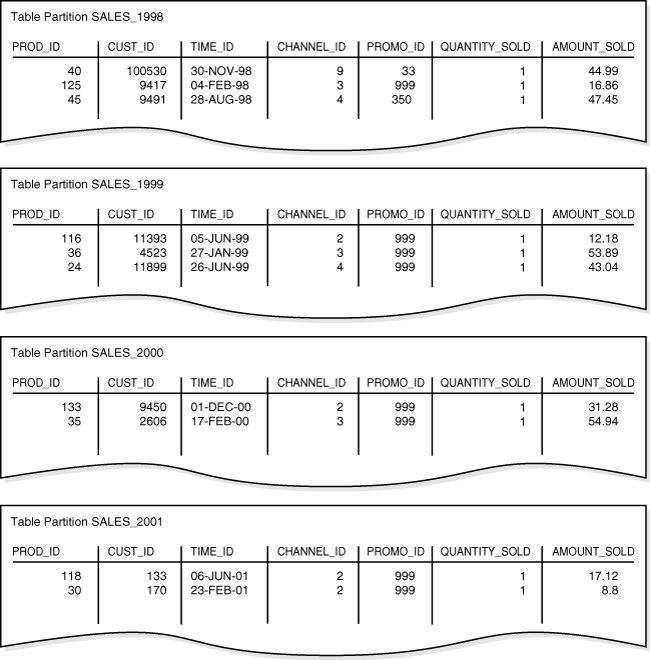
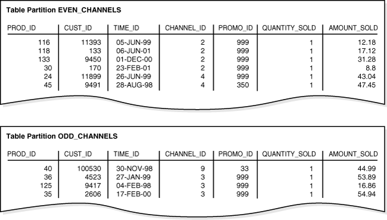
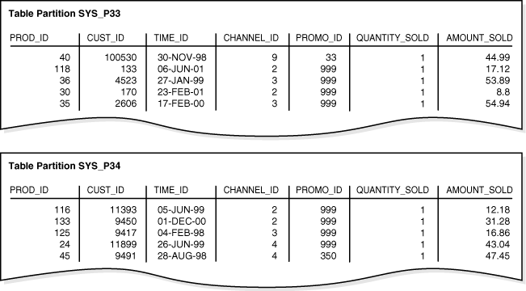
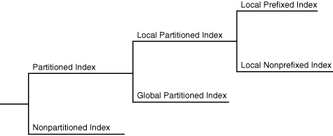
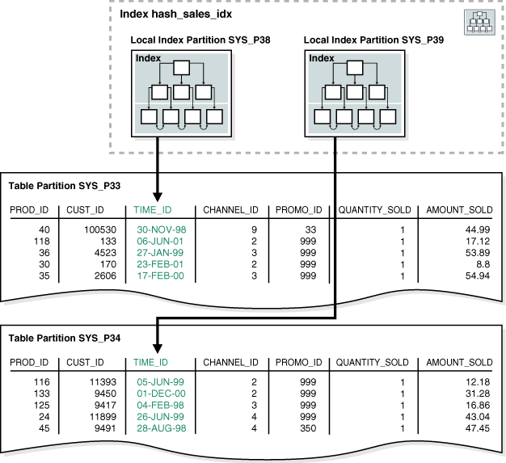
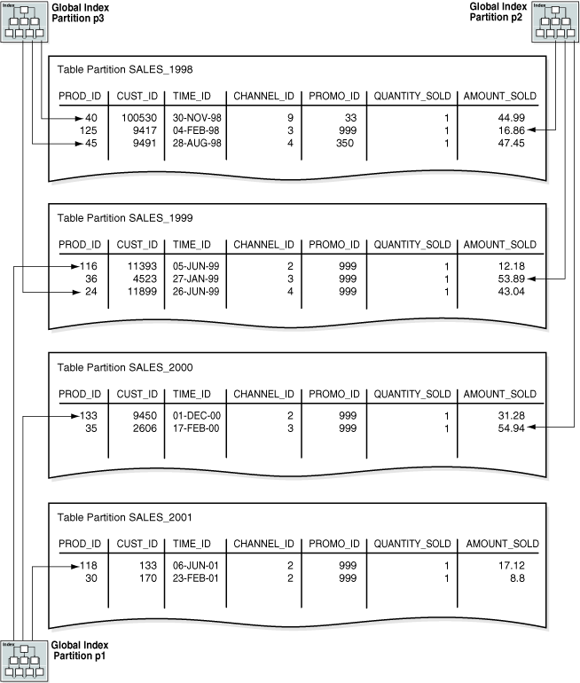
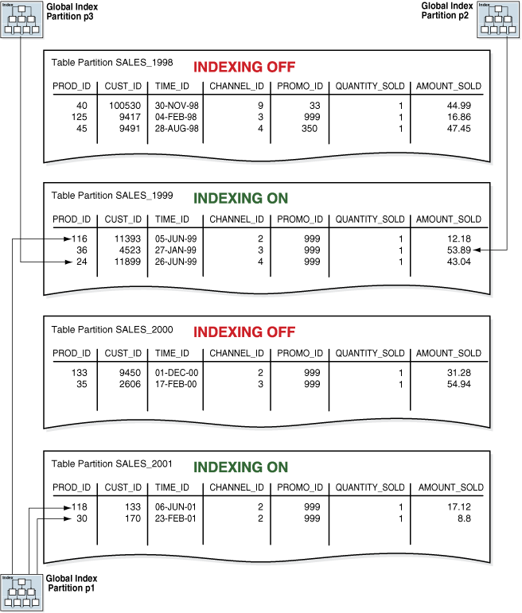

#Overview of Partitions

In an Oracle database, partitioning enables you to decompose very large tables and indexes into smaller and more manageable pieces called partitions. Each partition is an independent object with its own name and optionally its own storage characteristics.

For an analogy that illustrates partitioning, suppose an HR manager has one big box that contains employee folders. Each folder lists the employee hire date. Queries are often made for employees hired in a particular month. One approach to satisfying such requests is to create an index on employee hire date that specifies the locations of the folders scattered throughout the box. In contrast, a partitioning strategy uses many smaller boxes, with each box containing folders for employees hired in a given month.

Using smaller boxes has several advantages. When asked to retrieve the folders for employees hired in June, the HR manager can retrieve the June box. Furthermore, if any small box is temporarily damaged, the other small boxes remain available. Moving offices also becomes easier because instead of moving a single heavy box, the manager can move several small boxes.

From the perspective of an application, only one schema object exists. DML statements require no modification to access partitioned tables. Partitioning is useful for many different types of database applications, particularly those that manage large volumes of data. Benefits include:

* Increased availability

    The unavailability of a partition does not entail the unavailability of the object. The query optimizer automatically removes unreferenced partitions from the query plan so queries are not affected when the partitions are unavailable.

* Easier administration of schema objects

    A partitioned object has pieces that can be managed either collectively or individually. DDL statements can manipulate partitions rather than entire tables or indexes. Thus, you can break up resource-intensive tasks such as rebuilding an index or table. For example, you can move one table partition at a time. If a problem occurs, then only the partition move must be redone, not the table move. Also, dropping a partition avoids executing numerous DELETE statements.

* Reduced contention for shared resources in OLTP systems

    In some OLTP systems, partitions can decrease contention for a shared resource. For example, DML is distributed over many segments rather than one segment.

* Enhanced query performance in data warehouses

    In a data warehouse, partitioning can speed processing of ad hoc queries. For example, a sales table containing a million rows can be partitioned by quarter.

##Partition Characteristics

Each partition of a table or index must have the same logical attributes, such as column names, data types, and constraints. For example, all partitions in a table share the same column and constraint definitions, and all partitions in an index share the same indexed columns. However, each partition can have separate physical attributes, such as the tablespace to which it belongs.

###Partition Key

The partition key is a set of one or more columns that determines the partition in which each row in a partitioned table should go. Each row is unambiguously assigned to a single partition.

In the sales table, you could specify the time_id column as the key of a range partition. The database assigns rows to partitions based on whether the date in this column falls in a specified range. Oracle Database automatically directs insert, update, and delete operations to the appropriate partition by using the partition key.

###Partitioning Strategies

Oracle Partitioning offers several partitioning strategies that control how the database places data into partitions. The basic strategies are range, list, and hash partitioning.

A single-level partitioning uses only one method of data distribution, for example, only list partitioning or only range partitioning. In composite partitioning, a table is partitioned by one data distribution method and then each partition is further divided into subpartitions using a second data distribution method. For example, you could use a list partition for channel_id and a range subpartition for time_id.

####Range Partitioning

In range partitioning, the database maps rows to partitions based on ranges of values of the partitioning key. Range partitioning is the most common type of partitioning and is often used with dates.

Suppose that you want to populate a partitioned table with the sales rows shown in Example 4-1.

**Example 4-1 Sample Row Set for Partitioned Table**

```
  PROD_ID    CUST_ID TIME_ID   CHANNEL_ID   PROMO_ID QUANTITY_SOLD AMOUNT_SOLD
---------- ---------- --------- ---------- ---------- ------------- -----------
      116      11393 05-JUN-99          2        999             1       12.18
       40     100530 30-NOV-98          9         33             1       44.99
      118        133 06-JUN-01          2        999             1       17.12
      133       9450 01-DEC-00          2        999             1       31.28
       36       4523 27-JAN-99          3        999             1       53.89
      125       9417 04-FEB-98          3        999             1       16.86
       30        170 23-FEB-01          2        999             1         8.8
       24      11899 26-JUN-99          4        999             1       43.04
       35       2606 17-FEB-00          3        999             1       54.94
       45       9491 28-AUG-98          4        350             1       47.45 
```

You create time_range_sales as a partitioned table using the statement in Example 4-2. The time_id column is the partition key.

**Example 4-2 Range-Partitioned Table**

```sql
CREATE TABLE time_range_sales
   ( prod_id        NUMBER(6)
   , cust_id        NUMBER
   , time_id        DATE
   , channel_id     CHAR(1)
   , promo_id       NUMBER(6)
   , quantity_sold  NUMBER(3)
   , amount_sold    NUMBER(10,2)
   )
PARTITION BY RANGE (time_id)
 (PARTITION SALES_1998 VALUES LESS THAN (TO_DATE('01-JAN-1999','DD-MON-YYYY')),
  PARTITION SALES_1999 VALUES LESS THAN (TO_DATE('01-JAN-2000','DD-MON-YYYY')),
  PARTITION SALES_2000 VALUES LESS THAN (TO_DATE('01-JAN-2001','DD-MON-YYYY')),
  PARTITION SALES_2001 VALUES LESS THAN (MAXVALUE)
 ); 
```

Afterward, you load time_range_sales with the rows from Example 4-1. Figure 4-1 shows the row distributions in the four partitions. The database chooses the partition for each row based on the time_id value according to the rules specified in the PARTITION BY RANGE clause.

**Figure 4-1 Range Partitions**



The range partition key value determines the high value of the range partitions, which is called the transition point. In Figure 4-1, the SALES_1998 partition contains rows with partitioning key time_id values less than the transition point 01-JAN-1999.

The database creates interval partitions for data beyond the transition point. An interval partition extends range partitioning by instructing the database to create partitions of the specified range or interval. The database automatically creates the partitions when data inserted into the table exceeds all existing range partitions. In Figure 4-1, the SALES_2001 partition contains rows with partitioning key time_id values greater than or equal to 01-JAN-2001.

####List Partitioning

In list partitioning, the database uses a list of discrete values as the partition key for each partition. You can use list partitioning to control how individual rows map to specific partitions. By using lists, you can group and organize related sets of data when the key used to identify them is not conveniently ordered.

Assume that you create list_sales as a list-partitioned table using the statement in Example 4-3. The channel_id column is the partition key.

**Example 4-3 List-Partitioned Table**

```sql
CREATE TABLE list_sales
   ( prod_id        NUMBER(6)
   , cust_id        NUMBER
   , time_id        DATE
   , channel_id     CHAR(1)
   , promo_id       NUMBER(6)
   , quantity_sold  NUMBER(3)
   , amount_sold    NUMBER(10,2)
   )
PARTITION BY LIST (channel_id)
 ( PARTITION even_channels VALUES (2,4),
   PARTITION odd_channels VALUES (3,9)
 ); 
```

Afterward, you load the table with the rows from Example 4-1. Figure 4-2 shows the row distribution in the two partitions. The database chooses the partition for each row based on the channel_id value according to the rules specified in the PARTITION BY LIST clause. Rows with a channel_id value of 2 or 4 are stored in the EVEN_CHANNELS partitions, while rows with a channel_id value of 3 or 9 are stored in the ODD_CHANNELS partition.

**Figure 4-2 List Partitions**




####Hash Partitioning

In hash partitioning, the database maps rows to partitions based on a hashing algorithm that the database applies to the user-specified partitioning key. The destination of a row is determined by the internal hash function applied to the row by the database. The hashing algorithm is designed to distribute rows evenly across devices so that each partition contains about the same number of rows.

Hash partitioning is useful for dividing large tables to increase manageability. Instead of one large table to manage, you have several smaller pieces. The loss of a single hash partition does not affect the remaining partitions and can be recovered independently. Hash partitioning is also useful in OLTP systems with high update contention. For example, a segment is divided into several pieces, each of which is updated, instead of a single segment that experiences contention.

Assume that you create the partitioned hash_sales table using the statement in Example 4-4. The prod_id column is the partition key.

**Example 4-4 Hash-Partitioned Table**

```sql
CREATE TABLE hash_sales
   ( prod_id        NUMBER(6)
   , cust_id        NUMBER
   , time_id        DATE
   , channel_id     CHAR(1)
   , promo_id       NUMBER(6)
   , quantity_sold  NUMBER(3)
   , amount_sold    NUMBER(10,2)
   )
PARTITION BY HASH (prod_id)
PARTITIONS 2; 
```

Afterward, you load the table with the rows from Example 4-1. Figure 4-3 shows a possible row distribution in the two partitions. The names of these partitions are system-generated.

As you insert rows, the database attempts to randomly and evenly distribute them across partitions. You cannot specify the partition into which a row is placed. The database applies the hash function, whose outcome determines which partition contains the row. If you change the number of partitions, then the database redistributes the data over all of the partitions.

**Figure 4-3 Hash Partitions**



##Partitioned Tables

A partitioned table consists of one or more partitions, which are managed individually and can operate independently of the other partitions. A table is either partitioned or nonpartitioned. Even if a partitioned table consists of only one partition, this table is different from a nonpartitioned table, which cannot have partitions added to it. "Partition Characteristics" gives examples of partitioned tables.

A partitioned table is made up of one or more table partition segments. If you create a partitioned table named hash_products, then no table segment is allocated for this table. Instead, the database stores data for each table partition in its own partition segment. Each table partition segment contains a portion of the table data.

Some or all partitions of a heap-organized table can be stored in a compressed format. Compression saves space and can speed query execution. Thus, compression can be useful in environments such as data warehouses, where the amount of insert and update operations is small, and in OLTP environments.

You can declare the attributes for table compression for a tablespace, table, or table partition. If declared at the tablespace level, then tables created in the tablespace are compressed by default. You can alter the compression attribute for a table, in which case the change only applies to new data going into that table. Consequently, a single table or partition may contain compressed and uncompressed blocks, which guarantees that data size will not increase because of compression. If compression could increase the size of a block, then the database does not apply it to the block.

##Partitioned Indexes

A partitioned index is an index that, like a partitioned table, has been divided into smaller and more manageable pieces. Global indexes are partitioned independently of the table on which they are created, whereas local indexes are automatically linked to the partitioning method for a table. Like partitioned tables, partitioned indexes improve manageability, availability, performance, and scalability.

The following graphic shows index partitioning options.



###Local Partitioned Indexes

In a local partitioned index, the index is partitioned on the same columns, with the same number of partitions and the same partition bounds as its table. Each index partition is associated with exactly one partition of the underlying table, so that all keys in an index partition refer only to rows stored in a single table partition. In this way, the database automatically synchronizes index partitions with their associated table partitions, making each table-index pair independent.

Local partitioned indexes are common in data warehousing environments. Local indexes offer the following advantages:

* Availability is increased because actions that make data invalid or unavailable in a partition affect this partition only.

* Partition maintenance is simplified. When moving a table partition, or when data ages out of a partition, only the associated local index partition must be rebuilt or maintained. In a global index, all index partitions must be rebuilt or maintained.

* If point-in-time recovery of a partition occurs, then the indexes can be recovered to the recovery time (see "Data File Recovery"). The entire index does not need to be rebuilt.

Example 4-4 shows the creation statement for the partitioned hash_sales table, using the prod_id column as partition key. Example 4-5 creates a local partitioned index on the time_id column of the hash_sales table.

**Example 4-5 Local Partitioned Index**

```sql
CREATE INDEX hash_sales_idx ON hash_sales(time_id) LOCAL;
```

In Figure 4-4, the hash_products table has two partitions, so hash_sales_idx has two partitions. Each index partition is associated with a different table partition. Index partition SYS_P38 indexes rows in table partition SYS_P33, whereas index partition SYS_P39 indexes rows in table partition SYS_P34.

**Figure 4-4 Local Index Partitions**



You cannot explicitly add a partition to a local index. Instead, new partitions are added to local indexes only when you add a partition to the underlying table. Likewise, you cannot explicitly drop a partition from a local index. Instead, local index partitions are dropped only when you drop a partition from the underlying table.

Like other indexes, you can create a bitmap index on partitioned tables. The only restriction is that bitmap indexes must be local to the partitioned table—they cannot be global indexes. Global bitmap indexes are supported only on nonpartitioned tables.

####Local Prefixed and Nonprefixed Indexes

Local partitioned indexes fall into the following subcategories:

* Local prefixed indexes

    In this case, the partition keys are on the leading edge of the index definition. In Example 4-2, the table is partitioned by range on time_id. A local prefixed index on this table would have time_id as the first column in its list.

* Local nonprefixed indexes

    In this case, the partition keys are not on the leading edge of the indexed column list and need not be in the list at all. In Example 4-5, the index is local nonprefixed because the partition key product_id is not on the leading edge.

Both types of indexes can take advantage of partition elimination (also called partition pruning), which occurs when the optimizer speeds data access by excluding partitions from consideration. Whether a query can eliminate partitions depends on the query predicate. A query that uses a local prefixed index always allows for index partition elimination, whereas a query that uses a local nonprefixed index might not.

####Local Partitioned Index Storage

Like a table partition, a local index partition is stored in its own segment. Each segment contains a portion of the total index data. Thus, a local index made up of four partitions is not stored in a single index segment, but in four separate segments.

###Global Partitioned Indexes

A global partitioned index is a B-tree index that is partitioned independently of the underlying table on which it is created. A single index partition can point to any or all table partitions, whereas in a locally partitioned index, a one-to-one parity exists between index partitions and table partitions.

In general, global indexes are useful for OLTP applications, where rapid access, data integrity, and availability are important. In an OLTP system, a table may be partitioned by one key, for example, the employees.department_id column, but an application may need to access the data with many different keys, for example, by employee_id or job_id. Global indexes can be useful in this scenario.

As an illustration, suppose that you create a global partitioned index on the time_range_sales table from Example 4-2. In this table, rows for sales from 1998 are stored in one partition, rows for sales from 1999 are in another, and so on. Example 4-6 creates a global index partitioned by range on the channel_id column.

**Example 4-6 Global Partitioned Index**

```sql
CREATE INDEX time_channel_sales_idx ON time_range_sales (channel_id)
   GLOBAL PARTITION BY RANGE (channel_id)
      (PARTITION p1 VALUES LESS THAN (3),
       PARTITION p2 VALUES LESS THAN (4),
       PARTITION p3 VALUES LESS THAN (MAXVALUE));
```

As shown in Figure 4-5, a global index partition can contain entries that point to multiple table partitions. Index partition p1 points to the rows with a channel_id of 2, index partition p2 points to the rows with a channel_id of 3, and index partition p3 points to the rows with a channel_id of 4 or 9.

**Figure 4-5 Global Partitioned Index**



##Partial Indexes for Partitioned Tables

A partial index is an index that is correlated with the indexing properties of an associated partitioned table. The correlation enables you to specify which table partitions are indexed.

Partial indexes provide the following advantages:

* Unused table partitions are not indexed, thus saving index storage space.

* Performance of loads and queries can improve.

    Before Oracle Database 12c, an exchange partition operation required a physical update of an associated global index to retain it as usable. Starting with Oracle Database 12c, if the partitions involved in a partition maintenance operation are not part of a partial global index, then the index remains usable without requiring any global index maintenance.

* If at index creation you index only some table partitions and later index others, then you can reduce sort space required by index creation.

You can turn indexing on or off for the individual partitions of a table. A partial local index does not have usable index partitions for all table partitions that have indexing turned off. A global index, whether partitioned or not, excludes the data from all partitions that have indexing turned off. The database does not support partial indexes for indexes that enforce unique constraints.

Figure 4-6 shows the same global index as in Figure 4-5, except that the global index is partial. Table partitions SALES_1998 and SALES_2000 have the indexing property set to OFF, so the partial global index does not index them.

**Figure 4-6 Partial Global Partitioned Index**



##Partitioned Index-Organized Tables

You can partition an index-organized table (IOT) by range, list, or hash. Partitioning is useful for providing improved manageability, availability, and performance for IOTs. In addition, data cartridges that use IOTs can take advantage of the ability to partition their stored data.

Note the following characteristics of partitioned IOTs:

* Partition columns must be a subset of primary key columns.
* Secondary indexes can be partitioned locally and globally.
* OVERFLOW data segments are always equipartitioned with the table partitions.

Oracle Database supports bitmap indexes on partitioned and nonpartitioned index-organized tables. A mapping table is required for creating bitmap indexes on an index-organized table.Partitioned Index-Organized Tables

##Reference

* [1] [Partitions, Views, and Other Schema Objects](http://docs.oracle.com/database/121/CNCPT/schemaob.htm#CFAGCECI)