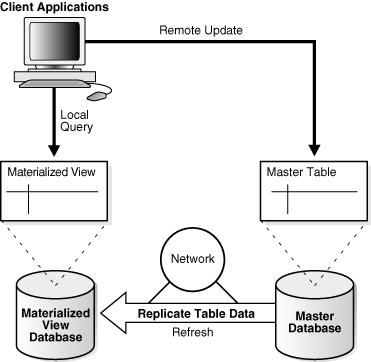
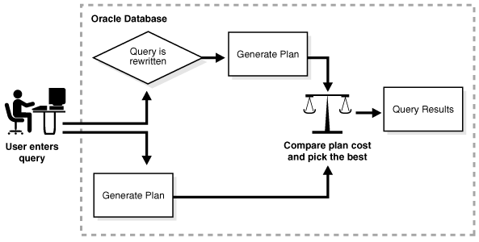

#Overview of Materialized Views

A materialized view is a query result that has been stored or "materialized" in advance as schema objects. The FROM clause of the query can name tables, views, or materialized views. A materialized view often serves as a master table in replication and a fact table in data warehousing.

Materialized views summarize, compute, replicate, and distribute data. They are suitable in various computing environments, such as the following:

* In data warehouses, materialized views can compute and store data generated from aggregate functions such as sums and averages.

    A summary is an aggregate view that reduces query time by precalculating joins and aggregation operations and storing the results in a table. Materialized views are equivalent to summaries (see "Data Warehouse Architecture (Basic)"). You can also use materialized views to compute joins with or without aggregations. If compatibility is set to Oracle9i or higher, then queries that include filter selections can use materialized views.

* In materialized view replication, the view contains a complete or partial copy of a table from a single point in time. Materialized views replicate data at distributed sites and synchronize updates performed at several sites. This form of replication is suitable for environments such as field sales when databases are not always connected to the network.

* In mobile computing environments, materialized views can download a data subset from central servers to mobile clients, with periodic refreshes from the central servers and propagation of updates by clients to the central servers.

In a replication environment, a materialized view shares data with a table in a different database, called a master database. The table associated with the materialized view at the master site is the master table. Figure 4-8 illustrates a materialized view in one database based on a master table in another database. Updates to the master table replicate to the materialized view database.

**Figure 4-8 Materialized View**



##Characteristics of Materialized Views

Materialized views share some characteristics of indexes and nonmaterialized views. Materialized views are similar to indexes in the following ways:

* They contain actual data and consume storage space.

* They can be refreshed when the data in their master tables changes.

* They can improve performance of SQL execution when used for query rewrite operations.

* Their existence is transparent to SQL applications and users.

A materialized view is similar to a nonmaterialized view because it represents data in other tables and views. Unlike indexes, users can query materialized views directly using SELECT statements. Depending on the types of refresh that are required, the views can also be updated with DML statements.

The following example creates and populates a materialized aggregate view based on three master tables in the sh sample schema:

```sql
CREATE MATERIALIZED VIEW sales_mv AS 
  SELECT t.calendar_year, p.prod_id, SUM(s.amount_sold) AS sum_sales
  FROM   times t, products p, sales s
  WHERE  t.time_id = s.time_id 
  AND    p.prod_id = s.prod_id
  GROUP BY t.calendar_year, p.prod_id;
```

The following example drops table sales, which is a master table for sales_mv, and then queries sales_mv. The query selects data because the rows are stored (materialized) separately from the data in the master tables.

```
SQL> DROP TABLE sales;

Table dropped.

SQL> SELECT * FROM sales_mv WHERE ROWNUM < 4;
 
CALENDAR_YEAR    PROD_ID  SUM_SALES
------------- ---------- ----------
         1998         13  936197.53
         1998         26  567533.83
         1998         27  107968.24
```

A materialized view can be partitioned. You can define a materialized view on a partitioned table and one or more indexes on the materialized view.

##Refresh Methods for Materialized Views

The database maintains data in materialized views by refreshing them after changes to the base tables. The refresh method can be incremental or a complete refresh.

###Complete Refresh

A complete refresh executes the query that defines the materialized view. A complete refresh occurs when you initially create the materialized view, unless the materialized view references a prebuilt table, or you define the table as BUILD DEFERRED. A complete refresh can be slow, especially if the database must read and process huge amounts of data. You can perform a complete refresh at any time after creation of the materialized view.

###Incremental Refresh

An incremental refresh, also called a fast refresh, processes only the changes to the existing data. This method eliminates the need to rebuild materialized views from the beginning. Processing only the changes can result in a very fast refresh time.

You can refresh materialized views either on demand or at regular time intervals. Alternatively, you can configure materialized views in the same database as their base tables to refresh whenever a transaction commits changes to the base tables.

Fast refresh comes in either of the following forms:

* Log-Based refresh

    In this type of refresh, a materialized view log or a direct loader log keeps a record of changes to the base tables. A materialized view log is a schema object that records changes to a base table so that a materialized view defined on the base table can be refreshed incrementally. Each materialized view log is associated with a single base table.

* Partition change tracking (PCT) refresh

    PCT refresh is valid only when the base tables are partitioned. PCT refresh removes all data in the affected materialized view partitions or affected portions of data, and then recomputes them. The database uses the modified base table partitions to identify the affected partitions or portions of data in the view. When partition maintenance operations have occurred on the base tables, PCT refresh is the only usable incremental refresh method.

###In-Place and Out-of-Place Refresh

For the complete and incremental methods, the database can refresh the materialized view in either of the following ways:

* In-Place refresh

    This refresh executes the refresh statements directly on the materialized view.

* Out-of-Place refresh

    This refresh creates one or more outside tables, executes the refresh statements on the outside tables, and then switches the materialized view or affected materialized view partitions with the outside tables. An out-of-place refresh achieves high availability during refresh, especially when refresh statements take a long time to finish.

Oracle Database 12c introduces synchronous refresh, which is a type of out-of-place refresh. A synchronous refresh does not modify the contents of the base tables, but instead uses the APIs in the synchronous refresh package, which ensures consistency by applying these changes to the base tables and materialized views at the same time. This approach enables a set of tables and the materialized views defined on them to be always synchronized. In a data warehouse, synchronous refresh method is well-suited for the following reasons:

* The loading of incremental data is tightly controlled and occurs at periodic intervals.

* Tables and their materialized views are often partitioned in the same way, or their partitions are related by a functional dependency.

##Query Rewrite

An optimization technique known as query rewrite transforms a user request written in terms of master tables into a semantically equivalent request that includes materialized views. When base tables contain large amounts of data, computing an aggregate or join is expensive and time-consuming. Because materialized views contain precomputed aggregates and joins, query rewrite can quickly answer queries using materialized views.

The query transformer transparently rewrites the request to use the materialized view, requiring no user intervention and no reference to the materialized view in the SQL statement. Because query rewrite is transparent, materialized views can be added or dropped without invalidating the SQL in the application code.

In general, rewriting queries to use materialized views rather than detail tables improves response time. Figure 4-9 shows the database generating an execution plan for the original and rewritten query and choosing the lowest-cost plan.

**Figure 4-9 Query Rewrite**



##Reference

* [1] [Overview of Materialized Views](http://docs.oracle.com/database/121/CNCPT/schemaob.htm#CFAIGHFC)

