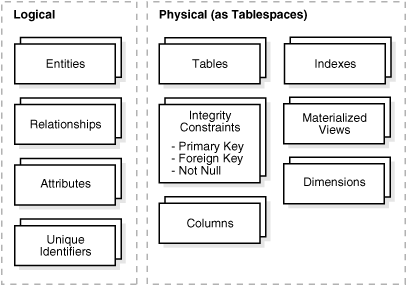
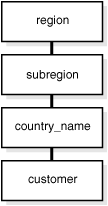

#Data Warehousing Physical Design

This chapter describes the physical design of a data warehousing environment, and includes the following topics:

##Moving from Logical to Physical Design

Logical design is what you draw with a pen and paper or design with a tool such as Oracle Designer before building your data warehouse. Physical design is the creation of the database with SQL statements.

During the physical design process, you convert the data gathered during the logical design phase into a description of the physical database structure. Physical design decisions are mainly driven by query performance and database maintenance aspects. For example, choosing a partitioning strategy that meets common query requirements enables Oracle Database to take advantage of partition pruning, a way of narrowing a search before performing it.

##About Physical Design

During the logical design phase, you defined a model for your data warehouse consisting of entities, attributes, and relationships. The entities are linked together using relationships. Attributes are used to describe the entities. The unique identifier (UID) distinguishes between one instance of an entity and another.

Figure 3-1 illustrates a graphical way of distinguishing between logical and physical designs.

During the physical design process, you translate the expected schemas into actual database structures. At this time, you must map:

* Entities to tables
* Relationships to foreign key constraints
* Attributes to columns
* Primary unique identifiers to primary key constraints
* Unique identifiers to unique key constraints

###Physical Design Structures

You must create some or all of the following structures as part of its physical design:

####Tablespaces

A tablespace consists of one or more datafiles, which are physical structures within the operating system you are using. A datafile is associated with only one tablespace. From a design perspective, tablespaces are containers for physical design structures.

Tablespaces need to be separated by differences. For example, tables should be separated from their indexes and small tables should be separated from large tables. Tablespaces should also represent logical business units if possible. Because a tablespace is the coarsest granularity for backup and recovery or the transportable tablespaces mechanism, the logical business design affects availability and maintenance operations.

You can now use ultralarge data files, a significant improvement in very large databases.

####About Partitioning

Oracle partitioning is an extremely important functionality for data warehousing, improving manageability, performance and availability. This section presents the key concepts and benefits of partitioning noting special value for data warehousing.

Partitioning allows tables, indexes or index-organized tables to be subdivided into smaller pieces. Each piece of the database object is called a partition. Each partition has its own name, and may optionally have its own storage characteristics. From the perspective of a database administrator, a partitioned object has multiple pieces that can be managed either collectively or individually. This gives the administrator considerable flexibility in managing a partitioned object. However, from the perspective of the user, a partitioned table is identical to a non-partitioned table; no modifications are necessary when accessing a partitioned table using SQL DML commands.

Database objects - tables, indexes, and index-organized tables - are partitioned using a partitioning key, a set of columns that determine in which partition a given row will reside. For example a sales table partitioned on sales date, using a monthly partitioning strategy; the table appears to any application as a single, normal table. However, the DBA can manage and store each monthly partition individually, potentially using different storage tiers, applying table compression to the older data, or store complete ranges of older data in read only tablespaces.

#####Basic Partitioning Strategies

Oracle partitioning offers three fundamental data distribution methods that control how the data is actually placed into the various individual partitions, namely:

* Range

    The data is distributed based on a range of values of the partitioning key (for a date column as the partitioning key, the 'January-2012' partition contains rows with the partitioning key values between '01-JAN-2012' and '31-JAN-2012'). The data distribution is a continuum without any holes and the lower boundary of a range is automatically defined by the upper boundary of the preceding range.

* List

    The data distribution is defined by a list of values of the partitioning key (for a region column as the partitioning key, the North_America partition may contain values Canada, USA, and Mexico). A special DEFAULT partition can be defined to catch all values for a partition key that are not explicitly defined by any of the lists.

* Hash

    A hash algorithm is applied to the partitioning key to determine the partition for a given row. Unlike the other two data distribution methods, hash does not provide any logical mapping between the data and any partition.

Along with these fundamental approaches Oracle Database provides several more:

* Interval Partitioning

    An extension to range partitioning that enhances manageability. Partitions are defined by an interval, providing equi-width ranges. With the exception of the first partition all partitions are automatically created on-demand when matching data arrives.

* Partitioning by Reference

    Partitioning for a child table is inherited from the parent table through a primary key - foreign key relationship. Partition maintenance is simplified and partition-wise joins enabled.

* Virtual column based Partitioning

    Defined by one of the above mentioned partition techniques and the partitioning key is based on a virtual column. Virtual columns are not stored on disk and only exist as metadata. This approach enables a more flexible and comprehensive match of the business requirements.

Using the above-mentioned data distribution methods, a table can be partitioned either as single or composite partitioned table:

* Single (one-level) Partitioning

    A table is defined by specifying one of the data distribution methodologies, using one or more columns as the partitioning key. For example consider a table with a number column as the partitioning key and two partitions less_than_five_hundred and less_than_thousand, the less_than_thousand partition contains rows where the following condition is true: 500 <= Partitioning key <1000.

    You can specify range, list, and hash partitioned tables.

* Composite Partitioning

    Combinations of two data distribution methods are used to define a composite partitioned table. First, the table is partitioned by data distribution method one and then each partition is further subdivided into subpartitions using a second data distribution method. All sub-partitions for a given partition together represent a logical subset of the data. For example, a range-hash composite partitioned table is first range-partitioned, and then each individual range-partition is further subpartitioned using the hash partitioning technique.

####Index Partitioning

Irrespective of the chosen index partitioning strategy, an index is either coupled or uncoupled with the partitioning strategy of the underlying table. The appropriate index partitioning strategy is chosen based on the business requirements, making partitioning well suited to support any kind of application. Oracle Database 12c differentiates between three types of partitioned indexes.

* Local Indexes

    A local index is an index on a partitioned table that is coupled with the underlying partitioned table, 'inheriting' the partitioning strategy from the table. Consequently, each partition of a local index corresponds to one - and only one - partition of the underlying table. The coupling enables optimized partition maintenance; for example, when a table partition is dropped, Oracle Database simply has to drop the corresponding index partition as well. No costly index maintenance is required. Local indexes are most common in data warehousing environments.

* Global Partitioned Indexes

    A global partitioned index is an index on a partitioned or nonpartitioned table that is partitioned using a different partitioning-key or partitioning strategy than the table. Global-partitioned indexes can be partitioned using range or hash partitioning and are uncoupled from the underlying table. For example, a table could be range-partitioned by month and have twelve partitions, while an index on that table could be hash-partitioned using a different partitioning key and have a different number of partitions. Global partitioned indexes are more common for OLTP than for data warehousing environments.

* Global Non-Partitioned Indexes

    A global non-partitioned index is essentially identical to an index on a non-partitioned table. The index structure is not partitioned and uncoupled from the underlying table. In data warehousing environments, the most common usage of global non-partitioned indexes is to enforce primary key constraints.

####Partitioning for Manageability

A typical usage of partitioning for manageability is to support a 'rolling window' load process in a data warehouse. Suppose that a DBA loads new data into a table on a daily basis. That table could be range partitioned so that each partition contains one day of data. The load process is simply the addition of a new partition. Adding a single partition is much more efficient than modifying the entire table, because the DBA does not need to modify any other partitions. Another advantage of using partitioning is when it is time to remove data. In this situation, an entire partition can be dropped, which is very efficient and fast, compared to deleting each row individually.

####Partitioning for Performance

By limiting the amount of data to be examined or operated on, partitioning provides a number of performance benefits. Two features specially worth noting are:

* Partitioning pruning: Partitioning pruning is the simplest and also the most substantial means to improve performance using partitioning. Partition pruning can often improve query performance by several orders of magnitude. For example, suppose an application contains an ORDERS table containing an historical record of orders, and that this table has been partitioned by day. A query requesting orders for a single week would only access seven partitions of the ORDERS table. If the table had two years of historical data, this query would access seven partitions instead of 730 partitions. This query could potentially execute 100x faster simply because of partition pruning. Partition pruning works with all of Oracle's other performance features. Oracle Database will utilize partition pruning in conjunction with any indexing technique, join technique, or parallel access method.

* Partition-wise joins: Partitioning can also improve the performance of multi-table joins, by using a technique known as partition-wise joins. Partition-wise joins can be applied when two tables are being joined together, and at least one of these tables is partitioned on the join key. Partition-wise joins break a large join into smaller joins of 'identical' data sets for the joined tables. 'Identical' here is defined as covering exactly the same set of partitioning key values on both sides of the join, thus ensuring that only a join of these 'identical' data sets will produce a result and that other data sets do not have to be considered. Oracle Database is using either the fact of already (physical) equi-partitioned tables for the join or is transparently redistributing ("repartitioning") one table at runtime to create equipartitioned data sets matching the partitioning of the other table, completing the overall join in less time. This offers significant performance benefits both for serial and parallel execution.

####Partitioning for Availability

Partitioned database objects provide partition independence. This characteristic of partition independence can be an important part of a high-availability strategy. For example, if one partition of a partitioned table is unavailable, all of the other partitions of the table remain online and available. The application can continue to execute queries and transactions against this partitioned table, and these database operations will run successfully if they do not need to access the unavailable partition. The database administrator can specify that each partition be stored in a separate tablespace; this would allow the administrator to do backup and recovery operations on an individual partition or sets of partitions (by virtue of the partition-to-tablespace mapping), independent of the other partitions in the table. Therefore in the event of a disaster, the database could be recovered with just the partitions comprising the active data, and then the inactive data in the other partitions could be recovered at a convenient time, thus decreasing the system down-time.In light of the manageability, performance and availability benefits, it should be part of every data warehouse.

###Views

A view is a tailored presentation of the data contained in one or more tables or other views. A view takes the output of a query and treats it as a table. Views do not require any space in the database.

###Integrity Constraints

Integrity constraints are used to enforce business rules associated with your database and to prevent having invalid information in the tables. Integrity constraints in data warehousing differ from constraints in OLTP environments. In OLTP environments, they primarily prevent the insertion of invalid data into a record, which is not a big problem in data warehousing environments because accuracy has already been guaranteed. In data warehousing environments, constraints are only used for query rewrite. NOT NULL constraints are particularly common in data warehouses. Under some specific circumstances, constraints need space in the database. These constraints are in the form of the underlying unique index.

###Indexes and Partitioned Indexes

Indexes are optional structures associated with tables or clusters. In addition to the classical B-tree indexes, bitmap indexes are very common in data warehousing environments. Bitmap indexes are optimized index structures for set-oriented operations. Additionally, they are necessary for some optimized data access methods such as star transformations.

Indexes are just like tables in that you can partition them, although the partitioning strategy is not dependent upon the table structure. Partitioning indexes makes it easier to manage the data warehouse during refresh and improves query performance.

###Materialized Views

Materialized views are query results that have been stored in advance so long-running calculations are not necessary when you actually execute your SQL statements. From a physical design point of view, materialized views resemble tables or partitioned tables and behave like indexes in that they are used transparently and improve performance.

###Dimensions

A dimension is a structure, often composed of one or more hierarchies, that categorizes data. Dimensional attributes help to describe the dimensional value. They are normally descriptive, textual values. Several distinct dimensions, combined with facts, enable you to answer business questions. Commonly used dimensions are customers, products, and time.

A dimension schema object defines hierarchical relationships between columns or column sets. A hierarchical relationship is a functional dependency from one level of a hierarchy to the next one. A dimension object is a container of logical relationships and does not require any space in the database. A typical dimension is city, state (or province), region, and country.

Dimension data is typically collected at the lowest level of detail and then aggregated into higher level totals that are more useful for analysis. These natural rollups or aggregations within a dimension table are called hierarchies.

This section contains the following topics:

####Hierarchies

Hierarchies are logical structures that use ordered levels to organize data. A hierarchy can be used to define data aggregation. For example, in a time dimension, a hierarchy might aggregate data from the month level to the quarter level to the year level. A hierarchy can also be used to define a navigational drill path and to establish a family structure.

Within a hierarchy, each level is logically connected to the levels above and below it. Data values at lower levels aggregate into the data values at higher levels. A dimension can be composed of more than one hierarchy. For example, in the product dimension, there might be two hierarchies—one for product categories and one for product suppliers.

Dimension hierarchies also group levels from general to granular. Query tools use hierarchies to enable you to drill down into your data to view different levels of granularity. This is one of the key benefits of a data warehouse.

When designing hierarchies, you must consider the relationships in business structures. For example, a divisional multilevel sales organization can have complicated structures.

Hierarchies impose a family structure on dimension values. For a particular level value, a value at the next higher level is its parent, and values at the next lower level are its children. These familial relationships enable analysts to access data quickly.

#####Levels

A level represents a position in a hierarchy. For example, a time dimension might have a hierarchy that represents data at the month, quarter, and year levels. Levels range from general to specific, with the root level as the highest or most general level. The levels in a dimension are organized into one or more hierarchies.

#####Level Relationships

Level relationships specify top-to-bottom ordering of levels from most general (the root) to most specific information. They define the parent-child relationship between the levels in a hierarchy.

Hierarchies are also essential components in enabling more complex rewrites. For example, the database can aggregate an existing sales revenue on a quarterly base to a yearly aggregation when the dimensional dependencies between quarter and year are known.

####Typical Dimension Hierarchy

Figure 3-2 illustrates a dimension hierarchy based on customers.

##Reference

* [1] [Data Warehousing Physical Design](http://docs.oracle.com/database/121/DWHSG/ch3physdes.htm#CHDDBFIC)
