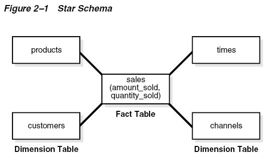

#oracle数据仓库

##Data warehouse和OLTP系统的对比

和OLTP系统不同，数据仓库的主要目的是集中统一的存放业务的历史数据，以便用于查询和分析。

数据仓库理论的鼻祖William Inmon给数据仓库的特性归纳为一下四点：

* 面向主题(Subject Oriented)
* 集成(Inegrated)
* 不可修改(Nonvolatile)
* 时间相关(Time Variant)

数据仓库和OLTP是基于不同的需求而得出的解决方案。下面是数据仓库和OLTP系统的一些主要方面的对比：

### 负载

数据仓库主要设计为适合即席查询(Ad hoc query)，我们无法预先知道数据仓库的负荷，所以，数据仓库需要设计为能够适应各种可能的查询
而OLTP系统一般执行的操作是可以预先确定的，可以按照估计出的系统负荷来设计OLTP系统.

###数据修改

数据仓库一般是通过ETL，周期性的将新的数据批量装载。数据进入数据仓库后，一般是不可修改的，所以数据仓库当中一般会建较多的索引用于优化查询。而OLTP系统，终端用户可以修改其对应的某些数据，所有OLTP系统一般即时体现着当前最新的数据。

###架构设计

数据仓库一般采用非规范化或者部分非规范化的设计，以优化查询性能，典型的设计如星型模型和雪花模型。因为非规范化设计，可以只需要join较少的表就得到更多的数据。而OLTP系统一般采用规范化的设计，以避免出现update/insert/delete异常，并保证数据的一致性。

###典型操作

数据仓库中，一条查询可能需要访问上千，甚至几百万行数据，所以查询的性能相当重要。在oracle中，dimension，materialized view，bitmap index等技术，都在数据仓库中大量使用以优化查询性能。OLTP中，一个操作一般只需要访问有限的几条数据。

###历史数据

数据仓库中需要大量的历史数据，以便从历史数据中分析所需要的信息OLTP系统则一般会将历史数据删除，以保证当前事务处理的性能。

##数据仓库建模

目前来说，数据仓库的数据存储载体还是关系数据库。对于数据仓库的建模，自然也要遵循关系数据库的一般设计准则。从数据仓库诞生以来，主要有两种建模方式。一种是Inmon推荐的关系模型，遵循规范化理论。另外一种是kimpall提出的多维模型，这是目前项目实践中的主流建模方式。多维模型中，最基本用的最多的就是星型模型(star schema)。

Star schema主要的思想在于将我们关心的数据和用于描述数据的属性分隔开来。实际的数据存放于Fact table中，从不同角度来描述数据的属性放到不同的dimension table中。比如，一个sales数据仓库可以这样设计，每一笔销售记录，应该会包含销售的产品，销售的客户，销售的供货商，销售的时间，销售的数量和获得的收入等。当我们要分析整个公司的所有销售记录时，毫无疑问，我们最关心的是一共销售了多少？

一共获得了多少收入？然后更进一步，在某个时间段内销售了多少？来自哪家供货商的产品的销售额最大？面向哪种客户的销售额最大？哪种产品的销售额最大？等等。

从上面我们关心的这些问题我们可以看到，对于销售的数量和金额这类具体的数字型的数据，通常是我们分析的对象，而对于像时间，产品，客户，供货商，我们希望从这些不同的角度来得到数字型数据的一个统计结果。所以，我们将数字型的数据存放在fact table中，将时间，产品，客户，供货商存放在不同的dimension table中，自然，在fact table和dimension table之间存在一个主-外键的关联，各个dimension table之间则没有关系。由此我们可以得到如下的一个star schema:



star schema之所以叫star schema，就是由于上面这个图形的形状来的，fact table处于中间的位置，dimension table围成一圈，每个dimension table和fact table关联。Fact table中除了区分每条记录的主键（fact table的主键很有可能是所有dimension table的外键组合起来的一个组合主键），连接每个dimension table的外键外，就只有我们关心的数字型数据，所以fact table中的每条记录，有个专门的术语称之为度量(measurement)，因为我们利用数据仓库做统计分析的时候，这些数据就是统计分析的一个个基本单位，也就是度量值。

显然，star schema是反规范化的。如果将dimension table按照规范化拆开，则star schema演化成了雪花模型(snowflake schema).规范化减少了数据的冗余，但是由于查询的时候要连接更多的表，性能就会受到影响。由于数据仓库主要用于查询的特性，除非你有非常特别的原因，一般推荐此采用star schema来进行数据仓库的架构设计。


##RELY constraint

数据仓库中的数据，一般是通过ETL定期load进来的。在做ETL的时候，一般会对load的数据的一致性做检查。所以，我们有理由认为，数据仓库中的数据都是符合一致性要求的。

既然我们已经可以确定数据仓库中的数据是一致的，那么就可以不在表上建constraint，constraint对DML或者load操作是有性能影响的，能不用当然不用的好。但是，虽然表中的数据实际上一致了，oracle自己却不知道，优化器也不知道。在利用物化视图查询重写(query rewrite)时，constraint和dimension的作用是很大的（一般在数据仓库环境中，query_rewrite_integrity参数设置为trusted），查询重写对数据仓库的性能影响相当大。

为了告诉oracle，数据应该符合某种一致性条件了，而又不想创建的constraint其作用，就可以创建类型为RELY的constraint，也就是一种可以让oracle知道这些数据是符合这些约束的，但这个约束本身却是没有其实际作用的约束。

文档中给出了一个例子：

```sql
ALTER TABLE sales ADD CONSTRAINT sales_time_fk
FOREIGN KEY (time_id) REFERENCES times (time_id)
RELY DISABLE NOVALIDATE;
```

另外，视图只能创建RELY constraint，不能创建普通的constraint。

##Dimension

前面我们提到，除了constraint，另外一个影响物化视图查询重写的重要因素就是dimension。

要理解oracle中的dimension，首先要搞清楚dimension和dimension table之间的区别。dimension table是table，和关系数据库中的其他table一样，存放数据，需要实际的存储空间。而dimension则只是一个逻辑结构，定义了dimension table中的一个列或一组列于其他列之间的一个层次关系，dimension只保存定义，可以将其理解为一种特定的constraint。所以，dimension不是一种必须存在的结构，但是，创建dimension对于数据仓库中一些复杂的查询重写有着相当重要的意义。而查询重写，则是数据仓库性能优化的一个不二法门。

数据仓库中由于数据量巨大，一些聚合计算等操作往往通过物化视图预先计算存储。但是，不可能对所有维度的所有可能的聚合操作都建立物化视图，一则空间不允许，二则刷新时间也不允许。那么，在对某些聚合操作的sql进行查询重写时，就希望能利用已经存在的物化视图，尽管他们的聚合操作条件不完全一致。而dimension定义的各个level之间的层次关系，对于一些上卷(rolling up)和下钻(drilling down)操作的查询重写的判断是相当重要的，而dimension中定义的attributes对于使用不同的列来做分组的查询重写起作用。

一个典型的dimension定义如下：

```sql
CREATE DIMENSION products_dim
LEVEL product IS (products.prod_id)
LEVEL subcategory IS (products.prod_subcategory)
LEVEL category IS (products.prod_category)
HIERARCHY prod_rollup (
product CHILD OF
subcategory CHILD OF
category
)
ATTRIBUTE product_info LEVEL product DETERMINES
(products.prod_name, products.prod_desc,
prod_weight_class, prod_unit_of_measure,
prod_pack_size, prod_status, prod_list_price, prod_min_price)
ATTRIBUTE subcategory DETERMINES
(prod_subcategory, prod_subcategory_desc)
ATTRIBUTE category DETERMINES
(prod_category, prod_category_desc);
```

dimension中三个重要的属性：level，hierarchy，attribute。其中level定义了一个或一组列为一个整体，而hierarchy则定义了各个level之间的层次关系，父level和子level之间是一种1:N的关系，而且，在dimension中可以指定多个hierarchy层次关系。attribute则定义了level和其他列的一个1:1的关系，但这种1:1的关系不一定是可逆的，比如上面的列子，根据product_info，也就是prod_id，可以确定prod_name，但不一定要求prod_name就能确定prod_id。

而且，各个level之间的列不一定要来自同一个table，对于雪花模型，dimension table可能被规范化为许多的小表，则dimension中的level可能是来自不同表中的列。这是需要在dimension中指定join key来指出各个表之间的关联列。例如：

```sql
CREATE DIMENSION customers_dim
LEVEL customer IS (customers.cust_id)
LEVEL city IS (customers.cust_city)
LEVEL state IS (customers.cust_state_province)
LEVEL country IS (countries.country_id)
LEVEL subregion IS (countries.country_subregion)
LEVEL region IS (countries.country_region)
HIERARCHY geog_rollup (
customer CHILD OF
city CHILD OF
state CHILD OF
country CHILD OF
subregion CHILD OF
region
JOIN KEY (customers.country_id) REFERENCES country);
```

如果不指定skip when null子句，每个level中都不允许出现null值。

通过dbms_dimension.describe_dimension可以查看dimension的定义。

通过dbms_dimension.validate_dimension可以检查dimension是否定义正确，在执行之前需要执行ultdim.sql创建一个dimension_exceptions表，如果定义有误，则会在dimension_exceptions中查到相应的记录。在9i里，validate_dimension在dbms_olap包中。

关于dimension, AskTom上有个问题写得比较详尽，值得仔细研究，[点此阅读](http://asktom.oracle.com/pls/ask/f?p=4950:8:7149133858280544210::NO::F4950_P8_DISPLAYID,F4950_P8_CRITERIA:47464735113741)。

##Bitmap join index

Bitmap index的主要思想就是，针对每一个可能的值x，建立一个或一组位图映射，每个bit为1代表这个位置的值等于x，为0则不等于x。而每个位置都可以直接映射到某一行的rowid。由于在执行DML操作时，锁定的是整个bitmap，而不是bitmap中的某个位，所以bitmap index对于并发DML的性能很差，而且频繁的DML操作会使得bitmap index的空间效率大打折扣，所以OLTP系统并不合适使用bitmap index。对于基本没有DML操作，有大量ad hoc查询的Data warehouse环境则相当有效。关于bitmap index的理解，可以参考itpub上的一篇深入讨论。

从oracle9i起，oracle又引进了一种新的索引类型：bitmap join index。和bitmap index建立在单个table上不同，bitmap join index是基于多表连接的，连接条件要求是等于的内连接(equi-inner join)。对于数据仓库而言，较普遍的是Fact table的外键列和相关的Dimension table的主键列的连接操作。

Bitmap join index能够消除查询中的连接操作，因为它实际上已经将连接的结果保存在索引当中了。而且，相对于在表的连接列上建普通bitmap index来说，bitmap join index需要更少的存储空间。同样的基于连接的Metarialized view也可以用来消除连接操作。但bitmap join index比起物化视图来更有效率，因为通过bitmap join index可以直接将基于索引列的查询对应到事实表的rowid。

以oracle的sample schema SH中的sales和customers表做个例子

###建立基于维度表中一个列的bitmap join index

```sql
create bitmap index sales_cust_gender_bjix
on sales(customers.cust_gender)
from sales,customers
where sales.cust_id=customers;
```

建立这样的bitmap join index后，下面的查询就可以从index中直接得到结果，而不再需要连接sales和custmoers两张表来获得结果了。相当于根据连接条件，将customers表中的cust_gender列保存到sales表中了。

```sql
select sum(sales.amount_sold)
from sales,customers
where sales.cust_id,customers.cust_id
and customers.cust_gender='M';
```

通过将bitmap join index dump出来可以看到，实际上，索引是按照ustomers.cust_gender分成2个位图，每个位图映射到sales表的ROWID。

所以根据customers.cust_gender来过滤连接结果时，从索引中可以直接得到目标数据在sales中的rowid，无须执行join操作了。

一个可能的执行计划如下：

```
Execution Plan
----------------------------------------------------------
0 SELECT STATEMENT Optimizer=CHOOSE (Cost=3751 Card=1 Bytes=9)
1 0 SORT (AGGREGATE)
2 1 PARTITION RANGE (ALL)
3 2 TABLE ACCESS (BY LOCAL INDEX ROWID) OF 'SALES' (Cost=3751 Card=508136 Bytes=4573220)
4 3 BITMAP CONVERSION (TO ROWIDS)
5 4 BITMAP INDEX (SINGLE VALUE) OF 'IX_BITMAP'
```

###建立基于一个维度表中多个列的bitmap join index

```sql
create bitmap index sales_cust_ms_bjix
on sales(customers.cust_gender,customers.cust_id)
from sales,customers
where sales.cust_id=customers.cust_id;
```

###建立多个维度表到一个事实表的bitmap join index

```sql
create bitmap index sales_c_gender_p_cat_bjix
on sales(customers.cust_gender,products.prod_category)
from sales,customers,products
where sales.cust_id=customers.cust_id
and sales.prod_id=products.prod_id;
```

###建立基于snowflake schme的bitmap join index

雪花模型的维度表被规范化为多个小表，也就是建index的时候需要额外连接其他几个表

```sql
create bitmap index sales_co_country_name_bjix
on sales(countries.country_name)
from sales,countries,customers
where sales.country_id=countries.country_id
and sales.cust_id=customers.cust_id;
```

Bitmap join index的一些限制条件

* 只支持CBO
* 只能是equi-inner连接，任何外连接都无法使用bitmap join index
* 多个连接条件只能是AND关系
* 只能在fact table上执行并行DML。如果在dimension table上执行并行DML，会导致索引变为unusable状态。
* 不同的事务中，只能并发更新一个表
* 在From字句中，任何一个表都不能出现两次
* 在索引组织表(IOT)和临时表上不能建立bitmap join index
* 索引只能基于dimenion table中的列
* 维度表用于连接的列只能是主键列或者是有唯一约束的列。

```
SQL> create bitmap index sales_cust_gender_bjix
2 on sales(customers.cust_gender)
3 from sales,customers
4 where sales.cust_id=customers.cust_id;
from sales,customers
*
ERROR at line 3:
ORA-25954: missing primary key or unique constraint on dimension
```

如果维度表的主键是组合主键，那么连接条件需要是全部主键列都参与其他对于bitmap index的限制条件同样使用于bitmap join index，比如在分区表上只能是local，不能是global。

##Unique constraint & unique index

一般情况下，unique constraint都是通过unique index来实现的。但是在数据仓库中，由于数据量巨大，建立一个索引可能需要花费相当大的时间和空间，假如查询中又用不上这个索引的话，那么建立索引的高代价却没有带来什么收益，这是很不划算的。

举个例子，假如有一个sales表，其中sales_id的数据是唯一的，我们在sales_id上建一个unique constraint，语法如下：

```sql
alter table sales add constraint sales_uk unique(sales_id);
```

这样建立的unique constraint是enable validate状态的，oracle会自动在sales_id列上创建一个的名为sales_uk的unique index。通过查询user_indexes或者user_ind_columns视图可以看到这个index：

```
SQL> select index_name,column_name from user_ind_columns where index_name='SALES_UK';
INDEX_NAME COLUMN_NAME
--------------------- ---------------------
SALES_UK SALES_ID
```

在数据仓库环境中，这个unique index可能是不合适的：

* 这个索引可能会相当的大。
* 在查询中几乎不会用到sales_id来做为过滤条件
* 多数情况下，sales会是一个分区表，而且分区键不会是sales_id。这样这个unique index必须是global index，在对分区的一些DDL操作中可能会导致global index失效。那么怎么能在创建unique constraint的同时不生成unique index呢？很简单，创建一个状态为disable validate的unique constraint就能满足上述要求。

```sql
alter table sales add constraint sales_uk unique(sales_id) disable validate;
```

再来查询user_ind_columns可以发现没有记录：

```
SQL> select index_name,column_name from user_ind_columns where index_name='SALES_ID';
no rows selected
```

但是disable validate状态的索引会导致无法对该列进行DML操作

```
SQL> delete from sales where rownum=1;
delete from sales where rownum=1
*
ERROR at line 1:
ORA-25128: No insert/update/delete on table with constraint (NING.SALES_UK) disabled and validated
```

那么，要修改有disable validate约束的表中的数据，只有以下两种方法：

* 使用DDL操作，比如分区表的exchange partition
* 首先drop constraint，修改数据，再重新创建disable validate的constraint

##Partition table

分区表(partition table)在数据仓库中的重要性不言而寓，数据仓库的事实表中的数据量一般都比较大，而且很多时候是和时间相关的历史数据，使用范围分区是最合适的，但有时也要结合实际考虑其他的分区方式。

分区有三种基本的方式：range,hash和list。某个分区还可以继续进行子分区，所以，上面三种基本的分区还可以组成两种组合分区：range-hash和range-list。

###Range partition

范围分区就是安装分区键的不同范围的数据进入到不同的分区当中，对于按照时间延续性的历史数据，这种分区非常合适。所以这种分区也是

最常见的分区形式。

例如，对于一个销售记录的表，可以按照销售时间来分区，每个月的数据都单独做为一个分区：

```sql
CREATE TABLE sales_range
(salesman_id NUMBER(5),
salesman_name VARCHAR2(30),
sales_amount NUMBER(10),
sales_date DATE)
PARTITION BY RANGE(sales_date)
(PARTITION sales_jan2000 VALUES LESS THAN(TO_DATE('02/01/2000','DD/MM/YYYY')),
PARTITION sales_feb2000 VALUES LESS THAN(TO_DATE('03/01/2000','DD/MM/YYYY')),
PARTITION sales_mar2000 VALUES LESS THAN(TO_DATE('04/01/2000','DD/MM/YYYY')),
PARTITION sales_apr2000 VALUES LESS THAN(TO_DATE('05/01/2000','DD/MM/YYYY')));
```

注意，分区表达式中是一个小于的关系，也就是不包括边界的，等于边界值的数据会进入到下一个分区。如果我们还有些数据在所有的分区定义之外，那么可以定义一个条件为MAXVALUE的分区，例如partition sales_other values less than(Maxvalue)，则不符合前面所有分区条件的数据都会进入这个“默认分区”。

如果你遇到以下情况，考虑使用范围分区是非常合适的：

* 对于一个大表，经常使用范围条件来查询的，可以考虑将该条件作为分区键进行反问分区。
* 你希望对表中的数据滚动更新。比如保持36个月的销售记录，每个月删除36个月前的分区，再建一个新的分区，将新的一个月的记录加进来。
* 当一个表中的数据量非常大的时候，一些管理任务，比如备份恢复什么的，都会花费相当长的时间。而将这些表改造成分区表对于简化这些管理任务相当有效，可以针对单个的分区来进行管理。

###Hash partition

Hash分区是，根据oracle内部的一种hash算法，将不同的数据放到不同的分区当中，因此能够将所有的数据比较平均的分到所有的分区中，是各个分区中的数据量比较平衡。
Oracle采用的是一种线性hash算法，分区的数目建议是2的指数个，比如2,4,8,16……

下面是4个分区的例子：

```sql
CREATE TABLE sales_hash
(salesman_id NUMBER(5),
salesman_name VARCHAR2(30),
sales_amount NUMBER(10),
week_no NUMBER(2))
PARTITION BY HASH(salesman_id)
PARTITIONS 4;
```

由于hash分区不是按照数据本身的一些逻辑来分区的，所以对于历史数据不合适，主要用来将数据平衡到各个分区当中。而且，hash分区的分区排除只能基于等于条件。

使用hash分区，你可以：

* 对于一些大数据量的表，提供更好的可用性和可管理性。这个算是所有分区表的共性。
* 防止数据在不同分区表中间分布不均。这个是hash分区的特性。
* 对于经常使用等于条件或者in条件的查询，hash分区可以很好的使用分区排除和分区级连接。这个可以算hash分区的一个限制条件。

###List partition

List分区可能是用的比较少的一种分区方式了。采用list分区，你可以完全的控制数据到分区的映射，不想范围分区只能指定某个范围的数据到某个分区。对于一些没有明显范围性的离散数据，采用list分区就比较合适了。

比如按照销售的地点进行list分区：

```sql
CREATE TABLE sales_list
(salesman_id NUMBER(5),
salesman_name VARCHAR2(30),
sales_state VARCHAR2(20),
sales_amount NUMBER(10),
sales_date DATE)
PARTITION BY LIST(sales_state)
(PARTITION sales_west VALUES('California', 'Hawaii') COMPRESS,
PARTITION sales_east VALUES('New York', 'Virginia', 'Florida'),
PARTITION sales_central VALUES('Texas', 'Illinois'));
```

对于list分区，如果有其他不符合上面所有分区定义条件的数据，可以建一个default分区来存放，就好像Range分区的Maxvalue一样：PARTITION sales_other VALUES(DEFAULT))。List分区还有一个限制，就是分区键只能是一个列，而不像Range和hash分区的分区键可以是多个列的组合，当然，也有限制，最多不能超过16个列的组合。

###Composite partition

Oracle只有两种组合分区方式，Range-hash和Range-list。组合分区的有点就是集合了两种不同分区方式的优点。而且，对于每个子分区，oracle都单独建了一个segment。

Range-hash分区的例子：

```sql
CREATE TABLE sales_range_hash(
s_productid NUMBER,
s_saledate DATE,
s_custid NUMBER,
s_totalprice NUMBER)
PARTITION BY RANGE (s_saledate)
SUBPARTITION BY HASH (s_productid) SUBPARTITIONS 8
(PARTITION sal99q1 VALUES LESS THAN (TO_DATE('01-APR-1999', 'DD-MON-YYYY')),
PARTITION sal99q2 VALUES LESS THAN (TO_DATE('01-JUL-1999', 'DD-MON-YYYY')),
PARTITION sal99q3 VALUES LESS THAN (TO_DATE('01-OCT-1999', 'DD-MON-YYYY')),
PARTITION sal99q4 VALUES LESS THAN (TO_DATE('01-JAN-2000', 'DD-MON-YYYY')));
```

Range-list分区的例子：

```sql
CREATE TABLE quarterly_regional_sales
(deptno NUMBER, item_no VARCHAR2(20),
txn_date DATE, txn_amount NUMBER, state VARCHAR2(2))
PARTITION BY RANGE (txn_date)
SUBPARTITION BY LIST (state)
SUBPARTITION TEMPLATE(
SUBPARTITION northwest VALUES ('OR', 'WA') TABLESPACE ts1,
SUBPARTITION southwest VALUES ('AZ', 'UT', 'NM') TABLESPACE ts2,
SUBPARTITION northeast VALUES ('NY', 'VM', 'NJ') TABLESPACE ts3,
SUBPARTITION southeast VALUES ('FL', 'GA') TABLESPACE ts4,
SUBPARTITION northcentral VALUES ('SD', 'WI') TABLESPACE ts5,
SUBPARTITION southcentral VALUES ('NM', 'TX') TABLESPACE ts6)
(
PARTITION q1_1999 VALUES LESS THAN(TO_DATE('1-APR-1999','DD-MON-YYYY')),
PARTITION q2_1999 VALUES LESS THAN(TO_DATE('1-JUL-1999','DD-MON-YYYY')),
PARTITION q3_1999 VALUES LESS THAN(TO_DATE('1-OCT-1999','DD-MON-YYYY')),
PARTITION q4_1999 VALUES LESS THAN(TO_DATE('1-JAN-2000','DD-MON-YYYY')));
```

注意中间的template关键字，使用template，就不必要为每个分区的子分区都单独做一次定义了，所有分区的子分区都会使用template定义的子分区条件和子分区名字。

##Materialized view

通常，在数据仓库中可以通过创建摘要信息(summary)来提升性能。这里的摘要指的是预先对一些连接(join)和聚合(aggregation)进行计算并将结果保存下来，后续查询的时候可以直接利用保存的摘要信息来生成报表。在oracle中，可以利用物化视图(materialized view)来创建数据仓库中的摘要。物化视图另外一种重要的功能是复制数据。结合oracle优化器的查询重写(query rewrite)功能，可以在不改写应用的情况下，利用物化视图提升系统性能。

###创建物化视图所需要的权限

在自己的schema下：

* create materialized view
* create table

在其他schema下：

* create any materialized view

物化视图的拥有者必须有create table系统权限，以及对物化视图所引用的对象的查询权限

对于提交刷新(refresh-on-commit)的物化视图，还需要基表的on commit refresh对象权限，或者有On commit refresh系统权限。

如果要支持查询重写，还需要query rewrite或者global query rewrite权限。

对于预定义表物化视图(materialized view on prebuilt container),需要对预定义表有select with grant option权限。

物化视图创建后，oracle会自动在同一个schema下创建一个内部表和最少一个索引，有可能还会创建一个视图。所以，还需要有创建这些对象的权限。

###物化视图的刷新方式

当基表数据变化后，物化视图需要刷新，以便反映基表的最新数据。一共采用三种刷新方式：

####Complete

完全刷新会先删除物化视图中的所有现有数据（如果基于单表的物化视图，可能会采用truncate），然后根据定义重新生成物化视图。

####Fast

快速刷新是一种增量刷新，只会将上次刷新以后对基表的操作刷新到物化视图中。要实现快速刷新，需要满足快速刷新的条件。

####Force

强制刷新其实叫做智能刷新更合适，oracle会自动判断是否满足快速刷新的条件，如果满足，采用快速刷新方式，否则完全刷新。

对于fast refresh，还可以指定是提交刷新(on commit)，按需刷新(on demand)，或者按计划刷新。

* On commit方式，只要针对基表的事务提交，就刷新对应的物化视图，如果基表含有对象类型，则不适用该方式。采用该选择，可能会延长事务提交的时间，因为提交需要等待刷新完成。
* on demand方式则需要调用dbms_mview.refresh或者dbms_mview.refresh_all来执行刷新。默认是on demand。另外，可以使用start with和next字句指定物化视图按计划刷新。

物化视图刷新，需要能够唯一识别出基表数据的每一列。可以使用的包括primary key,rowid和objet_id。

* With primary key方式是默认和推荐使用的方式，要求基表有主键，且基表对应物化视图日志是记录primary key的。
* with rowid方式，在基表没有可用主键的情况下，可以使用rowid方式。但采用rowid的物化视图只能基于单一基表，并且不能包含以下查询：
  * distinct或者聚合
  * group by或者connect by
  * 子查询
  * 集合操作(比如union/union all/minus)

采用rowid方式，如果要使用fast refresh，必须先执行一次complete refresh。

with object id。如果是对象物化视图(object materialized view)，则只能采用该方式。

通过使用never refresh选项，可以阻止对物化视图进行任何方式的刷新。

##引用

* [1] [原文地址](http://blog.csdn.net/thinker28754/article/details/3976686)


