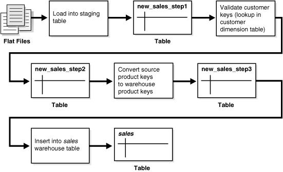
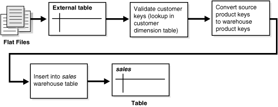
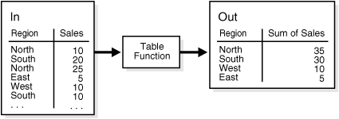
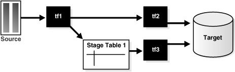

#Loading and Transformation in Data Warehouses

This chapter helps you create and manage a data warehouse, and discusses:

##Overview of Loading and Transformation in Data Warehouses

Data transformations are often the most complex and, in terms of processing time, the most costly part of the extraction, transformation, and loading (ETL) process. They can range from simple data conversions to extremely complex data scrubbing techniques. Many, if not all, data transformations can occur within an Oracle database, although transformations are often implemented outside of the database (for example, on flat files) as well.

This chapter introduces techniques for implementing scalable and efficient data transformations within the Oracle Database. The examples in this chapter are relatively simple. Real-world data transformations are often considerably more complex. However, the transformation techniques introduced in this chapter meet the majority of real-world data transformation requirements, often with more scalability and less programming than alternative approaches.

This chapter does not seek to illustrate all of the typical transformations that would be encountered in a data warehouse, but to demonstrate the types of fundamental technology that can be applied to implement these transformations and to provide guidance in how to choose the best techniques.

Because ETL can become complex and suffer from poor performance, Oracle Database provides a user interface that enables you to monitor and report on database operations that are part of an ETL plan. A database operation is a set of related database tasks defined by end users or application code. Database operation monitoring is extremely useful for troubleshooting a suboptimally performing job and helps to identify where and how much resources are being consumed at any given step. Thus, database operations enable you to track related information, identify performance bottlenecks and also reduce time to tune database performance problems.

###Data Warehouses: Transformation Flow

From an architectural perspective, you can transform your data in two ways:

####Multistage Data Transformation

The data transformation logic for most data warehouses consists of multiple steps. For example, in transforming new records to be inserted into a sales table, there may be separate logical transformation steps to validate each dimension key.

Figure 17-1 offers a graphical way of looking at the transformation logic.

**Figure 17-1 Multistage Data Transformation**



When using Oracle Database as a transformation engine, a common strategy is to implement each transformation as a separate SQL operation and to create a separate, temporary staging table (such as the tables new_sales_step1 and new_sales_step2 in Figure 17-1) to store the incremental results for each step. This load-then-transform strategy also provides a natural checkpointing scheme to the entire transformation process, which enables the process to be more easily monitored and restarted. However, a disadvantage to multistaging is that the space and time requirements increase.

It may also be possible to combine many simple logical transformations into a single SQL statement or single PL/SQL procedure. Doing so may provide better performance than performing each step independently, but it may also introduce difficulties in modifying, adding, or dropping individual transformations, as well as recovering from failed transformations.

####Pipelined Data Transformation

The ETL process flow can be changed dramatically and the database becomes an integral part of the ETL solution.

The new functionality renders some of the former necessary process steps obsolete while some others can be remodeled to enhance the data flow and the data transformation to become more scalable and non-interruptive. The task shifts from serial transform-then-load process (with most of the tasks done outside the database) or load-then-transform process, to an enhanced transform-while-loading.

Oracle offers a wide variety of new capabilities to address all the issues and tasks relevant in an ETL scenario. It is important to understand that the database offers toolkit functionality rather than trying to address a one-size-fits-all solution. The underlying database has to enable the most appropriate ETL process flow for a specific customer need, and not dictate or constrain it from a technical perspective. Figure 17-2 illustrates the new functionality, which is discussed throughout later sections.

**Figure 17-2 Pipelined Data Transformation**



####Staging Area

The overall speed of your load is determined by how quickly the raw data can be read from the staging area and written to the target table in the database. It is highly recommended that you stage your raw data across as many physical disks as possible to ensure the reading of the raw data is not a bottleneck during the load.

An excellent place to stage the data is in an Oracle Database File System (DBFS). DBFS creates a mountable file system which can be used to access files stored in the database as SecureFiles LOBs. DBFS is similar to NFS in that it provides a shared network file system that looks like a local file system. Oracle recommends that you create the DBFS in a separate database from the data warehouse, and that the file system be mounted using the DIRECT_IO option to avoid contention on the system page cache while moving the raw data files in and out of the file system. More information on setting up DBFS can be found in [Oracle Database SecureFiles and Large Objects Developer's Guide](http://docs.oracle.com/database/121/ADLOB/toc.htm).

##Loading Mechanisms

You can use the following mechanisms for loading a data warehouse:

###Loading a Data Warehouse with SQL*Loader

Before any data transformations can occur within the database, the raw data must become accessible for the database. One approach is to load it into the database. [Chapter 16, "Transportation in Data Warehouses"](http://docs.oracle.com/database/121/DWHSG/transport.htm#g1007787), discusses several techniques for transporting data to an Oracle data warehouse. Perhaps the most common technique for transporting data is by way of flat files.

SQL*Loader is used to move data from flat files into an Oracle data warehouse. During this data load, SQL*Loader can also be used to implement basic data transformations. When using direct-path SQL*Loader, basic data manipulation, such as data type conversion and simple NULL handling, can be automatically resolved during the data load. Most data warehouses use direct-path loading for performance reasons.

The conventional-path loader provides broader capabilities for data transformation than a direct-path loader: SQL functions can be applied to any column as those values are being loaded. This provides a rich capability for transformations during the data load. However, the conventional-path loader is slower than direct-path loader. For these reasons, the conventional-path loader should be considered primarily for loading and transforming smaller amounts of data.

The following is a simple example of a SQL*Loader control file to load data into the sales table of the sh sample schema from an external file sh_sales.dat. The external flat file sh_sales.dat consists of sales transaction data, aggregated on a daily level. Not all columns of this external file are loaded into sales. This external file is also used as a source for loading the second fact table of the sh sample schema, which is done using an external table:

The following shows the control file (sh_sales.ctl) loading the sales table:

```
LOAD DATA INFILE sh_sales.dat APPEND INTO TABLE sales
FIELDS TERMINATED BY "|"
(PROD_ID, CUST_ID, TIME_ID, CHANNEL_ID, PROMO_ID, QUANTITY_SOLD, AMOUNT_SOLD)
```

It can be loaded with the following command:

```
$  sqlldr control=sh_sales.ctl direct=true
Username:
Password:
```

In the case of SQL*Loader Express mode, you do not use a control file. Instead, it uses table column definitions to determine input data types.

> **See Also:**
> 
> [Oracle Database Utilities](http://docs.oracle.com/database/121/SUTIL/toc.htm) for more information

###Loading a Data Warehouse with External Tables

Another approach for handling external data sources is using external tables. Oracle's external table feature enables you to use external data as a virtual table that can be queried and joined directly and in parallel without requiring the external data to be first loaded in the database. You can then use SQL, PL/SQL, and Java to access the external data.

External tables enable the pipelining of the loading phase with the transformation phase. The transformation process can be merged with the loading process without any interruption of the data streaming. It is no longer necessary to stage the data inside the database for further processing inside the database, such as comparison or transformation. For example, the conversion functionality of a conventional load can be used for a direct-path INSERT AS SELECT statement in conjunction with the SELECT from an external table. Starting in Oracle Database 12c, the database automatically gathers table statistics as part of a bulk-load operation (CTAS and IAS) similar to how statistics are gathered when an index is created. By gathering statistics during the data load, you avoid additional scan operations and provide the necessary statistics as soon as the data becomes available to the users. Note that, in the case of an IAS statement, statistics are only gathered if the table the data is being inserted into is empty.

The main difference between external tables and regular tables is that externally organized tables are read-only. No DML operations (UPDATE/INSERT/DELETE) are possible and no indexes can be created on them.

External tables are mostly compliant with the existing SQL*Loader functionality and provide superior functionality in most cases. External tables are especially useful for environments where the complete external source has to be joined with existing database objects or when the data has to be transformed in a complex manner. For example, unlike SQL*Loader, you can apply any arbitrary SQL transformation and use the direct-path insert method. In addition, you can specify a program to be executed (such as zcat) that processes files (such as compressed data files) and enables Oracle Database to use the output (such as uncompressed data files), which means you can load large amounts of compressed data without first uncompressing it on a disk.

You can create an external table named sales_transactions_ext, representing the structure of the complete sales transaction data, represented in the external file sh_sales.gz. The product department is especially interested in a cost analysis on product and time. You thus create a fact table named cost in the sh schema. The operational source data is the same as for the sales fact table. However, because you are not investigating every dimensional information that is provided, the data in the cost fact table has a coarser granularity than in the sales fact table, for example, all different distribution channels are aggregated.

You cannot load the data into the cost fact table without applying the previously mentioned aggregation of the detailed information, due to the suppression of some of the dimensions.

The external table framework offers a solution to solve this. Unlike SQL*Loader, where you would have to load the data before applying the aggregation, you can combine the loading and transformation within a single SQL DML statement, as shown in the following. You do not have to stage the data temporarily before inserting into the target table.

The object directories must already exist, and point to the directory containing the sh_sales.gz file as well as the directory containing the bad and log files.

```sql
CREATE TABLE sales_transactions_ext
(PROD_ID NUMBER, CUST_ID NUMBER,
 TIME_ID DATE, CHANNEL_ID NUMBER,
 PROMO_ID NUMBER, QUANTITY_SOLD NUMBER,
 AMOUNT_SOLD NUMBER(10,2), UNIT_COST NUMBER(10,2),
 UNIT_PRICE NUMBER(10,2))
ORGANIZATION external (TYPE oracle_loader
  DEFAULT DIRECTORY data_file_dir ACCESS PARAMETERS
  (RECORDS DELIMITED BY NEWLINE CHARACTERSET US7ASCII
    PREPROCESSOR EXECDIR:'zcat' 
    BADFILE log_file_dir:'sh_sales.bad_xt'
    LOGFILE log_file_dir:'sh_sales.log_xt'
    FIELDS TERMINATED BY "|" LDRTRIM
    ( PROD_ID, CUST_ID,
      TIME_ID         DATE(10) "YYYY-MM-DD", 
      CHANNEL_ID, PROMO_ID, QUANTITY_SOLD, AMOUNT_SOLD,
      UNIT_COST, UNIT_PRICE))
  location ('sh_sales.gz') 
)REJECT LIMIT UNLIMITED;
```

The external table can now be used from within the database, accessing some columns of the external data only, grouping the data, and inserting it into the costs fact table:

```sql
INSERT /*+ APPEND */ INTO COSTS
(TIME_ID, PROD_ID, UNIT_COST, UNIT_PRICE)
SELECT TIME_ID, PROD_ID, AVG(UNIT_COST), AVG(amount_sold/quantity_sold)
FROM sales_transactions_ext GROUP BY time_id, prod_id;
```

> See Also:
> 
> * [Oracle Database SQL Language Reference](http://docs.oracle.com/database/121/SQLRF/statements_3001.htm#SQLRF53428) for a complete description of external table syntax
> * [Oracle Database Utilities](http://docs.oracle.com/database/121/SUTIL/GUID-C4C1A6D6-4C85-478F-9A43-148E1812CCE8.htm#SUTIL995) for usage examples

###Loading a Data Warehouse with OCI and Direct-Path APIs

OCI and direct-path APIs are frequently used when the transformation and computation are done outside the database and there is no need for flat file staging.

###Loading a Data Warehouse with Export/Import

Export and import are used when the data is inserted as is into the target system. No complex extractions are possible. See [Chapter 15, "Extraction in Data Warehouses"](http://docs.oracle.com/database/121/DWHSG/extract.htm#g1008480) for further information.

##Transformation Mechanisms

You have the following choices for transforming data inside the database:

###Transforming Data Using SQL

Once data is loaded into the database, data transformations can be executed using SQL operations. There are four basic techniques for implementing SQL data transformations:

####CREATE TABLE ... AS SELECT And INSERT /*+APPEND*/ AS SELECT

The CREATE TABLE ... AS SELECT statement (CTAS) is a powerful tool for manipulating large sets of data. As shown in the following example, many data transformations can be expressed in standard SQL, and CTAS provides a mechanism for efficiently executing a SQL query and storing the results of that query in a new database table. The INSERT /*+APPEND*/ ... AS SELECT statement offers the same capabilities with existing database tables.

In a data warehouse environment, CTAS is typically run in parallel using NOLOGGING mode for best performance.

A simple and common type of data transformation is data substitution. In a data substitution transformation, some or all of the values of a single column are modified. For example, our sales table has a channel_id column. This column indicates whether a given sales transaction was made by a company's own sales force (a direct sale) or by a distributor (an indirect sale).

You may receive data from multiple source systems for your data warehouse. Suppose that one of those source systems processes only direct sales, and thus the source system does not know indirect sales channels. When the data warehouse initially receives sales data from this system, all sales records have a NULL value for the sales.channel_id field. These NULL values must be set to the proper key value. For example, you can do this efficiently using a SQL function as part of the insertion into the target sales table statement. The structure of source table sales_activity_direct is as follows:

```
DESC sales_activity_direct
Name           Null?    Type
------------   -----    ----------------
SALES_DATE              DATE
PRODUCT_ID              NUMBER
CUSTOMER_ID             NUMBER
PROMOTION_ID            NUMBER
AMOUNT                  NUMBER
QUANTITY                NUMBER
```

The following SQL statement inserts data from sales_activity_direct into the sales table of the sample schema, using a SQL function to truncate the sales date values to the midnight time and assigning a fixed channel ID of 3.

```
INSERT /*+ APPEND NOLOGGING PARALLEL */
INTO sales SELECT product_id, customer_id, TRUNC(sales_date), 3,
       promotion_id, quantity, amount
FROM sales_activity_direct;
```

####Transforming Data Using UPDATE

Another technique for implementing a data substitution is to use an UPDATE statement to modify the sales.channel_id column. An UPDATE provides the correct result. However, if the data substitution transformations require that a very large percentage of the rows (or all of the rows) be modified, then, it may be more efficient to use a CTAS statement than an UPDATE.

####Transforming Data Using MERGE

Oracle Database's merge functionality extends SQL, by introducing the SQL keyword MERGE, in order to provide the ability to update or insert a row conditionally into a table or out of line single table views. Conditions are specified in the ON clause. This is, besides pure bulk loading, one of the most common operations in data warehouse synchronization.

#####Merge Examples

The following discusses various implementations of a merge. The examples assume that new data for the dimension table products is propagated to the data warehouse and has to be either inserted or updated. The table products_delta has the same structure as products.

**Example 17-1 Merge Operation Using SQL**

```sql
MERGE INTO products t USING products_delta s
ON (t.prod_id=s.prod_id)
WHEN MATCHED THEN UPDATE SET
  t.prod_list_price=s.prod_list_price, t.prod_min_price=s.prod_min_price
WHEN NOT MATCHED THEN INSERT (prod_id, prod_name, prod_desc, prod_subcategory,
  prod_subcategory_desc, prod_category, prod_category_desc, prod_status, 
  prod_list_price, prod_min_price)
VALUES (s.prod_id, s.prod_name, s.prod_desc, s.prod_subcategory, 
  s.prod_subcategory_desc, s.prod_category, s.prod_category_desc, 
  s.prod_status, s.prod_list_price, s.prod_min_price);
```

####Transforming Data Using Multitable INSERT

Many times, external data sources have to be segregated based on logical attributes for insertion into different target objects. It is also frequent in data warehouse environments to fan out the same source data into several target objects. Multitable inserts provide a new SQL statement for these kinds of transformations, where data can either end up in several or exactly one target, depending on the business transformation rules. This insertion can be done conditionally based on business rules or unconditionally.

It offers the benefits of the INSERT ... SELECT statement when multiple tables are involved as targets. In doing so, it avoids the drawbacks of the two obvious alternatives. You either had to deal with n independent INSERT … SELECT statements, thus processing the same source data n times and increasing the transformation workload n times. Alternatively, you had to choose a procedural approach with a per-row determination how to handle the insertion. This solution lacked direct access to high-speed access paths available in SQL.

As with the existing INSERT ... SELECT statement, the new statement can be parallelized and used with the direct-load mechanism for faster performance.

**Example 17-2 Unconditional Insert**

The following statement aggregates the transactional sales information, stored in sales_activity_direct, on a daily basis and inserts into both the sales and the costs fact table for the current day.

```sql
INSERT ALL
   INTO sales VALUES (product_id, customer_id, today, 3, promotion_id,
                      quantity_per_day, amount_per_day)
   INTO costs VALUES (product_id, today, promotion_id, 3,
                      product_cost, product_price)
SELECT TRUNC(s.sales_date) AS today, s.product_id, s.customer_id,
  s.promotion_id, SUM(s.amount) AS amount_per_day, SUM(s.quantity)
  quantity_per_day, p.prod_min_price*0.8 AS product_cost, p.prod_list_price 
  AS product_price
FROM sales_activity_direct s, products p
WHERE s.product_id = p.prod_id AND TRUNC(sales_date) = TRUNC(SYSDATE)
GROUP BY TRUNC(sales_date), s.product_id, s.customer_id, s.promotion_id, 
  p.prod_min_price*0.8, p.prod_list_price;
```

**Example 17-3 Conditional ALL Insert**

The following statement inserts a row into the sales and costs tables for all sales transactions with a valid promotion and stores the information about multiple identical orders of a customer in a separate table cum_sales_activity. It is possible two rows will be inserted for some sales transactions, and none for others.

```sql
INSERT ALL
WHEN promotion_id IN (SELECT promo_id FROM promotions) THEN
   INTO sales VALUES (product_id, customer_id, today, 3, promotion_id,
                       quantity_per_day, amount_per_day)
   INTO costs VALUES (product_id, today, promotion_id, 3,
                      product_cost, product_price)
WHEN num_of_orders > 1 THEN
   INTO cum_sales_activity VALUES (today, product_id, customer_id,
     promotion_id, quantity_per_day, amount_per_day, num_of_orders)
SELECT TRUNC(s.sales_date) AS today, s.product_id, s.customer_id,
   s.promotion_id, SUM(s.amount) AS amount_per_day, SUM(s.quantity)
   quantity_per_day, COUNT(*) num_of_orders, p.prod_min_price*0.8
   AS product_cost, p.prod_list_price AS product_price
FROM sales_activity_direct s, products p
WHERE s.product_id = p.prod_id
AND TRUNC(sales_date) = TRUNC(SYSDATE)
GROUP BY TRUNC(sales_date), s.product_id, s.customer_id,
 s.promotion_id, p.prod_min_price*0.8, p.prod_list_price;
```

**Example 17-4 Conditional FIRST Insert**

The following statement inserts into an appropriate shipping manifest according to the total quantity and the weight of a product order. An exception is made for high value orders, which are also sent by express, unless their weight classification is too high. All incorrect orders, in this simple example represented as orders without a quantity, are stored in a separate table. It assumes the existence of appropriate tables large_freight_shipping, express_shipping, default_shipping, and incorrect_sales_order.

```sql
INSERT FIRST WHEN (sum_quantity_sold > 10 AND prod_weight_class < 5) AND
sum_quantity_sold >=1) OR (sum_quantity_sold > 5 AND prod_weight_class > 5) THEN
  INTO large_freight_shipping VALUES
      (time_id, cust_id, prod_id, prod_weight_class, sum_quantity_sold)
  WHEN sum_amount_sold > 1000 AND sum_quantity_sold >=1 THEN
  INTO express_shipping VALUES
      (time_id, cust_id, prod_id, prod_weight_class,
       sum_amount_sold, sum_quantity_sold)
WHEN (sum_quantity_sold >=1) THEN INTO default_shipping VALUES
      (time_id, cust_id, prod_id, sum_quantity_sold)
ELSE INTO incorrect_sales_order VALUES (time_id, cust_id, prod_id)
SELECT s.time_id, s.cust_id, s.prod_id, p.prod_weight_class,
       SUM(amount_sold) AS sum_amount_sold,
       SUM(quantity_sold) AS sum_quantity_sold
FROM sales s, products p
WHERE s.prod_id = p.prod_id AND s.time_id = TRUNC(SYSDATE)
GROUP BY s.time_id, s.cust_id, s.prod_id, p.prod_weight_class;
```

**Example 17-5 Mixed Conditional and Unconditional Insert**

The following example inserts new customers into the customers table and stores all new customers with cust_credit_limit higher then 4500 in an additional, separate table for further promotions.

```sql
INSERT FIRST WHEN cust_credit_limit >= 4500 THEN INTO customers
  INTO customers_special VALUES (cust_id, cust_credit_limit)
  ELSE INTO customers
SELECT * FROM customers_new;
```

> **See Also:**
> 
> [Chapter 7, "Refreshing Materialized Views"](http://docs.oracle.com/database/121/DWHSG/refresh.htm#g1018554) for more information regarding MERGE operations

###Transforming Data Using PL/SQL

In a data warehouse environment, you can use procedural languages such as PL/SQL to implement complex transformations in the Oracle Database. Whereas CTAS operates on entire tables and emphasizes parallelism, PL/SQL provides a row-based approached and can accommodate very sophisticated transformation rules. For example, a PL/SQL procedure could open multiple cursors and read data from multiple source tables, combine this data using complex business rules, and finally insert the transformed data into one or more target table. It would be difficult or impossible to express the same sequence of operations using standard SQL statements.

Using a procedural language, a specific transformation (or number of transformation steps) within a complex ETL processing can be encapsulated, reading data from an intermediate staging area and generating a new table object as output. A previously generated transformation input table and a subsequent transformation will consume the table generated by this specific transformation. Alternatively, these encapsulated transformation steps within the complete ETL process can be integrated seamlessly, thus streaming sets of rows between each other without the necessity of intermediate staging. You can use table functions to implement such behavior.

###Transforming Data Using Table Functions

Table functions provide the support for pipelined and parallel execution of transformations implemented in PL/SQL, C, or Java. Scenarios as mentioned earlier can be done without requiring the use of intermediate staging tables, which interrupt the data flow through various transformations steps. Detailed information about table functions is provided in "What is a Table Function?".

####What is a Table Function?

A table function is defined as a function that can produce a set of rows as output. Additionally, table functions can take a set of rows as input. Prior to Oracle9i, PL/SQL functions:

* Could not take cursors as input.
* Could not be parallelized or pipelined.

Now, functions are not limited in these ways. Table functions extend database functionality by allowing:

* Multiple rows to be returned from a function.
* Results of SQL subqueries (that select multiple rows) to be passed directly to functions.
* Functions take cursors as input.
* Functions can be parallelized.
* Returning result sets incrementally for further processing as soon as they are created. This is called incremental pipelining

Table functions can be defined in PL/SQL using a native PL/SQL interface, or in Java or C using the Oracle Data Cartridge Interface (ODCI).

> **See Also:**
> 
> * [Oracle Database PL/SQL Language Reference](http://docs.oracle.com/database/121/LNPLS/tuning.htm#LNPLS01210) for further information
> * [Oracle Database Data Cartridge Developer's Guide](http://docs.oracle.com/database/121/ADDCI/pipe_paral_tbl.htm#ADDCI2140) for further information

Figure 17-3 illustrates a typical aggregation where you input a set of rows and output a set of rows, in that case, after performing a SUM operation.

**Figure 17-3 Table Function Example**



The pseudocode for this operation would be similar to:

```sql
INSERT INTO Out SELECT * FROM ("Table Function"(SELECT * FROM In));
```

The table function takes the result of the SELECT on In as input and delivers a set of records in a different format as output for a direct insertion into Out.

Additionally, a table function can fan out data within the scope of an atomic transaction. This can be used for many occasions like an efficient logging mechanism or a fan out for other independent transformations. In such a scenario, a single staging table is needed.

**Figure 17-4 Pipelined Parallel Transformation with Fanout**



The pseudocode for this would be similar to:

```sql
INSERT INTO target SELECT * FROM (tf2(SELECT * 
FROM (tf1(SELECT * FROM source))));
```

This inserts into target and, as part of tf1, into Stage Table 1 within the scope of an atomic transaction.

```sql
INSERT INTO target SELECT * FROM tf3(SELT * FROM stage_table1);
```

**Example 17-6 Table Functions Fundamentals**

The following examples demonstrate the fundamentals of table functions, without the usage of complex business rules implemented inside those functions. They are chosen for demonstration purposes only, and are all implemented in PL/SQL.

Table functions return sets of records and can take cursors as input. Besides the sh sample schema, you have to set up the following database objects before using the examples:

```sql
CREATE TYPE product_t AS OBJECT (
      prod_id                  NUMBER(6)
    , prod_name                VARCHAR2(50)
    , prod_desc                VARCHAR2(4000)
    , prod_subcategory         VARCHAR2(50)
    , prod_subcategory_desc    VARCHAR2(2000)
    , prod_category            VARCHAR2(50)
    , prod_category_desc       VARCHAR2(2000)
    , prod_weight_class        NUMBER(2)
    , prod_unit_of_measure     VARCHAR2(20)
    , prod_pack_size           VARCHAR2(30)
    , supplier_id              NUMBER(6)
    , prod_status              VARCHAR2(20)
    , prod_list_price          NUMBER(8,2)
    , prod_min_price           NUMBER(8,2)
);
/
CREATE TYPE product_t_table AS TABLE OF product_t;
/
COMMIT;

CREATE OR REPLACE PACKAGE cursor_PKG AS
  TYPE product_t_rec IS RECORD (
      prod_id                   NUMBER(6)
    , prod_name                 VARCHAR2(50)
    , prod_desc                 VARCHAR2(4000)
    , prod_subcategory          VARCHAR2(50)
    , prod_subcategory_desc     VARCHAR2(2000)
    , prod_category             VARCHAR2(50)
    , prod_category_desc        VARCHAR2(2000)
    , prod_weight_class         NUMBER(2)
    , prod_unit_of_measure      VARCHAR2(20)
    , prod_pack_size            VARCHAR2(30)
    , supplier_id               NUMBER(6)
    , prod_status               VARCHAR2(20)
    , prod_list_price           NUMBER(8,2)
    , prod_min_price            NUMBER(8,2));
  TYPE product_t_rectab IS TABLE OF product_t_rec;
  TYPE strong_refcur_t IS REF CURSOR RETURN product_t_rec;
  TYPE refcur_t IS REF CURSOR;
END;
/

REM artificial help table, used later
CREATE TABLE obsolete_products_errors (prod_id NUMBER, msg VARCHAR2(2000));
```

The following example demonstrates a simple filtering; it shows all obsolete products except the prod_category Electronics. The table function returns the result set as a set of records and uses a weakly typed REF CURSOR as input.

```
CREATE OR REPLACE FUNCTION obsolete_products(cur cursor_pkg.refcur_t)
RETURN product_t_table
IS
    prod_id                   NUMBER(6); 
    prod_name                 VARCHAR2(50);
    prod_desc                 VARCHAR2(4000);
    prod_subcategory          VARCHAR2(50);
    prod_subcategory_desc     VARCHAR2(2000);
    prod_category             VARCHAR2(50);
    prod_category_desc        VARCHAR2(2000);
    prod_weight_class         NUMBER(2);
    prod_unit_of_measure      VARCHAR2(20);
    prod_pack_size            VARCHAR2(30);
    supplier_id               NUMBER(6);
    prod_status               VARCHAR2(20);
    prod_list_price           NUMBER(8,2);
    prod_min_price            NUMBER(8,2);
    sales NUMBER:=0;
    objset product_t_table := product_t_table();
    i NUMBER := 0;
BEGIN
   LOOP
     -- Fetch from cursor variable
     FETCH cur INTO prod_id, prod_name, prod_desc, prod_subcategory, 
    prod_subcategory_desc, prod_category, prod_category_desc, prod_weight_class,
    prod_unit_of_measure, prod_pack_size, supplier_id, prod_status, 
    prod_list_price, prod_min_price;
     EXIT WHEN cur%NOTFOUND; -- exit when last row is fetched
     -- Category Electronics is not meant to be obsolete and will be suppressed
     IF prod_status='obsolete' AND prod_category != 'Electronics' THEN
     -- append to collection
     i:=i+1;
     objset.extend;
     objset(i):=product_t( prod_id, prod_name, prod_desc, prod_subcategory,
     prod_subcategory_desc, prod_category, prod_category_desc, 
     prod_weight_class, prod_unit_of_measure, prod_pack_size, supplier_id, 
     prod_status, prod_list_price, prod_min_price);
     END IF;
   END LOOP;
   CLOSE cur;
   RETURN objset;
END;
/
```

You can use the table function in a SQL statement to show the results. Here you use additional SQL functionality for the output:

```sql
SELECT DISTINCT UPPER(prod_category), prod_status
FROM TABLE(obsolete_products(
   CURSOR(SELECT prod_id, prod_name, prod_desc, prod_subcategory,
   prod_subcategory_desc, prod_category, prod_category_desc, prod_weight_class,
   prod_unit_of_measure, prod_pack_size,
   supplier_id, prod_status, prod_list_price, prod_min_price
          FROM products)));
```

The following example implements the same filtering than the first one. The main differences between those two are:

* This example uses a strong typed REF CURSOR as input and can be parallelized based on the objects of the strong typed cursor, as shown in one of the following examples.
* The table function returns the result set incrementally as soon as records are created.

```sql
CREATE OR REPLACE FUNCTION 
  obsolete_products_pipe(cur cursor_pkg.strong_refcur_t) RETURN product_t_table
PIPELINED
PARALLEL_ENABLE (PARTITION cur BY ANY) IS
    prod_id                 NUMBER(6);
    prod_name               VARCHAR2(50);
    prod_desc               VARCHAR2(4000);
    prod_subcategory        VARCHAR2(50);
    prod_subcategory_desc   VARCHAR2(2000);
    prod_category           VARCHAR2(50);
    prod_category_desc      VARCHAR2(2000);
    prod_weight_class       NUMBER(2);
    prod_unit_of_measure   VARCHAR2(20);
    prod_pack_size         VARCHAR2(30);
    supplier_id            NUMBER(6);
    prod_status            VARCHAR2(20);
    prod_list_price        NUMBER(8,2);
    prod_min_price         NUMBER(8,2);
    sales NUMBER:=0;
BEGIN
 LOOP
     -- Fetch from cursor variable
     FETCH cur INTO prod_id, prod_name, prod_desc, prod_subcategory,
     prod_subcategory_desc, prod_category, prod_category_desc, 
     prod_weight_class, prod_unit_of_measure, prod_pack_size, supplier_id, 
     prod_status, prod_list_price, prod_min_price;
     EXIT WHEN cur%NOTFOUND; -- exit when last row is fetched
     IF prod_status='obsolete' AND prod_category !='Electronics' THEN
       PIPE ROW (product_t( prod_id, prod_name, prod_desc, prod_subcategory,
 prod_subcategory_desc, prod_category, prod_category_desc, prod_weight_class,
 prod_unit_of_measure, prod_pack_size, supplier_id, prod_status, 
 prod_list_price, prod_min_price));
     END IF;
   END LOOP;
   CLOSE cur;
   RETURN;
END;
/
```

You can use the table function as follows:

```sql
SELECT DISTINCT prod_category,
                DECODE(prod_status,'obsolete','NO LONGER AVAILABLE','N/A')
FROM TABLE(obsolete_products_pipe(
  CURSOR(SELECT prod_id, prod_name, prod_desc, prod_subcategory,
         prod_subcategory_desc, prod_category, prod_category_desc,
         prod_weight_class, prod_unit_of_measure, prod_pack_size,
         supplier_id, prod_status, prod_list_price, prod_min_price
         FROM products)));
```

You now change the degree of parallelism for the input table products and issue the same statement again:

```sql
ALTER TABLE products PARALLEL 4;
```

The session statistics show that the statement has been parallelized:

```
SELECT * FROM V$PQ_SESSTAT WHERE statistic='Queries Parallelized';

STATISTIC              LAST_QUERY  SESSION_TOTAL
--------------------   ----------  -------------
Queries Parallelized            1              3

1 row selected.
```

Table functions are also capable to fanout results into persistent table structures. This is demonstrated in the next example. The function filters returns all obsolete products except a those of a specific prod_category (default Electronics), which was set to status obsolete by error. The result set of the table function consists of all other obsolete product categories. The detected wrong prod_id IDs are stored in a separate table structure obsolete_products_error. Note that if a table function is part of an autonomous transaction, it must COMMIT or ROLLBACK before each PIPE ROW statement to avoid an error in the callings subprogram. Its result set consists of all other obsolete product categories. It furthermore demonstrates how normal variables can be used in conjunction with table functions:

```sql
CREATE OR REPLACE FUNCTION obsolete_products_dml(cur cursor_pkg.strong_refcur_t,
 prod_cat varchar2 DEFAULT 'Electronics') RETURN product_t_table
PIPELINED
PARALLEL_ENABLE (PARTITION cur BY ANY) IS
    PRAGMA AUTONOMOUS_TRANSACTION;
    prod_id                   NUMBER(6);
    prod_name                 VARCHAR2(50);
    prod_desc                 VARCHAR2(4000);
    prod_subcategory          VARCHAR2(50);
    prod_subcategory_desc     VARCHAR2(2000);
    prod_category             VARCHAR2(50);
    prod_category_desc        VARCHAR2(2000);
    prod_weight_class         NUMBER(2);
    prod_unit_of_measure      VARCHAR2(20);
    prod_pack_size            VARCHAR2(30);
    supplier_id               NUMBER(6);
    prod_status               VARCHAR2(20);
    prod_list_price           NUMBER(8,2);
    prod_min_price            NUMBER(8,2);
    sales                     NUMBER:=0;
BEGIN
   LOOP
     -- Fetch from cursor variable
     FETCH cur INTO prod_id, prod_name, prod_desc, prod_subcategory, 
  prod_subcategory_desc, prod_category, prod_category_desc, prod_weight_class,
  prod_unit_of_measure, prod_pack_size, supplier_id, prod_status,
     prod_list_price, prod_min_price;
     EXIT WHEN cur%NOTFOUND; -- exit when last row is fetched
     IF prod_status='obsolete' THEN
       IF prod_category=prod_cat THEN
          INSERT INTO obsolete_products_errors VALUES
          (prod_id, 'correction: category '||UPPER(prod_cat)||' still
   available');
          COMMIT;
       ELSE
       PIPE ROW (product_t( prod_id, prod_name, prod_desc, prod_subcategory,
 prod_subcategory_desc, prod_category, prod_category_desc, prod_weight_class,
 prod_unit_of_measure, prod_pack_size, supplier_id, prod_status, 
 prod_list_price, prod_min_price));
       END IF;
     END IF;
   END LOOP;
   CLOSE cur;
   RETURN;
END;
/
```

The following query shows all obsolete product groups except the prod_category Electronics, which was wrongly set to status obsolete:

```sql
SELECT DISTINCT prod_category, prod_status FROM TABLE(obsolete_products_dml(
CURSOR(SELECT prod_id, prod_name, prod_desc, prod_subcategory, 
  prod_subcategory_desc, prod_category, prod_category_desc, prod_weight_class,
  prod_unit_of_measure, prod_pack_size, supplier_id, prod_status, 
  prod_list_price, prod_min_price
FROM products)));
```

As you can see, there are some products of the prod_category Electronics that were obsoleted by accident:

```sql
SELECT DISTINCT msg FROM obsolete_products_errors;
```

Taking advantage of the second input variable, you can specify a different product group than Electronics to be considered:

```sql
SELECT DISTINCT prod_category, prod_status
FROM TABLE(obsolete_products_dml(
CURSOR(SELECT prod_id, prod_name, prod_desc, prod_subcategory,
  prod_subcategory_desc, prod_category, prod_category_desc, prod_weight_class,
  prod_unit_of_measure, prod_pack_size, supplier_id, prod_status,
  prod_list_price, prod_min_price
FROM products),'Photo'));
```

Because table functions can be used like a normal table, they can be nested, as shown in the following:

```sql
SELECT DISTINCT prod_category, prod_status
FROM TABLE(obsolete_products_dml(CURSOR(SELECT * 
FROM TABLE(obsolete_products_pipe(CURSOR(SELECT prod_id, prod_name, prod_desc,
 prod_subcategory, prod_subcategory_desc, prod_category, prod_category_desc,
 prod_weight_class, prod_unit_of_measure, prod_pack_size, supplier_id, 
 prod_status, prod_list_price, prod_min_price
FROM products))))));
```

The biggest advantage of Oracle Database's ETL is its toolkit functionality, where you can combine any of the latter discussed functionality to improve and speed up your ETL processing. For example, you can take an external table as input, join it with an existing table and use it as input for a parallelized table function to process complex business logic. This table function can be used as input source for a MERGE operation, thus streaming the new information for the data warehouse, provided in a flat file within one single statement through the complete ETL process.

> **See Also:**
> 
> * [Oracle Database PL/SQL Language Reference](http://docs.oracle.com/database/121/LNPLS/tuning.htm#LNPLS01210) for details about table functions
> * [Oracle Database Data Cartridge Developer's Guide](http://docs.oracle.com/database/121/ADDCI/pipe_paral_tbl.htm#ADDCI2140) for details about tables functions implemented in languages other than PL/SQL

##Error Logging and Handling Mechanisms

Having data that is not clean is very common when loading and transforming data, especially when dealing with data coming from a variety of sources, including external ones. If this dirty data causes you to abort a long-running load or transformation operation, a lot of time and resources is wasted. The following sections discuss the two main causes of errors and how to address them:

###Business Rule Violations

Data that is logically not clean violates business rules that are known prior to any data consumption. Most of the time, handling these kind of errors will be incorporated into the loading or transformation process. However, in situations where the error identification for all records would become too expensive and the business rule can be enforced as a data rule violation, for example, testing hundreds of columns to see if they are NOT NULL, programmers often choose to handle even known possible logical error cases more generically. An example of this is shown in "Data Error Scenarios".

Incorporating logical rules can be as easy as applying filter conditions on the data input stream or as complex as feeding the dirty data into a different transformation workflow. Some examples are as follows:

* Filtering of logical data errors using SQL. Data that does not adhere to certain conditions is filtered out prior to being processed.
* Identifying and separating logical data errors. In simple cases, this can be accomplished using SQL, as shown in Example 17-1, "Merge Operation Using SQL", or in more complex cases in a procedural approach, as shown in Example 17-6, "Table Functions Fundamentals".

###Data Rule Violations (Data Errors)

Unlike logical errors, data rule violations are not usually anticipated by the load or transformation process. Such unexpected data rule violations (also known as data errors) that are not handled from an operation cause the operation to fail. Data rule violations are error conditions that happen inside the database and cause a statement to fail. Examples of this are data type conversion errors or constraint violations.

In the past, SQL did not offer a way to handle data errors on a row level as part of its bulk processing. The only way to handle data errors inside the database was to use PL/SQL. Now, however, you can log data errors into a special error table while the DML operation continues.

The following sections briefly discuss exception handling with PL/SQL and DML error logging tables:

####Handling Data Errors in PL/SQL

The following statement is an example of how error handling can be done using PL/SQL. Note that you have to use procedural record-level processing to catch any errors. This statement is a rough equivalent of the statement discussed in "Handling Data Errors with an Error Logging Table".

```sql
DECLARE
errm number default 0;
BEGIN
FOR crec IN (SELECT product_id, customer_id, TRUNC(sales_date) sd,
                   promotion_id, quantity, amount
             FROM sales_activity_direct) loop
 
BEGIN
 INSERT INTO sales VALUES (crec.product_id, crec.customer_id,
                           crec.sd, 3, crec.promotion_id,
                           crec.quantity, crec.amount);
exception
WHEN others then
 errm := sqlerrm;
 INSERT INTO sales_activity_error
        VALUES (errm, crec.product_id, crec.customer_id, crec.sd,
                crec.promotion_id, crec.quantity, crec.amount);
END;
END loop;
END;
/
```

####Handling Data Errors with an Error Logging Table

DML error logging extends existing DML functionality by enabling you to specify the name of an error logging table into which Oracle Database should record errors encountered during DML operations. This enables you to complete the DML operation in spite of any errors, and to take corrective action on the erroneous rows at a later time.

This DML error logging table consists of several mandatory control columns and a set of user-defined columns that represent either all or a subset of the columns of the target table of the DML operation using a data type that is capable of storing potential errors for the target column. For example, you need a VARCHAR2 data type in the error logging table to store TO_NUM data type conversion errors for a NUMBER column in the target table. You should use the DBMS_ERRLOG package to create the DML error logging tables. See the [Oracle Database PL/SQL Packages and Types Reference](http://docs.oracle.com/database/121/ARPLS/d_errlog.htm#ARPLS680) for more information about this package and the structure of the logging table.

The column name mapping between the DML target table and an error logging table determines which columns besides the control columns is logged for a DML operation.

The following statement illustrates how to enhance the example in "Transforming Data Using SQL" with DML error logging:

```sql
INSERT /*+ APPEND PARALLEL */
INTO sales SELECT product_id, customer_id, TRUNC(sales_date), 3,
   promotion_id, quantity, amount
FROM sales_activity_direct
LOG ERRORS INTO sales_activity_errors('load_20040802')
REJECT LIMIT UNLIMITED
```

All data errors are logged into table sales_activity_errors, identified by the optional tag load_20040802. The INSERT statement succeeds even in the presence of data errors. Note that you have to create the DML error logging table prior to using this statement.

If REJECT LIMIT X had been specified, the statement would have failed with the error message of error X=1. The error message can be different for different reject limits. In the case of a failing statement, only the DML statement is rolled back, not the insertion into the DML error logging table. The error logging table will contain X+1 rows.

A DML error logging table can be in a different schema than the executing user, but you must fully specify the table name in that case. Optionally, the name of the DML error logging table can be omitted; Oracle then assumes a default name for the table as generated by the DBMS_ERRLOG package.

Oracle Database logs the following errors during DML operations:

* Column values that are too large.
* Constraint violations (NOT NULL, unique, referential, and check constraints).
* Errors raised during trigger execution.
* Errors resulting from type conversion between a column in a subquery and the corresponding column of the table.
* Partition mapping errors.

The following conditions cause the statement to fail and roll back without invoking the error logging capability:

* Violated deferred constraints.
* Out of space errors.
* Any direct-path INSERT operation (INSERT or MERGE) that raises a unique constraint or index violation.
* Any UPDATE operation (UPDATE or MERGE) that raises a unique constraint or index violation.

In addition, you cannot track errors in the error logging table for LONG, LOB, or object type columns. See [Oracle Database SQL Language Reference](http://docs.oracle.com/database/121/SQLRF/statements_9014.htm#SQLRF55101) for more information on restrictions when using error logging.

DML error logging can be applied to any kind of DML operation. Several examples are discussed in the following section.

Note that SQL*Loader as an external load utility offers the functionality of logging data errors as well, but lacks the advantage of the integrated ETL processing inside the database.

##Loading and Transformation Scenarios

The following sections offer examples of typical loading and transformation tasks:

###Key Lookup Scenario

A typical transformation is the key lookup. For example, suppose that sales transaction data has been loaded into a retail data warehouse. Although the data warehouse's sales table contains a product_id column, the sales transaction data extracted from the source system contains Uniform Price Codes (UPC) instead of product IDs. Therefore, it is necessary to transform the UPC codes into product IDs before the new sales transaction data can be inserted into the sales table.

In order to execute this transformation, a lookup table must relate the product_id values to the UPC codes. This table might be the product dimension table, or perhaps another table in the data warehouse that has been created specifically to support this transformation. For this example, you assume that there is a table named product, which has a product_id and an upc_code column.

This data substitution transformation can be implemented using the following CTAS statement:

```sql
CREATE TABLE temp_sales_step2 NOLOGGING PARALLEL AS SELECT sales_transaction_id,
  product.product_id sales_product_id, sales_customer_id, sales_time_id,
  sales_channel_id, sales_quantity_sold, sales_dollar_amount
FROM  temp_sales_step1, product
WHERE temp_sales_step1.upc_code = product.upc_code;
```

This CTAS statement converts each valid UPC code to a valid product_id value. If the ETL process has guaranteed that each UPC code is valid, then this statement alone may be sufficient to implement the entire transformation.

###Business Rule Violation Scenario

In the preceding example, if you must also handle new sales data that does not have valid UPC codes (a logical data error), you can use an additional CTAS statement to identify the invalid rows:

```sql
CREATE TABLE temp_sales_step1_invalid NOLOGGING PARALLEL AS
SELECT * FROM temp_sales_step1 s
WHERE NOT EXISTS (SELECT 1 FROM product p WHERE p.upc_code=s.upc_code);
```

This invalid data is now stored in a separate table, temp_sales_step1_invalid, and can be handled separately by the ETL process.

Another way to handle invalid data is to modify the original CTAS to use an outer join, as in the following statement:

```sql
CREATE TABLE temp_sales_step2 NOLOGGING PARALLEL AS
SELECT sales_transaction_id, product.product_id sales_product_id,
   sales_customer_id, sales_time_id, sales_channel_id, sales_quantity_sold,
   sales_dollar_amount
FROM  temp_sales_step1, product
WHERE temp_sales_step1.upc_code = product.upc_code (+);
```

Using this outer join, the sales transactions that originally contained invalidated UPC codes are assigned a product_id of NULL. These transactions can be handled later. Alternatively, you could use a multi-table insert, separating the values with a product_id of NULL into a separate table; this might be a beneficial approach when the expected error count is relatively small compared to the total data volume. You do not have to touch the large target table but only a small one for a subsequent processing.

```sql
INSERT /*+ APPEND PARALLEL */ FIRST
WHEN sales_product_id IS NOT NULL THEN
   INTO temp_sales_step2
   VALUES (sales_transaction_id, sales_product_id,
   sales_customer_id, sales_time_id, sales_channel_id,
   sales_quantity_sold, sales_dollar_amount)
ELSE
   INTO temp_sales_step1_invalid
   VALUES (sales_transaction_id, sales_product_id,
   sales_customer_id, sales_time_id, sales_channel_id,
   sales_quantity_sold, sales_dollar_amount)
SELECT sales_transaction_id, product.product_id sales_product_id,
   sales_customer_id, sales_time_id, sales_channel_id,
   sales_quantity_sold, sales_dollar_amount
FROM temp_sales_step1, product
WHERE temp_sales_step1.upc_code = product.upc_code (+);
```

Note that for this solution, the empty tables temp_sales_step2 and temp_sales_step1_invalid must already exist.

Additional approaches to handling invalid UPC codes exist. Some data warehouses may choose to insert null-valued product_id values into their sales table, while others may not allow any new data from the entire batch to be inserted into the sales table until all invalid UPC codes have been addressed. The correct approach is determined by the business requirements of the data warehouse. Irrespective of the specific requirements, exception handling can be addressed by the same basic SQL techniques as transformations.

###Data Error Scenarios

If the quality of the data is unknown, the example discussed in the preceding section could be enhanced to handle unexpected data errors, for example, data type conversion errors, as shown in the following:

```sql
INSERT /*+ APPEND PARALLEL */ FIRST
WHEN sales_product_id IS NOT NULL THEN
INTO temp_sales_step2
VALUES (sales_transaction_id, sales_product_id,
   sales_customer_id, sales_time_id, sales_channel_id,
   sales_quantity_sold, sales_dollar_amount)
LOG ERRORS INTO sales_step2_errors('load_20040804')
REJECT LIMIT UNLIMITED
ELSE
INTO temp_sales_step1_invalid
VALUES (sales_transaction_id, sales_product_id,
   sales_customer_id, sales_time_id, sales_channel_id,
   sales_quantity_sold, sales_dollar_amount)
LOG ERRORS INTO sales_step2_errors('load_20040804')
REJECT LIMIT UNLIMITED
SELECT sales_transaction_id, product.product_id sales_product_id,
   sales_customer_id, sales_time_id, sales_channel_id,
   sales_quantity_sold, sales_dollar_amount
FROM temp_sales_step1, product
WHERE temp_sales_step1.upc_code = product.upc_code (+);
```

This statement tracks the logical data error of not having a valid product UPC code in table temp_sales_step1_invalid and all other possible errors in a DML error logging table called sales_step2_errors. Note that an error logging table can be used for several DML operations.

An alternative to this approach would be to enforce the business rule of having a valid UPC code on the database level with a NOT NULL constraint. Using an outer join, all orders not having a valid UPC code would be mapped to a NULL value and then treated as data errors. This DML error logging capability is used to track these errors in the following statement:

```sql
INSERT /*+ APPEND PARALLEL */
INTO temp_sales_step2
VALUES (sales_transaction_id, sales_product_id,
   sales_customer_id, sales_time_id, sales_channel_id,
   sales_quantity_sold, sales_dollar_amount)
SELECT sales_transaction_id, product.product_id sales_product_id,
   sales_customer_id, sales_time_id, sales_channel_id,
   sales_quantity_sold, sales_dollar_amount
FROM temp_sales_step1, product
WHERE temp_sales_step1.upc_code = product.upc_code (+)
LOG ERRORS INTO sales_step2_errors('load_20040804')
REJECT LIMIT UNLIMITED;
```

The error logging table contains all records that would have caused the DML operation to fail. You can use its content to analyze and correct any error. The content in the error logging table is preserved for any DML operation, irrespective of the success of the DML operation itself. Let us assume the following SQL statement failed because the reject limit was reached:

```
SQL> INSERT /*+ APPEND NOLOGGING PARALLEL */ INTO sales_overall
2 SELECT * FROM sales_activity_direct
3 LOG ERRORS INTO err$_sales_overall ('load_test2')
4 REJECT LIMIT 10;
SELECT * FROM sales_activity_direct
*
ERROR at line 2:
ORA-01722: invalid number
```

The name of the error logging table, err$_sales_overall, is the default derived by using the DBMS_ERRLOG package. See [Oracle Database PL/SQL Packages and Types Reference](http://docs.oracle.com/database/121/ARPLS/d_errlog.htm#ARPLS680) for more information.

The error message raised by Oracle occurs where the first after the error limit is reached. The next error (number 11) is the one that raised an error. The error message that is displayed is based on the error that exceeded the limit, so, for example, the ninth error could be different from the eleventh error.

The target table sales_overall will not show any records being entered (assumed that the table was empty before), but the error logging table will contain 11 rows (REJECT LIMIT + 1)

```
SQL> SELECT COUNT(*) FROM sales_overall;
COUNT(*)
----------
0

SQL> SELECT COUNT(*) FROM err$_sales_overall;
COUNT(*)
----------
11
```

A DML error logging table consists of several fixed control columns that are mandatory for every error logging table. Besides the Oracle error number, Oracle enforces storing the error message as well. In many cases, the error message provides additional information to analyze and resolve the root cause for the data error. The following SQL output of a DML error logging table shows this difference. Note that the second output contains the additional information for rows that were rejected due to NOT NULL violations.

```
SQL> SELECT DISTINCT ora_err_number$ FROM err$_sales_overall;

ORA_ERR_NUMBER$
---------------
           1400
           1722
           1830
           1847

SQL> SELECT DISTINCT ora_err_number$, ora_err_mesg$ FROM err$_sales_overall;

ORA_ERR_NUMBER$       ORA_ERR_MESG$
           1400       ORA-01400: cannot insert NULL into
                      ("SH"."SALES_OVERALL"."CUST_ID")
           1400       ORA-01400: cannot insert NULL into
                      ("SH"."SALES_OVERALL"."PROD_ID")
           1722       ORA-01722: invalid number
           1830       ORA-01830: date format picture ends before
                      converting entire input string
           1847       ORA-01847: day of month must be between 1 and last
                      day of month
```

> **See Also:**
> 
> [Oracle Database Administrator's Guide](http://docs.oracle.com/database/121/ADMIN/tables.htm#ADMIN10261) for a detailed description of control columns.

###Pivoting Scenarios

A data warehouse can receive data from many different sources. Some of these source systems may not be relational databases and may store data in very different formats from the data warehouse. For example, suppose that you receive a set of sales records from a nonrelational database having the form:

```
product_id, customer_id, weekly_start_date, sales_sun, sales_mon, sales_tue,
  sales_wed, sales_thu, sales_fri, sales_sat
```

The input table looks like the following:

```
SELECT * FROM sales_input_table;

PRODUCT_ID CUSTOMER_ID WEEKLY_ST  SALES_SUN  SALES_MON  SALES_TUE  SALES_WED SALES_THU  SALES_FRI  SALES_SAT
---------- ----------- --------- ---------- ---------- ---------- -------------------- ---------- ----------
       111         222 01-OCT-00        100        200        300        400       500        600        700
       222         333 08-OCT-00        200        300        400        500       600        700        800
       333         444 15-OCT-00        300        400        500        600       700        800        900
```

In your data warehouse, you would want to store the records in a more typical relational form in a fact table sales of the sh sample schema:

```
prod_id, cust_id, time_id, amount_sold
```

> **Note:**
> 
> A number of constraints on the sales table have been disabled for purposes of this example, because the example ignores a number of table columns for the sake of brevity.

Thus, you need to build a transformation such that each record in the input stream must be converted into seven records for the data warehouse's sales table. This operation is commonly referred to as [pivoting](http://docs.oracle.com/database/121/DWHSG/glossary.htm#i997077), and Oracle Database offers several ways to do this.

The result of the previous example will resemble the following:

```
SELECT prod_id, cust_id, time_id, amount_sold FROM sales;

   PROD_ID    CUST_ID   TIME_ID   AMOUNT_SOLD
---------- ----------   --------- -----------
       111        222   01-OCT-00         100
       111        222   02-OCT-00         200
       111        222   03-OCT-00         300
       111        222   04-OCT-00         400
       111        222   05-OCT-00         500
       111        222   06-OCT-00         600
       111        222   07-OCT-00         700
       222        333   08-OCT-00         200
       222        333   09-OCT-00         300
       222        333   10-OCT-00         400
       222        333   11-OCT-00         500
       222        333   12-OCT-00         600
       222        333   13-OCT-00         700
       222        333   14-OCT-00         800
       333        444   15-OCT-00         300
       333        444   16-OCT-00         400
       333        444   17-OCT-00         500
       333        444   18-OCT-00         600
       333        444   19-OCT-00         700
       333        444   20-OCT-00         800
       333        444   21-OCT-00         900
```

**Example 17-7 Pivoting**

The following example uses the multitable insert syntax to insert into the demo table sh.sales some data from an input table with a different structure. The multitable INSERT statement looks like the following:

```sql
INSERT ALL INTO sales (prod_id, cust_id, time_id, amount_sold)
      VALUES (product_id, customer_id, weekly_start_date, sales_sun)
      INTO sales (prod_id, cust_id, time_id, amount_sold)
      VALUES (product_id, customer_id, weekly_start_date+1, sales_mon)
      INTO sales (prod_id, cust_id, time_id, amount_sold)
      VALUES (product_id, customer_id, weekly_start_date+2, sales_tue)
      INTO sales (prod_id, cust_id, time_id, amount_sold)
      VALUES (product_id, customer_id, weekly_start_date+3, sales_wed)
      INTO sales (prod_id, cust_id, time_id, amount_sold)
      VALUES (product_id, customer_id, weekly_start_date+4, sales_thu)
      INTO sales (prod_id, cust_id, time_id, amount_sold)
      VALUES (product_id, customer_id, weekly_start_date+5, sales_fri)
      INTO sales (prod_id, cust_id, time_id, amount_sold)
      VALUES (product_id, customer_id, weekly_start_date+6, sales_sat)
SELECT product_id, customer_id, weekly_start_date, sales_sun,
      sales_mon, sales_tue, sales_wed, sales_thu, sales_fri, sales_sat
FROM sales_input_table;
```

This statement only scans the source table once and then inserts the appropriate data for each day.

> **See Also:**
> 
> * ["Pivoting Operations"](http://docs.oracle.com/database/121/DWHSG/analysis.htm#BCFHHHHF) for more information regarding pivoting
> * [Oracle Database SQL Language Reference](http://docs.oracle.com/database/121/SQLRF/statements_10002.htm#SQLRF01702) for pivot_clause syntax

##Reference

* [1] [17 Loading and Transformation in Data Warehouses](http://docs.oracle.com/database/121/DWHSG/transform.htm)

