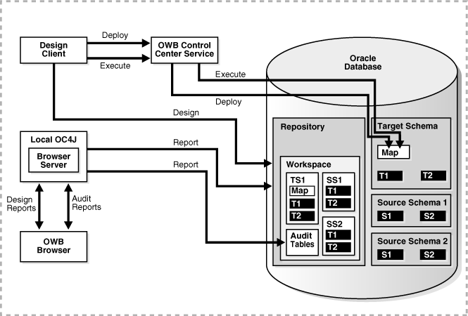
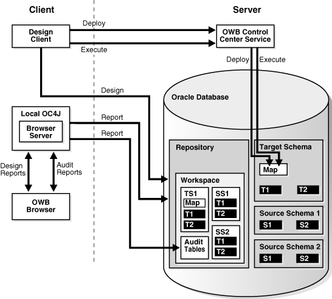
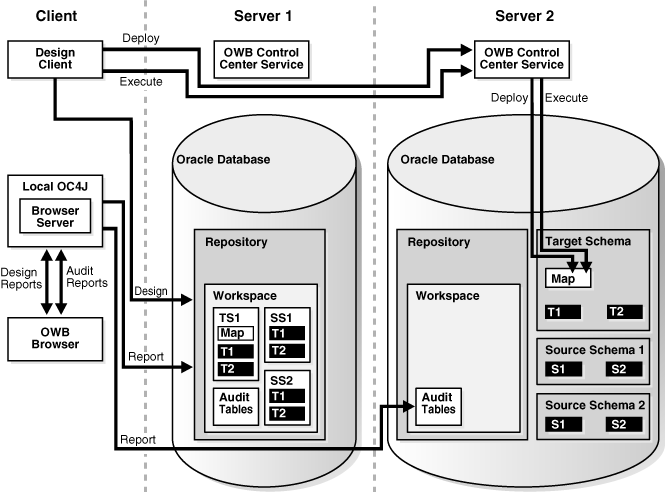
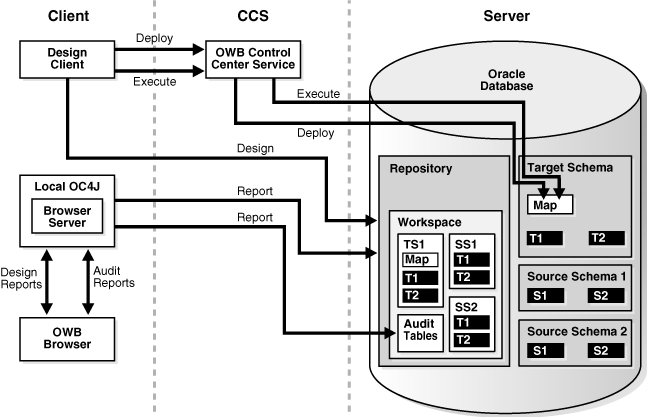
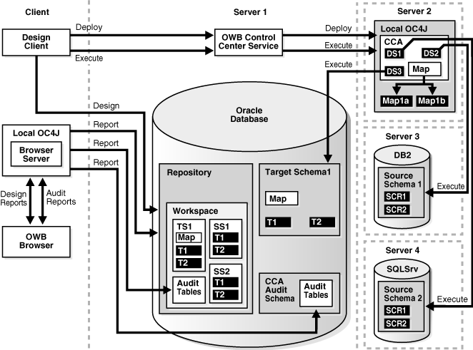

#Overview of Installation and Configuration Architecture

This section discusses the architecture and components of Oracle Warehouse Builder and provides installation and configuration procedures.

##Choosing an Appropriate Installation Configuration

Depending on the business needs of your organization, you may be implementing different types of Oracle Warehouse Builder installations:

* The primary installation of Oracle Warehouse Builder, which includes the installation and configuration of the main design repository.

* Optional installations on client computers where developers and administrators run Oracle Warehouse Builder client software, which do not contain a repository.

* Optional installations on hosts that run the Control Center Agent service, but do not contain a repository.

* Optional installations on database server hosts, where ETL jobs run and where the repository stores only run-time data.

##Architecture and Components of Oracle Warehouse Builder

This section describes some common installation configurations, and shows how the various components interact. The primary Oracle Warehouse Builder components include:

* The Oracle Warehouse Builder Client (which includes the Design Center and the Control Center Manager)

* The Oracle Warehouse Builder Browser

* Control Center Service

* Control Center Agent

* The Repository

Depending on your business needs, there are many possible installation configurations. The five most common topologies, that are illustrated in this section, are:

> **Note**: In any of these topologies, it is typical to have multiple design clients. For example, each Oracle Warehouse Builder developer or administrator usually has a corresponding, installed Oracle Warehouse Builder client, also called a design client.

###Single Computer Topology

When everything is running on the same computer, the database home for Oracle Database 11g Release 2 contains all the components needed to run Oracle Warehouse Builder, as illustrated in Figure 1-1.

**Figure 1-1 Single Computer Topology for Oracle Database 11g Release 2**

###Separate Client and Database Server Topology

If separate computers are being used to run the client and to host the repository, then all computers must have Oracle Warehouse Builder software installed, as illustrated in Figure 1-2. For the database server installation, Oracle Database 11g Release 2 includes the necessary components. For the client, you must install the Oracle Warehouse Builder software from the standalone install.

**Figure 1-2 Two Computer Topology; Separate Client and Database Server Installations**

###Multiple Database Topology

If a database on a separate computer is being used to run mappings designed on another database, then all computers must have the Oracle Warehouse Builder software installed, as illustrated in Figure 1-3. For the database servers, the installation for Oracle Database 11g Release 2 includes the necessary components. For the client, you must install Oracle Warehouse Builder software from the standalone install image.

You must prepare Oracle Warehouse Builder repository on all database server computers. As illustrated in Figure 1-3, one acts as the design repository (Server1). The additional servers where mappings run, each have their own repository (shown as Server2), which in this case functions as a run-time repository. The Control Center Service on the execution database server deploys and runs the code.

**Figure 1-3 Multiple Database Topology**

###Separate Client, Control Center Service, and Database Server Topology

If Oracle Warehouse Builder client, the Control Center Service, and the repository run on different computers, then all these computers must have Oracle Warehouse Builder software installed, as illustrated in Figure 1-4. For the database server, the installation media for Oracle Database 11g Release 2 includes the necessary components. For the client, you must install Oracle Warehouse Builder software from the standalone install image. For the Control Center Service, you can use either type of installation. However, Oracle recommends that you use the standalone image because it installs only the components that Oracle Warehouse Builder requires.

**Figure 1-4 Separate Client, Control Service Center, and Database Server Topology**

###Control Center Agent Topology

If separate computers are used to run client, the Control Center Agent service (CCA), and the repository, then all computers used to deploy or run Oracle Warehouse Builder code must have installed Oracle Warehouse Builder software, as illustrated in Figure 1-5. For the database server, the installation for Oracle Database 11g Release 2 includes the necessary components. For the client, you must install Oracle Warehouse Builder software from the standalone install image. For the Control Center Agent service, you can use either install. However, because the standalone image only installs Oracle Warehouse Builder-required components, Oracle recommends this option.

In some deployments, a Control Center Service is required on a host that does not have an Oracle Database installed. For example, if you use code template-based ETL mappings where part of the mapping executes on a non-Oracle database, then you can run a Control Center Agent on that non-Oracle database host. In such a case, you can install Oracle Warehouse Builder software on the non-Oracle database host.

Also note that:

* On the non-Oracle database host, the only component of Oracle Warehouse Builder software that is used is the Control Center Agent. The rest of the software is present but not used.

* The CCA may be located with Oracle Warehouse Builder client or Server1, in which case no additional installation would be necessary.

* In Figure 1-5, the Map1 has three execution units (a, b, c). The first two are Load Code Templates (LCTs) and the other one is an Oracle Target Code Template.

**Figure 1-5 Control Center Agent Topology**

