#Configuring Oracle Warehouse Builder for Windows

This section describes how to configure Oracle Warehouse Builder on Windows platforms.

##Configuring Oracle Warehouse Builder on Windows Installed as Part of Oracle Database 11g Release 2

Oracle Warehouse Builder is part of every database installation on hosts running Oracle Database 11g Release 2.

Once Oracle Database 11g Release 2 is installed, you must unlock two accounts: OWBSYS and OWBSYS_AUDIT.

There are no additional installation tasks. However, you must configure Oracle Workflow to use process flows in Oracle Warehouse Builder.

###To unlock OWBSYS and OWBSYS_AUDIT accounts:

* At the command prompt, start SQL*Plus:

    ```
    C:\> sqlplus
    ```

* When prompted for user name, log in as a user with administrative privileges.

    ```
    Enter user-name: sys as sysdba
    Enter password: password
    
    Connected to:
    Oracle Database 11g Enterprise Edition Release 11.2 - Production
    With the Partitioning, OLAP and Data Mining options
    ```

* Unlock the OWBSYS user account, and set its new password:

    ```
    SQL> alter user owbsys identified by password account unlock;
    
    User altered.
    ```

* Unlock the OWBSYS_AUDIT user account, and set its new password:

    ```
    SQL> alter user owbsys_audit identified by password account unlock;
    
    User altered.
    ```

##Configuring Oracle Warehouse Builder on Windows Installed as a Standalone Instance

###About Configuring Oracle Warehouse Builder Installed as a Standalone Instance

To properly configure Oracle Warehouse Builder and its repository on a host that runs an earlier version of the database, such as Oracle Database 10g Release 2, you must:

* Ensure that the database is fully installed and working; if it is not, see [Oracle Database Installation Guide for Microsoft Windows](http://www.oracle.com/pls/topic/lookup?ctx=db112&id=NTDBI003).

* Note the host name, the port, and Oracle service name of this database. The example here uses the following connection information: localhost:1521:orcl.

* Ensure that you have the user name and password for an account with SYSDBA privileges. The SYSDBA privilege is necessary for making changes to the basic configuration of Oracle Database, Oracle Warehouse Builder, and Oracle Warehouse Builder Repository.

To create an Oracle Warehouse Builder repository in your database, you must first create an OWBSYS schema, and then install repository objects within it. Oracle Warehouse Builder has command-level scripts to perform this task:

* The clean_owbsys.sql script drops the contents of any existing OWBSYS schema installations, but leaves the schema otherwise intact.

* The cat_owb.sql script checks if an OWBSYS schema exists, and creates it if necessary, and then installs the objects required by Oracle Warehouse Builder 11.2 repository.

* The reset_owbcc_home.sql script ensures that Oracle Warehouse Builder uses the 11.2 version of the Control Center Service.

* [Optional] The remote_owb_install.sql script, when executed on the server, ensures that a repository on a remote system can be installed; it sets the REMOTE_OWB_HOME variable for authentication by remote systems.

Starting with Oracle Warehouse Builder 11.1, the metadata repository is stored in the OWBSYS schema, inside a workspace. This contrasts with the terminology of Oracle Warehouse Builder 10.2, where a workspace corresponds to a repository.

Oracle Warehouse Builder repositories for version 11.2 and 11.1 cannot coexist on the same database; creating an 11.2 repository overwrites the contents of the 11.1 repository in the database. Oracle recommends that you back up the older Oracle Warehouse Builder repositories before installing the 11.2 repository or upgrading to the 11.2 repository.

###Cleaning an Oracle Warehouse Builder Repository

**To clean an existing Oracle Warehouse Builder repository:**

* On the Microsoft Windows desktop, click **Start** and select **Run**.

* Start SQL*Plus:

    ```
    C:> sqlplus
    ```

* When prompted for user name, log in as owbsys user.

    ```
    Enter user-name: owbsys
    Enter password: password
    
    Connected to:
    Oracle Database 11g Enterprise Edition Release 11.2 - Production
    With the Partitioning, OLAP and Data Mining options
    ```
* Stop Oracle Warehouse Builder Control Center service.

    ```
    SQL> @c:\OWB112\owb\rtp\sql\stop_service.sql
    See "[stop_service](http://docs.oracle.com/cd/E25154_01/doc/owb.11203/e17130/control_ctr_mgmt.htm#CIHGICJG)" for more information.
    ```

* Connect as user with administrative privileges:

    ```
    SQL> connect sys as sysdba
    Enter password: password
    ```

* Run the clean_owbsys.sql script to drop all the objects in the existing OWBSYS schema:

    ```
    SQL> @C:\OWB112\owb\UnifiedRepos\clean_owbsys.sql
    ```

###Creating an OWBSYS Schema with Repository Objects

The process of creating (or refreshing) an OWBSYS schema generates the corresponding locked user account within the specified tablespace; in this example, the tablespace is USERS. When the script completes, you must unlock the account and set its password. The instructions in "[Configuring Oracle Warehouse Builder on Windows Installed as Part of Oracle Database 11g Release 2](http://docs.oracle.com/cd/E25154_01/doc/owb.11203/e17130/setup_windows.htm#CHDJIGDI)" show how to unlock OWBSYS and OWBSYS_AUDIT accounts. OWBSYS schema is populated only when you run the Repository Assistant for the first time and create the first workspace in the repository.

**To set-up an OWBSYS schema with repository objects:**

* On the Microsoft Windows desktop, click Start and select Run.

* At the command prompt, start SQL*Plus:

    ```
    C:\>sqlplus
    ```

* When prompted for user name, log in as a user with administrative privileges.

    ```
    Enter user-name: sys as sysdba
    Enter password: password
    
    Connected to:
    Oracle Database 11g Enterprise Edition Release 11.2 - Production
    With the Partitioning, OLAP and Data Mining options
    ```

* Run the cat_owb.sql script to set up OWBSYS in a tablespace in your database. For example, this command sets up OWBSYS in the USERS tablespace:

    ```
    SQL> @C:\OWB112\owb\UnifiedRepos\cat_owb.sql USERS
    ```

###Configuring the Control Center Service

If you are installing Oracle Warehouse Builder 11.2 on an older Oracle Database release, or if you integrating Oracle Warehouse Builder with Oracle Business Intelligence Standard Edition (Oracle Discoverer), you must run the reset_owbcc_home.sql script to ensure that the Control Center Service functions correctly.

**To configure the Control Center service:**

* In Windows Explorer, open the directory for the Oracle home of Oracle Warehouse Builder release 11.2 to confirm the correct path for the Oracle home, paying particular attention to capitalization. In this example, the path is C:\OWB112.

    While Windows is generally case insensitive, the path entered in the next steps must be an exact match to Oracle Warehouse Builder home directory, as displayed in the Windows Explorer address bar. To avoid errors, copy and paste the path.

* On the Microsoft Windows desktop, click Start and select Run.

* At the command prompt, start SQL*Plus:

    ```
    C:\>sqlplus
    ```

* When prompted for user name, log in as a user with administrative privileges.

    ```
    Enter user-name: sys as sysdba
    Enter password: password
    
    Connected to:
    Oracle Database 11g Enterprise Edition Release 11.2 - Production
    With the Partitioning, OLAP and Data Mining options
    ```

* Run the reset_owbcc_home.sql script to force the Control Center service to run from Oracle Warehouse Builder 11.2 installation:

    ```
    SQL> @C:\OWB112\owb\UnifiedRepos\reset_owbcc_home.sql C:\OWB112
    ```

###Unlocking the OWBSYS and OWBSYS_AUDIT Accounts

**To unlock OWBSYS and OWBSYS_AUDIT accounts:**

* On the Microsoft Windows desktop, click Start and select Run.

* At the command prompt, start SQL*Plus:

    ```
    C:\>sqlplus
    ```

* When prompted for user name, log in as a user with administrative privileges.

    ```
    Enter user-name: sys as sysdba
    Enter password: password
    
    Connected to:
    Oracle Database 11g Enterprise Edition Release 11.2 - Production
    With the Partitioning, OLAP and Data Mining options
    ```

* Unlock the OWBSYS user account, and set its new password:

    ```
    SQL> alter user owbsys identified by password account unlock;
    
    User altered.
    ```

* Unlock the OWBSYS_AUDIT user account, and set its new password:

    ```
    SQL> alter user owbsys_audit identified by password account unlock;
    
    User altered.
    ```

###Configuring Oracle Workflow to Support Oracle Warehouse Builder Process Flows

Using process flows requires that you configure Oracle Workflow for use with Oracle Warehouse Builder. See "[Integrating with Oracle Workflow](http://docs.oracle.com/cd/E25154_01/doc/owb.11203/e17130/components.htm#BABGAABJ)" for details on configuring Oracle Workflow.

###Setting Oracle Warehouse Builder Home for Remote Installations

You must create a database directory OWB_REMOTE_ADMIN that is accessed by remote installations, so they can read the server's OWB_HOME/owb/bin/admin directory.

* On the Microsoft Windows desktop, click Start and select Run.

* At the command prompt, start SQL*Plus:

    ```
    C:\>sqlplus
    ```

* When prompted for user name, log in as a user with administrative privileges.

    ```
    Enter user-name: sys as sysdba
    Enter password: password
    
    Connected to:
    Oracle Database 11g Enterprise Edition Release 11.2 - Production
    With the Partitioning, OLAP and Data Mining options
    ```

* Set the OWB_REMOTE_HOME variable using script remote_owb_install.sql:

    ```
    SQL> @remote_owb_install.sql OWB_REMOTE_HOME
    ```

##Creating the First Workspace in the Repository on Windows

To use a repository, you must define an initial workspace, and the owner of that workspace. The following instructions use the Repository Assistant.

To create a workspace:

1. Start the repository assistant from the Start menu, selecting Program Files, then Oracle - OWB112, then Warehouse Builder, then Administration, then Repository Assistant.

    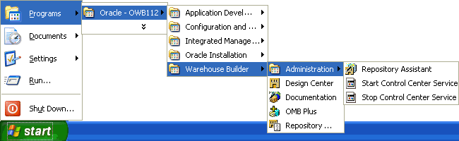

2. On the Welcome screen of the Repository assistant, click Next.

    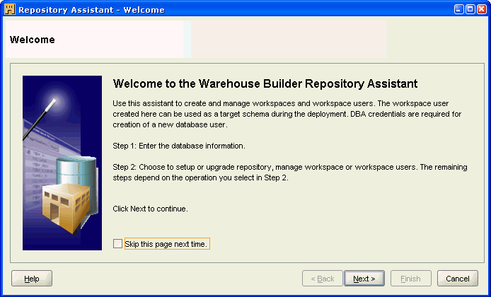

3. On the Database Information screen, enter the connection information (Host Name, Port Number, and Oracle Service Name) for the repository database, and click Next.

    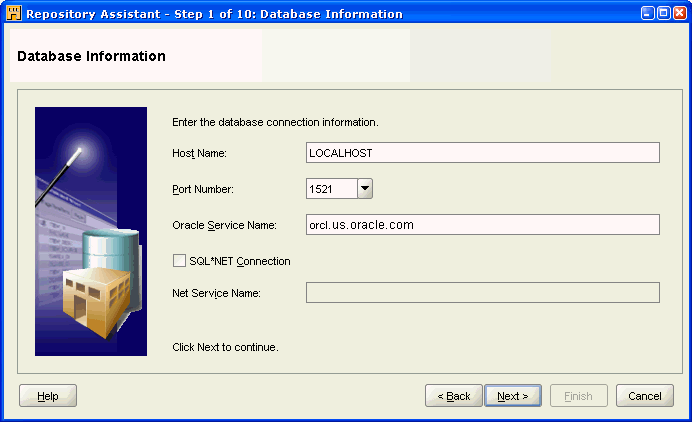

4. On the Choose Operation screen, select Manage Warehouse Builder workspaces. Click Next.

    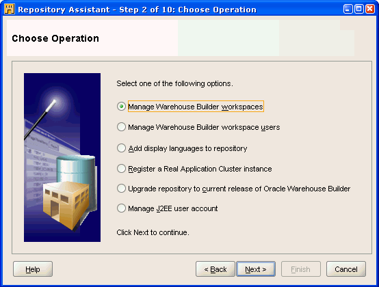

5. On the Choose Workspace Operations screen, select Create a New Warehouse Builder workspace. Click Next.

    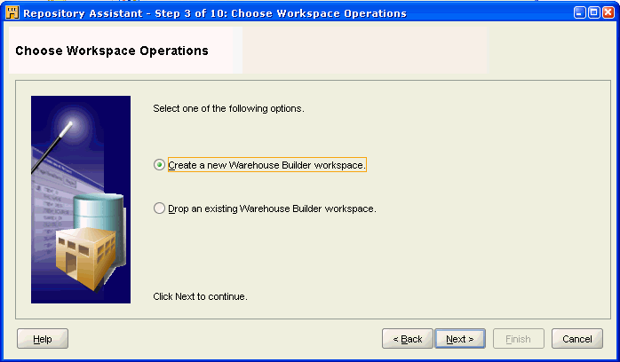

6. On the New or Existing User screen, select Create a workspace with a new workspace owner. Click Next.

    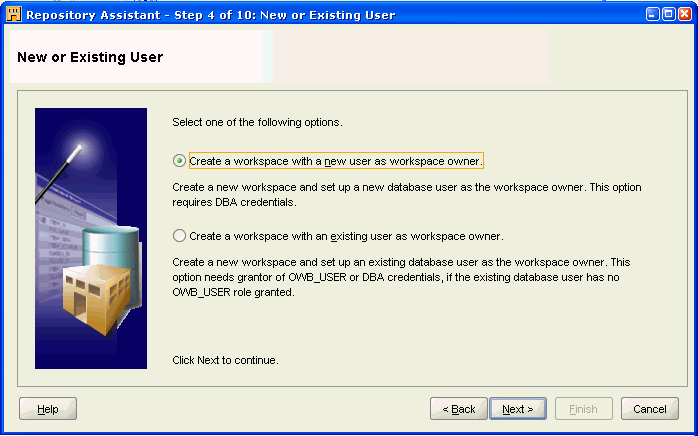

7. On the DBA Information screen, enter the User Name of a user with a SYS privilege, and that user's Password.

    Click Next.

    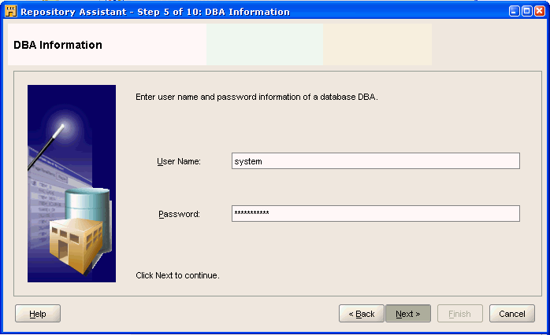

8. In the Workspace Owner (New) screen, enter the following:

    * Workspace Owner's User Name (wks_owner1)
    * Workspace Owner's Password
    * Workspace Owner's Password Confirmation
    * Workspace Name (wks1) (Workspace names cannot contain spaces)

    Click Next.

    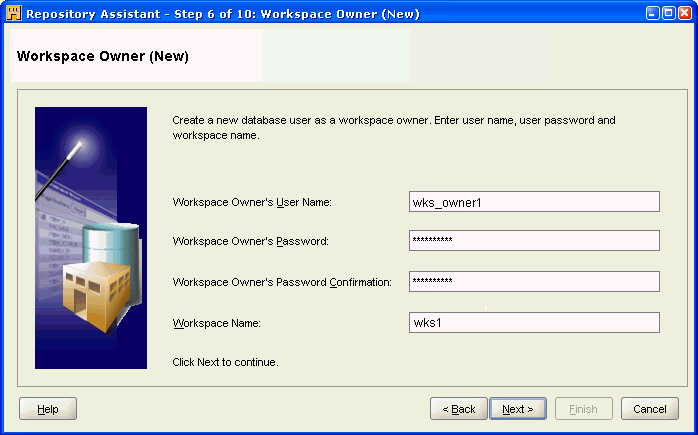

9. On the OWBSYS Information screen, enter the OWBSYS Password.

    Click Next.

    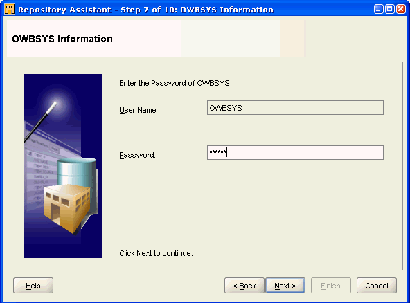

10. [Optional] For remote installations (when you the schema is on a remote system), the system performs the verification of versions, and displays the dialog "Found OWB software with the compatible version installed locally on the database server computer with path REMOTE_OWB_HOME."

    If the version is either incompatible or cannot be found, then the system displays the dialog "OWB software with the compatible version must be installed locally on the database server computer". If it is installed, acquire the DBA user credentials, and run the remote_owb_install.sql script on the Oracle Database server computer, as described in "Setting Oracle Warehouse Builder Home for Remote Installations".

11. On the Select Tablespaces screen, enter the following:

    * Tablespace for Data (USERS, or the name of the desired tablespace)
    * Tablespace for Indexes (USERS, or the name of the same tablespace)
    * Tablespace for Temporary Data (TEMP)
    * Tablespace for Snapshots (USERS, or the name of the same tablespace)

    Click Next.

    This step enables you to change the default tablespace details. Oracle Warehouse Builder repository is stored in the OWBSYS schema, but you must identify what tablespaces are used to store OWBSYS and certain other objects, like snapshots. You may choose tablespaces other than USERS, depending on your storage management strategy.

    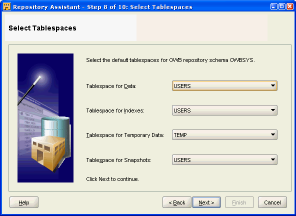

12. On the Select Languages screen, select the Base Language from the menu.

    [Optional] You may also select additional Display Languages from the list of Available languages on the left-hand side, and move them to the list of Selected languages on the right side.

    Click Next.

    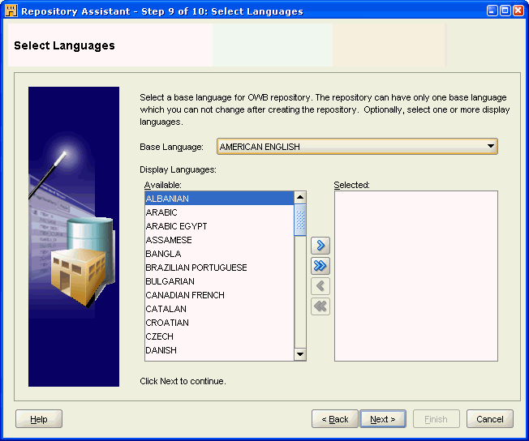

13. On the Workspace Users (Optional) screen, select the appropriate existing users from the Available list add them to the Selected list.

    [Optional] Click Create New User to make new users who can access Oracle Warehouse Builder. This takes you to step 14.

    Click Next. This takes you to step 16.

    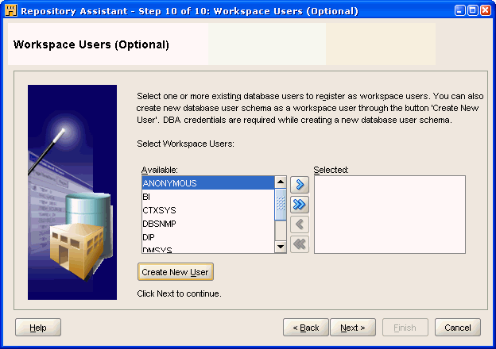

14. [Optional] In the Create New Database User screen, enter the following:

    * User Name (demo_user)
    * Password
    * Re-enter Password

    Click OK.

    DBA User Name (system) and DBA User Password are disabled fields and cannot be edited.

    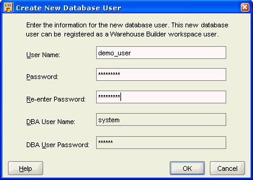

15. In the Workspace Users (Optional) screen, click Next.

    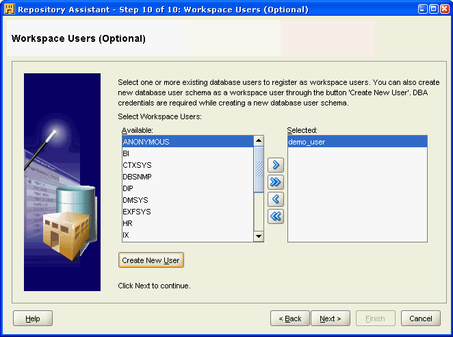

16. On the Summary screen, click Finish.

    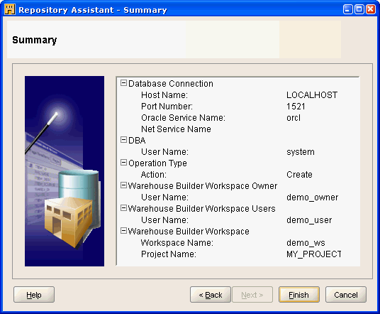

17. Once the Installation Result screen appears, click OK.

    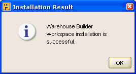
