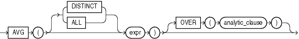

# AVG 函数
返回表达式的平均值

## 语法


##描述
AVG函数是一个聚合函数，同时也是分析函数。该函数接受一个数值类型的参数，如果传入非数值类型值则该值必须可被隐式转换成数值类型。返回结果是数值类型。

当用作分析函数时，如果使用DISTINCT，则`analytic_clause`子句不允许使用`order_by_clause`和`windowing_clause`，即只允许使用`query_partition_clause`。

##示例

###聚合函数示例
求employees表中salary字段的平均值：
```sql
SELECT AVG(salary) "Average"
  FROM emplayess;
```
结果

|       Average
|--------------
|   6461.83178

###分析函数示例
计算同一个经理的下属中聘用时间相邻的成员销售额的平均值
```sql
SELECT manager_id, last_name, hire_date, salary,
       AVG(salary) OVER (PARTITION BY manager_id 
                         ORDER BY hire_date 
                         ROWS BETWEEN 1 PRECEDING AND 1 FOLLOWING) AS c_mavg
  FROM employees
  ORDER BY manager_id, hire_date, salary;
```
结果

| MANAGER_ID | LAST_NAME | HIRE_DATE | SALARY | C_MAVG
|------------|-----------|------------|---------|----------
| 100 | De Haan   | 13-JAN-01 |  17000 | 14000
| 100 | Raphaely  | 07-DEC-02 |  11000 | 11966.6667
| 100 | Kaufling  | 01-MAY-03 |   7900 | 10633.3333
| 100 | Hartstein | 17-FEB-04 |  13000 | 9633.33333
| 100 | Weiss     | 18-JUL-04 |   8000 | 11666.6667
| 100 | Russell   | 01-OCT-04 |  14000 | 11833.3333
| 100 | Partners  | 05-JAN-05 |  13500 | 13166.6667
| 100 | Errazuriz | 10-MAR-05 |  12000 | 11233.3333

例如Raphaely的计算结果为 `(17000+11000+7900) / 3`

De Haan的计算结果为 `(0+17000+11000) / 3`