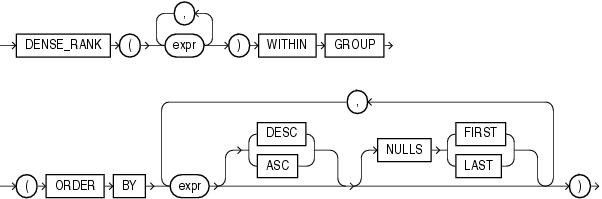
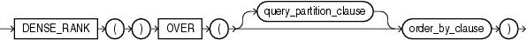

# DENSE_RANK 函数
该函数用于计算数值在一组值中的排名

## 语法
* **聚合函数语法** **

    

* **分析函数语法**

    

##描述
函数功能可参考 [RANK函数](RANK.md)

与RANK函数的区别是DENSE_RANK产生的排名是从1开始的连续整数，而RANK是不连续的(会跳过相同排名的行数)。

##示例
###聚合函数示例
以下示例显示salary为$15500并且commission为5%的虚拟行在表oe.employees中的排行。
```sql
SELECT DENSE_RANK(15500, .05) WITHIN GROUP 
  (ORDER BY salary DESC, commission_pct) "Dense Rank" 
  FROM employees;
```
结果：
```
Dense Rank
----------
         3
```

###分析函数示例
以下示例显示每个部门为60的员工的salary在部门内部的排名。相同salary的员工具有相同的排名，但是没有任何一个排名值被跳过。
```sql
SELECT department_id, last_name, salary,
       DENSE_RANK() OVER (PARTITION BY department_id ORDER BY salary) DENSE_RANK
  FROM employees WHERE department_id = 60
  ORDER BY DENSE_RANK, last_name;
```
结果：
```
DEPARTMENT_ID LAST_NAME                     SALARY DENSE_RANK
------------- ------------------------- ---------- ----------
           60 Lorentz                         4200          1
           60 Austin                          4800          2
           60 Pataballa                       4800          2
           60 Ernst                           6000          3
           60 Hunold                          9000          4
```