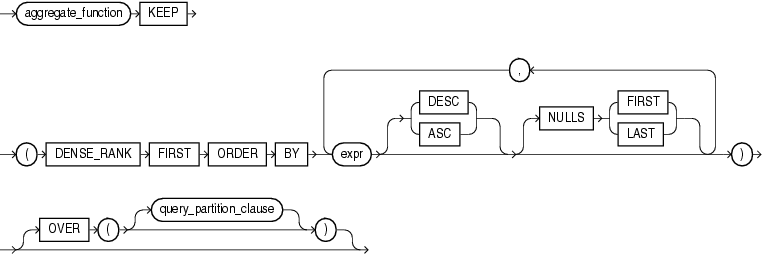

#FIRST 函数


##语法



##描述

**FIRST** 和 **LAST** 非常相似，两者都可作为聚合函数和分析函数。它们分别用于计算已排序值中的第一个和最后一个值，这些排序值来自于数据行。如果数据只有一行，用于FIRST或LAST计算的值集合中只有一个元素。


如果OVER子句被省略，则FIRST和LAST作为聚合函数。作为分析函数时，OVER子句必须定义。PARTITION子句是OVER子句中唯一有效的部分，如果被省略，那么整张表会被当作分析窗口。

参数类型为数值类型，或者可隐式转换为数值的非数值类型。返回值类型与参数类型一致。

当你需要从已排序的group中获取第一行(first row)或最后一行(last row)的值，而该值并非用于排序的字段。使用FIRST和LAST函数可避免使用自连接或视图，并且可提高性能。

* aggregate_function 可以是MIN, MAX, SUM, AVG, COUNT, VARIANCE, STDDEV函数中的任何一个， 它将对排名为FIRST或LAST的结果集进行计算。如果排名为FIRST或LAST的结果集只有一行，那么聚合计算将基于单元素的结果集。

* KEEP关键字是语法声明。用于向 aggregate_function 声明只有FIRST或LAST的结果集会被返回。

* DENSE_RANK FIRST 或 DENSE_RANK LAST声明数据库会对排名最小（FIRST)或排名最大（LAST）的行进行聚合。

##示例

###聚合函数示例

以下查询返回hr.employees表中每个部门拥有最低commission的员工中最低的salary和拥有最高commission的员工中最高的salary

```sql
SELECT department_id,
       MIN(salary) KEEP (DENSE_RANK FIRST ORDER BY commission_pct) "Worst",
       MAX(salary) KEEP (DENSE_RANK LAST ORDER BY commission_pct) "Best"
  FROM employees
  GROUP BY department_id
  ORDER BY department_id;
```

>以上 **DENSE_RANK FIRST ORDER BY commission_pct** 得到commission_pct最小的员工


```
DEPARTMENT_ID      Worst       Best
------------- ---------- ----------
           10       4400       4400
           20       6000      13000
           30       2500      11000
           40       6500       6500
           50       2100       8200
           60       4200       9000
           70      10000      10000
           80       6100      14000
           90      17000      24000
          100       6900      12008
          110       8300      12008
                    7000       7000
```

###分析函数示例

以下查询返回与上一查询作相同计算，但结果集中会显示部门中拥有最高和最低salary所有的员工

```sql
SELECT last_name, department_id, salary,
       MIN(salary) KEEP (DENSE_RANK FIRST ORDER BY commission_pct)
         OVER (PARTITION BY department_id) "Worst",
       MAX(salary) KEEP (DENSE_RANK LAST ORDER BY commission_pct)
         OVER (PARTITION BY department_id) "Best"
   FROM employees
   ORDER BY department_id, salary, last_name;
```

```
LAST_NAME           DEPARTMENT_ID     SALARY      Worst       Best
------------------- ------------- ---------- ---------- ----------
Whalen                         10       4400       4400       4400
Fay                            20       6000       6000      13000
Hartstein                      20      13000       6000      13000
. . .
Gietz                         110       8300       8300      12008
Higgins                       110      12008       8300      12008
Grant                                   7000       7000       7000
```