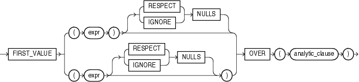

# FIRST_VALUE 函数
该函数提供了从一个数据行窗口中第一行获取值的能力

## 语法


##描述
FIRST_VALUE是一个分析函数，它返回一个数据行窗口中第一行的相关值。

`{RESPECT | IGNORE} NULLS` 用于确定当expr为null时是否被计算在内，默认为RESPECT NULLS。如果定义了IGNORE NULLS，则函数返回第一个非null值（当所有值都为null时则返回NULL）

FIRST_VALUE函数是分析函数，不允许嵌套其它的分析函数，但可嵌套Oracle内置的非分析函数。

##示例
查询部门中销售额最低的人员名字
```sql
SELECT department_id, last_name, salary,
       FIRST_VALUE(last_name)
         OVER (ORDER BY salary ASC ROWS UNBOUNDED PRECEDING) AS lowest_sal
  FROM (SELECT * FROM employees
          WHERE department_id = 90
          ORDER BY employee_id)
  ORDER BY last_name;
```
结果：

DEPARTMENT_ID | LAST_NAME | SALARY | LOWEST_SAL
------------- | ----------|------- | ----------
           90 | De Haan   |  17000 | Kochhar
           90 | King      |  24000 | Kochhar
           90 | Kochhar   |  17000 | Kochhar

以下示例说明数据行的排序对分析函数返回的结果有重要影响
```sql
SELECT department_id, last_name, salary,
       FIRST_VALUE(last_name)
         OVER (ORDER BY salary ASC ROWS UNBOUNDED PRECEDING) AS fv
  FROM (SELECT * FROM employees
          WHERE department_id = 90
          ORDER by employee_id DESC)
  ORDER BY last_name;
```
结果：

DEPARTMENT_ID | LAST_NAME | SALARY | FV
------------- | --------- | ------ | -------
           90 | De Haan   |  17000 | De Haan
           90 | King      |  24000 | De Haan
           90 | Kochhar   |  17000 | De Haan

示例：

```sql
SELECT department_id, last_name, salary, hire_date,
       FIRST_VALUE(last_name)
         (ORDER BY salary ASC, hire_date ROWS UNBOUNDED PRECEDING) AS fv
  FROM (SELECT * FROM employees 
          WHERE department_id = 90
          ORDER BY employee_id DESC)
  ORDER BY last_name;
```
结果：

DEPARTMENT_ID | LAST_NAME | SALARY | HIRE_DATE | FV
------------- | --------- | ------ | --------- | -------
           90 | De Haan   |  17000 | 13-JAN-01 | De Haan
           90 | King      |  24000 | 17-JUN-03 | De Haan
           90 | Kochhar   |  17000 | 21-SEP-05 | De Haan

ROWS定义物理位置窗口，RANGE定义逻辑位置窗口。RANGE以ORDER BY 后的表达式作为参考，如果存在重复值，则以第一次获取的值为准。

```sql
SELECT department_id, last_name, salary,
       FIRST_VALUE(last_name)
         OVER (ORDER BY salary ASC RANGE UNBOUNDED PRECEDING) AS lowest_sal
  FROM (SELECT * FROM employees
          WHERE department_id = 90
          ORDER BY employee_id);
```
结果：

DEPARTMENT_ID | LAST_NAME | SALARY | LOWEST_SAL
------------- | --------- | ------ | ----------
           90 | De Haan   |  17000 | De Haan
           90 | Kochhar   |  17000 | De Haan
           90 | King      |  24000 | De Haan