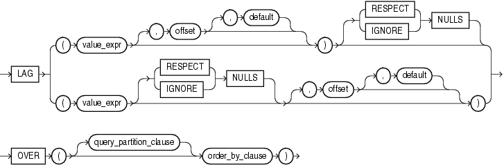

# LAG 函数
该函数提供了访问结果集中前面的行的能力

## 语法


##描述
LAG函数是一个分析函数。它提供了获取结果集中指定的往前偏移位置的相关值。

参数offset是一个大于0的整数值，默认为1，意为在结果集中往前数offset行。参数default用于定义当offset指定的行超出结果集范围时的默认值，该参数是可选的，默认为null。

`{RESPECT | IGNORE} NULLS` 用于确定当value_expr为null时是否被计算在内，默认为RESPECT NULLS，即null值也当作1行

LAG函数是分析函数，不允许嵌套其它的分析函数，但可嵌套Oracle内置的非分析函数。

##示例
获取销售人员中，前一个聘用的人员的销售额
```sql
SELECT last_name, hire_date, salary,
       LAG(salary, 1, 0) OVER (ORDER BY hire_date) AS prev_sal
  FROM employees
  WHERE job_id = 'PU_CLERK'
  ORDER BY last_name, hire_date, salary;
```
结果：

LAST_NAME  | HIRE_DATE |    SALARY |  PREV_SAL
---------- | --------- | --------- |----------
Baida      | 24-DEC-05 |      2900 |      2800
Colmenares | 10-AUG-07 |      2500 |      2600
Himuro     | 15-NOV-06 |      2600 |      2900
Khoo       | 18-MAY-03 |      3100 |         0
Tobias     | 24-JUL-05 |      2800 |      3100

例如：在聘用Baida之前聘用了Tobias，所以Baida的PREV_SAL就是Tobias的SALARY